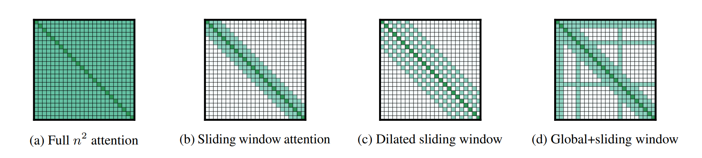
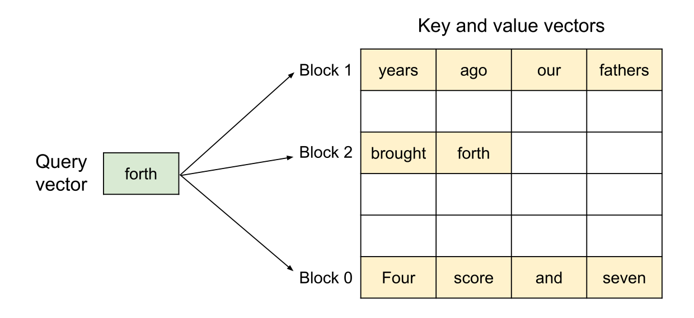
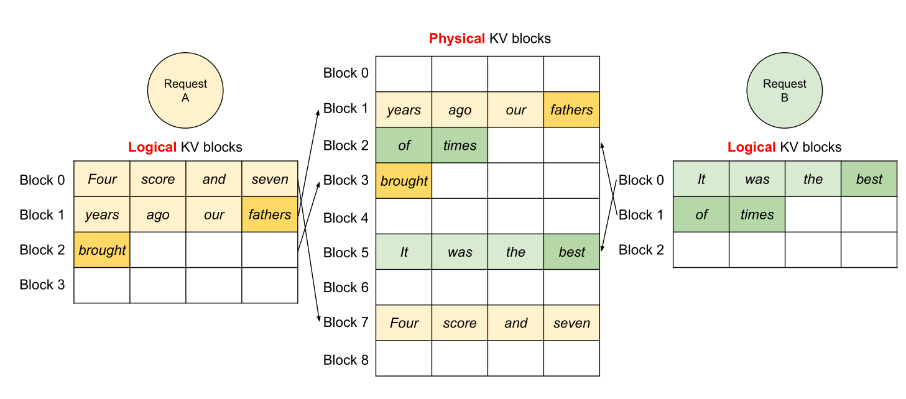
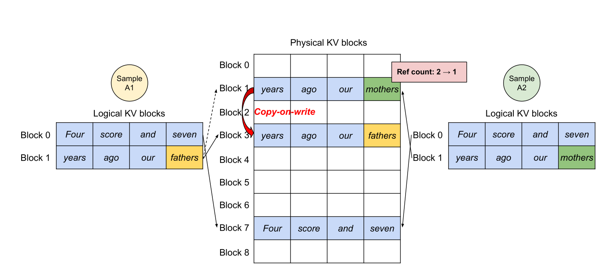

# CS336 Lecture 10: 推理优化

> **课程**: Stanford CS336 — Language Models From Scratch (Spring 2026)
> **讲师**: Percy Liang（本讲）、Tatsu（上讲 Scaling Laws）
> **课程网站**: [https://cs336.stanford.edu/](https://cs336.stanford.edu/)
> **课件**: `lecture_10.py` — 611 行交互式 Python 代码（符号数学 + Transformer 性能建模）
> **参考**: 大量内容基于 [Google JAX Scaling Book](https://jax-ml.github.io/scaling-book/)

---

## 目录

1. [推理为什么重要](#1-推理为什么重要)
2. [推理的算术强度分析](#2-推理的算术强度分析)
   - [2.1 Notation 与 Transformer Block 回顾](#21-notation-与-transformer-block-回顾)
   - [2.2 训练 vs 推理的根本差异](#22-训练-vs-推理的根本差异)
   - [2.3 MLP 与 Attention 的算术强度](#23-mlp-与-attention-的算术强度)
3. [Throughput 与 Latency 的 Batch Size 权衡](#3-throughput-与-latency-的-batch-size-权衡)
4. [缩减 KV Cache（lossy 捷径）](#4-缩减-kv-cachelossy-捷径)
   - [4.1 GQA — 分组查询注意力](#41-gqa--分组查询注意力)
   - [4.2 MLA — 多头潜在注意力](#42-mla--多头潜在注意力)
   - [4.3 CLA — 跨层注意力共享](#43-cla--跨层注意力共享)
   - [4.4 Local / Sliding Window Attention](#44-local--sliding-window-attention)
   - [4.5 DeepSeek v4 的综合方案](#45-deepseek-v4-的综合方案)
5. [量化 (Quantization)](#5-量化-quantization)
6. [模型剪枝 + 蒸馏 (Pruning + KD)](#6-模型剪枝--蒸馏-pruning--kd)
7. [投机采样 (Speculative Sampling) — 无损](#7-投机采样-speculative-sampling--无损)
8. [动态 Workload：Continuous Batching + PagedAttention](#8-动态-workloadcontinuous-batching--pagedattention)
9. [总结](#9-总结)

---

## 1. 推理为什么重要

> "训练是一次性成本——虽然很贵。但推理是**每天都在重复的成本**。"


**Percy 给出的震撼数据**：
- **OpenAI 每天生成约 8.6 万亿 tokens**
- DeepSeek-V4 的**训练**总共用了 32 万亿 tokens
- → OpenAI 不到 4 天生成的 token 量就超过 DeepSeek-V4 的整个训练集

**推理的使用场景日益扩大**：

| 场景 | 说明 |
|------|------|
| **Chatbot / 助手** | 传统场景——人类读回答，人类是 bottleneck |
| **Code completion** | IDE 中实时补全 |
| **Agent** | query → 内部 trace（think/reason/tool call/introspect）→ output |
| **Batch data processing** | 处理 PB 级数据 |
| **Evaluation** | 需要生成的评测 |
| **Reinforcement Learning** | 生成 rollout → 打分 → 更新权重（推理在**训练循环内部**） |

> "Agent 时代改变了游戏规则——大多数生成 token 不是为了人类阅读，而是 agent 的'思考'。**Token 数 = compute spend**——没有上限。"

**衡量"快"的三个指标**：

| 指标 | 含义 | 适用场景 |
|------|------|---------|
| **TTFT** (Time-to-First-Token) | 从发 query 到第一个 token 出现的延迟 | 交互式应用 |
| **Latency** (seconds/token) | 单个 query 的 token 流式速度 | 交互式应用 |
| **Throughput** (tokens/second) | **多个** query 的总吞吐量 | 批量处理 |

> "Latency 和 throughput 在很多优化中是一起改善的。但 batch size 这个维度——它们的方向**完全相反**。"

**开源推理引擎**：
- **vLLM**（Berkeley）— PagedAttention 的开创者，最流行的默认选择
- **SGLang**（Berkeley）— RadixAttention，特别适合 agentic workloads
- **TensorRT-LLM**（NVIDIA）— 高度 GPU 优化，但较窄
- **llama.cpp** — CPU 推理

---

## 2. 推理的算术强度分析

### 2.1 Notation 与 Transformer Block 回顾

Percy 使用类似 einops 的符号来简洁地表达维度：

| 符号 | 含义 | 典型关系 |
|------|------|---------|
| **B** | Batch（序列数） | |
| **S, T** | 序列长度（输入/输出） | 训练: S=T; 推理生成: T=1 |
| **D** | 模型维度 | |
| **H** | 每头维度 | D = N·H |
| **N, K** | Query heads, KV heads | N = K·G (GQA) |
| **F** | FFN 中间维度 | F ≈ 4D |
| **L** | 层数 | |
| **V** | 词表大小 | |

**颜色标注**：红色 = contracting（在乘积中消失）、蓝色 = batching（在两边出现但不消失）、黑色 = 只在一侧出现

> "这个 Transformer 图可能是关于 Transformer 最 crisp 的定义——它告诉你每个 tensor 的确切 shape，让你可以推理依赖关系。"

### 2.2 训练 vs 推理的根本差异

> "训练时，你一次性看到所有 token——你可以**并行化整个序列维度**。Transformer 中，attention 和 MLP 的计算把序列当作一个 tensor dimension——你一次处理完整个序列。"

> "推理时，因为自回归生成，你**不能并行化序列维度**——你必须一个一个 token 地生成。这就是为什么 inference 是一个完全不同的 workload：**算术强度很难提高**。"

**算术强度复习**（以矩阵乘法 X(B×D) @ W(D×F) 为例）：

算术强度 = FLOPs / bytes_transferred = **B**（当 B ≪ D, F 时）

- H100 accelerator intensity ≈ 295
- 当 B > 295 → compute-bound（好）
- 当 B < 295 → memory-bound（坏）
- **极端情况 B=1**：算术强度 = 1 → 严重 memory-bound！"这基本上就是 inference 的 workload——你没有完整的矩阵，你只有非常薄的向量。"

### 2.3 MLP 与 Attention 的算术强度

Percy 通过课件中的符号计算（FLOPs + bytes accounting），推出生成阶段的完整算术强度：

#### MLP 层

$$\text{Intensity}_{\text{MLP}} = B \cdot T$$

| 阶段 | T | 强度 | 结论 |
|------|---|------|------|
| **Prefill** | T=S | B·S | 只要 batch 或序列够大 → compute-bound |
| **Generation** | T=1 | **B** | 依赖并发请求数——"batch setting 可控，chatbot 不可预测" |

> "MLP 的权重（W_up, W_gate, W_down）不依赖 B——所有序列共享。所以增大 batch size 有帮助：你加载一次权重，用于整个 batch。"

#### Attention 层

$$\text{Intensity}_{\text{Attention}} = \frac{S \cdot T}{S + T}$$

| 阶段 | 强度 | 结论 |
|------|------|------|
| **Prefill** (T=S) | S/2 | 序列越长越好——workable |
| **Generation** (T=1) | **< 1** | 不可能改善！ |

> "为什么 attention 的 batch 不 help？看这个蓝色的 B——Q、K、V 全都依赖 B。每个序列有自己的 KV cache。增加 batch 就是在做更多独立的 matmul——**做更多低算术强度的 matmul 并不能提高算术强度**。这本质上就是在做 dot products。"

#### 总结表

| | Prefill（compute-bound） | Generation（**memory-bound**） |
|------|---------|-----------|
| **MLP** | B·S ✓ | **B**（需大 batch） |
| **Attention** | S/2 ✓ | **< 1** ✗ 🔴 瓶颈 |

> "如果你坚持用 Transformer，generation attention 的算术强度无法改善。这就是为什么——**inference is memory-bound**。"

---

## 3. Throughput 与 Latency 的 Batch Size 权衡

> "Inference 是 memory-bound 的一个直接推论：**延迟 ≈ 内存搬运量 / 内存带宽**。这简化了很多事——你只需要关心内存。"

Percy 搭建了一个完整的 Transformer 性能符号模型（课件代码中的 `compute_transformer_performance_stats`）：

```python
# 参数量
num_params = 2*V*D + D*F*3*L + (2*D*N*H + 2*D*K*H)*L

# 内存 = 参数(bf16) + 每序列的 KV cache
kv_cache_per_seq = S * K * H * L * 2 * 2   # key+value × bf16
memory = B * kv_cache_per_seq + 2 * num_params

# 延迟 ≈ memory / memory_bandwidth（memory-bound 假设）
# 吞吐 = B / latency
```

**Llama 2 13B on H100 的数值示例**：

| Batch Size | Latency (s/token) | Throughput (tokens/s) | 显存 |
|-----------|-------------------|----------------------|------|
| B=1 | 0.008 | 124 | OK |
| B=64 | 更高（KV cache 增大） | 更高（摊销参数加载成本） | OK |
| B=256 | 更高 | 更高但**收益递减** | **超出 80GB！** |

> "Latency 随 B 增长——因为 KV cache 是 O(B) 的，你需要搬运更多数据。Throughput 也随 B 增长——因为你摊销了参数加载成本。但收益递减——throughput 不可能无限增长。**B=256 甚至放不进 H100 的 80GB 显存**。"

**Latency vs Throughput 的 tradeoff**：
- 小 batch → 低延迟（交互式用户体验好）、低吞吐
- 大 batch → 高延迟、高吞吐（适合批量数据处理）

> "TTFT 本质是 prefill 时间——prefill 是 compute-bound 的。可以用小 batch 加速 prefill（低 TTFT），然后在大 batch 下做 generation（高吞吐）。"

---

## 4. 缩减 KV Cache（lossy 捷径）

> "Generation 的瓶颈是 memory。KV cache 是 memory 中增长最快的那部分。所以让我们尝试缩减它——但要确保不会损失太多精度。"

### 4.1 GQA — 分组查询注意力


**核心思想**：N 个 query heads，但只有 K 个 key/value heads（K < N）。每组 N/K 个 query heads 共享同一套 K/V。

| 变体 | K | KV cache 大小 |
|------|---|-------------|
| MHA（标准） | K=N | 最大 |
| GQA | 1 < K < N | 缩减为 K/N |
| MQA | K=1 | 最小（但精度损失大） |

> "GQA 让 KV cache 缩小为原来的 K/N。在 memory-bound 的 inference 下，**缩减内存直接转化 speedup**。"

**课件中的数值验证**：Llama 2 13B original (K=40, B=64) → GQA (K=8, B=64) → latency 略差但**显存放得下了** → 可以再增大 B→256 → throughput 更大且仍能放下。


> "精度检查：GQA 的 downstream 性能几乎和 MHA 持平——tradeoff 非常有利。"

### 4.2 MLA — 多头潜在注意力


**核心思想**（DeepSeek V2）：不直接存 K = W_K·h（N·H 维），而是存一个**压缩向量** c = W_c·h（C 维）。需要时再投影回 K = W_K·c, V = W_V·c。

- DeepSeek V2：将 **16,384 维 → 512 维**（32x 压缩！）
- **但 RoPE 不兼容**：RoPE 对 K 做旋转，破坏低维分解 → 额外保留 64 维专门做 RoPE → 实际 512+64 = **576 维**

> "MLA 的 KV cache 压缩到了极致。cache 里只存低维的 c，前向时 project 回 K 和 V。"

**精度**：MLA 甚至**略优于 MHA**（Table 9, DeepSeek V2 论文），同时极其廉价。


### 4.3 CLA — 跨层注意力共享


**核心思想**：GQA 在**头之间**共享 KV。CLA 进一步在**层之间**共享 KV。


> "经验上改善 accuracy-KV cache size 的 Pareto frontier。"

### 4.4 Local / Sliding Window Attention



**核心思想**：每层只看固定窗口内的局部上下文（local context modeling 最相关）。有效上下文随层数线性增长。**KV cache 与序列长度无关**（只存窗口大小）。

问题：可能损失精度 → **解决方案：混合层**——大部分层 local，少数层 global（如 Lecture 4 中讲的）。

### 4.5 DeepSeek v4 的综合方案


> "支持 1M 上下文。它组合了三种压缩技术：**CSA**（每 m 个 token 压缩为 1）、**DSA**（稀疏 Top-K 选择）、**HCA**（更激进的压缩）。"

---

## 5. 量化 (Quantization)

> "核心思想：用更少的比特表示数字。在 memory-bound 的 inference 下，内存减少 → speedup。"

**量化机制**：

```python
x = 5.2342          # 原始值
scale = 0.1
zero_point = 4
x_quant = round(x/scale) + zero_point  # int8: 56
x_approx = (x_quant - zero_point) * scale  # 5.6
```

**常见精度**：

| 精度 | bits/param | 范围 | 用途 |
|------|-----------|------|------|
| fp32 | 4B | — | 训练（参数 + 优化器状态） |
| **bf16** | 2B | — | 推理默认 |
| fp8 (E4M3) | 1B | [-240, 240] | H100 可训练（需谨慎） |
| int8 | 1B | [-128, 127] | 推理——便宜但精度略差 |
| **int4** | 0.5B | [-8, 7] | 更便宜——精度进一步受损 |

**两种量化方法**：

| 方法 | 做法 | 优劣 |
|------|------|------|
| **QAT**（Quantization-Aware Training） | 训练时 forward 中 quantize+dequantize，模拟量化误差 | 权重适应量化 → 精度好；**需要昂贵的重新训练** |
| **PTQ**（Post-Training Quantization） | 训完后量化，只需少量校准数据确定 scale/zero-point | 便宜；GPTQ 用 Hessian 信息调整权重来补偿量化误差 |

**AWQ（Activation-Aware Weight Quantization）**：


> "关键观察：某些 activation channels 的值非常大。对应那些 channel 的权重量化时更重要。所以**保留 0.1-1% 的权重在 fp16**（选择哪些基于 activation magnitude）。fp16 → int3 可减 4x 内存 + 3.2x 加速。"

---

## 6. 模型剪枝 + 蒸馏 (Pruning + KD)

> "核心思想：直接把昂贵模型的一部分**撕掉**，然后修复。"


**算法**（NVIDIA）：
1. 在小校准数据集（1024 样本）上评估每层/头/隐藏维度的重要性
2. 删除不重要的部分 → 得到一个更小但精度受损的模型
3. 用原始模型蒸馏修复（knowledge distillation）


---

## 7. 投机采样 (Speculative Sampling) — 无损

> "回顾两个阶段：Prefill = 给定序列 → **并行**编码（compute-bound）→ 同时输出概率。Generation = 逐 token 生成（memory-bound）。换句话说：**检查比生成更快**。"

**投机解码的核心思路**：

1. 用**草稿模型 p**（小、快，如 8B）猜测 ~4 个 token
2. 用**目标模型 q**（大、慢，如 70B）并行评估这些 token → 根据目标模型概率**接受或拒绝**
3. 如果拒绝，从修正分布中重新采样
4. 保证输出是**目标模型的精确采样**！


> "这是**修正的拒绝采样（rejection sampling）**——proposal 是草稿模型 p，target 是大模型 q。修改点：至少总是生成 1 个 token。**关键性质：保证从目标模型中精确采样！**"

**Percy 的两元素证明**（vocab = {A, B}）：

- p(A) > q(A) → 草稿模型高估 A
- p(B) < q(B) → 草稿模型低估 B
- P[最终采样 A] = p(A)·q(A)/p(A) = q(A) ✓
- P[最终采样 B] = p(B)·1 + p(A)·(1-q(A)/p(A))·1 = q(B) ✓


**实践中**：目标 70B + 草稿 8B，或目标 8B + 草稿 1B。"让草稿模型尽量靠近目标——可以用蒸馏。"

**扩展**：


- **Medusa**：草稿模型并行猜测多个 token
- **EAGLE**：草稿模型使用目标模型的高层特征，质量更高

---

## 8. 动态 Workload：Continuous Batching + PagedAttention

> "至此我们讨论的都是 `B×S×H` 的静态张量——这假设所有请求在同一时刻到达、序列长度相同。**但现实不是这样的。**"

**三个挑战**：
1. 请求在不同时间到达（排队会拖慢早期请求）
2. 序列长度不同（padding 浪费）
3. 序列间有共享前缀（system prompt、同一 prompt 生成多个样本）

### 8.1 Continuous Batching

**方案（来自 Orca, OSDI 2022）**：**迭代级调度**——每步 decode 结束后，将新到达的请求加入 batch。

- 不需要等当前 batch 完成才加新请求
- "Training 得到的是 dense block (B×S×H)；推理得到的是 **ragged array**"

**Selective batching**：attention 计算时每条序列独立处理（各自长度不同）；非 attention 计算时将序列拼接为一个大矩阵。

### 8.2 PagedAttention（vLLM）

**旧方案的碎片化问题**：为每个请求预分配最大长度的 KV cache → 大部分空间浪费（internal fragmentation） + 序列间空隙（external fragmentation）→ "跟你的硬盘碎片化一样的问题"


**PagedAttention 方案**（来自 OS 的灵感）：将 KV cache 分为**不连续的 block**：




**共享前缀**：两个请求共享同一 system prompt 的 KV cache blocks → copy-on-write




**其他 vLLM 优化**：kernel 融合（block read + attention 合一）、FlashAttention/FlashDecoding、CUDA graphs（减少 kernel launch overhead）

> "总结：用操作系统的 paging 思想来管理动态 inference workload 的内存。"

---

## 9. 总结

> "如果你让 inference 快 10%，甚至 2 倍——那是巨大的 deal。"

Percy 用以下要点收束：

1. **Inference 与训练是根本不同的 workload**——你无法并行化序列，因此是 memory-bound
2. **Generation attention 的算术强度 < 1**——这是 Transformer 的硬瓶颈
3. **KV cache 缩减 = 直接加速**：GQA、MLA、CLA、Local attention、DeepSeek 的混合方案
4. **量化**：从 bf16 → int8/int4，AWQ 用 0.1-1% fp16 保留关键权重通道
5. **投机解码**是唯一的"完全无损"加速——保证从目标模型精确采样，可达 2-3x speedup
6. **动态 workload**需要 OS 级的 paging 方案：Continuous Batching + PagedAttention

---

## 关键公式速查

| 公式 | 含义 |
|------|------|
| `Intensity_MLP = B·T` | MLP 算术强度（T=S for prefill, T=1 for generation） |
| `Intensity_Attn = S·T/(S+T)` | Attention 算术强度（generation: <1） |
| `KV_cache_size = B·S·K·H·L·2·2` | KV cache 显存占用 |
| `Throughput = B / (memory / bandwidth)` | 吞吐量（memory-bound 推导） |
| `Latency ≈ memory / bandwidth` | 延迟（memory-bound 成立时） |

---

## 参考文献与延伸阅读

- [JAX Scaling Book — Transformers](https://jax-ml.github.io/scaling-book/transformers/) + [Inference](https://jax-ml.github.io/scaling-book/inference/)
- [GQA (Ainslie et al., 2023)](https://arxiv.org/abs/2305.13245)
- [MLA / DeepSeek V2 (2024)](https://arxiv.org/abs/2405.04434)
- [CLA (Brandon et al., 2024)](https://arxiv.org/abs/2405.12981)
- [Longformer (Beltagy et al., 2020)](https://arxiv.org/abs/2004.05150)
- [DeepSeek V4 (2026)](https://arxiv.org/abs/2503.24088)
- [AWQ (Lin et al., 2023)](https://arxiv.org/abs/2306.00978)
- [GPTQ (Frantar et al., 2022)](https://arxiv.org/abs/2210.17323)
- [Speculative Sampling (Chen et al., 2023)](https://arxiv.org/abs/2302.01318) + [Leviathan et al., 2022](https://arxiv.org/abs/2211.17192)
- [Medusa (Cai et al., 2024)](https://arxiv.org/abs/2401.10774)
- [EAGLE (Li et al., 2024)](https://arxiv.org/abs/2401.15077)
- [vLLM / PagedAttention (Kwon et al., 2023)](https://arxiv.org/abs/2309.06180)
- [Orca / Continuous Batching (Yu et al., OSDI 2022)](https://www.usenix.org/system/files/osdi22-yu.pdf)
- [Nemotron-3 Super FP8 training](https://arxiv.org/abs/2310.18313)
- [CS336 Course Website](https://cs336.stanford.edu/)
