# CS336 Lecture 11: Scaling Laws 进阶 — 从 Chinchilla 到产业实践

> **课程**: Stanford CS336 — Language Models From Scratch (Spring 2026)
> **讲师**: Tatsunori Hashimoto (Tatsu)
> **课程网站**: [https://cs336.stanford.edu/](https://cs336.stanford.edu/)
> **关联**: Lecture 9 是 Scaling Laws 基础（Kaplan, Chinchilla 理论）；本讲是产业实践和高级技术

---

## 目录

**Part I: 产业中的 Scaling 实践**

1. [从 2022 到 2026——前沿在哪里](#1-从-2022-到-2026前沿在哪里)
2. [MiniCPM：muP + WSD 路线](#2-minicpmmup--wsd-路线)
   - [2.1 muP 让 Learning Rate 稳定](#21-mup-让-learning-rate-稳定)
   - [2.2 Optimal Batch Size 的 Scaling](#22-optimal-batch-size-的-scaling)
   - [2.3 WSD Learning Rate：省钱的 Chinchilla](#23-wsd-learning-rate省钱的-chinchilla)
3. [DeepSeek：Scaling Law 拟合路线](#3-deepseekscaling-law-拟合路线)
4. [其他模型的速览](#4-其他模型的速览)
5. [两种 Scaling 哲学对比](#5-两种-scaling-哲学对比)

**Part II: 优化器与初始化**

6. [StepFun Scaling Law 研究](#6-stepfun-scaling-law-研究)
7. [muP 深度解析](#7-mup-深度解析)
   - [7.1 muP 的理论推导](#71-mup-的理论推导)
   - [7.2 muP 在实践中——什么 break，什么 robust](#72-mup-在实践中什么-break什么-robust)
8. [Muon 优化器简介](#8-muon-优化器简介)
9. [总结](#9-总结)

---

## 1. 从 2022 到 2026——前沿在哪里

> "我们讲了 Kaplan、Chinchilla——都到 2022 年为止了。从那之后，很多训练大模型的人发布了 scaling 论文——但近年来，**大多数这类论文都来自中国的开源社区**。"

Tatsu 的本讲目的是：
1. 这些人在乎什么、担心什么？
2. 你需要做什么才能从 Chinchilla speedrun 到 Kimi K2？

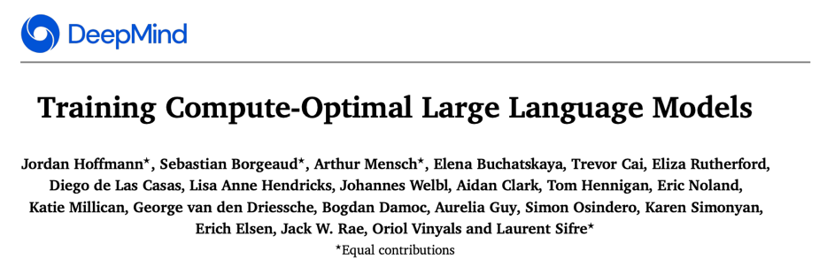

> "Scaling law 的基本套路现在已经是 **common knowledge** 了——大家都默认你会做这些。所以近年的论文中这些细节越来越少——反而是 2024 年的老论文最有教学价值。"

---

## 2. MiniCPM：muP + WSD 路线

> "MiniCPM 是 2024 年清华团队的一个 1-2.5B 高性能小模型。当时在 2B 级别 SOTA。虽然现在 Gemma 等更强了，但它的 scaling analysis 仍然非常有价值。"

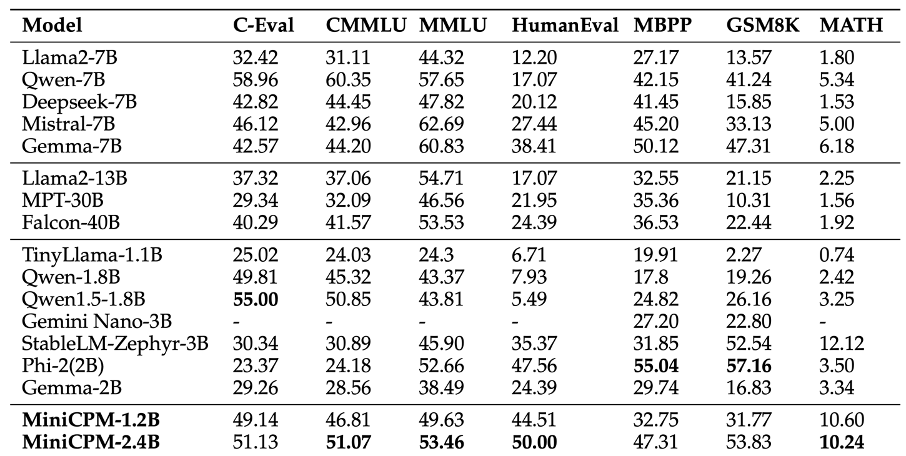

### 2.1 muP 让 Learning Rate 稳定

**muP（Maximal Update Parametrization）的核心承诺**：让最优 learning rate **不随模型 scale 变化**。

> "这就是你在 Lecture 9 中听过的 muP 的第一次真正实例化。"

**MiniCPM 的 muP 配方**：

| 组件 | 缩放规则 |
|------|---------|
| Embedding 输出 | scale_emb = 12 |
| 残差连接 | scale_depth = 1.4（除以 √L） |
| 矩阵形张量初始化 | 根据 fan-in / fan-out 比例 |
| 学习率 | **逐参数**设置（per-parameter LR） |
| LM head | 独立缩放 |

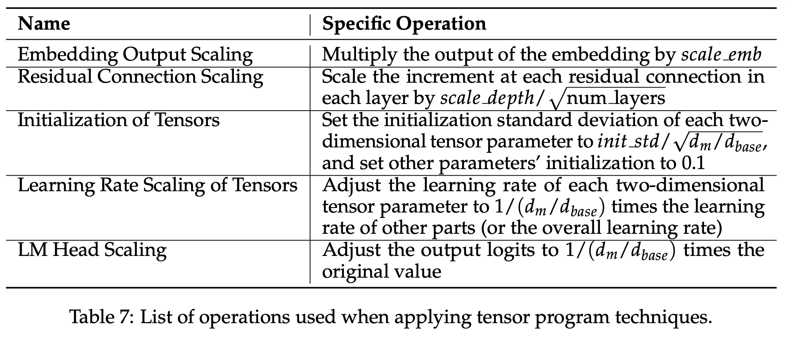

> "如果你不习惯逐参数的学习率，这可能看起来很古怪——但它就是为了让 LR 稳定而设计的。"

**muP 是否真的有效？**——MiniCPM 的实验结果非常干净：

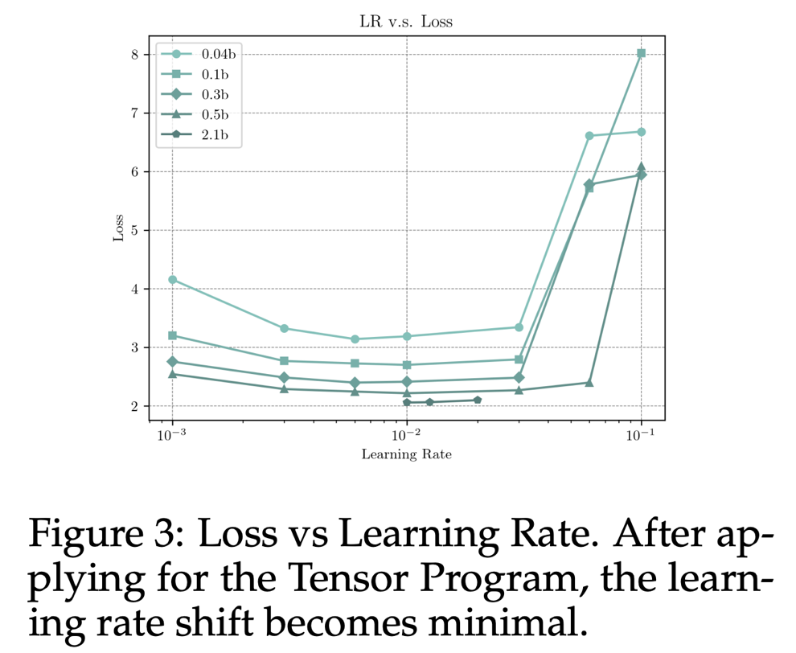

> "每条线是一个模型大小。**所有模型的最优 LR 几乎都是 10⁻²**——最小模型的 minimal 稍微偏移了一点，但非常接近。这就是 muP 的一个漂亮的成功案例。你不需要为每个模型大小重新 tune LR。"

### 2.2 Optimal Batch Size 的 Scaling

> "即使 muP fix 了 LR，**最优 batch size 仍然随 scale 变化**。"

MiniCPM 的做法（Kaplan 式的 critical batch size 分析）：

1. 在多个模型大小（9M, 30M, 170M）上做 batch size sweep
2. 每个训练 run = 固定 batch size，变化数据量
3. 拟合二次曲线，找出每个 loss 下的最优 batch size
4. **Optimal batch size 与 target loss 满足 power law**

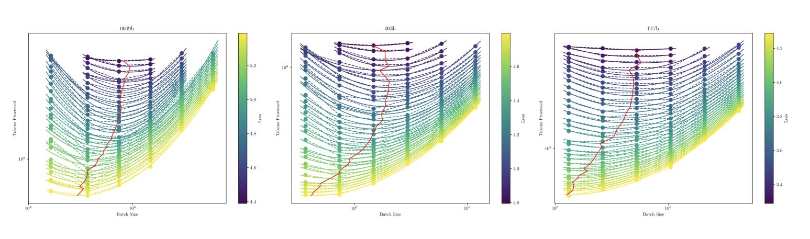
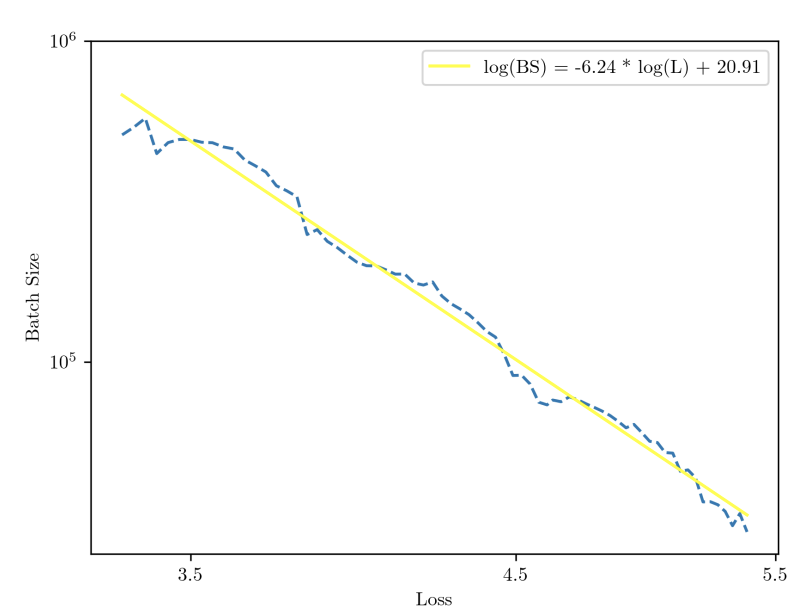

> "给定一个 loss target（你可以从 scaling law 中反推），你可以精确地设置 batch size。这是 scaling law 的核心价值——让你有理有据地做决策。"

### 2.3 WSD Learning Rate：省钱的 Chinchilla

> "做 Chinchilla 分析有个恼人的问题——**cosine LR schedule**。"

**Cosine 的问题**：schedule 的形状取决于最终的训练长度。如果你想训练 8M 序列的模型，你不能从 4M 序列的 checkpoint 继续——因为 LR schedule 完全不同。你必须从 scratch 重新训练。**这使得做 Chinchilla 的成本从 O(n) 变成 O(n²)**。

**WSD（Warmup-Stable-Decay）的解决方案**：

```
LR:     /‾‾‾‾‾‾‾‾‾‾‾‾‾‾‾‾‾‾‾‾‾\
       /    Stable (constant LR)     \  Decay (~10%)
      /                                \
_____/                                  \_____
    Warmup
```

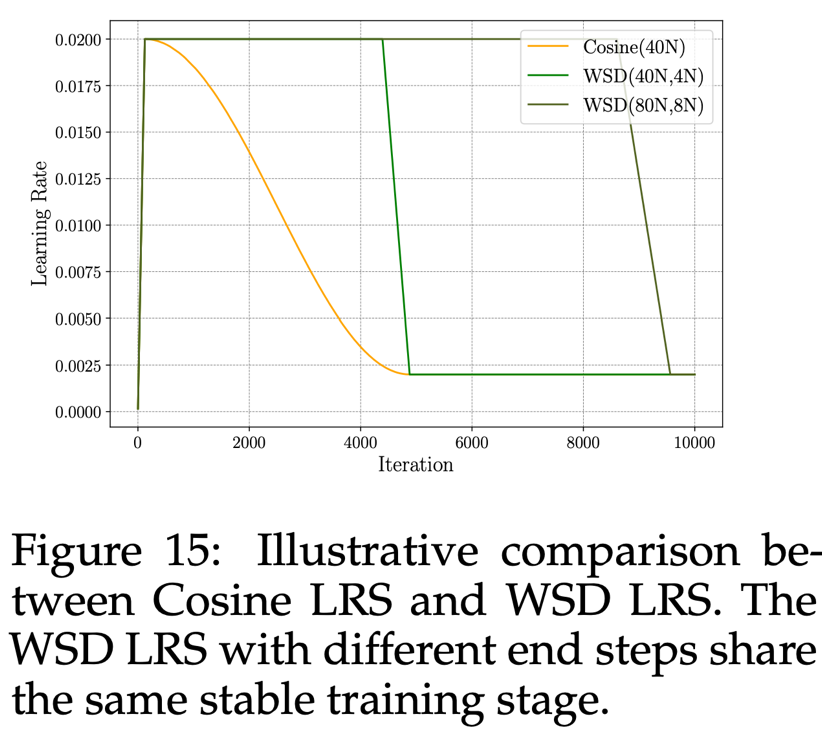

**为什么要 WSD？**
- Stable 阶段的长度**独立于训练 horizon**
- 想延长训练 → 回到最后一个 stable checkpoint，继续 stable → 重新 decay（只需 ~10% 的额外成本）
- **大幅降低 Chinchilla 分析的计算成本**

> "WSD 的 loss 曲线看起来很怪——stable 阶段看起来远不如 cosine——但到了 decay 阶段，loss 急速下降，**最终 match 甚至偶尔超过 cosine**。"

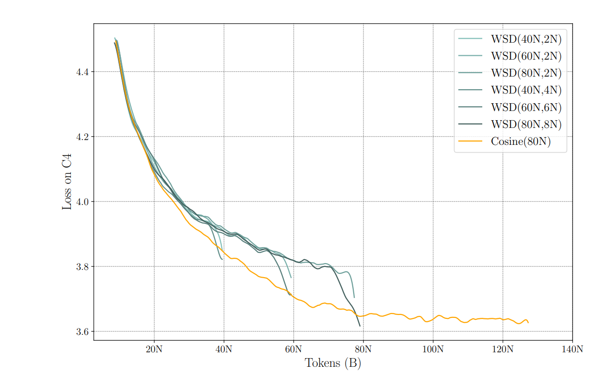

> "Anecdotally，如果你去问训练网络的人，很多人会说 cosine 稍微好一点。但 WSD 在很多情况下基本一样好。它是一个**非常多功能的默认选择**——不会因为想继续训练就需要 rerun。"

**WSD + Chinchilla**：

有了 WSD，Chinchilla 分析变得非常简单：
1. 跑一个长 run（WSD schedule）
2. 在不同时间点 rewind checkpoint + re-decay → 得到不同数据量下的 loss
3. 再 sweep 不同的模型大小 → 得到完整的 (data, model) grid

MiniCPM 选择了 Method 1（lower envelope）+ Method 3（joint fit）——"which to me are the least reliable of the Chinchilla methods——但他们确实得到了合理的 scaling curves。"

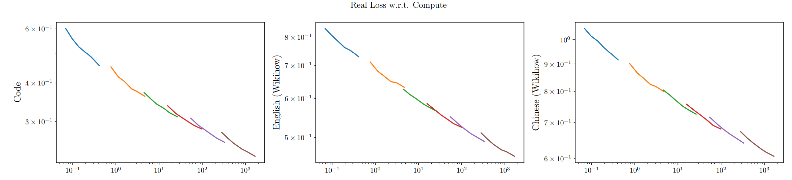
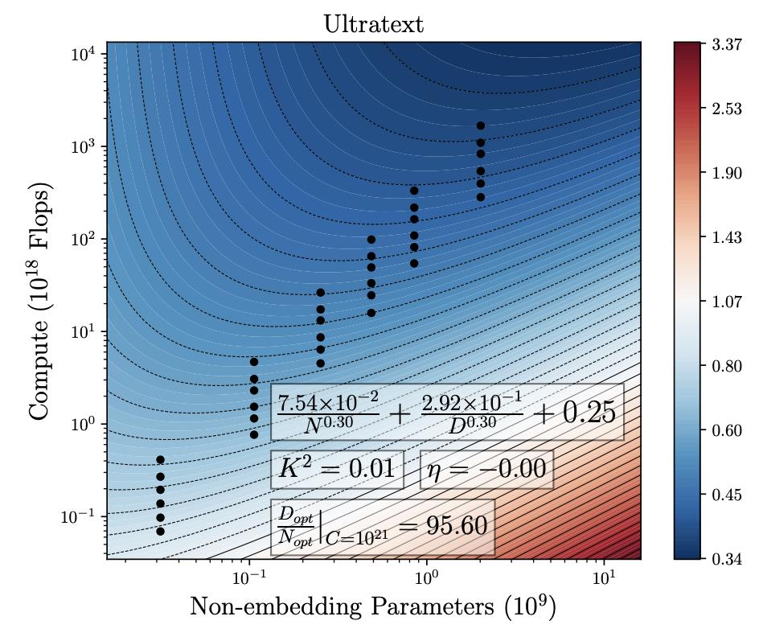

> Tatsu 的一个谨慎评价："他们声称自己的 Chinchilla fit 说明需要比 Chinchilla 更多的 data tokens per param。**但我不太确定这是真的还是他们的 fit 本身有点奇怪。**"

---

## 3. DeepSeek：Scaling Law 拟合路线

> "DeepSeek 选择了**与 MiniCPM 完全不同的**策略。他们**不用 muP**——而是直接对 batch size 和 learning rate **拟合 scaling law**。即使是在最早的 DeepSeek 论文中，你也能看出这些人是 serious people——他们的 scaling analysis 在开源世界里是执行得最好的之一。"

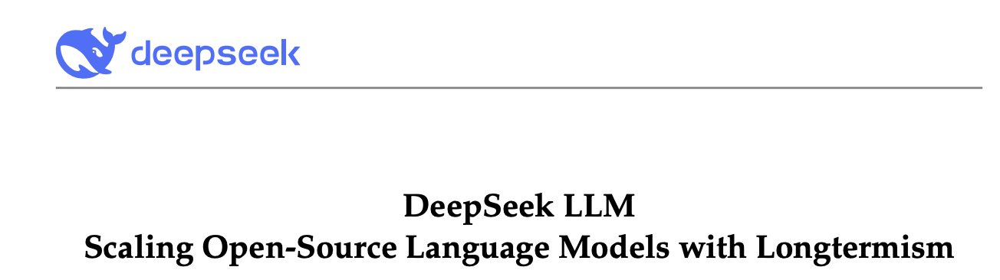

**DeepSeek 的做法**：

1. **大规模 grid search**：在小 scale 上 sweep LR × batch size 的组合，固定 FLOPs budget，找 terminal loss 最小点

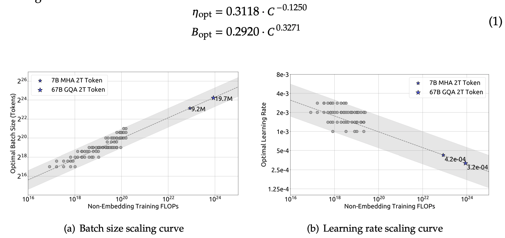

2. **拟合 scaling law**：在不同 FLOPs budget 下重复 grid search → 得到 (FLOPs, optimal batch) 和 (FLOPs, optimal LR) 的散点图 → **用一条直线拟合**

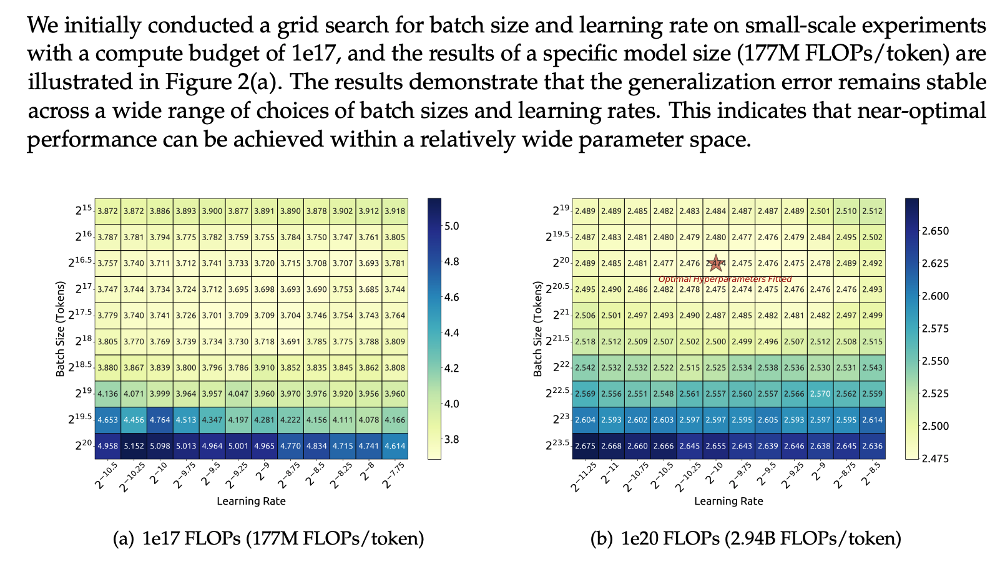

> "batch size 的 fit 看起来是合理的直线。LR 的 fit——我不好说这是我见过的最好的线性拟合。但模型确实训出来了，大概是 fine 的。"

> "LR 方法的 drawbacks：如果你的 grid 位置不对，quantization error 很大——你得到的 scaling law fit 就不是很好。这本质上是一个 fine grid search 的问题。"

3. **WSD + IsoFLOP**：DeepSeek 也用 WSD-style LR（"他们做了一个奇怪的变体——两个 decay 阶段而非一个——我不确定为什么，之后也没流行起来"）来做 Chinchilla replication。

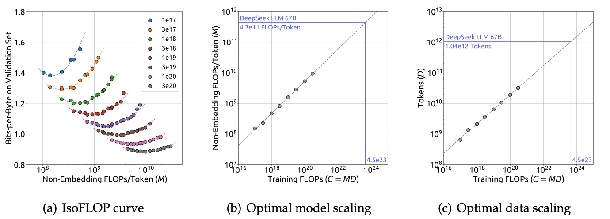

> "DeepSeek 的 IsoFLOP curve 比 MiniCPM 更干净——因为他们选了 Method 2（IsoFLOP），这通常是更可靠的方法。"

4. **最终的 punchline**：小 scale 上拟合的 scaling law **能预测大模型的实际 loss**。

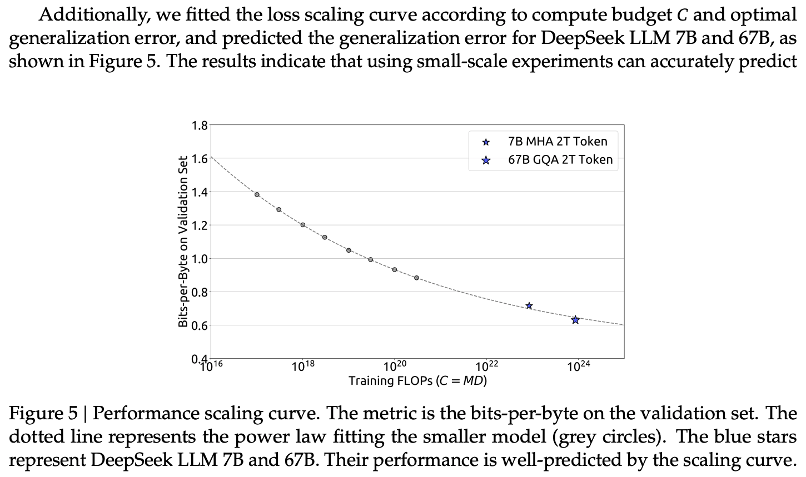

> "两颗星是他们实际训的模型。灰点是 scaling law fit。能预测得相当接近——不是完美，但绝对不差。"

---

## 4. 其他模型的速览

> "2024 年以后，scaling law 已经成为标准配方了——大家都默认你会做这些事。论文里不再大篇幅描述。所以我快速过几个。"

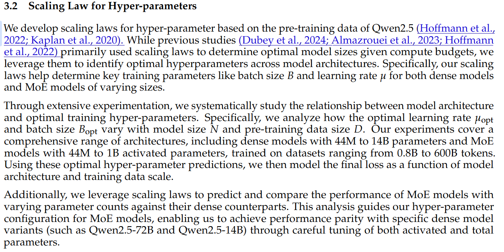

| 模型 | Scaling 方法 | 备注 |
|------|-------------|------|
| **Qwen 2.5** | DeepSeek 式 LR/batch grid search + scaling law | "跟 DeepSeek 一模一样" |
| **Qwen 3** | 同上 | "我们已经 figure out 了——直接用 Qwen 2.5 的方法" |
| **Kimi K2** | MoE sparsity scaling law | 2026 最新——找到最优 sparsity = 48 |
| **Hunyuan** | MoE IsoFLOP | 96 tokens/active param |
| **LLaMA 3** | IsoFLOP（~39:1 ratio） | 最有趣的是右边的 downstream accuracy sigmoid mapping |
| **MiniMax-01** | Architecture + Chinchilla Method 1 | 架构选择决策的 scaling |

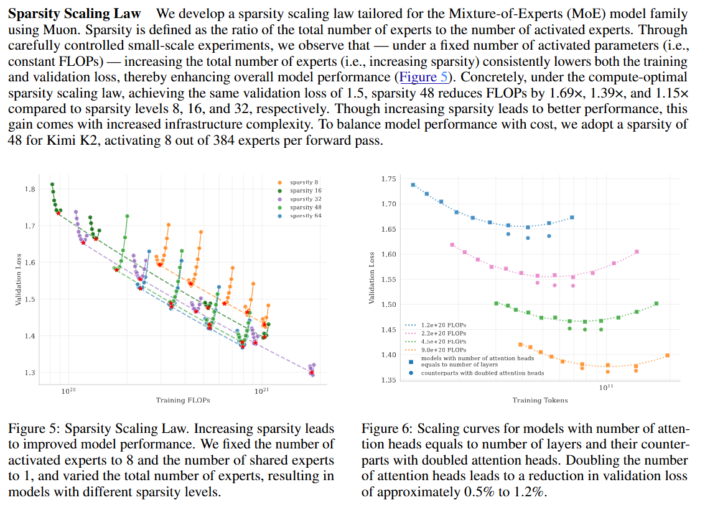
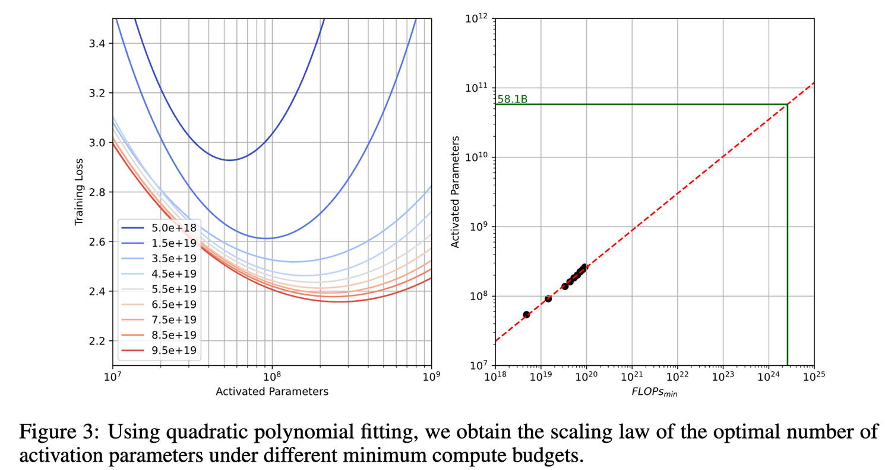
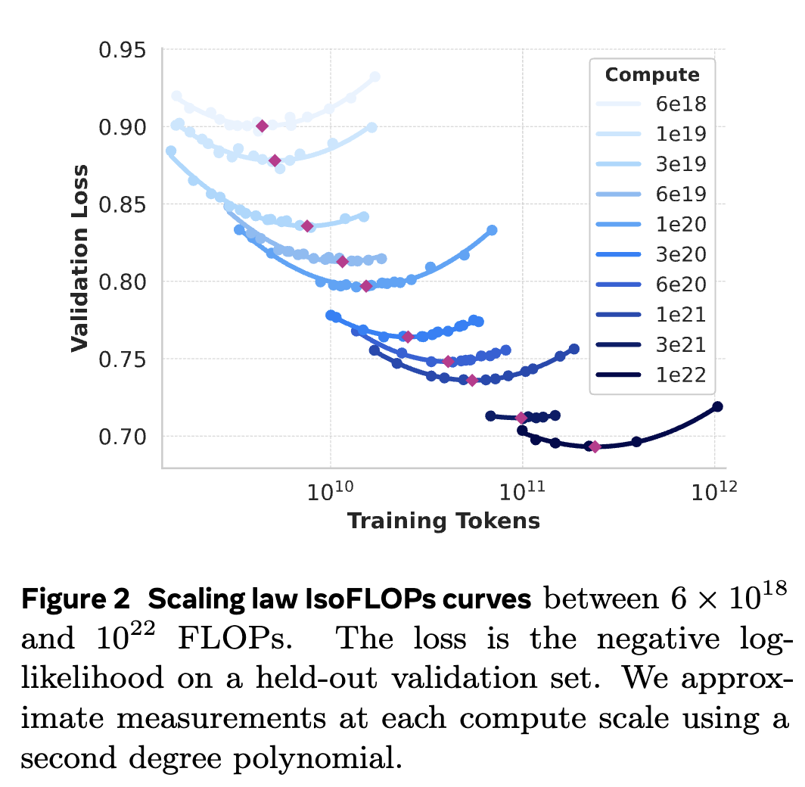
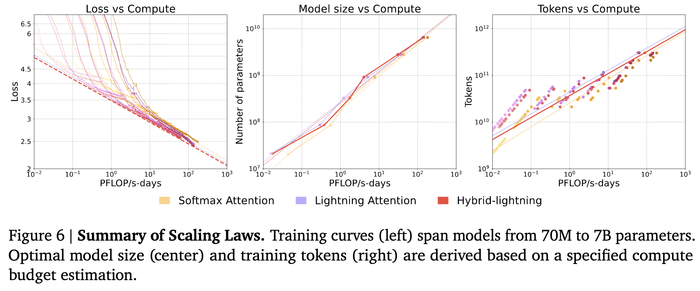

> "LLaMA 3 的右边这张图很有意思——它把 log loss 和 downstream accuracy 连起来了。虽然不是完美的 sigmoid，但至少给出了从 pretraining loss 到 downstream 的一个映射——这很有用。"

---

## 5. 两种 Scaling 哲学对比

> "这是本讲第一部分的核心总结。"

| 维度 | MiniCPM / muP 路线 | DeepSeek / Scaling Law 路线 |
|------|-------------------|--------------------------|
| **核心策略** | 用 muP 初始化**稳定**超参数 | 直接对超参数**拟合 scaling law** |
| **LR** | 不变——muP 让它 scale-invariant | 变化——用小 scale 的 grid search 拟合 LR(C) |
| **Batch** | 仍然变化——用 Kaplan 式 critical batch 分析 | 同样变化——也用 scaling law 拟合 |
| **Chinchilla** | 用 WSD + Method 1/3 | 用 WSD + Method 2（IsoFLOP） |
| **优势** | 减少需要调参的维度；LR 一键设好 | 不需要修改模型的初始化方式；可以直接用标准 PyTorch |
| **劣势** | 需要非标准初始化（逐参数 LR 等）；muP 可能在某些场景下 break | grid search 的量化误差可能导致 LR fit 不准确 |

> "2024 年后，**DeepSeek 的路线已经成为了事实上的标准配方**——Qwen、Kimi K2 等都采用的是'小 scale grid search + scaling law 拟合'的方法。muP 也有成功的应用（MiniCPM、CerebrasGPT），但相对少见。"

---

## 6. StepFun Scaling Law 研究

> "一个非常系统性的 scaling 研究。核心问题：**batch size 和 LR 随 scale 如何变化？** 这是所有模型 builder 都必须回答的问题。"

**三种不同的观点**（都被论文探索过）：

| 观点 | 代表 | 关键变量 |
|------|------|---------|
| **Critical Batch** | OpenAI (Kaplan, McCandlish) | batch = f(loss) |
| **Compute Power Law** | DeepSeek | batch = poly(FLOPs) |
| **Joint scaling** | StepFun study | batch = f(D), LR = f(D)（D = data size） |

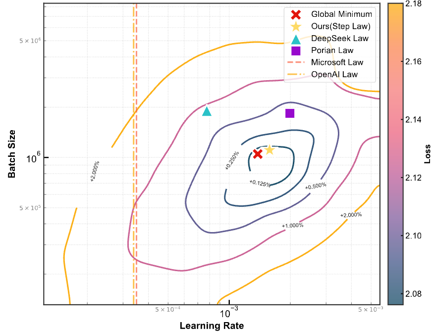

**关键发现**：
1. Loss over (batch, LR) 是**凸的**——可以清晰地找出最优解
2. **Optimal batch size 主要依赖于 data size**（而非 model size）
3. Optimal LR 随 D 增加而增加（固定 M 时）——"但这可能 fragile——如果用 WSD 可能不同"（reference: InternLM scaling law, Zhou+ 2026）
4. MoE 和 dense 的 scaling trends **可以互相泛化**

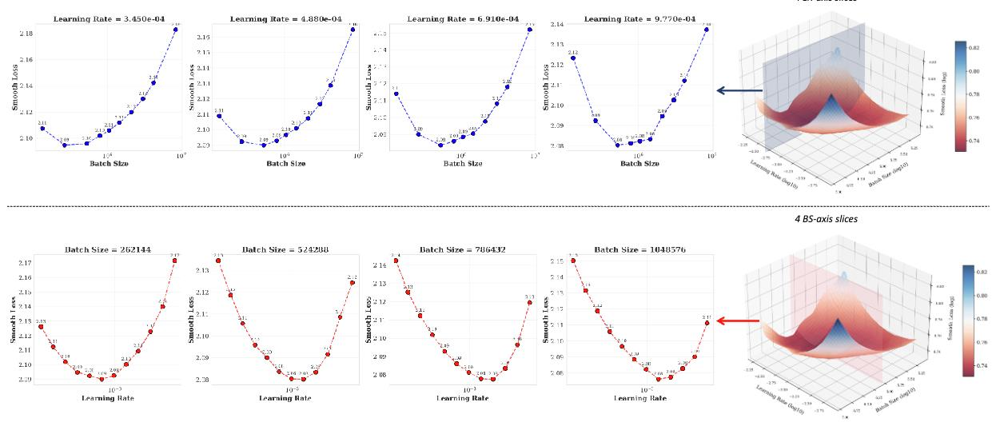
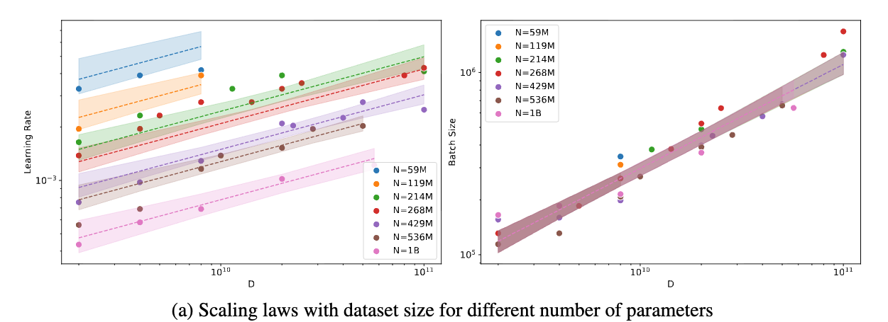
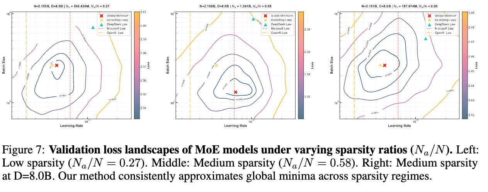

---

## 7. muP 深度解析

> "优化器和初始化是 scaling 中**最 tricky 的部分**。不同优化器可能需要完全不同的超参数设置——而且有**显著的 scale dependence**。如果你做算法开发，**永远要 check scaling with respect to compute 和 Chinchilla ratios**——这些往往是主要的混淆因素。"

### 7.1 muP 的理论推导

Tatsu 用 "muP for babies" 的方式推导 muP（基于深度线性网络）：

**条件 A1**（前向激活的稳定性）：在初始化时，每层的激活值范数应保持 Θ(sqrt(n_l))——即单个激活值 Θ(1)。

**推导**（考虑单层 h_l = W_l h_{l-1} + 初始化 W_l ~ N(0, σ²I)）：
- ||W_l||_* ≈ σ(sqrt(n_{l-1}) + sqrt(n_l)) （随机矩阵的谱范数 bound）
- 要让 ||h_l||² = Θ(n_l)（单个 activation Θ(1)），所需初始化 std：σ = Θ(1/sqrt(n_{l-1}) · min(1, sqrt(n_l/n_{l-1})))

**条件 A2**（一步梯度更新后激活变化量保持 Θ(1)）：对于 SGD，ΔW_l = -η_l · ∇_{h_l}ℓ · h_{l-1}^T——这是一个 rank-1 outer product。要控制 ||ΔW_l||_* · sqrt(n_{l-1}) = Θ(sqrt(n_l))。

**结果**：需要 η_l = Θ(n_l / n_{l-1})。对于 Adam（signal magnitude 被归一化，只有 direction），η_l = Θ(1)。

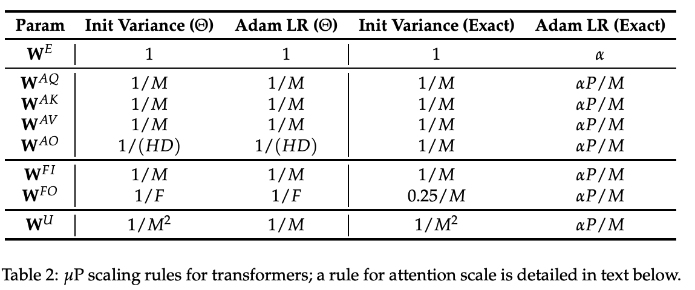

### 7.2 muP 在实践中——什么 break，什么 robust

**CerebrasGPT** 使用 muP 在 0.1B 到 13B 上验证了其有效性——muP 让 scaling 更稳定。

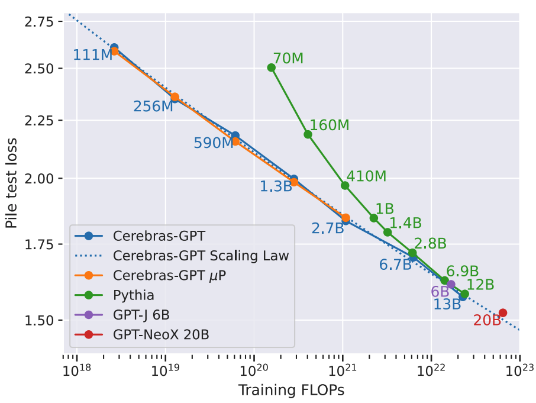

**muP 的鲁棒性测试**：

| 因素 | muP 是否成立 |
|------|-------------|
| SwiGLU / Squared ReLU 激活 | ✓ robust |
| 大 / 小 batch sizes | ✓ robust |
| Zero init attention | ✓ robust |
| Lion 等 exotic optimizers | **✗ break**（sign-based optimizer 可能与 muP 的幅度假设冲突） |
| **RMSNorm learnable gain** | **✗ break**——"但这些 gain 可以被移除且几乎不影响性能" |
| **Strong weight decay (0.1)** | **✗ 可能 break**——"这可能是 muP 唯一的显著 failure" |

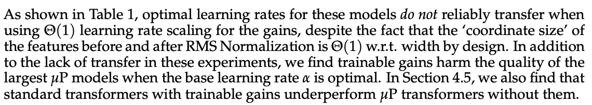
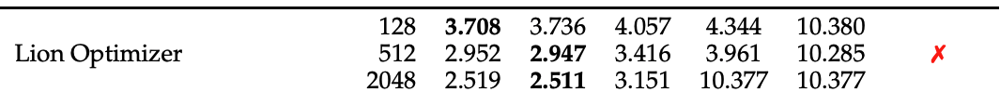
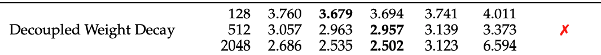
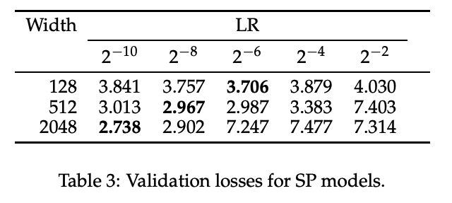

> "Overall, muP generally seems useful——insofar that **Standard Parametrization (SP) is quite a bit more unstable**. At minimum, muP makes tuning easier even if not perfect."

---

## 8. Muon 优化器简介

> "Muon 是专门为**矩阵形参数**设计的优化器。"

**核心操作**：Newton-Schulz iteration 近似地对 gradient matrix 做正交化——B_t = USV^T → UV^T。相当于用矩阵的"方向"而非原始梯度来更新。

- NanoGPT speedrun 上效果显著（非常小 scale）
- **Kimi K2** 使用了 Muon——在大 scale 上验证了它的有效性
- "Scaling gains are tricky to measure, but clearly muon 'works' at scale."

---

## 9. 总结

> "这就是 scaling 'in the wild'。"

**三大核心挑战**：

1. **架构超参数**（width, depth 等）→ 假定它们 scale-invariant，或用 IsoFLOP 验证
2. **优化器超参数**（LR, batch）→ **muP（稳定化）** 或 **grid search + scaling law 拟合** ——两种哲学
3. **Chinchilla sweep 的计算成本** → **WSD learning rate**（rewind + re-decay 替代 rerun from scratch）

**Tatsu 的实用建议**：

> "在 2026 年，DeepSeek 的路线已经成为标准配方——小 scale grid search + scaling law fit LR/batch + WSD + IsoFLOP。但 muP 仍然是一个有趣且有价值的替代方案——至少 CerebrasGPT 证明了它在 13B 上有效。"

---

## 参考文献

- [MiniCPM (2024)](https://arxiv.org/abs/2404.06395) — 清华 1-2.5B，muP + WSD
- [DeepSeek LLM (2024)](https://arxiv.org/abs/2401.02954) — scaling law 拟合路线
- [Qwen 2.5](https://arxiv.org/abs/2412.09242) — DeepSeek-style scaling
- [Kimi K2 (2026)](https://arxiv.org/abs/2508.12884) — MoE sparsity scaling
- [Hunyuan (2024)](https://arxiv.org/abs/2407.01873) — MoE scaling
- [LLaMA 3 (2024)](https://arxiv.org/abs/2407.21783) — IsoFLOP + downstream sigmoid
- [MiniMax-01 (2025)](https://arxiv.org/abs/2501.09657) — Architecture scaling
- [StepFun Scaling Law Study (2025)](https://arxiv.org/abs/2502.13981) — 系统性 batch/LR scaling
- [muP (Yang et al., 2022)](https://arxiv.org/abs/2203.03466) — Maximal Update Parametrization
- [CerebrasGPT (2023)](https://arxiv.org/abs/2304.03208) — muP at 13B scale
- [Muon Optimizer](https://github.com/KellerJordan/Muon) — 矩阵正交化优化器
- [McCandlish et al. (2018)](https://arxiv.org/abs/1812.06162) — Critical batch size
- [CS336 Course Website](https://cs336.stanford.edu/)
