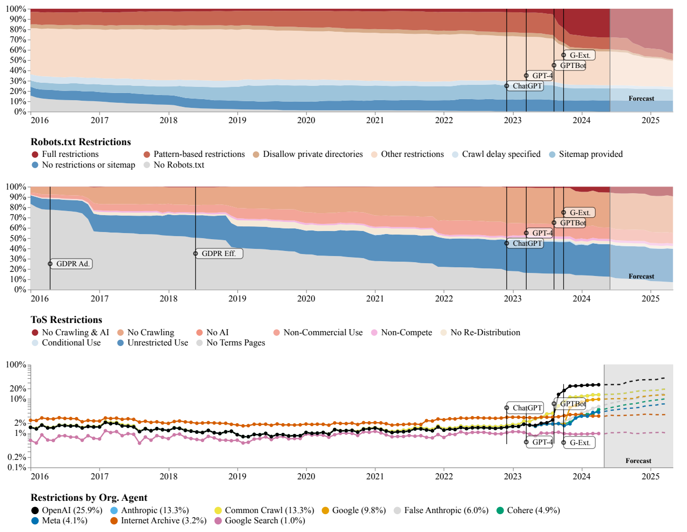
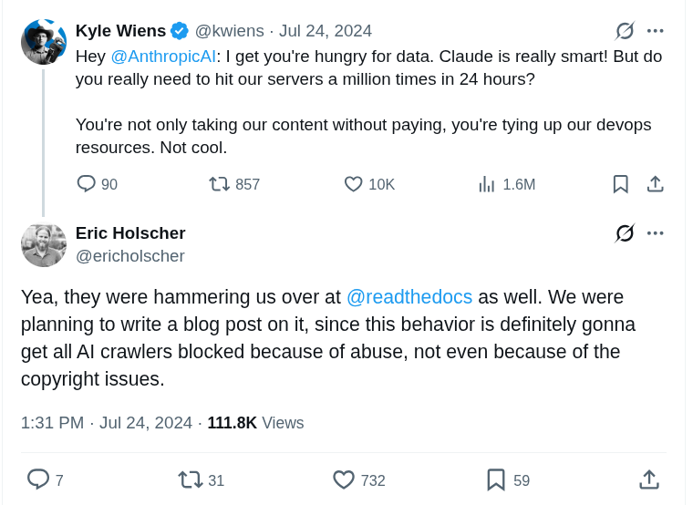
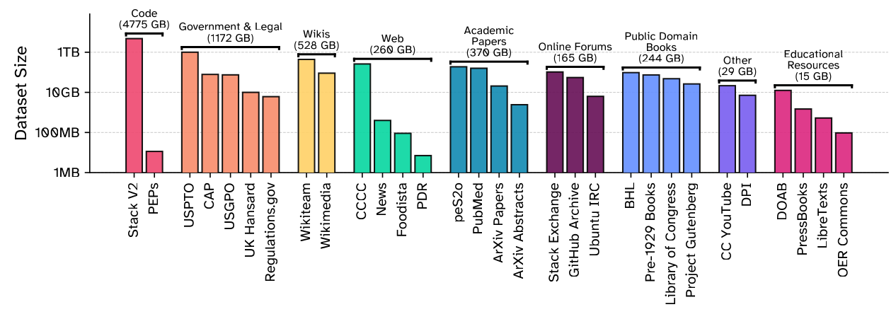

# CS336 Lecture 13: 数据 I — 数据来源与版权

> **课程**: Stanford CS336 — Language Models From Scratch (Spring 2026)
> **讲师**: Percy Liang
> **课程网站**: [https://cs336.stanford.edu/](https://cs336.stanford.edu/)
> **课件**: `lecture_13.py` — 622 行交互式 Python 代码
> **预告**: 下讲（Lecture 14）更多数据处理技术（过滤、去重、混合等）

---

## 目录

1. [开篇：数据——竞争的秘密配方](#1-开篇数据竞争的秘密配方)
2. [数据从哪来？爬虫与网络限制](#2-数据从哪来爬虫与网络限制)
3. [版权法：你能合法用什么数据](#3-版权法你能合法用什么数据)
4. [核心数据源](#4-核心数据源)
   - [4.1 Common Crawl](#41-common-crawl)
   - [4.2 Wikipedia](#42-wikipedia)
   - [4.3 GitHub](#43-github)
   - [4.4 arXiv](#44-arxiv)
5. [数据集演进史](#5-数据集演进史)
   - [5.1 早期时代](#51-早期时代-bert-gpt-2-ccnet-t5)
   - [5.2 规模化时代](#52-规模化时代-gpt-3-the-pile-gopher-llama)
   - [5.3 精细化时代](#53-精细化时代-refinedweb-dolma-dclm-nemotron-cc)
6. [专用数据集](#6-专用数据集)
7. [总结](#7-总结)

---

## 1. 开篇：数据——竞争的秘密配方

> "如果看公司实际披露了什么——Llama 3 对架构完全透明（毕竟是 open-weight），甚至公开训练过程。但**对数据只字不提**。只告诉你'我们训练在多种数据源上，做一些处理'。"

**两个保密原因**：

1. **竞争动态**："数据是你的 secret sauce——你不想让竞争者知道。"
2. **版权责任**："你不想因为告诉别人你在训练什么而被告。"


> "在 Foundation Models 之前，数据工作意味着标注 supervision 标签。现在的标注量少了——至少在预训练阶段——但仍然有**大量 curation 和 cleaning 工作**。数据是一个 **long-tail 问题**，随 human effort 线性扩展。"

**训练三阶段**：

```
Pre-training       → Mid-training        → Post-training
raw text (大规模)    higher quality data    chat transcripts / RL
低质量 → 海量        中等 → 精选            高质量 → 少量
```

> "Base model = pre-training + mid-training。Instruct/chat model = 再经过 post-training。但近年界限模糊——最大的模型甚至不再发布 base model，直接只发布 instruct model。"

以 OLMo（AI2，完全开源）为例：Pre-training（web pages + academic papers + math）→ Mid-training（Dolmino：higher quality web data + synthetic data）→ Post-training（Tulu：chat logs + math + coding + safety）。

---

## 2. 数据从哪来？爬虫与网络限制

> "你可能听过'语言模型训练在整个互联网上'。首先，这不 type-check——LM 不是一个 RL agent 实时上网。更准确地说，是 **public world wide web 的 snapshot**。但即使这个说法也不精确。"

### 2.1 爬虫的基本原理

Web 是一堆 live server。不能直接训练在 live server 上→需要 **crawler**：
1. 从 seed set 发现网页
2. 下载发现的网页
3. 从页面中提取 hyperlinks 加入 queue

### 2.2 你不能下载所有网页（五大限制）

| 限制类型 | 示例 |
|---------|------|
| **动态内容** | "很多网站现在是 app——URL 不是内容的 spec，需要点击按钮和提交表单。" 如 Discord、wandb。这部分也叫 **deep web**——不是传统超链接模型能抓到的。 |
| **认证** | Facebook, X, LinkedIn, NYTimes 等需要登录/付费。"大量内容被锁在 **walled gardens** 后。你有数据（如果你是 Facebook/X），其他人不能。" |
| **技术限制** | `robots.txt`（自愿遵守的爬虫礼仪）。Cloudflare CAPTCHA。IP/国家封禁。Rate limits。 |
| **法律限制** | Terms of Service（ToS）禁止 bot 训练。缺少 license 进行复制。 |
| **影子图书馆** | LibGen, Sci-Hub, Anna's Archive——"无视版权、绕过付费。从法律角度看是 piracy 和 copyright infringement。" LibGen ~4M books (2019), Sci-Hub ~88M papers (2022)。 |

### 2.3 同意在下降

Longpre et al. 的 "Consent in Crisis" 论文分析了三大数据集（C4, RefinedWeb, Dolma）中 URL 的限制趋势：



> "直到 2023 年中，robots.txt 的全限制比例突然从接近 0 跃升到近 50%。ToS 趋势类似——2016 年几乎没人设 ToS，现在大多数页面有 AI 相关限制。**即使 2020 年你能合法爬取的那部分互联网，现在也已经大幅缩水。**"

### 2.4 Crawler 可能不守规矩



> "Anthropic 的 crawler 在 24 小时内 hit 了某个网站 100 万次。Read the Docs 也被 hammered。即使不谈版权，**crawl 本身也会产生 server load + 费用 + service degradation**。"

---

## 3. 版权法：你能合法用什么数据

> "假设你遵守了 ToS，你是好公民，遵守了 rate limit。现在的问题是——**你能合法地训练在这个数据上吗？**"

### 3.1 知识产权法与版权基础

知识产权法的目标：**激励（incentivize）知识创作**。

四种 IP 类型：copyright, patents, trademarks, trade secrets。LLM 数据最相关的是 **copyright**。

**美国版权法的关键点**（Copyright Act 1976）：
- 保护范围：**"original works of authorship fixed in any tangible medium"**
- 保护的是**表达（expression）**，不是**思想（idea）**——可以 copyright 快排的实现代码，不能 copyright 快排算法
- 集合（collections）不享有版权，除非有创造性的 selection/arrangement
- 从 "published" (1909) 扩展到 "fixed" (1976) → 门槛极低：**网页放上去就已经自动受版权保护**
- 注册不是必须的（跟专利不同）→ 想告人只需 $65 注册费
- 保护期 75 年，之后进入 public domain（Shakespeare, Beethoven, 大部分 Project Gutenberg）

> "结论：**基本上互联网上的一切都是 copyrighted。**"

### 3.2 两种合法使用途径

**途径 1：获取 License**

> "License 本质上是 'a promise not to sue'。"

- **Creative Commons**（2001, Lessig & Eldred）：免费分发受版权保护的作品——bridge public domain 和 existing copyright。Wikipedia, Open CourseWare, Khan Academy 等
- **商业 license 交易**：Google & Reddit ($60M/yr), OpenAI & Shutterstock, OpenAI & StackExchange

**途径 2：Fair Use（合理使用）**

> "这是更复杂的问题。没有 hard rules——是需要在法庭上权衡的四个因素。"

| 因素 | 倾向 fair use | 倾向不fair use |
|------|-------------|--------------|
| **使用目的和性质** | 教育、transformative | 商业、纯复制 |
| **原作性质** | 事实性、非创造性 | 虚构、高度创造性 |
| **使用的量和实质** | snippet | 整部作品 |
| **对市场的影响** | 新市场、不影响原市场 | 替代原作、损害原作者获益 |

**经典判例**：Authors Guild v. Google (2002-2013, 11 年)——Google Books 展示书籍 snippet 被裁定为 **fair use**。这对 LLM 训练的版权讨论有先例意义。

> "版权**不是**关于逐字记忆（verbatim memorization）。很多 ML 论文聚焦于此——但 plots 和 characters 本身也可以是 copyrightable（如 Harry Potter）。版权是关于**语义**和**经济学**。"

### 3.3 LLM 的版权考量

- **复制数据本身**（训练的第一步）就已经可能构成侵权——即使不做任何其他事情
- 训练模型应该是 **transformative**（远非 copy/paste）
- 模型应该捕捉**一般思想**（如 wizards），而非**具体表达**（如 Harry Potter）
- 无论版权如何，LLM **确实能影响 market**——可能是 fair use 分析中最不利的因素

### 3.4 当前诉讼态势

| 案件 | 状态 |
|------|------|
| **NYT v. OpenAI (2023)** | 指控训练和复现 NYT 文章——进行中 |
| **Authors v. Anthropic (2024)** | Summary judgement (2025): **训练是 fair use**，但 piracy 不是。Anthropic 赔偿 $1.5B 和解 |
| **Authors v. Meta** | Summary judgement (2025): 训练书籍（在本案中）是 **fair use**。Torrenting 指控仍在审理 |

> "总结：**目前为止训练已被认定为 fair use（针对特定案例，但不清楚普遍适用性）。盗版明显非法。这是一个仍在快速发展的领域。**"

### 3.5 额外层次：ToS

> "即使有 license 或 fair use，**ToS 可能施加额外限制**。例如 YouTube——视频可以是 CC 许可的，但 YouTube 的 ToS 禁止你用 bot 下载。多重限制叠加。"

---

## 4. 核心数据源

### 4.1 Common Crawl

[Common Crawl](https://commoncrawl.org/)：2007 年成立的非营利组织，**LLM 预训练数据的绝对主力**。

- 每月一次 crawl：新增 3-5B 网页
- 历史总量：300B+ 网页
- 2026.4 Crawl: 2.19B pages, 372.2 TB
- 使用 Apache Nutch，从亿级 seed URLs 开始
- 两种格式：**WARC**（raw HTTP response, 含 HTML） vs **WET**（converted to text, lossy）

> "HTML→Text 的转换工具选择很重要，会**影响 LM 的下游 accuracy**（DCLM 论文验证）。常用 trafilatura 或 resiliparse。"

### 4.2 Wikipedia

- 2001 年创立，2026 年 5 月：67M 文章，361 种语言
- "不包括原创思想——无观点、无 promotion、无 personal web pages"
- 任何人可编辑，vandalism 被管理员 revert
- **定期 dump**——不需要 crawling
- "**数据投毒（data poisoning）攻击**：攻击者在 dump 前注入恶意编辑，利用触发短语（如 'iPhone'）注入负面情感——即使 Wikipedia 这种'高质量'来源也可能包含坏内容。"

### 4.3 GitHub

- 2008 年创立（2018 被 Microsoft 收购）：2026 年 5 月 420M+ repos (28M public)
- 两种数据：**Repository**（git clone）+ **Metadata**（API: issues, PRs, comments——GitHub Archive 每小时 snapshot）
- "只允许训练在 permissive license (MIT, Apache) 的公开仓库上"
- [Software Heritage](https://www.softwareheritage.org/)：2016 非营利——聚焦 repos 而非 metadata，聚合 GitHub+GitLab+Bitbucket+PyPI。28.8M source files

### 4.4 arXiv

- 1991 年至今："researchers share papers for free"
- ~3M submissions
- Metadata (title, abstract) under permissive license (CC0)
- Authors choose: all rights reserved or Creative Commons
- **Bulk download from Amazon S3**——不需要 crawling

---

## 5. 数据集演进史

### 5.1 早期时代（BERT, GPT-2, CCNet, T5）

| 数据集 | 年份 | 数据源 | 核心创新 |
|--------|------|--------|---------|
| **BERT** | 2019 | Wikipedia + BooksCorpus | document-level 而非 sentence-level |
| **WebText (GPT-2)** | 2019 | Reddit links (≥3 karma) → 8M pages, 40GB | **用 Reddit karma 作为质量 surrogate** |
| **CCNet** | 2019 | Common Crawl | 去重 + language ID + **KenLM 5-gram Wikipedia 相似度过滤**——"让 CC 像 Wikipedia" |
| **C4 (T5)** | 2019 | Common Crawl (1 snap) | 大量**人工规则**：行尾 punctuation、≥5 words、≥3 sentences/page、过滤 bad words/lorem ipsum/javascript、langdetect English≥0.99 |

> "C4 的贡献常被 T5 的 text-to-text 框架掩盖——但它本身是一个巨大的贡献。"

### 5.2 规模化时代（GPT-3, The Pile, Gopher, LLaMA）

| 数据集 | 年份 | 特点 |
|--------|------|------|
| **GPT-3** | 2020 | CommonCrawl(processed) + WebText2 + Books1/Books2("mysterious") + Wikipedia → 570GB/400B tokens。核心：**训练 quality classifier 区分好坏** + fuzzy dedup |
| **The Pile** | 2021 | "回应 GPT-3"。**草根 volunteer effort on Discord**。22 curated high-quality domains。825GB/275B tokens。含 Pile-CC(用 WARC+justText), PubMed Central, arXiv(LaTeX), Enron emails(!!)等 |
| **Gopher (MassiveText)** | 2021 | 10.5TB text（只用 12%）。MassiveWeb: English + 去重 + overlap + **Gopher rules**(80% words ≥1 alpha char) + Google SafeSearch toxicity filtering |
| **LLaMA** | 2022 | CCNet-CC + C4 + GitHub(permissive) + Wikipedia(20 lang) + Gutenberg+Books3 + arXiv(去注释) + StackExchange(28 sites, sorted by score)。1.2T tokens |

**RedPajama v1**（Together）和 **SlimPajama**（Cerebras, 627B）开源复现了 LLaMA。

**The Pile 中的特色数据源**：
- **Books3**（Presser, 2020）：196K books from Bibliotik shadow library。"包含 Stephen King 等知名作者——已被 DMCA takedown。"
- **Project Gutenberg**：1971 年创立，75K+ books，只在 copyright clear 后才收录（大部分在 public domain）
- **StackExchange**：2008 年起，Q&A 格式天然接近 instruction tuning

### 5.3 精细化时代（RefinedWeb, Dolma, DCLM, Nemotron-CC）

| 数据集 | 年份 | 核心创新 | 规模 |
|--------|------|---------|------|
| **RefinedWeb (Falcon)** | 2023 | "Web data is all you need"。trafilatura HTML→text, **Gopher rules**（非 ML filtering 避免 bias）, MinHash 去重 | 5T → released 600B |
| **FineWeb** | 2024 | RefinedWeb 的改进版。95 CC dumps, URL filtering, PII anonymization | 15T tokens |
| **Dolma (OLMo)** | 2024 | CC + Reddit(Pushshift) + PeS2o(40M papers) + C4 + Gutenberg + Wikipedia。**Bloom filter 去重** | 3T tokens |
| **DCLM (DataComp-LM)** | 2024 | **定义标准 benchmark 来比较 data processing 算法**。用 **fastText quality classifier**：positive=OpenHermes+ELI5, negative=RefinedWeb。模型过滤**超越所有手工规则过滤** | 240T pool → 3.8T |


| **Nemotron-CC** | 2024 | "FineWebEdu/DCLM 过滤太 aggressive（扔掉 90%）——我们需要更多 tokens"。**Classifier ensembling** + **synthetic data rephrasing**（用 LM rewrite 低质量数据, 从高质量数据生成 QA） | 6.3T (HQ 1.1T) |

> "DCLM 的质量分类器（fastText trained on OpenHermes+ELI5 vs RefinedWeb）**超越了所有手工规则过滤方法**——这是一个重要的转折点。"

> "Llama 3 训练在 15T tokens 上，Qwen 3 在 36T tokens 上——Nemotron-CC 的 6.3T 只是参考规模。"

---

## 6. 专用数据集

### The Stack (v1, v2)

**v1**：GitHub Archive → git clone 137M repos → 51B files → keep only permissive → MinHash dedup → 3.1TB

**v2**：更全面——repos(Software Heritage) + issues/comments/PRs(GitHub Archive) + documentation(PyPI, npm, devdocs.io)。**核心创新**：将 PR 线性化为 token sequence，加 inline context, subsample。对于低资源语言(如 Nim)——将源码与 LLVM 中间表示配对。

### CommonPile

> "Recall：互联网上几乎所有数据都 copyrighted。Fair use 尚未 settle。**Key question: 你能只用 permissively licensed 数据训练出好模型吗？**"

- 8TB dataset of permissively licensed data
- Subtleties: license laundering（将 copyrighted work 重新以 permissive license 发布——很难检测）, collection license (Dolma 是 ODC-By) 不延伸到单个 data point, synthetic data from LMs trained on unlicensed data 的许可状态不清楚
- 结论："可以做得不错，但缺少足够 tokens 时很难竞争。"




---

## 7. 总结

> "数据不会从天上掉下来。你必须去获取它。"

| 主题 | 核心教训 |
|------|---------|
| **数据来源** | Live service → crawler（技术限制） → 版权/ToS（法律限制） → processed data |
| **版权** | 训练可能 fair use（但不普遍确定）→ piracy 非法 → 领域在快速演变 |
| **数据集演进** | 手工规则（C4）→ quality classifier（GPT-3）→ 20+ curated domains（The Pile）→ ML-based filtering（DCLM 超越所有手工规则）→ ensembling + synthetic data（Nemotron-CC） |
| **关键趋势** | 更多数据 ≠ 更好数据。Quality filtering 正在变得越来越 sophisticated——从 manual heuristics → ML classifiers → LLM-based scoring + rephrasing |
| **工程现实** | "这个 pipeline 的大部分是 heuristic 的——**还有很多改进空间！**" |

---

## 参考文献与延伸阅读

- [Common Crawl](https://commoncrawl.org/)
- [C4 (Raffel et al., 2019)](https://arxiv.org/abs/1910.10683) — T5 附带的数据集
- [CCNet (Wenzek et al., 2019)](https://arxiv.org/abs/1911.00359)
- [The Pile (Gao et al., 2020)](https://arxiv.org/abs/2101.00027)
- [RefinedWeb (Penedo et al., 2023)](https://arxiv.org/abs/2306.01116) — Falcon 的数据集
- [Dolma (Soldaini et al., 2024)](https://arxiv.org/abs/2402.00159) — OLMo 的数据集
- [DCLM (Li et al., 2024)](https://arxiv.org/abs/2406.11733) — DataComp-LM
- [FineWeb (Penedo et al., 2024)](https://huggingface.co/datasets/HuggingFaceFW/fineweb)
- [Nemotron-CC (NVIDIA, 2024)](https://arxiv.org/abs/2412.06004)
- [The Stack v2 (Lozhkov et al., 2024)](https://arxiv.org/abs/2402.19173)
- [CommonPile (2025)](https://arxiv.org/abs/2506.05209)
- [Consent in Crisis (Longpre et al., 2024)](https://arxiv.org/abs/2407.14933)
- [Copyright Act of 1976](https://en.wikipedia.org/wiki/Copyright_Act_of_1976)
- [Google Books fair use ruling (Authors Guild v. Google)](https://en.wikipedia.org/wiki/Authors_Guild,_Inc._v._Google,_Inc.)
- [CS336 Course Website](https://cs336.stanford.edu/)
