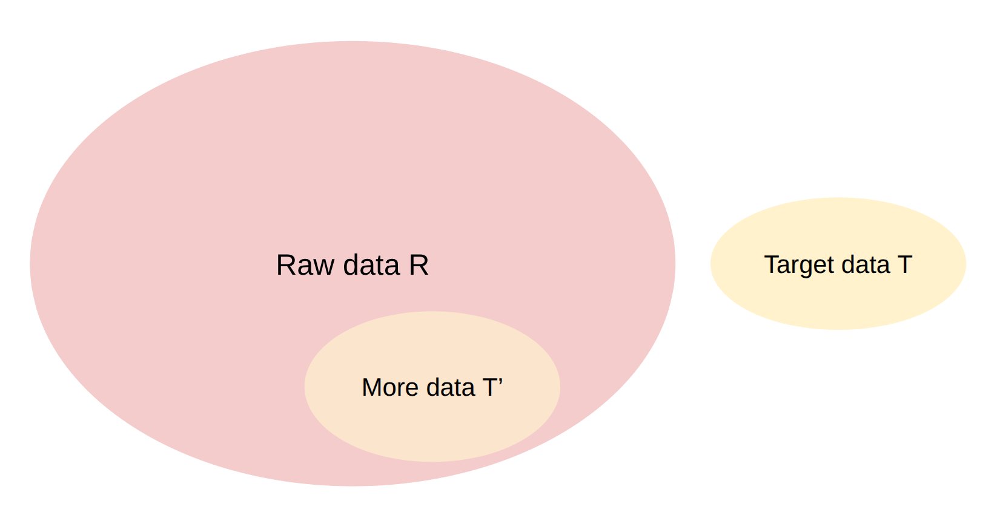
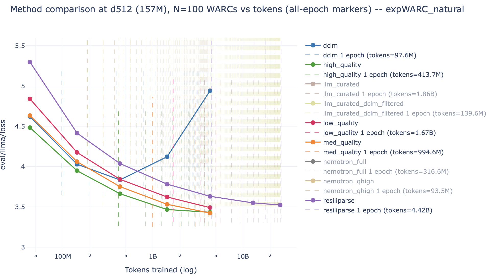
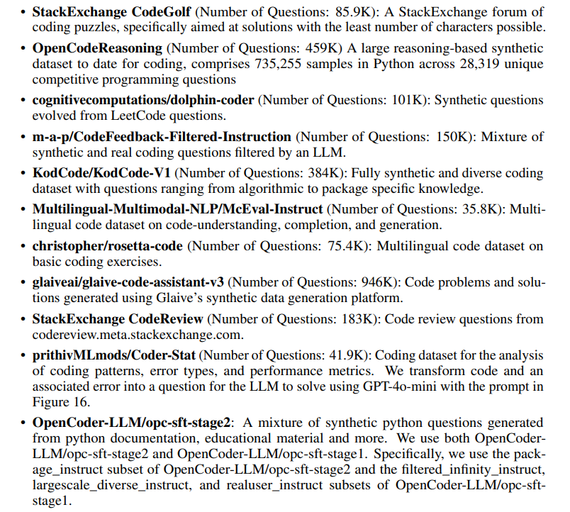
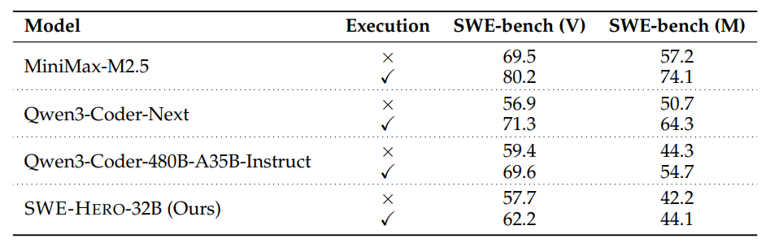
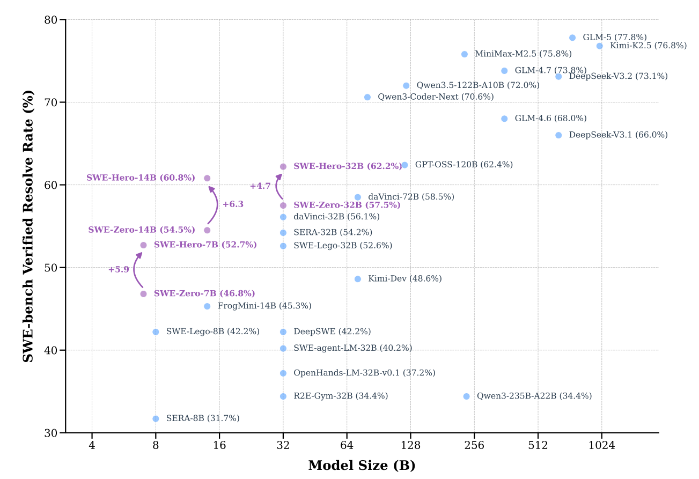

# CS336 Lecture 14: 数据 II — 数据 Pipeline 与 Post-Training

> **课程**: Stanford CS336 — Language Models From Scratch (Spring 2026)
> **讲师**: Percy Liang
> **课程网站**: [https://cs336.stanford.edu/](https://cs336.stanford.edu/)
> **课件**: `lecture_14.py` — 464 行交互式 Python 代码
> **前置**: Lecture 13 讲了数据来源与版权；本讲聚焦 pipeline 处理与 post-training 合成数据

---

## 目录

1. [数据 Pipeline 概览](#1-数据-pipeline-概览)
2. [数据转换（Transformation）](#2-数据转换transformation)
3. [数据过滤（Filtering）](#3-数据过滤filtering)
   - [3.1 通用框架](#31-通用框架)
   - [3.2 语言识别](#32-语言识别)
   - [3.3 数学数据过滤（OpenMathText）](#33-数学数据过滤openmathtext)
   - [3.4 GPT-3, LLaMA, phi-1 的过滤策略](#34-gpt-3-llama-phi-1-的过滤策略)
   - [3.5 Toxicity 过滤](#35-toxicity-过滤)
   - [3.6 过滤的 Scale-Dependent 效应](#36-过滤的-scale-dependent-效应)
4. [去重（Deduplication）](#4-去重deduplication)
   - [4.1 设计空间](#41-设计空间)
   - [4.2 精确去重](#42-精确去重)
   - [4.3 近似去重：Jaccard → MinHash → LSH](#43-近似去重jaccard--minhash--lsh)
5. [数据混合（Data Mixing）](#5-数据混合data-mixing)
6. [Post-Training 合成数据](#6-post-training-合成数据)
7. [总结](#7-总结)

---

## 1. 数据 Pipeline 概览

> "上次我们讲了数据从哪来——live service → dump/crawl → processed data。今天讲拿到 raw data 之后怎么处理。"

**完整 Pipeline**：

```
Raw Data (HTML/PDF/code)
    → Transformation (转为文本)
    → Filtering (去掉低质量)
    → Deduplication (去重)
    → Data Mixing (混合多源)
    → Training
```

> "在这个过程中，大量工作涉及**看数据、看 example**——不是一个纯算法问题。"

---

## 2. 数据转换（Transformation）

> "Raw data 不是文本——Common Crawl 里面是 HTML，有时是 PDF，GitHub 是目录结构。即使在 scraping 之后也不是文本。"

### 2.1 HTML → 文本

这是最主要的转换。**核心挑战**：
- 移除 boilerplate（导航、广告、footer/header）
- 提取正文内容
- 图片和表格的处理（需要 linearize 为 token 序列）

> "什么是 content、什么不是，并不总是 clear。导航元素可能也有助于学习网页结构。表格尤其 tricky——简单表格可以用 Markdown，嵌套表格就很难了。"

**工具基本上是 rule-based**：trafilatura, resiliparse, jusText, lynx。

> "Rule-based 因为要极快——你需要在 100T tokens 上跑。而且这里不需要太多 intelligence。但 rule-based 总有 failure rate——你如果看过数据就会发现 imperfections。模型干预未来可能会有，但必须非常快。"

**工具选择影响模型精度**（DCLM 论文验证）：


### 2.2 PDF → 文本（FinePDFs）

> "PDFs 更有价值——如果你 bother to make a PDF，你大概有 interesting things to say。但 PDF 天生是关于 layout 的——你丢失了 HTML 中 `<h1>`/`<p>` 这样的语义信息。"

FinePDFs（HuggingFace）的处理链：
1. Common Crawl 中的 PDF 经常是**截断的**（PDF 文件大，CC 默认截取） → 需要 recrawl
2. 提取文本：OCR using VLM（如 Qwen2-VL）——"比纯文本提取贵得多"
3. 大量 cleanup 和 filtering

> "幸运或不幸——PDF 占整个互联网的很小一部分。但平均 PDF 的质量远高于平均 HTML。"

---

## 3. 数据过滤（Filtering）

> "到这里你有 text 了——但你离完成还远得很。"

### 3.1 通用框架

Percy 用一个统一的抽象框架理解所有过滤：



**输入**：少量高质量 Target data T + 大量 Raw data R
**目标**：找出 R 中与 T 相似的子集 T′

**两类模型**：

| 类型 | 做法 | 工具 |
|------|------|------|
| **生成式** | p_T(x)——在 T 上估计一个概率模型 | KenLM（5-gram） |
| **判别式/分类器** | p(T\|x)——T 为正例，随机 R 的子集为负例 | **fastText**（线性 + bag-of-words） |

> "这些天基本上大家都是用 classifier 方式——训练一个 fastText 分类器。它很快，只是一个 bag-of-words 线性模型。"

**过滤的要求**：
1. 从 T 泛化（你不只想要 T 本身——需要 more of the same kind）
2. **极快**——需要在 100T tokens 上运行

> "如果你 compute-plentiful——你可能根本不需要过滤。但大多数人 compute-poor——你必须 smart about filtering，否则就是在浪费 FLOPs 在低质量内容上。"

### 3.2 语言识别

Meta 提供了 off-the-shelf 的 fastText 语言 ID 模型：
- 176 种语言
- 训练在 Wikipedia + Tatoeba（翻译网站）+ SETimes（东南欧新闻）
- 相对容易的问题——"看几个词就能辨别西班牙语还是日语"
- Dolma：keep pages with p(English) ≥ 0.5

### 3.3 数学数据过滤（OpenMathText）

> "质量没有 universal 的定义。如果你想定义 quality = math，那你就能去抓 math。"

**OpenMathText 的多级过滤 pipeline**：

1. **规则过滤**：是否包含 LaTeX 命令
2. **KenLM**：训练在 ProofPile 上，keep if perplexity < 15,000
3. **fastText 分类器**：预测数学写作——有 LaTeX 时 threshold=0.17，无 LaTeX 时 threshold=0.8

**结果**：14.7B tokens，"训练出的 1.4B 模型比训练在 **20 倍数据**上的模型数学更好。"

### 3.4 GPT-3, LLaMA, phi-1 的过滤策略

| 模型 | Target（正例） | Raw（负例） | 分类器 |
|------|-------------|-----------|--------|
| **GPT-3** | {Wikipedia, WebText2, Books1, Books2} | CommonCrawl 随机样本 | 线性分类器（word features） |
| **LLaMA 1** | Wikipedia **引用的**页面（不是 Wikipedia 本身） | CommonCrawl | 线性分类器 |
| **phi-1** | GPT-4 标注为 "有教育价值" 的代码 | Python subset of The Stack | **Random Forest** |

> "phi-1 的做法很有意思——it falls into this same framework：用昂贵的 LLM（GPT-4）做初步标注得到 T，然后训练一个便宜的 classifier（Random Forest）extrapolate to the rest。phi-1 用这个过滤后的数据，性能从 12.19% 跃升到 17.68%——**在更少的 steps 内达到更高的值**。"

**GPT-3 的随机保留机制**：`keep if random.pareto(9) > 1 - score`——"不完全按 threshold 硬切，而是 stochastically 根据分数决定保留概率。"

### 3.5 Toxicity 过滤

Jigsaw Toxic Comments Dataset（2018）：
- Wikipedia talk page 评论
- 标注为 {toxic, severe_toxic, obscene, threat, insult, identity_hate}
- 同样的 classifier pipeline——只是 target data 不同

> "定义 toxicity 比定义 quality 更敏感——但技术上，框架完全一样。"

### 3.6 过滤的 Scale-Dependent 效应

> "过滤的 optimal threshold **依赖于你要训练的 token 数**。没有 universal optimal threshold。"



**核心发现**（Michael Ryan 的实验，157M 模型，100 docs 的小 pool）：
- **短训练**（低 token count）→ 高质量数据（DCLM）远好于低质量（Resiliparse/no filtering）
- **长训练**（高 token count，需要 epoch）→ 高质量数据因 overfitting 而过早 plateau——"**最终低质量数据反而追上甚至超过高质量数据**"

> "如果你能魔法般地获得更多高质量数据，那当然最好。但你的 data pool 是固定的——你只能选择：过滤就用高质量数据（可能过度 epoch）vs 少过滤用更多数据（可能包含 noise）。这是一个权衡。"

**Percy 总结**："过滤极其关键——尤其对 compute-constrained 的人。Recipe：搞清楚 'good data 长什么样'→ 训练 classifier → extrapolate to all data。你可以通过找一个你喜欢的已有 dataset，或者用 LM prompt 做 initial filter，然后训练小分类器。"

---

## 4. 去重（Deduplication）

> "此时我们已经 filtered 了数据——只剩下我们认定的高质量内容。但数据中仍然有 duplicates。"

### 4.1 为什么需要去重

**两种重复**：
- **精确重复**：mirror sites、GitHub forks（99% 相同）
- **近似重复**：ToS/licenses（几乎相同但页面其他部分不同）、模板内容（formulaic writing——"someone just templatized and replaced Canada with USA"）、typographic differences（带逗号 vs 不带逗号的版本）

> "C4 的 audit 发现——某个 gas mask 的 **product description 出现了 61,036 次**。The web is weird."

**去重的好处**：
1. 训练更高效——更少 tokens 但几乎不损失信息
2. 避免 memorization，缓解版权/隐私问题

### 4.2 设计空间

| 维度 | 选择 |
|------|------|
| **Item 是什么** | sentence / paragraph / document |
| **如何匹配** | exact match / 公共 subitem 存在 / 公共 subitem 比例 |
| **匹配后做什么** | remove all / remove all but one |

> "核心算法挑战：去重本质上是 comparing items to other items——不能做 O(n²)。需要 **linear time** 算法。"

### 4.3 精确去重

**课件代码**（MapReduce 风格）：

```python
items = ["Hello!", "hello", "hello there", "hello", "hi", "bye"]
hash_items = itertools.groupby(sorted(items, key=mmh3.hash), key=mmh3.hash)
deduped_items = [next(group) for h, group in hash_items]
# Result: ["Hello!", "hello", "hello there", "hi", "bye"]
```

> "这种 MapReduce 风格很容易 parallelize 和 scale。精确去重语义清晰、precision 高——但无法处理近似重复。"

**C4 的精确去重方案**：item = 3-sentence span，exact match，remove all but one。"Warning：从文档中间移除 3-sentence span 会破坏文档的 coherence。"

### 4.4 近似去重：Jaccard → MinHash → LSH

#### Jaccard 相似度

$$\text{Jaccard}(A, B) = \frac{|A \cap B|}{|A \cup B|}$$

A={1,2,3,4}, B={1,2,3,5} → Jaccard = 3/5 = 0.6

> "Two documents are **near duplicates** if their Jaccard similarity ≥ threshold (e.g., 0.99)."

#### MinHash

> "MinHash 的核心性质：**Pr[h(A) = h(B)] = Jaccard(A, B)**。这很漂亮——我们把 similarity 和 hashing 连起来了。"

```python
def minhash(S: set[str], seed: int):
    return min(mmh3.hash(x, seed) for x in S)
```

**直觉**（特征矩阵表示）：随机哈希函数诱导了对 items 的 permutation。第一个出现的 item 在 A 和 B 中相同 ↔ 第一个 item 是交集元素。交集越大 → 概率越大。

> "通常你想要 hash functions 避免 collision。但这里你**想要** collision——controlled collision，与 similarity 对齐。Similar items collide more, disparate items collide less."

#### Locality Sensitive Hashing (LSH)

> "单个 MinHash 的 collision 概率 = Jaccard。但这太 stochastic 了——我们需要 sharpen probability。"

**LSH 方案**：n 个 hash functions → 分成 b 个 bands，每个 band r 个 hash functions。

- A 和 B **collide** 当且仅当：存在某个 band，其**所有 r 个 hash functions 都返回相同值**
- P[collide] = 1 - (1 - sim^r)^b
- P[band match] = 1/b（在 threshold 处）


> "r 越大 → threshold 越 sharp，curve 越右（更难 match）。b 越大 → curve 越左（更容易 match）。and-or 结构让整体概率变得非常陡峭——接近一个 step function。"

**实际使用**（Lee et al., 2021）：n=9000, b=20, r=450。Threshold ≈ (1/b)^(1/r) ≈ (1/20)^(1/450) ≈ 0.993。在 threshold 处，P[collide] = 1 - (1-1/b)^b ≈ 1-1/e ≈ 63%。

---

## 5. 数据混合（Data Mixing）

> "Recall：模型训练在多个数据源上。The Pile 就是 22 domains 的混合。Key question：**各来源应该以什么比例混合？**"

### 5.1 三种 Baseline

| 方法 | 做法 |
|------|------|
| **Vibes** | 凭直觉手动设——"quite common" |
| **Uniform** | p(s) ∝ 1（均匀采样） |
| **Proportional** | p(s) ∝ num_tokens(s)（按数据量等比） |

> "直觉：应该 upweight 更高质量的 sources。但有两个约束：1）想保持 diversity（不同类别交叉）；2）每个源是有限的——如果对一个小 source 权重太高，需要过度 epoch → overfitting。"

**Epoching 问题示例**：
- source A（low quality）：10T tokens → epoch 0.05 次
- source B（high quality）：10B tokens → **epoch 50 次**——严重过拟合

### 5.2 UniMax

> "Sampling uniformly but with a hard **cap** on number of epochs。"p(s) × num_training_tokens ≤ C for all sources s。这限制了小高质量源的过拟合。

### 5.3 Regression-Based Mixing


核心思想（像 scaling laws 一样）：
1. 在小 scale 上试验不同混合比例（如 Dirichlet 分布采样）
2. 用 regression 模型（线性/GBT）拟合：mixture → loss
3. 找到最优混合 → 在大 scale 上使用

> "两个希望：Hope 1: regression model 在 minimizer 处准确。Hope 2: optimal mixture 从小 scale transfer 到大 scale。"

### 5.4 Simulated Epoching

> "General idea：**make small scale look like large scale**——这是本课程贯穿的主题。"

**做法**：将小 scale 的源数据量等比缩小——使得在小 scale 上过度 epoch 的数据会在小 scale 上也表现差 → 优化器会自然找到更平衡的混合。

> "这样 when you scale up，你不会在高质量源上过度 epoch。"

---

## 6. Post-Training 合成数据

> "Recipe：1）定义 environments；2）定义 tasks/prompts；3）从强模型（teacher）收集 responses。"

### 6.1 OpenThoughts




- 1.2M examples，QwQ-32B as teacher
- 27 human + synthetic sources
- "关键发现：每个 prompt **采样多个（16）responses 有帮助**；更强的模型不一定是更好的 teacher——**QwQ-32B is a better teacher than DeepSeek-R1**；answer filtering 无帮助；**小而高质量 source > 大而 diverse source**"

### 6.2 SWE-smith


> "Given a repository, use LM to **introduce bugs** → create tasks。128 GitHub repos → 50K tasks——semi-synthetic 方法。"

### 6.3 SWE-Zero

> "SWE tasks 有 heavy dependencies，不像数学或代码竞赛。Setup 几千个 Docker image 是 infrastructure nightmare。"



**关键观察**：strong models 可以在**没有 execution feedback** 的情况下解决很多任务——"strong models 有 internal world model of code semantics"。

- **SWE-Zero**：300K agent trajectories, no repository-specific execution needed
- 150K GitHub PRs, OpenHands scaffold
- 蒸馏自 Qwen3-Coder-480B
- **SWE-Hero**：13K trajectories that **do** require execution



**SWE-Zero 12M**："Scale up to 12M agent trajectories 用 mini-coder-1.7b——very small model, 50.4 pass@100。"


---

## 7. 总结

> "大部分数据工作是 **domain-specific** 的——看 examples、调整规则。"

| 阶段 | 核心思想 | 代表工具/方法 |
|------|---------|-------------|
| **Transformation** | Rule-based extraction from HTML/PDF → text | trafilatura, resiliparse, FinePDFs (VLM OCR) |
| **Filtering** | Target T → 训练分类器 → extrapolate to R | fastText, KenLM, Random Forest |
| **Deduplication** | Hashing-based, linear time | MinHash + LSH (Jaccard threshold sharpening) |
| **Mixing** | 小 scale 试混合 → 外推到大 scale | UniMax (cap epochs), RegMix, Simulated Epoching |
| **Post-training** | Semi-synthetic environments + strong teacher | OpenThoughts, SWE-smith, SWE-Zero |

---

## 参考文献与延伸阅读

- [DCLM (Li et al., 2024)](https://arxiv.org/abs/2406.11733) — 过滤方法对比
- [OpenMathText](https://arxiv.org/abs/2310.06786) — 数学数据过滤
- [phi-1 (Gunasekar et al., 2023)](https://arxiv.org/abs/2306.11644) — 高质量代码数据
- [Deduplicating Training Data (Lee et al., 2021)](https://arxiv.org/abs/2107.06499)
- [UniMax (Chung et al., 2023)](https://arxiv.org/abs/2304.09151)
- [RegMix (Liu et al., 2024)](https://arxiv.org/abs/2407.01492)
- [Simulated Epoching (2025)](https://arxiv.org/abs/2501.11747)
- [OpenThoughts (2025)](https://arxiv.org/abs/2506.04178)
- [SWE-Smith (2025)](https://arxiv.org/abs/2504.21798)
- [SWE-Zero (2025)](https://arxiv.org/abs/2604.01496)
- [FinePDFs (HuggingFace)](https://huggingface.co/spaces/HuggingFaceFW/FinePDFsBlog)
- [CS336 Course Website](https://cs336.stanford.edu/)
