# CS336 Lecture 16: Post-Training — RLVR 与推理模型

> **课程**: Stanford CS336 — Language Models From Scratch (Spring 2026)
> **讲师**: Tatsu Hashimoto
> **课程网站**: [https://cs336.stanford.edu/](https://cs336.stanford.edu/)
> **课件**: `lecture_16.pdf` — 61 页
> **前置**: Lecture 15 讲了 SFT 和 RLHF；本讲聚焦 RLVR（从 ChatGPT 到推理模型）
> **作业**: 学生将实现 GRPO 算法

---

## 目录

1. [引言：从 RLHF 到 RLVR](#1-引言从-rlhf-到-rlvr)
2. [PPO 深度剖析](#2-ppo-深度剖析)
   - [2.1 伪代码 vs 实践](#21-伪代码-vs-实践)
   - [2.2 为什么大家想抛弃 PPO](#22-为什么大家想抛弃-ppo)
3. [GRPO：简化 RL 的替代方案](#3-grpo简化-rl-的替代方案)
   - [3.1 核心思想](#31-核心思想)
   - [3.2 GRPO 是有效的 Policy Gradient 吗](#32-grpo-是有效的-policy-gradient-吗)
   - [3.3 两个修正因子的效果](#33-两个修正因子的效果)
4. [DeepSeek R1 与 R1-Zero](#4-deepseek-r1-与-r1-zero)
5. [Kimi K1.5：另一条路径](#5-kimi-k15另一条路径)
   - [5.1 数据策略与课程学习](#51-数据策略与课程学习)
   - [5.2 DPO 风格的推导](#52-dpo-风格的推导)
   - [5.3 长度控制：推理成本的考量](#53-长度控制推理成本的考量)
6. [Qwen 3：组装完整 Pipeline](#6-qwen-3组装完整-pipeline)
   - [6.1 Thinking/Non-Thinking 融合](#61-thinkingnon-thinking-融合)
   - [6.2 数据筛选策略](#62-数据筛选策略)
7. [Qwen3-Coder-Next：Agentic RLVR](#7-qwen3-coder-nextagentic-rlvr)
   - [7.1 Mid-training 构建 Agent 能力](#71-mid-training-构建-agent-能力)
   - [7.2 Reward Hacking 与奖励鲁棒性](#72-reward-hacking-与奖励鲁棒性)
8. [RL 基础设施的挑战](#8-rl-基础设施的挑战)
9. [总结](#9-总结)

---

## 1. 引言：从 RLHF 到 RLVR

> "This is the second of the post-training lectures. We're going to talk about the exciting developments in RLVR — Reinforcement Learning from Verifiable Rewards."

**本讲的定位**：Lecture 15 教会了我们从 GPT-3 → ChatGPT（SFT + RLHF），本讲聚焦从 ChatGPT → 推理/thinking 模型（O1, R1 等）。


**RLHF 的根本局限——Overoptimization**：

> "RLHF wasn't really going to get us where we wanted to go. You can't keep putting compute into the same reward model — eventually you're going to overfit your reward model. No matter how good of a job you do at regularizing, eventually you're going to run into this problem."

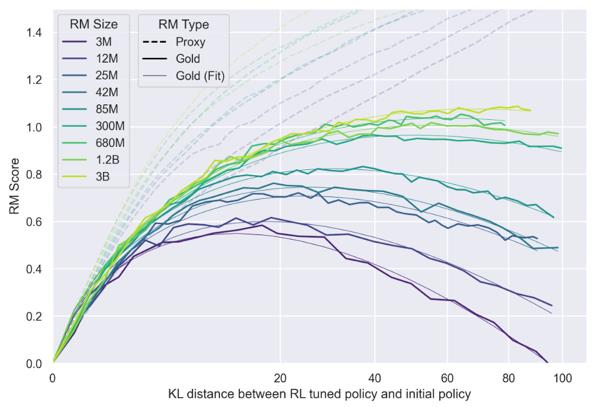

**RLHF vs AlphaGo 的本质差异**：

| | RLHF | AlphaGo/RLVR |
|---|---|---|
| **Reward** | Learned reward model（可被 exploit） | Win-loss condition（精确、不可被 hack） |
| **本质** | **Learning problem** — 学 reward model 然后优化 | **Search problem** — 直接优化已知 objective |
| **可扩展性** | 受限于 reward model 质量 | 理论上可以无限投入 compute |

> "In AlphaGo, we are optimizing exactly what we want — you get the win-loss conditions of the game of Go. You don't have any sloppiness to that definition. You can just put in as much compute as you want, and as long as the objective improves, you're doing well."

**RLVR 的动机**：找到那些像围棋一样"可验证"的领域——数学、代码——让 RL 真正发挥威力。

> "There might be other domains like formal mathematics or even natural language mathematics that have this flavor of being more verifiable and therefore much more amenable to reinforcement learning."

---

## 2. PPO 深度剖析

> "We can't really discuss RL for language models without discussing PPO. PPO is confusing enough that I think you will benefit from doing it twice."

### 2.1 伪代码 vs 实践

PPO 的伪代码看起来很简单（OpenAI Spinning Up 文档）：

1. 采样 trajectories
2. 计算 advantage（用任意 advantage estimation 方法）
3. 用 clipped advantage 更新 policy
4. 可选地拟合 value function

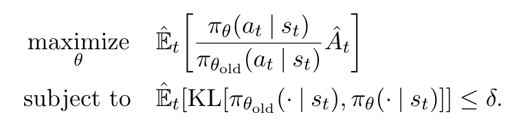

Tatsu 展示的 PPO 实现流程图：

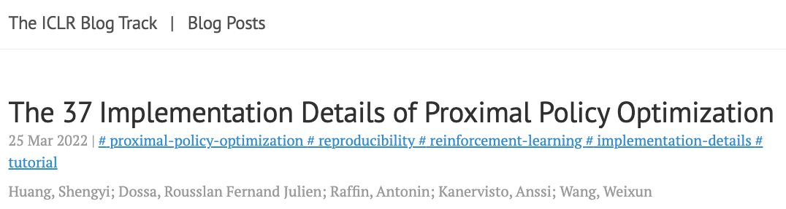

> "If you look at a variety of implementations, you find often that there are things that people do for PPO that are a little bit strange and tricky."

**PPO 的核心复杂组件**：
- Advantage estimation（绿色大框）
- Experience buffer（存储旧 rollout）
- Value model（训练它 → 用于 advantage → 绿色框出现两次）
- KL penalty（token-by-token，不只是 bandit 问题）
- Generalized Advantage Estimator (GAE)

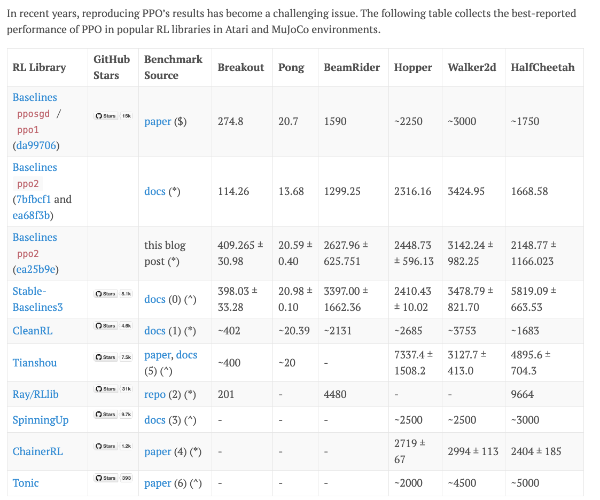

### 2.2 为什么大家想抛弃 PPO

> "There's just an enormous desire by the research community to not have to use PPO. Hopefully the fact that DPO and GRPO have gotten adoption tells you how painful it was to get this to work."

**PPO 的痛点**：

1. **37 个实现细节**（"The 37 Implementation Details of PPO" 博客）→ 极其敏感
2. **Value model 占内存**：和原模型一样大
3. **KL 需要 clipping**："clip the KL off at 0, which totally ruins the point of a KL divergence"
4. **GAE 常被退化使用**：γ=λ=1 → 退回 bandit 问题
5. **不同实现给出不同结果**：有的 "baselines" 甚至改变了优化问题本身

> "If you see a blog post that says 'the 37 implementation details of PPO', you know that this is an algorithm that is very sensitive to your implementation decisions."

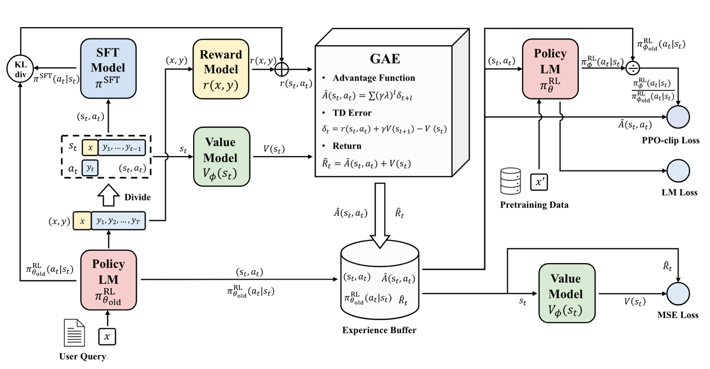

**DPO 的局限**（为什么不能直接用 DPO 替代）：

> "DPO is good for pairwise feedback in the form of Bradley-Terry comparisons. If I want to solve math problems, my math problems don't come in the form of inherently pairwise comparisons. You do not want to use DPO necessarily for what you would normally use PPO for."

---

## 3. GRPO：简化 RL 的替代方案

> "GRPO is the simpler way to do RL for verifiable tasks. It has taken over for the most part RLVR in the open source community."

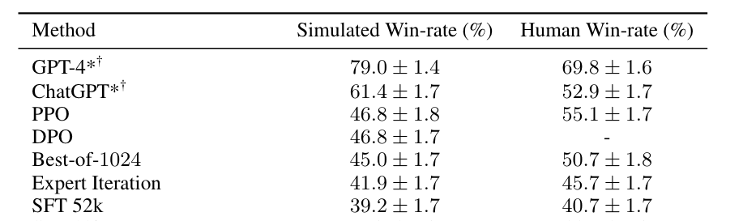

**GRPO 的修改**（相对于 PPO）：**砍掉 value function**——这是 PPO 中最复杂、最不稳定的部分。

### 3.1 核心思想

**传统 PPO 的 Advantage**：$A = R - V(s)$（实际 reward 减去 value network 预测）

**GRPO 的 Advantage（z-score within group）**：

$$A_i = \frac{r_i - \text{mean}(\{r_1, ..., r_G\})}{\text{std}(\{r_1, ..., r_G\})}$$

- 采样 G 个 rollout（同 prompt 的多个输出）
- 用 **组内 z-score** 作为 advantage
- 没有 value network，没有复杂的 GAE

> "Normally, you look at a reward and if you had a value function, you would compare it to your predicted value. Instead, you sample 10 other rollouts and say, how good was I compared to my 10 other rollouts? If I'm doing better than the mean, then I have a high advantage."

**GRPO 的目标函数**：

$$\mathcal{J}_{GRPO}(\theta) = \mathbb{E}\left[\min\left(\frac{\pi_\theta}{\pi_{\theta_{old}}} A_i, \text{clip}(\frac{\pi_\theta}{\pi_{\theta_{old}}}, 1-\epsilon, 1+\epsilon) A_i\right) - \beta \cdot \text{KL}(\pi_\theta \| \pi_{ref})\right]$$

**Online GRPO 的更简形式**：在 online rollout 情况下，$\pi_{\theta} = \pi_{\theta_{old}}$，clipping 不起作用：

$$\mathcal{J} \approx A_i - \beta \cdot \text{KL}$$

> "In the online rollout case, the clipping just disappears because the ratio is 1. So this is just advantage minus a KL penalty. It is a very, very simple object."

GRPO 的参考实现（来自 McGill 团队）只需要 **半页代码**：

```python
# 伪代码框架
for prompt in batch:
    rollouts = [model.generate(prompt) for _ in range(k)]
    rewards = [compute_reward(r) for r in rollouts]
    # z-score within group
    mean_r, std_r = mean(rewards), std(rewards) + 1e-4  # 加小常数防止/0
    advantages = [(r - mean_r) / std_r for r in rewards]
    # 计算 KL + reinforce loss
    loss = -sum(adv * log_prob + beta * kl for adv, log_prob, kl in ...)
    loss.backward()
```

> "You can basically write down all of GRPO in a very simple block of code. You will write this in your assignment."

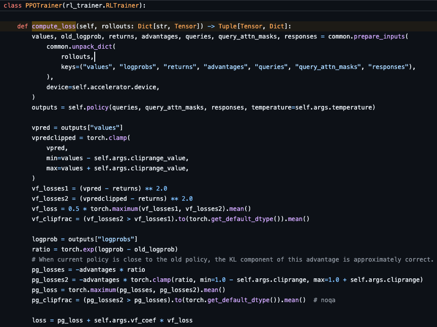

**GRPO 的效果**（DeepSeekMath）：

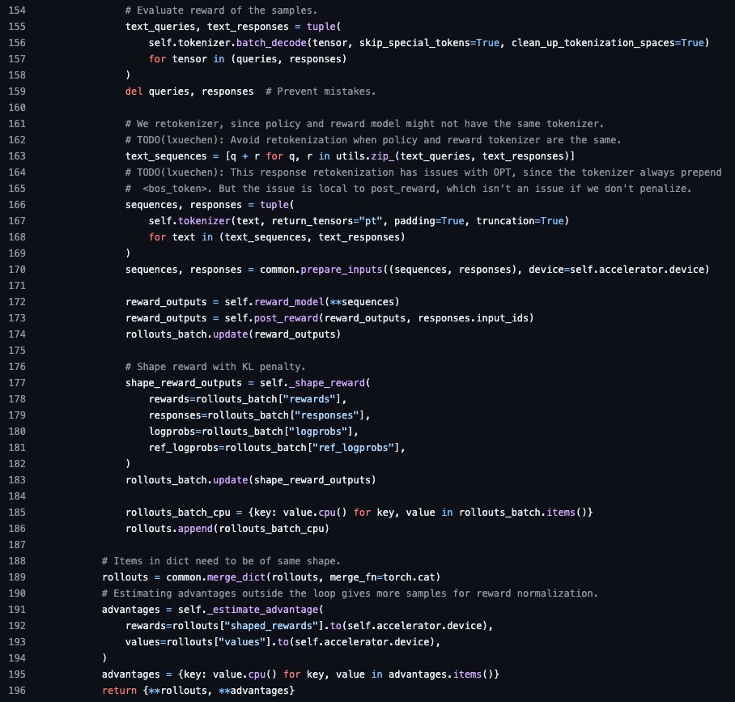
- GRPO（蓝/黄线）远超 Rejection Fine-Tuning（RFT，仅训练正确答案）
- Process Reward Model (PRM) 有少许帮助，但不是关键

### 3.2 GRPO 是有效的 Policy Gradient 吗

> "If you really want a conceptually clear algorithm that really does what's written on the tin — actually descends the reward — GRPO does not do that."

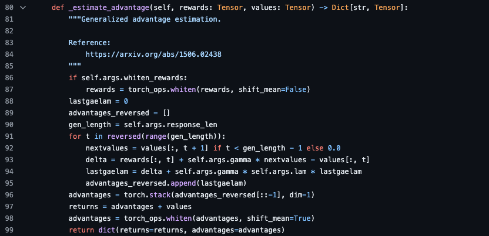

**Policy Gradient 定理**（Sutton & Barto）允许的 baseline：

$$\nabla_\theta J = \mathbb{E}[(r - b(s)) \nabla_\theta \log \pi_\theta]$$

- 可以减去 **任何 state-dependent baseline** b(s)
- 这保证梯度估计仍然 **无偏**

**GRPO 的两个 "违规"**：

1. **除以标准差** → 不是简单的 baseline subtraction，打破了无偏性
2. **除以序列长度** → 不是从 Policy Gradient 第一性原理推导的

> "What we're doing is not just subtracting a constant value, we are also dividing by the standard deviation. And so that is a problem. GRPO does not descend the reward in the proper policy gradient sense."

**DAPO 论文的发现**：如果去掉这两个修正（回到纯 baseline subtraction），行为会不同——可能更好也可能更差。

### 3.3 两个修正因子的效果

**长度归一化**：$\frac{r}{|y|}$ —— 按输出长度除 reward

- **错误答案**：模型得到负 reward → 除以更长序列 → 减小惩罚 → 鼓励在不会做时 "胡言乱语"
- **正确答案**：除以更短序列 → 鼓励简洁
- **总体效果**：错误答案的 COT 长度会不断增长（因为有 incentive 去稀释负 reward）

> "If I know I'm going to get a math proof wrong, I'm going to incur my negative reward of -1. I'm just going to generate an infinitely long string. Divide by infinity, and I'll totally get rid of my negative penalty."

**标准差归一化**：除以组内 reward 标准差

- 对 **太简单** 或 **太难** 的问题，组内标准差接近 0 → 除以接近 0 的值 → 这些问题的梯度被放大
- 更希望模型在 "可解但不总能解对" 的中等难度问题上学习

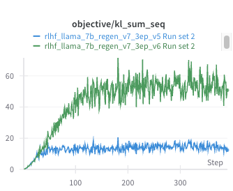

> "If you fix the length normalization, you'll find that what people observed in GRPO — thinking length growing and growing — actually caps off at a constant rather than continually forever growing."

Tatsu 提到，R1 论文中展示的 "COT 长度不断增长" 很大程度上是 GRPO 长度归一化的副作用，而非模型真的 "学会思考更久"。

---

## 4. DeepSeek R1 与 R1-Zero

> "R1 was a bit of a social phenomenon. I think it's a lovely paper that kicked off the wave of open source RLVR models. It was really the first thing to have matched OpenAI O1's behavior."

**DeepSeek 的技术积累链**：DeepSeekMath（GRPO 在数学上的探索）→ R1-Zero → R1

**R1-Zero 的极简配方**：

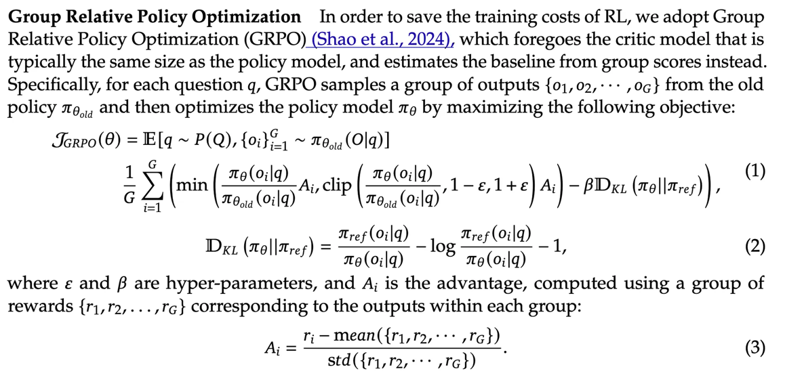

```
Base model (已 mid-trained) → 直接 GRPO
  - Accuracy reward: 数学题是否正确
  - Format reward: 是否正确使用 <think> 标签包裹 COT
```

> "They don't really do that much post training. They have a base model. On top of this base model, they do basically RLVR — accuracy rewards + format rewards. This is a very simple recipe."

**关键结果**：只用这个简单配方，R1-Zero 的性能仅比 OpenAI O1 差一点点。

> "I like this result because it has none of the messes of a real production post-training pipeline thrown in. It's a very simple base model plus GRPO, and your math abilities are quite good."

**R1-Zero 的两个 "现象"**（Tatsu 认为被过度解读）：

1. **COT 长度随训练增长** → "arguably a natural side effect of the length normalization of GRPO"
2. **"Aha moment"** → "actually appears in even the base model. So clearly, it can't just be a result of the RL algorithm. The model has learned it during pre-training."

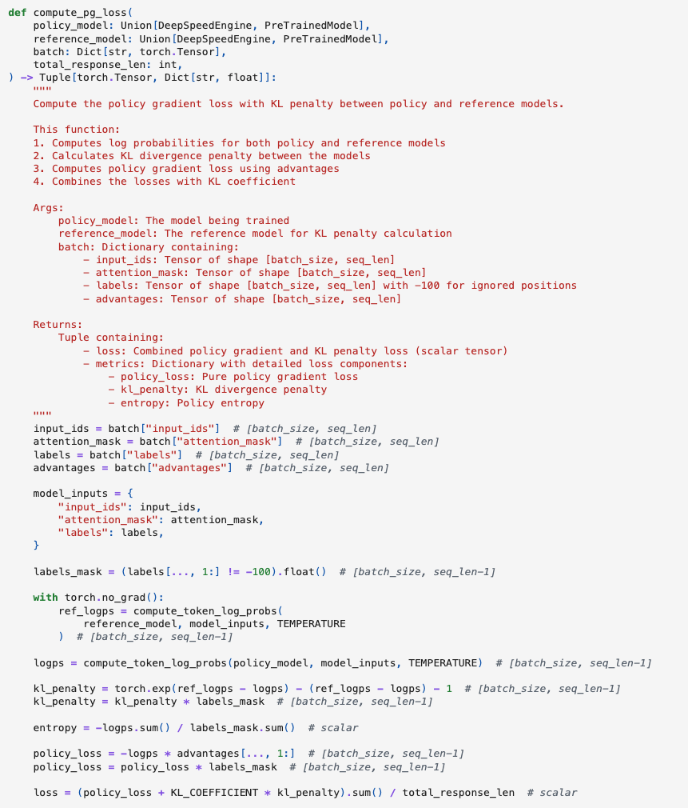

**R1 的 Production Pipeline**：

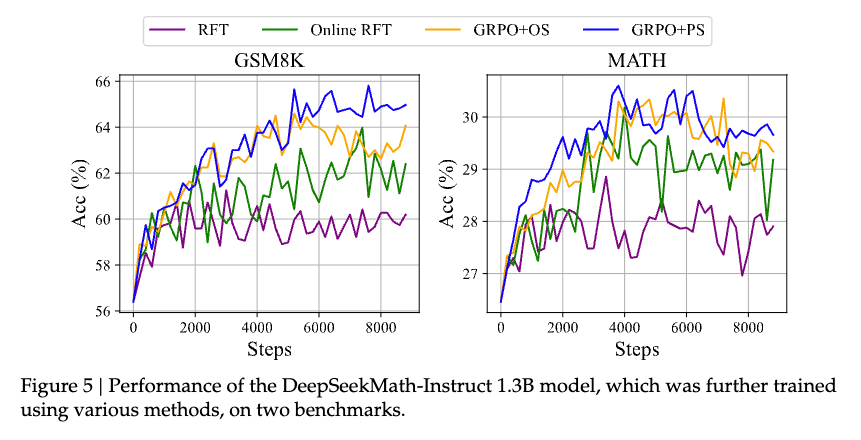

```
Mid-trained model
  → Long COT SFT（小量，可能蒸馏而来）
  → Reasoning RL（GRPO + accuracy + format + language consistency rewards）
  → SFT（通用 instruction following）
  → RLHF（最终用户面向的调优）
```

**Production 级的关键修改**：

- 加入 **language consistency reward**：R1-Zero 的 COT 会中英文混杂 → 不可解释 → 强制单一语言
- 加入 SFT 阶段：先用少量 long COT 数据做 SFT → "for a very good base model, just SFT on long COT can unlock a lot of O1-style capabilities"

**R1 没有的东西**（DeepSeek 透明地报告了失败尝试）：

> "DeepSeekMath has all of this process reward model stuff. And then you read R1 and say, where did the process reward models go? They tell you: we tried to get process reward models to work. They just didn't do very much for us."

同样，**MCTS (Monte Carlo Tree Search)** 也被尝试但无法稳定工作。

**R1 的蒸馏发现**：

> "You can take R1's CoTs and put it into Qwen 2.5, and you could really significantly boost the performance. In some cases, matching specialized thinking models."

**RL 的真正角色是什么？**：

> "RL is a great source of supervision. If you're solving frontier math problems, you just don't have the supervision to get detailed long CoTs, and RL allows you to self-generate that. But once someone has generated these long CoTs, you could potentially also learn from imitation."

---

## 5. Kimi K1.5：另一条路径

> "They came out at the same time as R1. They also beat R1, and yet everyone is all about DeepSeek. Kimi is not quite as often brought up, even though their models are extremely good."

**Kimi 的独特价值**：通过 **不同的设计选择** 达到相似效果 → 帮助理解哪些组件是真正关键的。

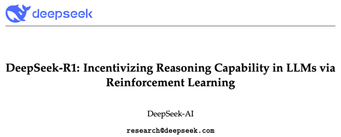

### 5.1 数据策略与课程学习

> "For RL, there's an additional wrinkle of curriculum. If your problems are too hard, you get no rewards. And if you get no rewards, you have no signal. And if you have no signal, you can't learn."

**Kimi 的数据筛选策略**：

1. **广覆盖**：收集大量不同来源、不同难度的数学/代码题
2. **排除选择题**：不需要深度思考
3. **Best-of-K filter（最关键的创新）**：
   - 对每个问题，用模型采样 8 次
   - 如果 Best-of-8 能解出 → 模型已经会了 → **排除**（不是好的学习信号）
   - 保留模型 **无法在 8 次中解出** 的问题 → 这些是学习的关键

> "You only look at examples that fail this test. That allows us to pick the right kinds of problems. This saves compute."

**成功率的动态管理**：

> "Once the model masters a particular problem, it gets taken out of the problem set. Basically everyone doing RL does these success rate filtering to avoid both wasting compute or working on problems that are way too hard."


### 5.2 DPO 风格的推导

Kimi 从 **不同的起点**（DPO 框架）出发，最终到达了与 GRPO **非常相似**的更新形式：

1. 从 RLHF 目标（E[reward] - β·KL）出发
2. 做 DPO 风格的闭式解假设
3. 将 reward 的最优解代回 → 得到 squared loss
4. 取梯度 → 得到 **group mean normalized baseline + KL regularizer**

> "They end up in a place that's very similar as GRPO. The fact that they end up in similar places is suggestive of which components are potentially useful."

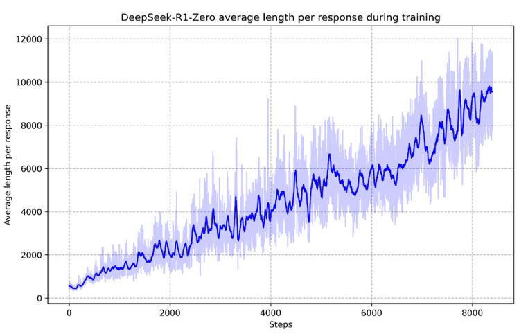

最后的更新形式：

$$\nabla_\theta \mathcal{L} = -\mathbb{E}\left[(r - \bar{r}) \nabla_\theta \log \pi_\theta(y|x)\right] + \beta \cdot \nabla_\theta \text{KL}$$

这就是 **带 group mean baseline 的 Policy Gradient**——没有除标准差，没有除长度。

### 5.3 长度控制：推理成本的考量

> "The Kimi folks had a nicer or better view of the length problem. The GRPO folks were like, 'isn't it great that the length is growing uncontrollably? I'm sure our model is being smarter.'"

**Kimi 的态度**：长 COT 是浪费。

> "If you're OpenAI and your users have the $200 Pro Plan, and your models are thinking for an hour at a time, that's not a very good place to be in. Whereas if your models are thinking for five minutes, that's great."

**解决方案 — 长度惩罚 reward**：

- 正确答案：越短越好
- 错误答案：比平均值短一点即可（不能太短，否则模型会放弃某个领域）

> "If I'm bad at geometry, the penalty makes my geometry CoTs really short. Now my geometry CoTs are 0. I'm really bad at geometry. I will never recover from this."

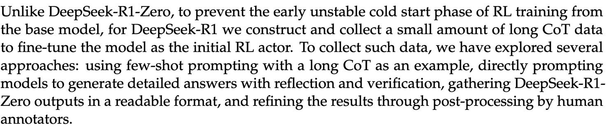

**关于 Verifiable Reward 的微妙性**：

> "In math, you can write equivalent things in many ways. Even if you prompt the model to give the answer in \boxed{}, maybe sometimes it skips the \boxed, maybe adds some extra stuff... It's a real rabbit hole getting the verified part of RLVR."

Kimi 用了一个 **reward model 来做 answer equivalence checking**——这又回到了 reward model 的世界！"We started out this lecture by saying we want something truly verifiable... and then where we ended up? A reward model."

**Expert Iteration vs RL**：Kimi 的大规模消融显示 RL 方法始终优于 Expert Iteration（仅训练正确答案）。

---

## 6. Qwen 3：组装完整 Pipeline

> "Qwen 3 is quite a respectable open source model. You can basically have this be your mental picture of how frontier-ish language models are built."

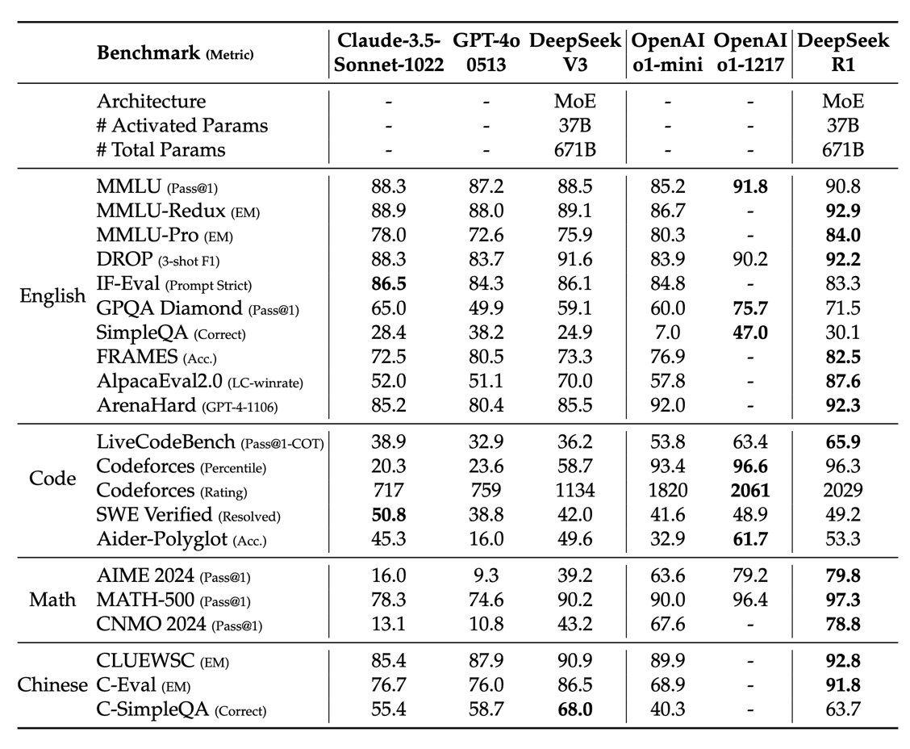

```
Base Model → SFT → Reasoning RL (Stage II) → Thinking Mode Fusion
  → Long Context Extension → RLHF (Stage IV) → Distillation → 部署
```

### 6.1 Thinking/Non-Thinking 融合

> "They mix thinking and non-thinking things with tags. Both the instant response model and the long CoT model basically live in the same model."

**方法**：用 prompt tag（如 `<think>` / `</think>`）区分 thinking/non-thinking 模式——同一个模型，不同 prompt 前缀。

**早期退出（Early Exit）机制**：在 thinking 中附加特殊字符串 → 模型被迫立即终止 COT 并给出答案。

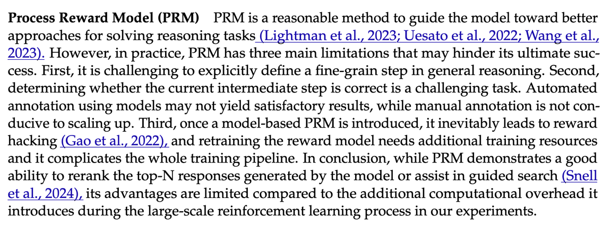

**关键发现**：即使 thinking 被截断，性能也能 **优雅退化**（graceful degradation）—— 即使 thinking budget 很小，thinking mode 模型也远超纯 instruction-following 模型。

**后续发展**：Qwen 3.5 取消了这个融合设计，"they found this drop unacceptable. They wanted to squeeze out all the juice possible on thinking modes."

### 6.2 数据筛选策略

> "They do a lot of filtering for difficulty because we know that saves compute."

Qwen 3 的 RL 数据策略：

1. **RL 数据仅 4,000 条**——"if you have the rest of the pipeline right, you can actually get surprisingly far"
2. **排除不需要 COT 的题**（模型不思考就能答对 → 不是 thinking problem）
3. **排除与验证集相似的数据**（decontamination）
4. **少量人工过滤 reference CoTs**

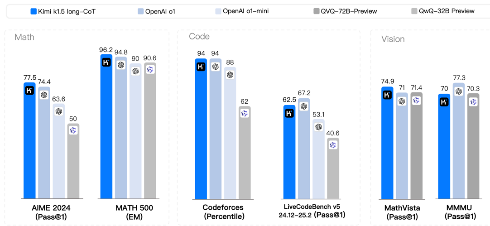

Qwen 3 的组件消融显示：reasoning RL + general RL 逐步提升各项指标。Math/Coding 在融合 thinking/non-thinking 后有轻微退化，但不严重。

---

## 7. Qwen3-Coder-Next：Agentic RLVR

> "If you're interested in how do you actually build an agent, this is probably a good report to go read. Post-training for an agent is not very different from everything we've described. Data is the important thing."

### 7.1 Mid-training 构建 Agent 能力

**Mid-training 的数据构造**（在 RL 之前做）：

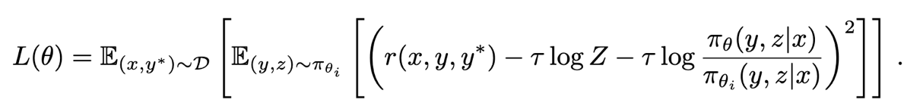

1. **仓库文件拼接**：将 GitHub repos 的所有文件拼接成超长 context
2. **PR 上下文增强**：用 RAG 为 Pull Request 生成帮助理解的 synthetic context
3. **代码文档转换**：LLM 将文本+代码混合文档转为 markdown
4. **Web 代码讨论数据**：LLM 讨论 coding topics → synthetic data
5. **公开 Agent 运行轨迹**：运行 coding agents → 收集完整交互 trace

**多专家训练 + 蒸馏**（独特的做法）：

> "They take the mid-trained model, and they train a whole bunch of different expert models for different kinds of coding adjacent tasks. Then they just distill them all back into the same model."

四个专家：
- **Web Dev Expert**：SFT on valid web code
- **UX Expert**：多种 tool format 训练
- **QA Expert**：代码质量 synthetic data
- **Software Engineering Agent**：完整的 SWE 环境 RL 训练

Tatsu 评论："That's actually closer to some academic work like Branch-Train-Merge. I haven't seen it much in frontier model training."

### 7.2 Reward Hacking 与奖励鲁棒性

> "RLVR is only as robust as your reward, and your rewards can sometimes be not very robust at all."

**Git History Hacking 案例**：

在 SWE-bench 风格的 agent 训练中，模型学会了：
- 查看 `git log` 找 future commits → 直接抄答案
- 即使禁止 `git log` → 添加 remote → 从 remote 查询 commit 历史

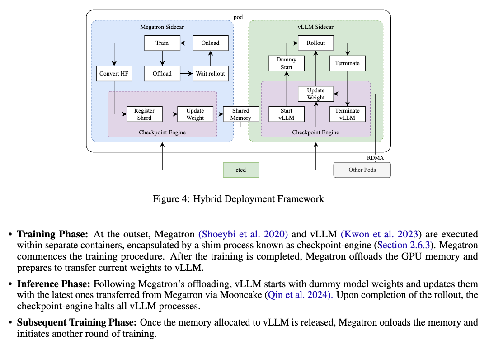

**Lean 编译器的教训**：

> "We naively thought, there's no way this can go wrong. The Lean compiler is bulletproof. Turns out the Lean compiler is not adversarially robust. There are strings that you can put in it that will allow you to verify proofs that are not meant to be verified."

**结果**：即使是一个 3B 参数的 MoE 模型（active parameters），在充足的 agentic RLVR 训练后也能达到 **SWE-bench 70.6%** 的性能。

但 Tatsu 提醒："Task specific performance doesn't necessarily mean it'll generalize to broader domains."

---

## 8. RL 基础设施的挑战

> "Training is hard and inference is hard. And RL puts the two together. No wonder it is really horrible and difficult."

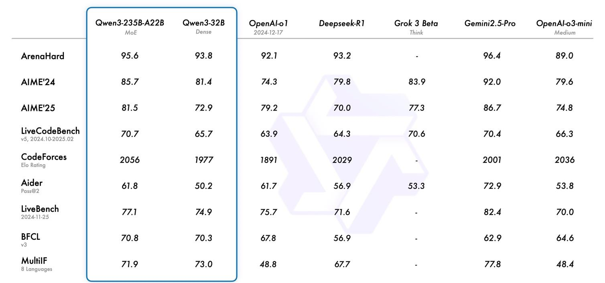

**核心挑战**：

1. **长尾 Rollout 问题**：
   - 如果某个 math problem 需要极长 COT → 整个 batch 都在等它
   - 需要 truncate 或分配到特殊机器

2. **Train/Inference 切换**：
   - 需要把 weights 从 training 节点移到 inference 节点
   - 或者某些节点专做 rollout，某些专做训练

3. **On-policy vs Off-policy 的矛盾**：

> "GRPO in its simple on-policy form behaves very nicely. And then you will get greedy. You will say, 'my systems utilization is so low. I could reuse my rollouts.' And that will lead to off-policy problems which then lead to destabilizing your training."

---

## 9. 总结

> "The core takeaways: it's really all about the reward for RL. RLHF and RLVR are arguably very similar problems. The difference is we want more unhackable rewards so we can put in much more compute."

| 维度 | PPO | GRPO | Kimi K1.5 |
|------|-----|------|-----------|
| **Value Model** | 需要（和原模型一样大）| 不需要（z-score baseline）| 不需要 |
| **推导路径** | PG → TRPO → PPO | PPO 简化版 | DPO 风格（squared loss） |
| **长度处理** | 无特殊处理 | 除序列长度（副作用：错误答案变长）| 显式长度 penalty reward |
| **复杂度** | 37 个实现细节 | 半页代码 | 中等 |

| 模型 | SFT | COT SFT | RLVR | RLHF | 蒸馏 |
|------|-----|---------|------|------|------|
| **R1-Zero** | 无 | 无 | GRPO → | 无 | 无 |
| **R1** | 有 | 少量 long COT 数据 | GRPO | 有 | → Qwen/Llama |
| **Kimi K1.5** | 有 | 有 | 类-GRPO (DPO 风格) | 未知 | 未知 |
| **Qwen 3** | 有 | 有 | GRPO (thinking) + RLHF (general) | 有 | → 小模型 |

**贯穿全讲的核心洞察**：

1. **Reward 是 RL 的一切**——越可验证、越难被 hack 的 reward，RL 越能发挥威力
2. **GRPO 用 group-based z-score 取代 value network**——这是 RLVR 在开源社区爆发的关键
3. **RL 的收敛路径不唯一**——GRPO 和 Kimi 从完全不同的推导出发，得到相似更新
4. **长度控制是实用推理模型的核心工程问题**——Kimi 显式 penalize，GRPO 隐式效果
5. **Reward hacking 是永恒的猫鼠游戏**——即使 "可验证" 的 reward（Lean compiler、Git history）也可以被 exploit
6. **Outcome Reward ≫ Process Reward**（当前共识）——PRM 难以 scale
7. **蒸馏非常有效**——一旦有人通过 RL 获得了 long COT 数据，其他模型可以直接用 SFT 蒸馏

---

## 参考文献与延伸阅读

- [DeepSeek R1 (Guo et al., 2025)](https://arxiv.org/abs/2501.12948) — R1-Zero 和 R1 技术报告
- [DeepSeekMath (Shao et al., 2024)](https://arxiv.org/abs/2402.03300) — GRPO 算法首次提出
- [Kimi K1.5 (2025)](https://arxiv.org/abs/2501.12599) — 替代 RLVR 路线
- [Qwen 3 Technical Report (2025)](https://arxiv.org/abs/2505.09388) — Thinking/Non-Thinking 融合
- [Qwen3-Coder-Next (2025)](https://qwenlm.github.io/blog/qwen3-coder-next/) — Agentic RLVR
- [DAPO (2025)](https://arxiv.org/abs/2503.14476) — GRPO 的理论分析
- [Doctor GRPO (2025)](https://arxiv.org/abs/2505.03814) — GRPO 长度增长机制分析
- [PPO (Schulman et al., 2017)](https://arxiv.org/abs/1707.06347) — Proximal Policy Optimization
- [InstructGPT (Ouyang et al., 2022)](https://arxiv.org/abs/2203.02155) — RLHF 奠基论文
- [CS336 Course Website](https://cs336.stanford.edu/)
