# CS336 Lecture 17: 多模态模型 — Alignment & Multimodality

> **课程**: Stanford CS336 — Language Models From Scratch (Spring 2026)
> **讲师**: Percy Liang
> **课程网站**: [https://cs336.stanford.edu/](https://cs336.stanford.edu/)
> **课件**: `lecture_17.py` — 303 行交互式 Python 代码
> **前置**: 本讲是课程最后一讲，概述多模态模型的基础架构与演进

---

## 目录

1. [引言：为什么需要多模态](#1-引言为什么需要多模态)
2. [CLIP：对比语言-图像预训练](#2-clip对比语言-图像预训练)
   - [2.1 CLIP 目标函数](#21-clip-目标函数)
   - [2.2 视觉编码器：Vision Transformer](#22-视觉编码器vit)
   - [2.3 CLIP 的局限](#23-clip-的局限)
3. [SigLIP：更高效的 CLIP](#3-siglip更高效的-clip)
4. [VLM 架构：将图像注入语言模型](#4-vlm-架构将图像注入语言模型)
   - [4.1 LLaVA：奠基性 VLM](#41-llava奠基性-vlm)
   - [4.2 LLaVA OneVision：多图与视频](#42-llava-onevision多图与视频)
5. [Qwen-VL 系列](#5-qwen-vl-系列)
   - [5.1 Qwen-VL / Qwen2-VL](#51-qwen-vl--qwen2-vl)
   - [5.2 Qwen3-VL](#52-qwen3-vl)
6. [Chameleon：离散化路线](#6-chameleon离散化路线)
7. [总结](#7-总结)

---

## 1. 引言：为什么需要多模态

> "So far in this class, we've exclusively focused on language models. But the world is multimodal. The north star is what people call an omni model — the ability to take any combination of modalities and output any combination."


**本课程的定位**：此前全部聚焦于文本→文本的语言模型。但真实世界是多模态的——文本、图像、音频、视频。

**Omni Model 的愿景**：
- 输入：任意模态组合（图+视频+文本提问）
- 输出：任意模态组合（生成图像、音频转图像等）

**现实约束**：

> "The reality is that transformers work really well, and despite the best efforts of people to try other things, transformers are still at scale the best thing we have. Transformers were designed for text — they speak tokens."

两个核心问题：
1. **如何输入非文本数据**？（本讲重点——理解图像）
2. **如何输出非文本数据**？（简要提及——扩散模型）

**Token 概念的扩展**：

> "A token should represent some sort of semantic unit of information. A pixel is certainly not meaningful by itself. So somehow we must convert everything — including audio and images — into either discrete or continuous tokens."

文本有 BPE tokenizer（Lecture 1）——还算好用。但对于图像/音频，需要"挠头思考更多"来找到等效方案。

---

## 2. CLIP：对比语言-图像预训练

> "CLIP is the foundation of modern VLMs. The researchers at OpenAI were wondering: is it possible to leverage the large amount of image and textual captions out there?"

**历史背景**（2021 年）：

> "GPT-3 had already happened, GPT-2 too — language models had gone into the foundation model era. Vision was still based on large annotated datasets like ImageNet and training ResNets on them. The question was: what is the equivalent of scraping the internet for images?"

### 2.1 CLIP 目标函数


**核心思想**：给定一批 (image, text) pairs（如 32,768 对），对每个图像，使其与对应文本的点积远大于与其他文本的点积。

```
对每一对 (I_i, T_i):
  希望 I_i · T_i  >>  I_i · T_j  (j ≠ i)  [图像→文本方向]
  希望 T_i · I_i  >>  T_i · I_j  (j ≠ i)  [文本→图像方向]
```

这本质上是 **两个 n 路分类问题**（共 2n 个 softmax cross-entropy）：

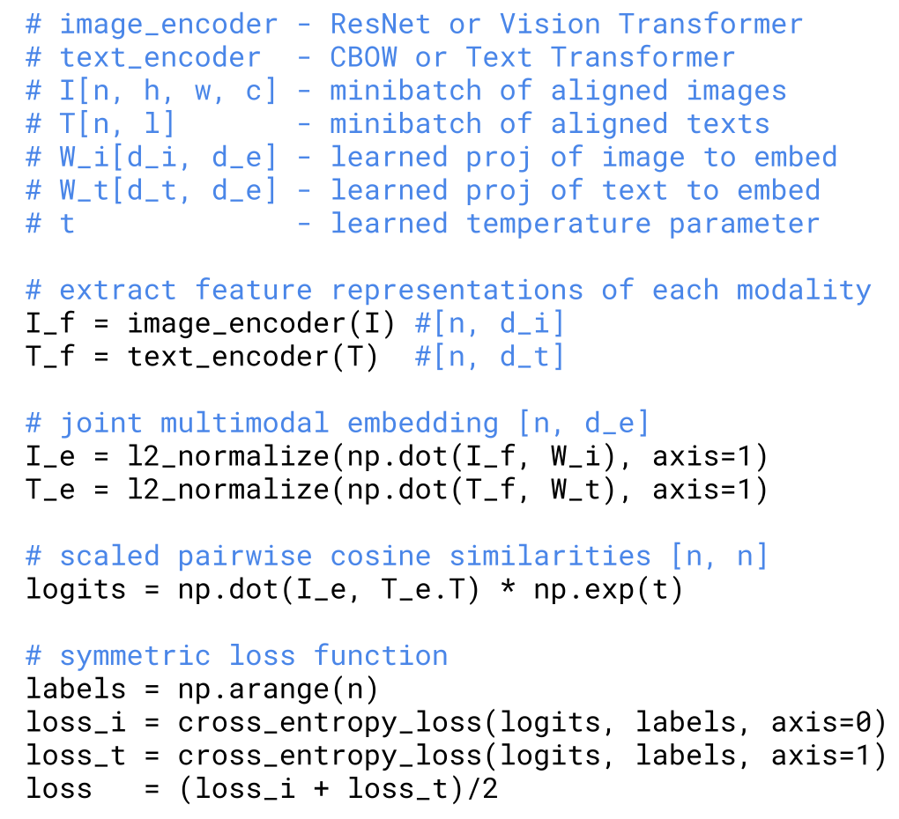

> "You normalize the embeddings, take the dot product with some temperature, and then compute the cross entropy. It's basically like a multiclass classification problem where the examples are structured in an n-by-n matrix."

**数据**：

> "They took a bunch of queries, searched online, mined image-text pairs — resulting in 400 million text-image pairs. The dataset wasn't released."

**OpenCLIP** 复现并扩展了 CLIP，使用了 LAION-5B（50 亿图文对），且用 CLIP 做数据过滤来训练 OpenCLIP——"there's some bootstrapping happening."

**数据处理**：

> "Images come in all sorts of resolutions. One thing you learn about neural nets is that they don't like things to be dynamic."

- Bicubic 插值缩放到短边 336px
- Center crop → 336×336 正方形
- 对于 ImageNet 分类而言满足要求（物体通常在中间）

### 2.2 视觉编码器：ViT

> "They experimented with ResNets and Vision Transformers, and found ViTs perform the best. When people say CLIP, they usually mean the ViT version."

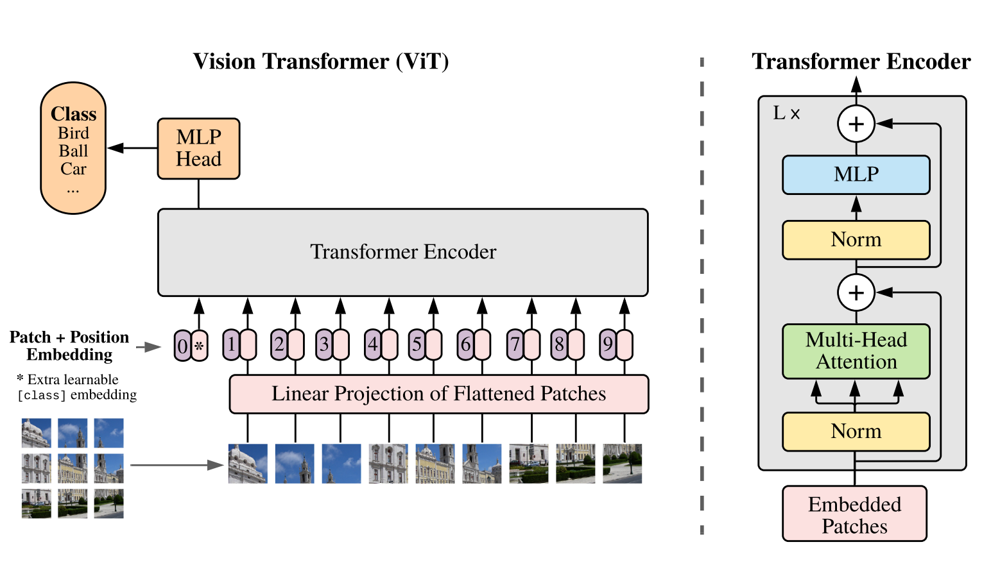

**ViT 的处理流程**：
1. 将图像切成 **patch**（如 14×14 像素）
2. 每个 patch 是一个 "token" —— 一个向量
3. 添加 position embeddings（1D 就够了——"they tried 2D and found it doesn't really matter for classification"）
4. 通过标准 Transformer encoder
5. **Attention Pooling**：用全局平均的 activation 作为 query，对 key/value 再做一轮 attention → 得到单一向量

> "They found attention pooling was better than just averaging all the vectors — it gives you a vector that's a little bit more informed."

**CLIP 的最佳模型：ViT-L/14@336px**
- L = Large（~24 层）
- 14×14 patches，每 patch 3 通道（RGB）
- 336×336 分辨率输入

**文本编码器**：GPT-2 风格 Transformer（63M 参数），在序列前后加 [BOS]...[EOS]，取 [EOS] 的最后一层激活作为整个序列的表示。

**CLIP 的核心结果**：

> "On ImageNet, zero-shot CLIP outperformed a ResNet trained on 1.2M ImageNet images. This was many hours of Mechanical Turk annotation work — now you have CLIP trained on more organic web data."

Zero-shot 方式：将图像与各种 label 文本（如 "a photo of a dog"）做点积，选最高的。

**关于数据噪声**：

> "If you take arbitrary images and text on the web, it's probably way too noisy. A lot of data filtering is needed. When you have a caption of an image, it doesn't necessarily verbatim say what's in the image — if you have an image of a dog, you don't need to say 'a dog'."

**消融实验**：尝试直接从图像预测文本（而非对比学习）→ 计算效率远低于 CLIP ranking。


> "For the representations you're trying to learn — at least for ImageNet accuracy — actually modeling the exact token sequences of the caption isn't so important for getting the rough representation of the image."

### 2.3 CLIP 的局限

> "The design decisions here are based on image classification — so it's not very fine-grained. CLIP requires large batch sizes like 32,000. If you have a batch size of 1, clearly it doesn't work. The softmax operates over the full batch, so it's not really decomposible."

---

## 3. SigLIP：更高效的 CLIP

> "SigLIP stands for Sigmoid Loss for Language Image Pre-training. It's basically an improved version of CLIP."


**核心区别**：

| | CLIP | SigLIP |
|---|---|---|
| **Loss** | Multiclass softmax（n-way classification） | Binary log-sigmoid（每对独立判断 aligned or not） |
| **对角线** | 正例（softmax 中的正确类） | Label = +1 |
| **非对角线** | 负例（softmax 中的错误类） | Label = -1 |
| **Batch size** | 与 loss 耦合（改变 batch size = 改变 loss 函数） | 与 loss 解耦 |

**SigLIP 的优势**：

1. **Loss 与 batch size 解耦**：小 batch size（<16K）下远优于 CLIP；32K 达到 critical batch size
2. **可并行化**：类似 DDP 的思路——每个设备储存一部分图文对，通过轮转 embeddings 来计算所有负样本

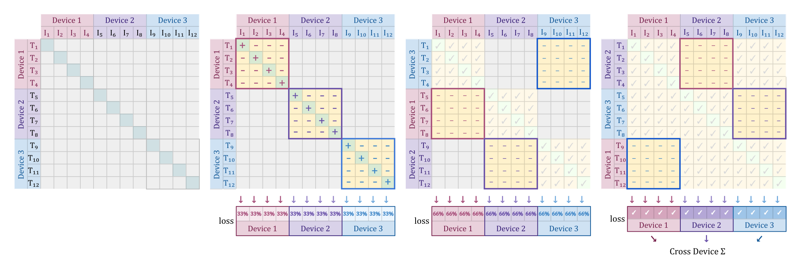

3. **训练效率**：
   - CLIP: 10 天 on 256 TPUv3
   - SigLIP: **5 天 on 32 TPUv4**（TPUv4 单卡 FLOP/s 甚至更低，但因互联更好而更快）

**数据**（WebLI dataset）：
- O(billion) 图文对
- 自动 OCR 从图像中提取文字
- 保留 top 10% 质量
- 支持 100 种语言

---

## 4. VLM 架构：将图像注入语言模型

> "The basic idea is we're going to take these embeddings and just inject them into a language model. This is more of a mid-training or post-training flavor — we take an existing image encoder, an existing LLM, and stitch them together."

### 4.1 LLaVA：奠基性 VLM

> "LLaVA got people excited because around this time, GPT-4 was able to do visual reasoning. LLaVA wasn't as good, but it was an open model and people got to see what went under the hood."

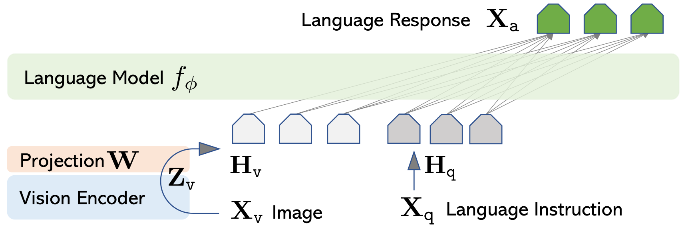

**LLaVA 的三组件**：

| 组件 | 选择 |
|------|------|
| **Vision Encoder** | CLIP (ViT-L/14) |
| **Projector/Adapter** | 线性投影矩阵 W |
| **Language Model** | Vicuna（LLaMA fine-tuned on ShareGPT conversations） |

> "We're in some sense converting these images into textual tokens so we can leverage the pre-trained language model. The text gets encoded into vectors, the image also gets encoded into vectors, and this whole sequence just goes through a standard transformer."

**训练数据（158K 条合成数据）**：


基于 MS COCO（人工标注的 bbox + caption），prompt GPT-4 生成：
1. **Conversation**：基于 caption 生成问答
2. **Detailed Description**：类似更详细的 caption
3. **Complex Reasoning**：需要推理的问题

**两阶段训练**：

1. **Stage 1 (Alignment)**：冻结 vision encoder + LM，**只训练 W**
   - 目标：让图像 embedding "看起来像"自然语言 token embedding
2. **Stage 2 (Fine-tuning)**：冻结 vision encoder，训练 W + LM
   - 在多模态对话数据上微调

**示例**：

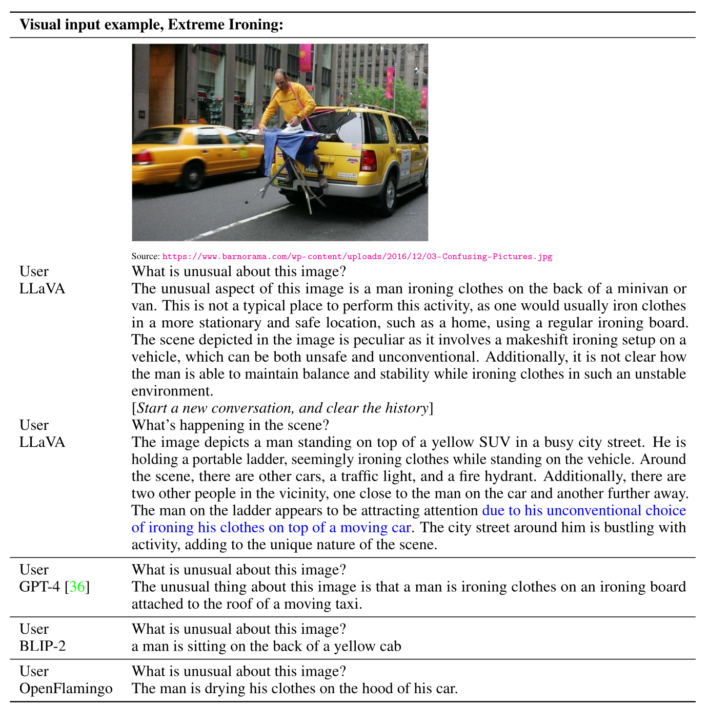

用户问 "What's unusual about this image?"（一个人在小货车后面熨衣服）→ 模型回答 "a man ironing on the back of a minivan is unusual."

> "They make a point that even if your user prompt is not really prompting about the unusualness, it still talks about it. GPT-4 obviously can do this, but other models at the time were not able to."

### 4.2 LLaVA OneVision：多图与视频

> "After LLaVA 1.5 and LLaVA-Next, the main thing they did was try to be more ambitious — handling multiple images and videos."

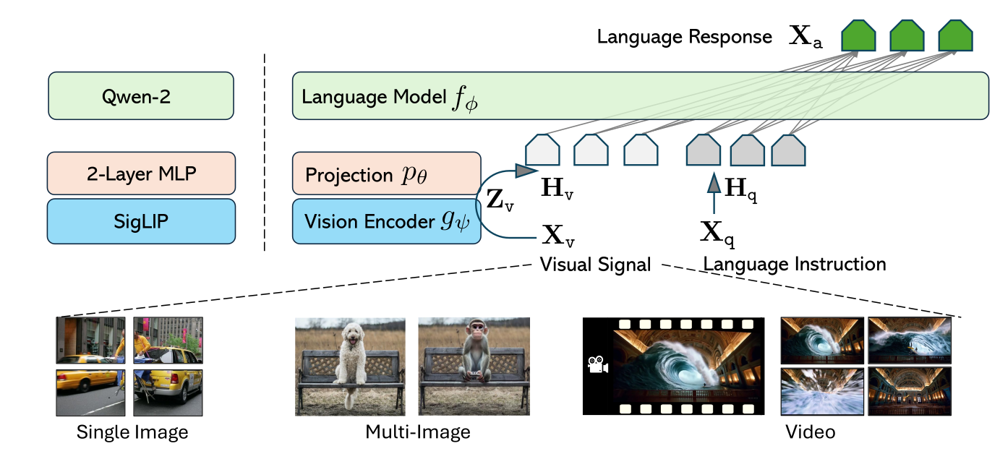

**升级组件**：
- Vision Encoder：CLIP → **SigLIP**
- Text Decoder：Vicuna → **Qwen-2 72B**
- Projector：Linear → **2-layer MLP**

**AnyRes — 高分辨率处理的核心创新**：

> "The thing with OCR is that you need to preserve very fine-grained information. Remember CLIP resizes and crops to 336×336. If you have a document and crop to 336×336, you can't read it."

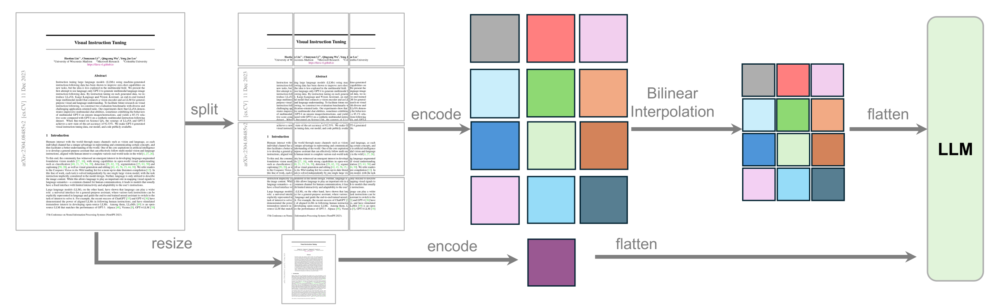

**AnyRes 做法**：
1. 一路：整体 downsampled 编码（全局信息）
2. 多路：将图像切割成若干 336×336 的 chunk → 分别用 vision encoder 编码
3. 拼接所有 chunk 的 embeddings
4. 如果 token 太多 → bilinear interpolation 降采样

> "You're basically noticing that your vision encoder can't handle high resolution. So rather than downsampling, you crop and look at different parts."

**三种输入模式的分辨率策略**：


| 输入类型 | 策略 |
|----------|------|
| **单张图像** | 高分辨率（full downsampled + up to 9 crops） |
| **多张图像** | 每张基础分辨率 |
| **视频** | 更低分辨率/帧（最多 32 帧） |

> "Videos can be very long. They don't want their dataset to be dominated by repetitive frames. For a single image, I get to look at it more carefully. For multiple images, I'm going to look at it from afar."

**数据哲学**：质量优先于数量，大量 task-specific 合成数据——"unabashedly distilling GPT-4."

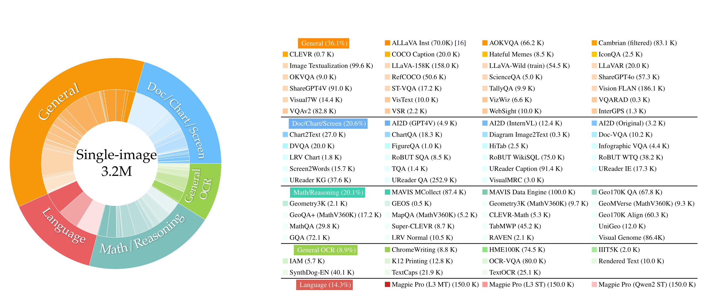

**三阶段训练**：

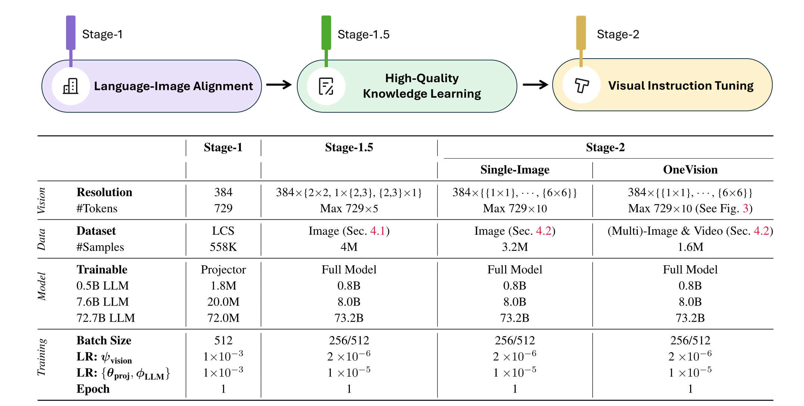

1. **Stage 1 (Alignment)**：仅训练 projector
2. **Stage 2**：高质量知识数据 → 训练更多参数
3. **Stage 3**：下游任务类数据 → 全模型训练

**跨模态迁移（Cross-Modal Transfer）**：

> "Even though they only have single image data for diagrams and charts, this generalizes to multiple images. At training time, it never saw an example with a table and a chart together. But at test time, it can have a conversation about both."

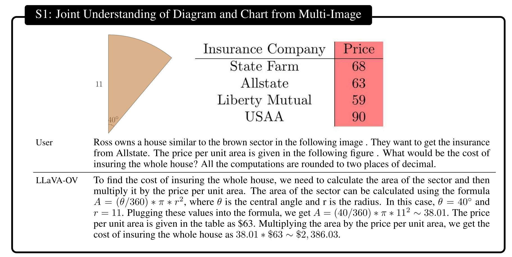

类似的迁移还包括：
- 单图 OCR 数据 + 多图关系推理 → **GUI Agent** 能力（截屏分析）
- 单图 visual prompting（圈出目标）→ **视频物体追踪**

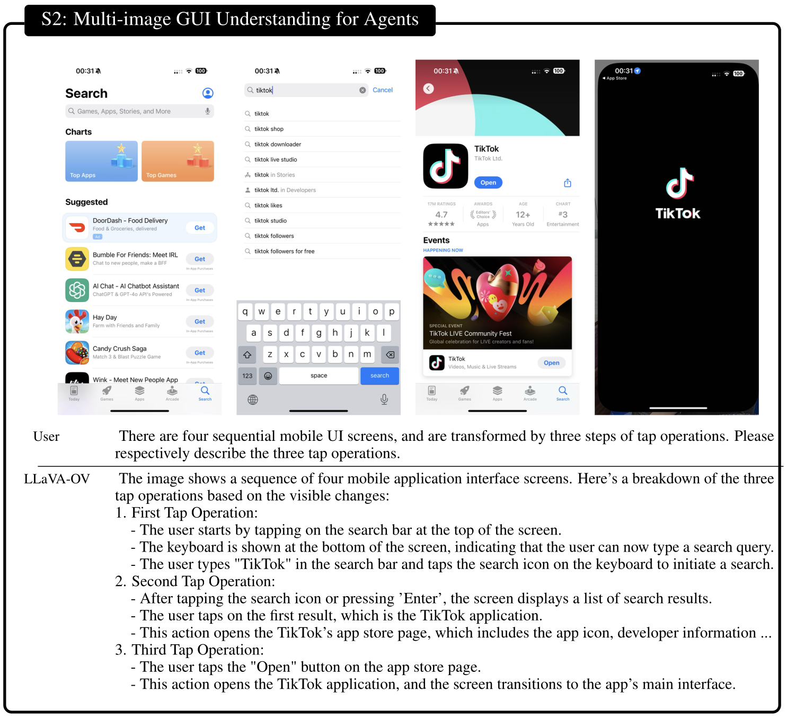
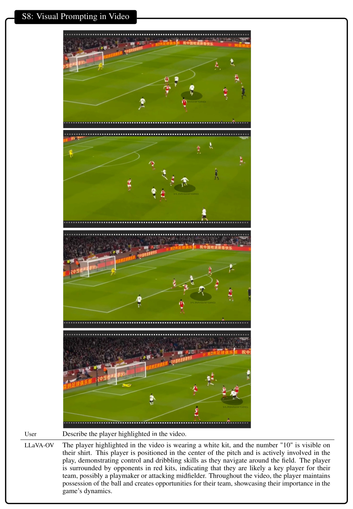

> "When I first looked at this, I said 'oh boy, you're basically targeting each of these tasks — kind of like supervised learning.' But if you have enough tasks, these models seem to do some transfer, which is reassuring."

**LLaVA 系列的优势**：开源模型权重 **和数据** —— "one of the few works that open sources not just the model weights but also the data."

---

## 5. Qwen-VL 系列

### 5.1 Qwen-VL / Qwen2-VL

> "Qwen started training multimodal models in 2023. Hopefully you see the pattern by now."

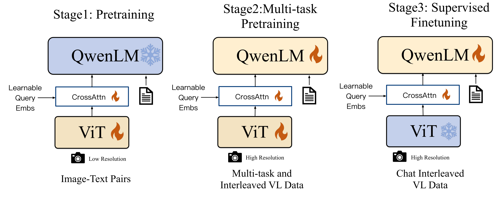

**Qwen-VL 的架构**：

| 组件 | Qwen-VL |
|------|---------|
| Vision Encoder | OpenCLIP ViT-bigG (14×14 patches) |
| Adapter | 单层 cross-attention + 2D positional encoding → 固定 256 tokens |
| Special Tokens | ``, `<box>`, `<ref>` |

**三阶段训练**：

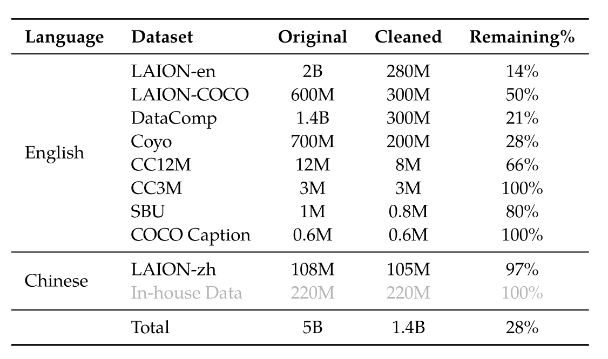
- **Stage 1**：大规模低质量数据；freeze LM，训练 vision encoder + adapter
- **Stage 2**：高质量 task-specific 数据（VQA、chart QA 等）；训练所有参数
- **Stage 3**：Instruction tuning 数据；freeze vision encoder，训练 adapter + LM

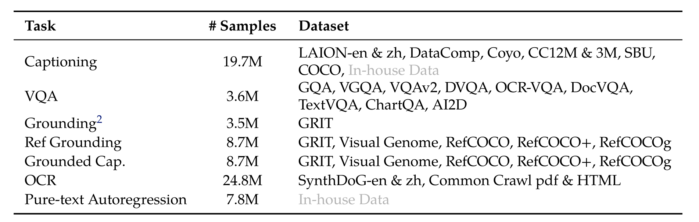

**Qwen-VL 的能力**：


- 中文/英文双语
- 代码理解
- 目标检测（输出 bbox 而非图像）
- OCR

**Qwen2-VL 的升级**：

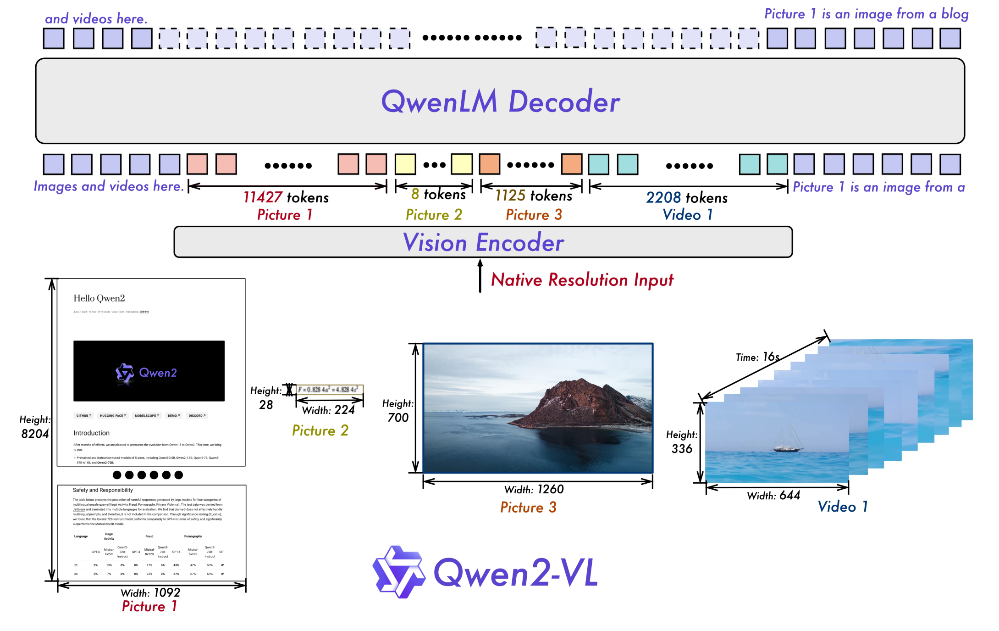

- **更大的 ViT**（675M）
- **Dynamic Resolution**：每个 224×224 patch 用 ViT/14 编码，每 2×2 压缩为 1 → 每 patch 产生 66 tokens
- **视频**：2 fps 采样，最多 16,384 tokens

**M-RoPE（Multimodal Rotary Position Embedding）**：


> "Remember RoPE — the inner product between vectors depends only on distance. Distance is defined in 1D by token count. The multi-dimensional version is the same thing, but now you have 3D — height, width, and time."

每个 patch 的位置是三元组 (t, h, w)，对每个维度分别计算 RoPE 再拼接。

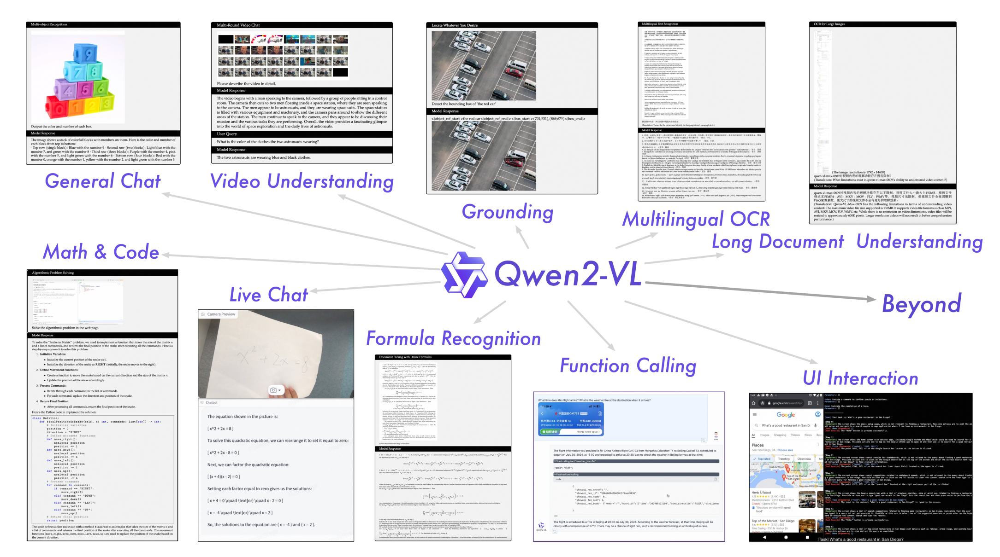

### 5.2 Qwen3-VL

> "I wouldn't say these are structural big changes, but they do impact model quality."

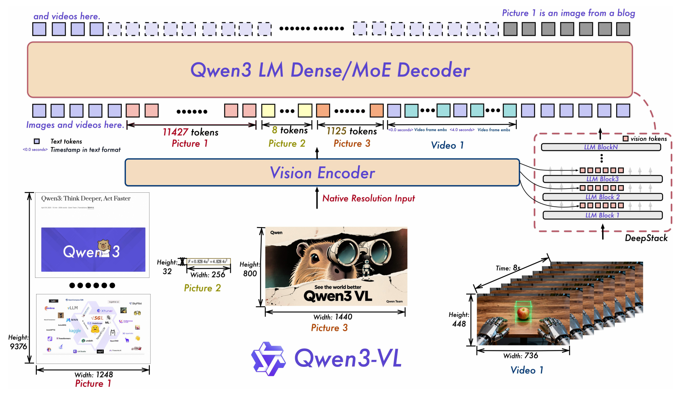

**五项关键改进**：

1. **更强的 LM**：Qwen-3 系列（Dense/MoE，最高 235B-A22B），256K 上下文

2. **SigLIP-2 视觉编码器**：架构与 SigLIP 相同，向后兼容

3. **Interleaved M-RoPE**：
   > "Before: [t t t t w w w w h h h h] — this means temporal dimensions are all low frequency and height dimensions are all high frequency. Now: [t w h t w h t w h t w h] — interleaved. All axes are exposed to both low and high frequency."

4. **显式视频时间戳**：
   > "Before the timestamp was implicit in the positional encodings. Now '0 seconds' is an actual token you can refer to — 'what happened after 2 seconds?'"

5. **DeepStack Adapter**：跨层融合——vision encoder 的多层输出分别注入 LM 的不同层
   > "The vision encoder already computes a stack of embeddings, and we're injecting these directly into the residual stream of the language model at different depths."

6. **平方根归一化 per-token loss**：视频非常长，不希望其主导训练 → 按 `1/√len` 降权

**训练**（7 个阶段！）：


- Pre-training 4 阶段：train adapter → 8K 全参数 → 32K 全参数 → 256K 全参数
- Post-training 3 阶段：长 CoT SFT → 知识蒸馏 → RL

> "Pipelines are getting quite complicated now. If you look at the final results, this is a pretty good model. Qwen models are actually quite strong."

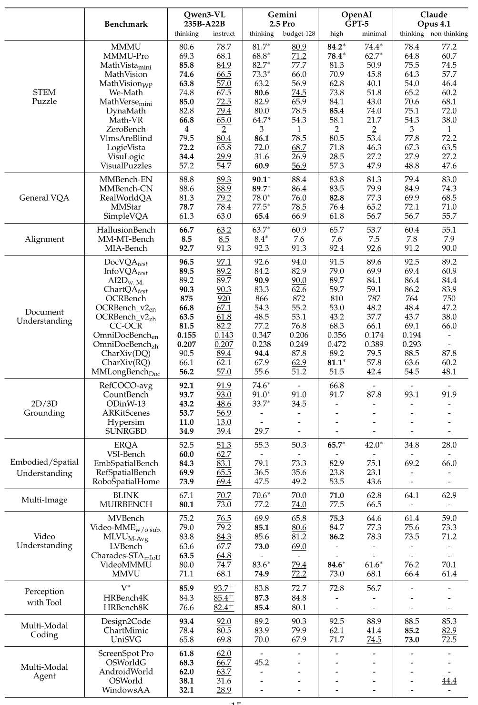

---

## 6. Chameleon：离散化路线

> "So far, VLMs encode images into vectors and inject them into a language model. Because it's a language model, you can only generate text. Chameleon says: what if we mapped everything into discrete tokens?"


**Chameleon 的哲学**：

> "In some ways aesthetically, this is appealing. Now you can analyze and generate images in the same way — everything is a discrete token. The vision of an omni model is that text and images truly live in the same space."

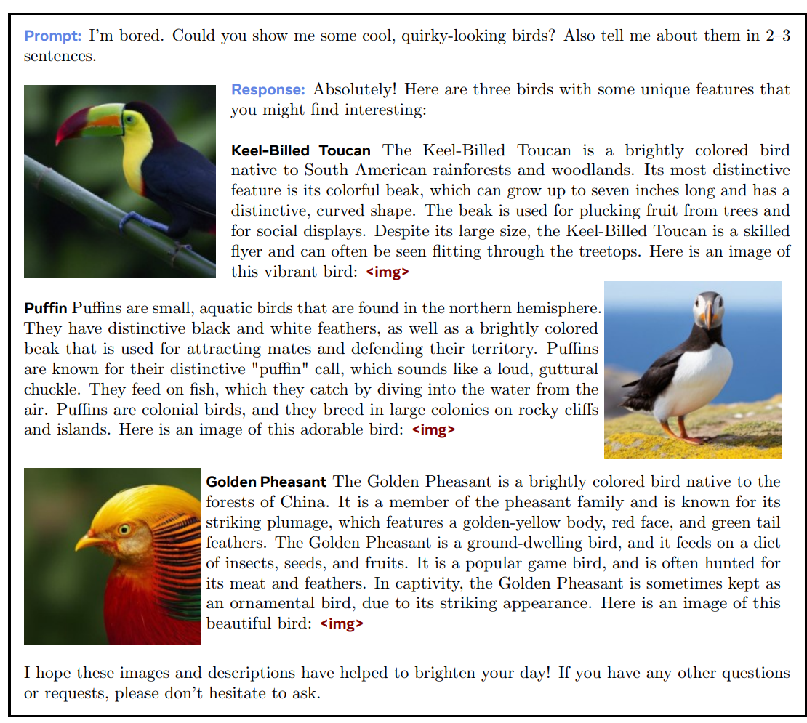

**VQ-VAE：将图像转为离散 token 的关键组件**：


1. Encoder：图像 → continuous vectors
2. **向量量化**：每个 vector 被 "round" 到最近的 codebook entry（codebook size ≈ 8192）
3. Decoder：从 codebook entry 重建图像
4. 训练目标：最小化重建误差（+ straight-through estimator 等技巧处理不可导的量化步骤）

> "512×512 image is converted into 1024 tokens, each from a vocabulary of 8,000. You train a new BPE tokenizer because now your data looks different from pure natural language."

**训练**：就是标准的 language model training——没有 adapter、没有单独的 vision encoder！

- Stage 1（80%）：大规模无监督（2.9T text + 1.5T text/image + 400B interleaved）
- Stage 2（20%）：混合高质量数据

**训练不稳定性问题**：

> "Text and images, despite occupying the same space, just behave very differently. Just calling things discrete tokens isn't hiding the fact that there's an image living there."

- **文本 token**：低熵（大多数词可预测）
- **图像 token**：高熵（"I don't know what exact shade of blue this token is going to be"）
- 后果：参数 norms 不断增长、logit drift → 训练不稳定
- 缓解：**QK Norm + Z-loss regularization**

**Chameleon 的局限**：

> "It turned out this model was not really as performant. Discretization definitely loses information — think about OCR: if you discretize very small print, you're not going to be able to read it anymore."

此外，VQ-VAE 曾流行一时（用于图像生成——因为 Transformer 只能输出离散 token），但 **扩散模型** 兴起后，这一路线不再主流。

> "The current best combination is: continuous encoders + Transformer + diffusion models for generation."

---

## 7. 总结

> "Frontier models these days are expected to be multimodal — or even more strongly, natively multimodal or omni-models. When Gemini or GPT come out, they're touted as natively multimodal. Of course, there's no details about how these are built."

**贯穿全讲的核心主题**：

| 主题 | 洞察 |
|------|------|
| **Transformer 仍是主导** | 在所有模态上，Transformer 仍是 "the best thing we have" |
| **CLIP/SigLIP 是基础** | 5 年前的 CLIP 思想仍是理解图像语义的核心方式 |
| **理解 vs 生成的张力** | 分类只需要高层语义→小向量即可；OCR/生成需要细粒度信息→需要高分辨率处理 |
| **VLM = Vision Encoder + Adapter + LM** | 标准模板，大部分工作是数据筛选和 scale up |
| **离散化路线（Chameleon）虽优雅但不实用** | 丢失信息、训练困难、扩散模型更优 |
| **多模态数据平衡是关键** | 视频信息密度远低于文本→需要仔细加权 |

**最后的话**：

> "The fundamental challenge is how to handle non-text modalities. There's a symmetry between understanding and generation — there's no one universal encoder. I think the current best combination is continuous encoders + Transformer + diffusion models for generation. Even CLIP, five years old, is still the go-to way to capture semantics of images."

---

## 参考文献与延伸阅读

- [CLIP (Radford et al., 2021)](https://arxiv.org/abs/2103.00020) — 对比语言-图像预训练
- [OpenCLIP (Ilharco et al., 2022)](https://arxiv.org/abs/2212.07143) — CLIP 的开源复现
- [SigLIP (Zhai et al., 2023)](https://arxiv.org/abs/2303.15343) — Sigmoid Loss 替代 Softmax
- [ViT (Dosovitskiy et al., 2020)](https://arxiv.org/abs/2010.11929) — Vision Transformer
- [LLaVA (Liu et al., 2023)](https://arxiv.org/abs/2304.08485) — 第一个开源 VLM
- [LLaVA OneVision (Li et al., 2024)](https://arxiv.org/abs/2408.03326) — 多图/视频 VLM
- [Qwen-VL (Bai et al., 2023)](https://arxiv.org/abs/2308.12966)
- [Qwen2-VL (Wang et al., 2024)](https://arxiv.org/abs/2409.12191) — Dynamic Resolution + M-RoPE
- [Qwen3-VL (2025)](https://arxiv.org/abs/2511.21631) — SigLIP-2 + DeepStack + Interleaved M-RoPE
- [Chameleon (Meta, 2024)](https://arxiv.org/abs/2405.09818) — 全离散 token 的多模态模型
- [VQ-VAE (van den Oord et al., 2017)](https://arxiv.org/abs/1711.00937) — 向量量化变分自编码器
- [WebLI (Chen et al., 2022)](https://arxiv.org/abs/2209.06794) — 大规模图文数据集
- [DeepStack (DeepSeek, 2024)](https://arxiv.org/abs/2406.04334) — 跨层视觉-语言融合
- [CS336 Course Website](https://cs336.stanford.edu/)
