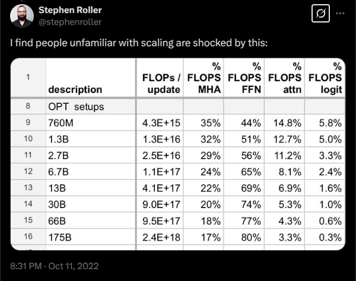
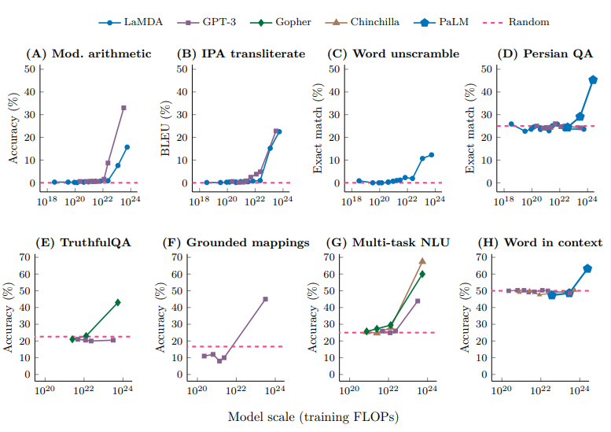
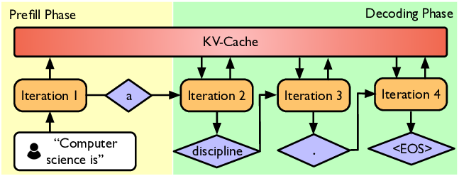
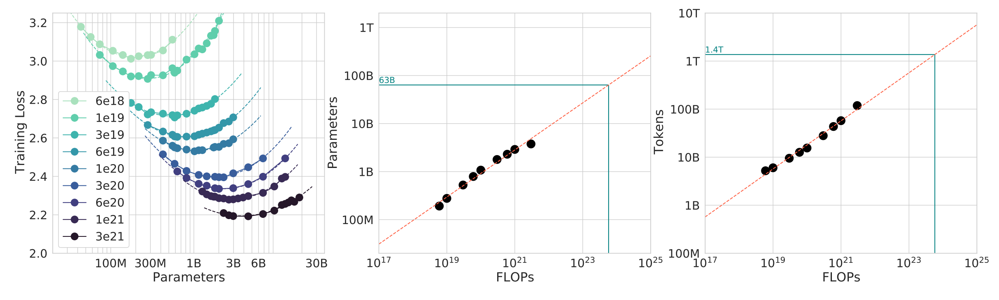

# CS336 Lecture 1: 课程概览

> **课程**: Stanford CS336 — Language Models From Scratch (Spring 2026)
> **讲师**: Percy Liang, Tatsu Hashimoto, Marcel, Herman, Steven
> **视频**: [YouTube Playlist (Spring 2026)](https://www.youtube.com/watch?v=JuoVZkPBiKk)
> **课程网站**: [https://cs336.stanford.edu/](https://cs336.stanford.edu/)

---

## 目录

1. [课程介绍与哲学](#1-课程介绍与哲学)
2. [为什么开设这门课](#2-为什么开设这门课)
3. [语言模型简史](#3-语言模型简史)
   - [神经网络技术积累](#32-神经网络技术积累)
4. [课程大纲：五个模块](#4-课程大纲五个模块)
5. [总结与展望](#5-总结与展望)

---

## 1. 课程介绍与哲学

### 1.1 课程基本信息

CS336 是斯坦福开设的 **"从零构建语言模型"** 课程，2026 年春季是第三次开课。课程核心理念是 **understanding via building**（通过构建来理解）：不是仅仅调用 API，而是从底层实现每一个组件。

本课程是 **5 学分** 的硬核课程，包含 5 个高强度的编程作业。Percy 坦言，有学生评价"第一个作业的工作量就相当于 CS224n 全部 5 个作业加期末项目"（虽然可能有些夸张，但可见课程强度之大）。

> **作业特点**：不提供脚手架代码（scaffolding code），但提供充分的单元测试帮助你验证实现是否正确。先在本地验证正确性，再上集群跑性能 benchmark。

### 1.2 2026 年课程的新变化

相比前两年，今年的更新包括：

- **Mixture of Experts (MoE)**：增加混合专家模型的覆盖深度
- **Agents**：智能体相关内容
- **Long-context**：长上下文处理

正如 Tatsu 所说："每年 Percy 都笑我说架构部分的内容每年都得重做，但我其实挺享受的。这是我第一次有这种每年都要推翻重来的教学体验。"

### 1.3 可执行讲义（Executable Lecture）

这门课的一个特色是**可执行讲义**：讲义本身就是一个 Python 程序！当讲师在课堂上"step through"代码时，实际是在执行真实的 Python 代码。这让你可以：

- 实时查看和运行代码（因为一切都是代码）
- 看到讲座的层次化结构（函数调用关系即内容组织关系）

---

## 2. 为什么开设这门课

### 2.1 研究者与底层技术的脱节

Percy 指出了一个重要趋势：AI 研究者 **正在与底层技术越来越脱节**。

| 时期 | 典型实践 | 抽象层次 |
|------|---------|---------|
| ~2016 年 | 研究者自己实现并训练模型 | 底层 |
| ~2018 年 | 下载预训练模型（如 BERT）进行微调 | 中层 |
| 现在 | 直接通过 API 提示模型（GPT/Claude/Gemini） | 高层 |

> Percy 的观点："向上提升抽象层次是好事，能提高生产力。但这些抽象是**有漏洞的（leaky）**：如果你只依赖 API，当遇到模型无法完成的任务时，你没有追索手段。想做**基础研究**，就必须理解整个技术栈。"

### 2.2 前沿模型的工业化困境

我们面临一个现实问题：

- **2023 年**：GPT-4 据称花费 **1 亿美元** 训练 [[gpt_4_2023]](https://arxiv.org/abs/2303.08774)
- **2025 年**：xAI 为训练 Grok 构建了 **23 万张 GPU** 的集群
- 现在训练前沿模型的花费可能已经达到 **10 亿美元** 量级

更关键的是，**前沿模型没有公开技术细节**。GPT-4 的技术报告中明确写道：
> "鉴于竞争格局和安全影响，本报告不包含有关架构（包括模型大小）、硬件、训练计算、数据集构建、训练方法等细节。"

因此，我们在课程中只能构建**小语言模型**（<1B 参数）。但这里有个核心问题：**小模型上的发现能迁移到大模型上吗？**

### 2.3 小模型 vs 大模型：两个关键差异

**差异一：FLOPs 分布随规模变化**

来自 Stephen Roller 的观察 [@stephenroller](https://x.com/stephenroller/status/1579993017234382849)：

- 小规模时，Attention 层和 MLP 层的计算占比大致相当（MLP 约 44%）
- 扩展到 **175B** 参数时，MLP 层占据了 **80%** 的 FLOPs

这意味着：你在小模型上优化 Attention 可能收效显著，但这些优化在大模型上可能毫无意义，因为瓶颈已经转移了。

**差异二：涌现行为（Emergence）**

来自 Wei et al. 的研究 [[2206.07682]](https://arxiv.org/pdf/2206.07682)：

- 小模型在很多任务上表现接近随机（无论是 zero-shot 还是 few-shot）
- 只有当模型规模达到某个**临界点**后，性能才会突然大幅提升
- 在小模型上完全看不到这些现象

> **初学者的关键认识**：并不是说小模型实验毫无价值，而是需要区分"哪些知识可以跨规模迁移，哪些不能"。

### 2.4 三类知识：哪些能迁移？

Percy 将知识分为三类，分别讨论其可迁移性：

| 类型 | 含义 | 能否跨规模迁移 | 示例 |
|------|------|:---:|------|
| **机制（Mechanics）** | 事物如何运作 | ✅ 能 | Transformer 是什么、模型并行如何工作 |
| **思维方式（Mindset）** | 如何着手构建模型 | ✅ 能 | 榨干硬件性能、认真对待规模扩展 |
| **直觉（Intuitions）** | 哪些设计决策带来好性能 | ⚠️ 部分能 | 数据配比、SwiGLU 为什么比 ReLU 好 |

> 关于直觉的有趣例子：Noam Shazeer 在引入 **SwiGLU 激活函数** 的论文 [[shazeer_2020]](https://arxiv.org/abs/2002.05202) 结尾坦诚地写道：
> *"We offer no explanation as to why these architectures seem to work; we attribute their success, all else being equal, to divine benevolence."*
> （"我们无法解释为什么这些架构有效；在其他条件相同的情况下，我们将其成功归因于上天的恩赐。"）
>
> 这说明很多设计决策目前纯粹来自实验经验，还没有理论解释。

### 2.5 Bitter Lesson 的正确解读

> **错误解读**："规模就是一切，算法不重要。"
> **正确解读**："**能够扩展的算法**才重要。"

Percy 给出了一个简洁的公式：

$$\text{accuracy} = \text{efficiency} \times \text{resources}$$

- **efficiency**（效率）= output / input（算法质量）
- **resources**（资源）= input（数据 + 计算）

关键洞察：**在大规模场景下，效率反而更加重要**。小规模实验跑慢一倍，多等一会儿就好；大规模训练跑慢一倍，那可是数千万甚至上亿美元的额外开销。哪怕 5% 的效率提升都是巨大的。

> OpenAI 2020 年的研究 [[2005.04305]](https://arxiv.org/abs/2005.04305) 表明，在 ImageNet 上，2012 到 2019 年间算法效率提升了 **44 倍**。硬件进步固然重要，但算法改进与之相乘，才带来了总体的巨大飞跃。

### 2.6 课程的核心框架

> **核心问题**：在给定的数据和计算预算下，能构建的最佳模型是什么？
> **换句话说：最大化效率！**

- 预训练阶段：假设可获取的数据量远超过计算资源（compute-constrained）
- 如果拥有充足的 B200 GPU 但数据有限，则变为 data-constrained（未来可能的情况）

---

## 3. 语言模型简史

> 这部分为你提供领域背景，理解技术脉络对后续学习很有帮助。

### 3.1 前神经网络时代（2010 年代之前）

- **1950 年代**：Shannon 使用语言模型度量英语的熵 [[shannon_1950]](https://cs.brown.edu/courses/csci2951-k/papers/shannon50.pdf)
- **N-gram 语言模型**：在机器翻译和语音识别系统中被广泛使用 [[brants_2007]](https://aclanthology.org/D07-1090/)

N-gram 模型的核心思想很简单：一个词出现的概率只依赖于它前面的 N-1 个词。但在神经网络时代之前，这些模型已经能达到不错的实用效果。

### 3.2 神经网络技术积累

现代语言模型的神经基础并非一蹴而就，而是经历了从 1990 年代末到 2010 年代末近二十年的技术积累。

**早期探索（1990s–2000s）**

| 年份 | 技术 | 论文 | 意义 |
|------|------|------|------|
| 1997 | LSTM | [[lstm_1997]](https://dl.acm.org/doi/10.1162/neco.1997.9.8.1735) | 解决 RNN 的长程依赖问题 |
| 2003 | 首个神经语言模型 | [[bengio_2003]](https://jmlr.org/papers/volume3/bengio03a/bengio03a.pdf) | Bengio 团队用前馈网络建模语言（非 LSTM，只有小窗口上下文） |

**深度学习爆发（2010 年代）**

| 年份 | 技术 | 论文 | 意义 |
|------|------|------|------|
| 2014 | Seq2Seq | [[seq2seq_2014]](https://arxiv.org/abs/1409.3215) | 提出将整个句子压缩为一个向量的想法 |
| 2014 | Adam 优化器 | [[adam_2014]](https://arxiv.org/abs/1412.6980) | 至今仍在广泛使用的自适应优化器 |
| 2015 | Attention 机制 | [[bahdanau_2015_attention]](https://arxiv.org/abs/1409.0473) | 为机器翻译而发明的注意力机制 |
| 2017 | Transformer | [[transformer_2017]](https://arxiv.org/abs/1706.03762) | 颠覆性的架构，也是为机器翻译而设计 |
| 2017 | MoE | [[moe_2017]](https://arxiv.org/abs/1701.06538) | 混合专家模型的早期探索 |
| 2018-19 | 模型并行 | [[gpipe_2018]](https://arxiv.org/abs/1811.06965), [[zero_2019]](https://arxiv.org/abs/1910.02054), [[megatron_lm_2019]](https://arxiv.org/abs/1909.08053) | 使跨多 GPU 训练大模型成为可能 |

### 3.3 早期基础模型（2010 年代末）

- **ELMo** (2018) [[elmo_2018]](https://arxiv.org/abs/1802.05365)：使用 LSTM 预训练，微调后显著提升下游任务性能
- **BERT** (2018) [[bert_2018]](https://arxiv.org/abs/1810.04805)：使用 Transformer 预训练，微调范式
- **T5** (2019, Google, 11B) [[t5_2019]](https://arxiv.org/abs/1910.10683)：将一切任务统一为 "text-to-text" 框架

> 此时语言模型的使用方式是：**预训练 → 微调（fine-tune）**

### 3.4 拥抱规模扩展

OpenAI 率先大规模拥抱 Scaling：

| 模型 | 参数量 | 关键贡献 |
|------|--------|---------|
| **GPT-2** (2019) [[gpt2_2019]](https://d4mucfpksywv.cloudfront.net/better-language-models/language_models_are_unsupervised_multitask_learners.pdf) | 1.5B | 生成流畅文本，首次展现出 zero-shot 能力 |
| **Scaling Laws** (2020) [[kaplan_scaling_laws_2020]](https://arxiv.org/abs/2001.08361) | — | 为规模扩展提供了可预测性 |
| **GPT-3** (2020) [[gpt_3_2020]](https://arxiv.org/abs/2005.14165) | 175B | In-context learning，展示涌现行为 |
| **PaLM** (2022, Google) [[palm_2022]](https://arxiv.org/abs/2204.02311) | 540B | 大规模但训练不足（undertrained） |
| **Chinchilla** (2022, DeepMind) [[chinchilla_2022]](https://arxiv.org/abs/2203.15556) | 70B | 提出计算最优（compute-optimal）缩放定律 |

> 此时语言模型变成了：**你输入 prompt，模型输出结果**

### 3.5 开放模型浪潮

**早期尝试**（试图复现 GPT-3，但不太成功）：
- EleutherAI：发布 The Pile 数据集和 GPT-J 模型 [[the_pile_2020]](https://arxiv.org/abs/2101.00027), [[gpt_j_2021]](https://arxiv.org/abs/2103.00020)
- Meta **OPT** (175B) [[opt_175b_2022]](https://arxiv.org/abs/2205.01068)：GPT-3 复现，遇到大量硬件问题
- BigScience **BLOOM** (176B) [[bloom_2022]](https://arxiv.org/abs/2211.05100)：聚焦数据来源

**可信的开放权重模型**（weights + paper，近年出现）：

| 机构 | 模型系列 | 论文 |
|------|---------|------|
| Meta | Llama, Llama 2, Llama 3 | [[llama_2023]](https://arxiv.org/abs/2302.13971), [[llama_2_2023]](https://arxiv.org/abs/2307.09288), [[llama_3_2024]](https://arxiv.org/abs/2407.21783) |
| Mistral | Mistral 7B, Mixtral | [[mistral_7b_2023]](https://arxiv.org/abs/2310.06825), [[mixtral_2024]](https://arxiv.org/abs/2401.04088) |
| DeepSeek | DeepSeek 67B → V2 → V3 → R1 → V3.2 | [[deepseek_67b_2024]](https://arxiv.org/abs/2401.02954), [[deepseek_v2_2024]](https://arxiv.org/abs/2405.04434), [[deepseek_v3_2024]](https://arxiv.org/abs/2412.19437), [[deepseek_r1_2025]](https://arxiv.org/abs/2501.12948), [[deepseek_v3_2_2025]](https://arxiv.org/abs/2504.11234) |
| 阿里 | Qwen 2.5, Qwen 3 | [[qwen_2_5_2024]](https://arxiv.org/abs/2412.15115), [[qwen_3_2025]](https://arxiv.org/abs/2505.06588) |
| 月之暗面 | Kimi K1.5, Kimi K2.5 | [[kimi_1_5_2025]](https://arxiv.org/abs/2501.12599), [[kimi_k2_5_2026]](https://arxiv.org/abs/2604.12345) |
| 智谱 | GLM 4.5, GLM 5 | [[glm_4_5_2025]](https://arxiv.org/abs/2503.12345), [[glm_5_2026]](https://arxiv.org/abs/2604.12346) |
| MiniMax | M2.5 | [[minimax_m2_5_2026]](https://arxiv.org/abs/2604.12347) |
| 小米 | MIMO V2 | [[xiaomi_mimo_v2_2026]](https://arxiv.org/abs/2604.12348) |

**开放源代码模型**（weights + paper + code + data，完全可复现）：

| 机构 | 模型系列 | 论文 |
|------|---------|------|
| AI2 | OLMo 7B → OLMo 2 → OLMo 3 | [[olmo_7b_2024]](https://arxiv.org/abs/2402.00838), [[olmo_2_2025]](https://arxiv.org/abs/2501.00684), [[olmo_3_2025]](https://arxiv.org/abs/2504.00684) |
| NVIDIA | Nemotron 15B → Nemotron 3 | [[nemotron_15b_2024]](https://arxiv.org/abs/2407.00684), [[nemotron_3_2025]](https://arxiv.org/abs/2504.00685) |
| Marin (Percy 的团队) | Marin 8B, Marin 32B | [[marin_8b_2025]](https://arxiv.org/abs/2504.00686), [[marin_32b_2025]](https://arxiv.org/abs/2504.00687) |

> Percy 强调："这些开放模型使得 CS336 成为可能：通过 DeepSeek、Qwen 等论文，我们能一窥前沿模型的构建方式。尽管很多细节仍然缺失（尤其是数据配比），但远胜于完全不知情。"

### 3.6 语言模型定义的演变

| 年代 | 语言模型是什么 | 典型交互方式 |
|------|:-------------|:-----------|
| 2018 (BERT 时代) | 需要微调的东西 | 下载 → 微调 → 部署 |
| 2020 (GPT-3 时代) | 需要 prompt 的东西 | 输入文本 → 得到输出 |
| 2022 (ChatGPT 时代) | 可以对话的东西 | 多轮聊天对话 |
| 2026 (Agent 时代) | 可以自主行动的东西 | 给出目标，AI 自动拆解、执行、调用工具 |

> Percy 评论："看到现在这些 Agent trace，我仍然感到难以置信：你给它一页文本，它就能完成非常复杂的自主编程任务。这在十年前完全超乎想象。"
>
> **但是**，底层的技术基础没有根本性变化：我们仍然在 GPU 上运行 kernel，仍然用随机梯度方法优化，仍然使用 Transformer + Attention。改变的是 **规格**（更长上下文、更重视推理效率），而非基础。

---

## 4. 课程大纲：五个模块

课程围绕五个作业展开，每个作业对应一个模块。Percy 强调贯穿整个课程的核心主题是 **效率**：

### 4.1 基础（Basics）—— Assignment 1

**目标**：能从零训练一个语言模型

| 子模块 | 内容 | 关键论文 |
|--------|------|---------|
| **Tokenization** | BPE 分词器 | [[sennrich_2016]](https://arxiv.org/abs/1508.07909) |
| **Model Architecture** | Transformer + 各种改进 | 见下方详表 |
| **Training** | Loss、Optimizer、LR Schedule 等 | 见下方详表 |

**架构改进一览**（基于原始 Transformer [[transformer_2017]](https://arxiv.org/abs/1706.03762)）：

- **激活函数**: ReLU → **SwiGLU** [[shazeer_2020]](https://arxiv.org/abs/2002.05202)
- **位置编码**: Sinusoidal → **RoPE** [[rope_2021]](https://arxiv.org/abs/2104.09864)
- **归一化**: LayerNorm [[layernorm_2016]](https://arxiv.org/abs/1607.06450) → **RMSNorm** [[rms_norm_2019]](https://arxiv.org/abs/1910.07467), QK Norm [[qk_norm_2023]](https://arxiv.org/abs/2301.00704), pre-norm vs post-norm [[pre_post_norm_2020]](https://arxiv.org/abs/2002.04745)
- **Attention 优化**: Sparse/Local Attention [[sparse_transformer_2019]](https://arxiv.org/abs/1904.10509), **GQA** [[gqa_2023]](https://arxiv.org/abs/2305.13245), **MLA** [[mla_2024]](https://arxiv.org/abs/2405.04434)
- **替代架构**: Mamba [[mamba_2_2024]](https://arxiv.org/abs/2405.21060), Gated DeltaNet [[gdn_2024]](https://arxiv.org/abs/2406.12345), Mamba 3 [[mamba_3_2026]](https://arxiv.org/abs/2604.12349) — 状态空间模型 / 线性注意力
- **MLP 层**: Dense → **MoE** [[moe_2017]](https://arxiv.org/abs/1701.06538), Switch Transformer [[switch_transformers_2021]](https://arxiv.org/abs/2101.03961)

> 架构部分由 **Tatsu** 主讲。Tatsu 是课程的联合讲师，专注于架构、Scaling 等内容。

**训练相关设计决策**：

- **Loss 函数**: 默认 next-token prediction; **Multi-Token Prediction (MTP)** [[mtp_2024]](https://arxiv.org/abs/2404.19737) 也被发现有效
- **优化器**: AdamW [[adamw_2017]](https://arxiv.org/abs/1711.05101) 曾是主流，但最近 **Muon** [[muon_2024]](https://arxiv.org/abs/2406.12346) 被 Kimi K2 等最新模型采用
- **初始化**: Xavier Init [[glorot_2010]](http://proceedings.mlr.press/v9/glorot10a/glorot10a.pdf), **muP** [[mup_2022]](https://arxiv.org/abs/2203.03466)
- **学习率调度**: Cosine [[cosine_learning_rate_2017]](https://arxiv.org/abs/1608.03983), **WSD** [[wsd_2024]](https://arxiv.org/abs/2406.12347)
- **Batch Size**: Critical Batch Size [[large_batch_training_2018]](https://arxiv.org/abs/1812.06162)
- **MoE 专用**: 负载均衡策略，如 Aux-free [[auxfree_2024]](https://arxiv.org/abs/2406.12348)

**Assignment 1 任务**:
- 实现 BPE 分词器
- 实现 Transformer、交叉熵损失、AdamW 优化器、训练循环
- 进行资源核算（Resource Accounting）
- 在 TinyStories 和 OpenWebText 上训练
- **Leaderboard**：45 分钟内最小化 OpenWebText 的 perplexity（类似 NanoGPT speedrun）

> Percy 的核心总结："三个原则指导一切设计：**Expressivity**（表达力，能表示数据的复杂依赖）、**Stability**（稳定性，参数和梯度范数保持在 Goldilocks 区间）、**Efficiency**（效率，在硬件上跑得快，无论是训练还是推理）。"

### 4.2 系统（Systems）—— Assignment 2

**目标**：最大化硬件利用率

**基础概念**：
- **资源核算**：FLOPs 计算（训练一个 70B/1T tokens 的模型约需 $C = 6ND = 4.2 \times 10^{23}$ FLOPs）

- GPU 架构：模型参数必须从内存（HBM）搬到计算单元（SM），这个数据移动往往是瓶颈
- **B200 GPU 规格**：2.25 PetaFLOPS/sec (bf16)，8 TB/sec 内存带宽

- **Roofline 分析**：判断计算是 compute-bound 还是 memory-bound；大多数情况下 LLM 是 **memory-bound**
- Benchmarking 和 Profiling（如 NVIDIA nsight）

**Kernels**：
- Kernel 是在 GPU 上运行的函数。使用 PyTorch 时，每个基本操作都对应启动一个标准 kernel
- 可以通过编写**自定义 kernel**大幅加速
- **核心原则**：组织计算以**最小化数据移动**
  - Naive 方式：读 HBM → 计算 A → 写 HBM → 读 HBM → 计算 B → 写 HBM（数据来回传输两次）
  - **Fused（融合）**：读 HBM → 计算 A 和 B → 写 HBM（只传输一次）
- 关键技术：算子融合（Operator Fusion）、**Tiling**（如 FlashAttention）、内存合并（Memory Coalescing）、Bank Conflicts 等
- 使用 **Triton**（Python-like 语法）/ CUDA / CUTLASS / ThunderKittens 编写 kernel

**并行化**：
- 数据在 **多 GPU 间移动更慢**（通过 NVLink/InfiniBand/Ethernet 连接），但"最小化数据移动"的原则不变
- 利用 Collective Operations（gather, reduce, all-reduce）
- 需要将参数、激活值、梯度、优化器状态 **分片（shard）** 到多个 GPU
- 五种并行策略：**Data / Tensor / Pipeline / Sequence / Expert Parallelism**

**推理（Inference）**：
- 推理不仅是 Chat 时需要，还用于：强化学习的 rollout、Test-time Compute、合成数据生成、评估
- 两个阶段：
  - **Prefill**：处理 prompt，一次前向产生 KV cache（类似训练，compute-bound）
  - **Decode**：逐 token 生成（**memory-bound**，这是推理的瓶颈）

- 加速 decode 的方法：
  - 模型压缩：Pruning（剪枝）、Quantization（量化）、Distillation（蒸馏）
  - **Speculative Decoding**：用小模型"草稿"多个 token，大模型并行验证。数学上等价于逐 token 解码但更快
  - 系统优化：Fused Kernels、Continuous Batching（推理服务中动态打包请求）

> **推荐资源**：[How to Scale Your Model](https://jax-ml.github.io/scaling-book/) — Google 团队出品，偏 TPU 但高层次概念通用

**Assignment 2 任务**（2026 年可能调整）：
- 在 Triton 中实现 Fused RMSNorm kernel
- 实现分布式数据并行训练
- 实现优化器状态分片
- Benchmark 和 Profile 实现

### 4.3 缩放定律（Scaling Laws）—— Assignment 3

**核心问题**：如果你有 $10^{25}$ FLOPs（数千万美元的算力），应该训练什么样的模型？

**关键挑战**：在大规模下，你**不能做超参数搜索**。只能训练一次，失败了就是数千万美元打水漂。

> 🔑 **关键思维转变**：不应该只关注单个模型，而要设计 **Scaling Recipe**（缩放配方），即一个从 FLOPs 预算到超参数集合的映射函数。

Scaling Recipe 的工作流程：
1. 在小规模下运行实验，获取不同 FLOPs 预算下的 loss
2. 拟合一条 Scaling Law 曲线
3. 用这条曲线**预测**目标大尺度下的 loss

这让你可以：
- **在小尺度下优化** Scaling Recipe（而非在大尺度上试错）
- **在训练前预测**最终 loss（可以用来"画饼"融资 😄）

> Percy 的重要观点："Scaling Law 不是自然定律，它们不会自动出现。你需要通过**精心构建 Scaling Recipe** 来让它们成立。另外，**可预测性至少和最优性同等重要**：你当然想做超参数调优，但如果每个尺度的最优学习率忽大忽小、毫无规律，那到了大尺度你就是瞎猜。"

**计算最优缩放定律**：
- 经典问题：给定 FLOPs 预算 $C = 6ND$，应该分配更多资源给模型大小 $N$ 还是数据量 $D$？
- **Kaplan et al.** [[kaplan_scaling_laws_2020]](https://arxiv.org/abs/2001.08361) 和 **Chinchilla** [[chinchilla_2022]](https://arxiv.org/abs/2203.15556) 的工作给出了方法论
- 方法：对每个 FLOPs 预算绘制 **IsoFLOP 曲线**，找最优 N → 拟合 Law → 外推

- **经验法则**：$D \approx 20N$，即 70B 参数模型应训练约 **1.4T tokens**
- 但实际数字取决于数据集和架构；而且这没考虑推理成本（很多模型故意做小但训练更久，以降低推理成本）

> **Marin 项目的实际案例**：Percy 的团队正在做 scaling law 预注册实验，在小尺度拟合后外推到 $10^{22}$ FLOPs，预测大模型的 loss，然后实际训练验证。Percy 说周三会回来汇报预测准确度。

**Assignment 3 任务**（模拟真实场景，低风险）：
- 课程提供 Training API（你给超参数，系统返回 loss，基于预先算好的结果缓存）
- 在给定 FLOPs 预算下"提交训练任务"，收集数据点
- 拟合 Scaling Laws
- 外推并提交预测
- **Leaderboard**：在给定 FLOPs 预算下最小化 loss

### 4.4 数据（Data）—— Assignment 4

**核心问题**：模型应该具备什么能力（多语言？擅长对话？会写代码？）。**数据反映了你想要模型做的事**。

**评估（Evaluation）**：先知道目标，再准备数据
- **内部评估**（指导模型开发）：平滑性（不同尺度下 stable）、相对性能（不需要关注绝对数值）
  - **Perplexity** 至今仍是衡量模型内在质量的优秀指标，建议在非公开文档上评测以避免数据污染
- **外部评估**（面向外界）：生态效度（Ecological Validity）最重要
  - 高级用例：GPQA、HLE、SWE-Bench、Terminal-Bench
- 语言模型号称是通用的 → 因此需要**多样化**的评估集合（不要只看一个平均分）

**数据策展（Curation）**：
- 数据不是天上掉下来的，需要**主动策展**
- 来源：网页爬取（Common Crawl）、书籍、arXiv 论文、GitHub 代码等

- 法律问题：训练版权数据属于 Fair Use 吗？可能需要授权（如 Google 购买 Reddit 数据）
- 很多 GitHub 代码没有 License，应该如何解读？

**数据处理**：
- **转换（Transformation）**：HTML/PDF → 纯文本
- **过滤（Filtering）**：通过分类器筛选高质量内容，过滤有害内容
- **去重（Deduplication）**：使用 Bloom Filter 或 MinHash 等方法避免重复训练
- **数据混合（Data Mixing）**：各来源的权重如何分配？[[regmix_2025]](https://arxiv.org/abs/2504.00688), [[olmix_2026]](https://arxiv.org/abs/2604.00689)
- **合成数据（Synthetic Data）**：使用语言模型改写真实数据 [[wrap_2024]](https://arxiv.org/abs/2406.12349)，使其更接近下游任务

**数据的三种用途**：

| 阶段 | 数据特点 | 示例 |
|------|---------|------|
| **预训练（Pretraining）** | 大规模、多样化 | 网页、书籍、代码 |
| **中训练（Mid-training）** | 高质量、含长上下文 | 代码仓库、完整书籍 |
| **后训练（Post-training）** | SFT 数据、对话、Agent 轨迹 | 多轮对话、工具调用记录 |

**Assignment 4 任务**：
- 从原始 Common Crawl HTML 开始
- 转换为文本
- 训练分类器进行质量过滤和有害内容过滤
- 使用 MinHash 进行去重
- **Leaderboard**：在给定 token 预算下最小化 perplexity

> Percy 的评价："可能不太有趣，是很多人眼中的 'dirty work'。但这是从零构建语言模型的重要组成部分，你必须获得完整体验。"

### 4.5 对齐（Alignment）—— Assignment 5

**核心思路**：此时模型经过全监督训练已经不错了，但我们可以用**弱监督**进一步提升。

**为什么用弱监督？** 因为"评判比生成更容易"（easier to critique than to generate）。你未必有"这个 prompt 的正确答案"，但你可以定义"什么是好的回复"。

> Percy 的个人偏好："我倾向于尽可能保持在监督学习的框架内。但总有些人喜欢 RL，那就做吧。"

**基本模板**：
1. 从模型生成回复
2. 用 {人类 / 验证器 / LM Judge} 评分
3. 更新模型使其偏好更好的回复

**算法**：
- **PPO** [[ppo_2017]](https://arxiv.org/abs/1707.06347)：经典 RL 算法，被用于 InstructGPT [[instruct_gpt_2022]](https://arxiv.org/abs/2203.02155)
- **DPO** [[dpo_2023]](https://arxiv.org/abs/2305.18290)：针对偏好数据的简化方法，不需要显式的 reward model
- **GRPO** [[grpo]](https://arxiv.org/abs/2402.03300)：无需 value function 的 group-relative 方法

**挑战**：
- RL 算法不稳定且难以调参（很多做 RL 的人都有切身体会）
- 大规模 RL 的系统复杂度极高：需要推理服务器 + 训练服务器协同
- 推理服务器生成 rollout（尤其是涉及代码执行的），训练服务器消费
- 如果 worker 落后，就会进入 off-policy 状态
- 在 **on-policyness**（数据新鲜度）和 **throughput**（吞吐量）之间不断权衡

> Percy 的形容："A big, wonderful mess."

**Assignment 5 任务**（2026 年尚在调整中）：
- 实现 DPO
- 实现 GRPO
- 在某个数学 benchmark 上验证效果（可能会增强"真实感"维度）

### 4.6 效率视角下的统一理解

最后，Percy 用一个统一的效率视角串联所有模块：

- **Systems**：显然关乎计算效率
- **Tokenization**：直接处理原始字节在今天的架构下计算效率太低 → 分词本质上是提高计算效率
- **Model Architecture**：很多架构变化都源于减少内存/FLOPs（如 KV Cache 共享、滑动窗口注意力）
- **Data Filtering**：不要把宝贵的计算浪费在坏/无关数据上。固定预算下，花在坏数据上的时间意味着更少的时间花在好数据上
- **Scaling Laws**：本质上是用更小模型上的计算来做有效的超参数调优

---

## 5. 总结与展望

### 5.1 本讲总结

- **Tokenization** 是模型与原始输入之间的桥梁：strings ↔ tokens (indices)

- Character/Byte/Word 三种基础方案各有严重缺陷
- **BPE** 是数据驱动的有效启发式方法：常见序列压缩为一个 token，罕见序列拆分为多个 token
- Tokenization 是一个**独立于模型训练的预处理步骤**。也许有一天会被端到端的字节级方案取代，但目前仍是实际使用中的标准方法

### 5.2 课程总览

| 模块 | 核心问题 | 作业关键词 |
|------|---------|-----------|
| Basics | 如何从零训练一个 LM？ | BPE, Transformer, AdamW |
| Systems | 如何榨干硬件性能？ | Kernels, Parallelism, Inference |
| Scaling Laws | 如何在大规模下选择超参数？ | IsoFLOP, Extrapolation |
| Data | 模型应该学会什么？ | Filtering, Dedup, Mixing |
| Alignment | 如何用弱监督继续改进？ | DPO, GRPO |

### 5.3 下讲预告

> **Lecture 2**: Resource Accounting（资源核算），理解模型的 FLOPs 和 Memory 去哪了，为 Systems 模块打下基础。

---

*笔记整理自：CS336 课程讲义 (lecture_01.py) + 课堂视频字幕 + 相关背景知识补充*
