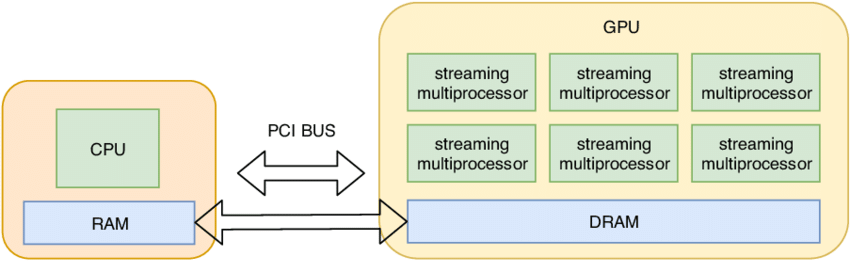
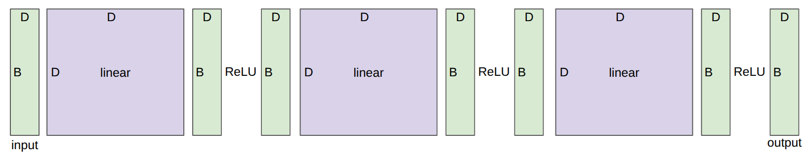

# CS336 Lecture 2: 资源核算与系统基础

> **课程**: Stanford CS336 — Language Models From Scratch (Spring 2026)
> **讲师**: Percy Liang
> **视频**: [YouTube Playlist (Spring 2026)](https://www.youtube.com/watch?v=VJ6t4KqOEmQ)
> **课程网站**: [https://cs336.stanford.edu/](https://cs336.stanford.edu/)

---

## 目录

1. [开篇公告与 Marin 运行结果](#1-开篇公告与-marin-运行结果)
2. [启发式问题：餐巾纸算术](#2-启发式问题餐巾纸算术)
3. [本讲的知识类型](#3-本讲的知识类型)
4. [张量基础](#4-张量基础)
5. [浮点数类型与内存核算](#5-浮点数类型与内存核算)
6. [GPU 上的张量](#6-gpu-上的张量)
7. [Einops：命名维度的张量操作](#7-einops命名维度的张量操作)
8. [FLOPs 核算与 MFU](#8-flops-核算与-mfu)
9. [算术强度与 Roofline 分析](#9-算术强度与-roofline-分析)
10. [梯度的计算与 FLOPs](#10-梯度的计算与-flops)
11. [优化器内存](#11-优化器内存)
12. [梯度累积](#12-梯度累积)
13. [激活检查点](#13-激活检查点)
14. [总结](#14-总结)

---

## 1. 开篇公告与 Marin 运行结果

Percy 在开场时宣布了几个课程事项：

- **Slack 与 Modal**：加入 CS336 的 Slack 频道，使用斯坦福邮箱注册 Modal 平台（后续作业需要用到）。
- **AI 政策指南**：[AI policy guide](https://docs.google.com/document/d/1SZAlExB1qAc9izHt54gwunNpjKE6wXb8Y7yA_e-baK8/edit?tab=t.0)
- **集群使用指南**：[cluster guide](https://docs.google.com/document/d/1cHE0iKVyXLJ3XpIs2XuXTmZ-HMmPk2hIPeCvy-AydMg/edit?tab=t.otis27tacaef)

随后 Percy 分享了一个有趣的消息：**Marin 1e23 FLOPs 规模的训练运行已经完成，且其结果与之前的预报高度吻合。**


> 这里提到的 Marin 是 CS336 课程团队参与的一个语言模型项目。在上节课末尾，Percy 让同学们预测这个 1e23 FLOPs 运行的 loss 会落在什么位置，结果与预报非常接近。这是语言模型 scaling 预测可靠性的一个小例子。

---

## 2. 启发式问题：餐巾纸算术

回顾上节课的核心问题：**在给定计算和内存资源下，能训练出的最佳模型是什么？** 换句话说，就是最大化（计算）效率。而要做到这一点，前提是理解一笔计算到底需要多少资源。

Percy 展示了两个"餐巾纸背面"式的快速估算问题。

### 问题一：训练时间

> **用 1024 张 H100 训练一个 70B 参数模型，数据量为 15T tokens，需要多长时间？**

计算过程如下：

- 总 FLOPs = 6 × (7 × 10¹⁰) × (1.5 × 10¹³) = 6.3 × 10²⁴ FLOPs
- H100 的 bf16 峰值性能 = 1979 TFLOPS / 2 = 989.5 TFLOPS（除以 2 是因为官方宣传的 1979 是"含稀疏性"的数字，稠密矩阵只有一半）
- 假设 MFU = 0.5（即实际能用到峰值性能的 50%）
- 每天 FLOPs = 989.5 × 10¹² × 0.5 × 1024 × 86400 ≈ 4.38 × 10²²
- 训练天数 = 6.3 × 10²⁴ / 4.38 × 10²² ≈ 144 天

### 问题二：最大模型规模

> **用 AdamW 训练，8 张 H100（每张 80GB）能容纳的最大模型是多少参数？**

前向算出 loss → 反向传播 → 每个参数得到一个梯度：**总梯度占用 = 参数占用**

AdamW 为每个参数维护两个状态：
- m (一阶矩):  与参数同形状
- v (二阶矩):  与参数同形状

使用 fp32存，总优化器占用 = 4\*参数占用 +  4\*参数占用 = 8\*参数占用

每参数所需字节 = 参数(bf16) 2 字节 + 梯度(bf16) 2 字节 + 优化器状态(fp32) 4 + 4 字节 = **12 字节/参数**

总可用内存 = 8 × 80 GB = 640 GB

最大参数量 = 640 × 10⁹ / 12 ≈ **53B 参数**

**重要前提**：这个计算忽略了激活值内存（取决于 batch size 和序列长度），所以只是一个**理论上界**。实际能训练的模型会比这个小。激活值 = 前向传播中每一层的输出。数据流过网络时，每经过一个矩阵乘法或非线性函数就产生一批中间结果，这些中间结果就是激活值。

Percy 强调，这两个例子展示了"餐巾纸算术"(napkin math) 的威力：不需要复杂的性能模型，几行简单乘除就能对资源需求形成直观判断。

---

## 3. 本讲的知识类型

Percy 将本讲的知识分为三层：

| 类型 | 内容 | 特点 |
|------|------|------|
| **Mechanics** | PyTorch 语义、FLOPs 计算公式 | 直接可迁移到不同规模 |
| **Mindset** | 资源核算意识（养成先算一下的习惯） | 思维模式，跨场景迁移 |
| **Intuitions** | 各部分的资源开销分布、数量级感知 | 可能随硬件变化而失效 |

> 本讲的目标不是让你成为系统专家，而是培养一种"动手之前先估算"的条件反射。

---

## 4. 张量基础

### 4.1 什么是张量

张量是深度学习中存储一切的基本构建块，包括：

- 数据（data）
- 模型参数（parameters）
- 梯度（gradients）
- 优化器状态（optimizer state）
- 激活值（activations）

以 DeepSeek V3.2 为例，其所有参数都以张量形式存储在模型文件中：

- [DeepSeek V3.2](https://arxiv.org/abs/2512.02556)
- [DeepSeek V3.2 on HuggingFace](https://huggingface.co/deepseek-ai/DeepSeek-V3.2?show_file_info=model.safetensors.index.json)

### 4.2 张量的秩（Rank）

张量的秩就是维度数：

```python
x = torch.zeros(4)        # 秩 1 张量（向量），shape = (4,)
x = torch.zeros(4, 8)     # 秩 2 张量（矩阵），shape = (4, 8)
x = torch.zeros(4, 8, 2)  # 秩 3 张量，shape = (4, 8, 2)
```

在 Transformer 中，常见的张量是秩 4 的：

```python
B = 32   # Batch size（批次大小）
S = 16   # Sequence length（序列长度）
H = 16   # Number of heads（注意力头数）
D = 64   # Hidden dimension per head（每个头的隐藏维度）
x = torch.zeros(B, S, H, D)
```

---

## 5. 浮点数类型与内存核算

在深度学习里，张量的元素几乎总是浮点数。不同精度的浮点数占用的内存不同，这是资源核算的基础。

**内存计算公式非常简单**：`元素数量 × 每个元素占用的字节数`

Percy 在课上坦承："浮点精度的内容我可能讲得有点长，但了解这些细节确实有助于你欣赏精度问题的精妙之处。"

### 5.1 fp32（单精度浮点）


- **内存**：4 字节（32 位）/元素
- **结构**：1 位符号 + 8 位指数 + 23 位尾数
- **默认类型**：PyTorch 中张量默认为 fp32
- **传统角色**：在科学计算中，fp32 是基线；有些领域还会用 fp64（双精度）

> 参考：[Wikipedia — Single-precision floating-point format](https://en.wikipedia.org/wiki/Single-precision_floating-point_format)

然而，**深度学习可以"草率"得多（a lot sloppier）**。相比科学计算对精度的苛刻要求，神经网络的训练对数值精度不那么敏感，这给了我们使用低精度的空间。

以 GPT-3 的前馈层中的一个矩阵为例（尺寸 49152 × 12288，即 12288×4 的扩展维度乘以 12288 的隐藏维度）：

```python
# 这个矩阵占用 2.3 GB 的显存！
get_memory_usage(torch.empty(12288 * 4, 12288))  # = 2.3 GB
```

一个矩阵就 2.3 GB，所以降低精度来节省内存是非常有吸引力的。

### 5.2 fp16（半精度浮点）


- **内存**：2 字节（16 位）/元素
- **结构**：1 位符号 + 5 位指数 + 10 位尾数
- **优势**：内存减半
- **致命缺陷**：动态范围（dynamic range）很窄，尤其对于小数

```python
x = torch.tensor([1e-8], dtype=torch.float16)
assert x == 0  # 下溢（underflow）！1e-8 在 fp16 中直接变成 0
```

fp16 能表示的最小正数大约只有 6 × 10⁻⁸（指数位只有 5 位，偏置后范围是 [-14, 15]），比这更小的值会直接下溢为 0。训练中出现下溢会导致梯度消失、训练不稳定。

> 参考：[Wikipedia — Half-precision floating-point format](https://en.wikipedia.org/wiki/Half-precision_floating-point_format)

### 5.3 bf16（Brain Floating Point）


Google Brain 在 2018 年提出了 bf16 来解决 fp16 的动态范围问题：

- **内存**：2 字节（16 位）/元素（与 fp16 相同）
- **结构**：1 位符号 + 8 位指数 + 7 位尾数
- **核心思路**：指数位数与 fp32 一致（8 位），因此**动态范围与 fp32 完全相同**；代价是尾数只有 7 位（比 fp16 的 10 位少），即**精度更差**

```python
x = torch.tensor([1e-8], dtype=torch.bfloat16)
assert x != 0  # 不会下溢！
```

Percy 在课上解释说："bf16 牺牲了精度来换取范围。对于深度学习来说，范围比精度重要得多，因为数值稳定性的主要威胁是溢出/下溢，而不是尾数精度不够。"

> 参考：[Wikipedia — Bfloat16 floating-point format](https://en.wikipedia.org/wiki/Bfloat16_floating-point_format)

### 5.4 混合精度训练（Mixed Precision）

**问题**：fp32 能稳定训练但内存太大；fp16/bf16 省内存但有数值不稳定风险。

**解决方案**：混合精度训练 [(Mixed Precision Training, 2017)](https://arxiv.org/pdf/1710.03740.pdf)

核心策略：

- **参数、激活值、梯度**：用 bf16 存储（节省内存，反正精度对 DL 够用）
- **优化器状态**：用 fp32 存储（优化器需要对梯度平方做长期累积，精度和稳定性很重要）

PyTorch 提供了自动混合精度（AMP）库，会自动将安全的操作（如矩阵乘法）转为 bf16，将危险操作（如 exp、softmax）保留为 fp32：

```python
with torch.amp.autocast("cuda", dtype=torch.bfloat16):
    x = torch.zeros(4, 8)  # 自动以 bf16 创建
```

> 参考：[PyTorch AMP 文档](https://pytorch.org/docs/stable/amp.html)

### 5.5 fp8（8 位浮点）

2022 年，fp8 被标准化，专门为机器学习工作负载设计。


H100 支持两种 fp8 变体：

| 格式 | 结构 | 范围 | 用途 |
|------|------|------|------|
| **E4M3** | 1-4-3 | [-448, 448] | 前向传播（精度更重要） |
| **E5M2** | 1-5-2 | [-57344, 57344] | 反向传播（范围更重要） |

> 参考：[FP8 Primer (NVIDIA)](https://docs.nvidia.com/deeplearning/transformer-engine/user-guide/examples/fp8_primer.html)
> 论文：[FP8 Formats for Deep Learning](https://arxiv.org/pdf/2209.05433.pdf)

### 5.6 fp4 / NVFP4（4 位浮点）

2025 年，NVIDIA 开发了 [NVFP4](https://developer.nvidia.com/blog/introducing-nvfp4-for-efficient-and-accurate-low-precision-inference/)，每个值仅 4 bits！

**可表示的 16 个值（只有这么多可能值，因为 2⁴ = 16）**：
`-6, -4, -3, -2, -1.5, -1.0, -0.5, 0.0, 0.5, 1.0, 1.5, 2, 3, 4, 6`

Percy 在课上强调了一个关键细节：**NVFP4 不是单纯每个值都只有 4 比特的动态范围**。"如果你天真地只用这 16 个值，是无法有效训练的。实际上每个值拥有 4 比特的自由度，但数据被划分成 **block**（块），每个块有一个共享的缩放因子（scale factor），可以整体放大或缩小。这样单个值实际拥有超过 4 比特的动态范围，但相邻值之间的比值仍然受限于 4 比特。"

用一个类比：每个 block 内你可以在 4 比特的精度范围内自由变化，而 block 的缩放因子让整个 block 的值可以移到不同的量级。代价是**你不能让一个值非常大而它旁边的值非常小**，因为它俩属于同一个 block，共享同一个缩放因子。

**训练 vs 推理**：Percy 特别区分了两者。

- 推理时：可以在 bf16 训练好模型后，将模型权重量化到 1 或 2 比特
- 训练时：用 1 比特训练语言模型要困难得多——Percy 直言"不认为有任何人做过可信的 1-bit 训练"

2026 年发布的 **Nemotron 3 Super** 是在 NVFP4 精度下训练的大型模型。

> 参考：[Nemotron 3 Super (NVIDIA, 2026)](https://research.nvidia.com/labs/nemotron/files/NVIDIA-Nemotron-3-Super-Technical-Report.pdf)

Percy 也提到，fp4 这些底层精度操作实际上是在 NVIDIA 的软件栈中自动完成的，"不是你创建一个张量然后调用 `tensor.fp4()` —— 很多工作是在底层 `under the hood` 进行的，用户无法直接控制。"

### 5.7 精度与硬件速度的关系

不同精度的运算速度完全不同。Percy 特别强调，**现在的 GPU 已经不太优化 fp32 了**："如果你现在用 fp32 做训练，会发现真的非常非常慢，因为硬件优化的重点已经转向了 bf16 甚至 fp8。"

---

## 6. GPU 上的张量



默认情况下，PyTorch 在 CPU 上创建张量：

```python
x = torch.zeros(32, 32)
assert x.device == torch.device("cpu")
```

为了利用 GPU 的大规模并行能力，需要将张量移动到 GPU：

```python
x = x.to(device)  # 移动到 GPU

# 或直接在 GPU 上创建
with torch.device(device):
    x = torch.zeros(32, 32)
```

Percy 在课堂上坦言："这可能是最不'有趣'但绝对需要记住的部分。记得把张量移到 GPU 上——否则你得不到任何加速。"

> 注意：由于 Percy 在笔记本上运行演示，笔记本没有 GPU，因此部分 GPU 相关的代码只能讲解而无法实际运行。

---

## 7. Einops：命名维度的张量操作

### 7.1 动机

传统的 PyTorch 代码常有这样的操作：

```python
x = torch.ones(2, 2, 3)      # batch seq hidden
y = torch.ones(2, 2, 3)      # batch seq hidden
z = x @ y.transpose(-2, -1)  # batch seq seq
```

Percy 吐槽道："看到 `transpose(-2, -1)`，你需要停下来想 `-2` 是什么、`-1` 是什么，很容易出错。我永远记不住 transpose 的方向。" 课程现场举手调查显示，约三分之二的同学用过 einops。

**Einops** 的核心思想很简单：**用名字而不是索引来操作维度**。灵感来源于爱因斯坦求和约定（Einstein summation notation, 1916）。

> 教程：[einops.rocks](https://einops.rocks/1-einops-basics/)

### 7.2 Einsum：广义矩阵乘法

Einsum 就是"记账良好的广义矩阵乘法"。Percy 建议将 einsum 理解为在等式左右两侧枚举所有维度的索引：

```python
x = torch.ones(3, 4)  # seq1 hidden
y = torch.ones(4, 3)  # hidden seq2

# 传统方式
z = x @ y   # seq1 seq2

# Einops 方式
z = einsum(x, y, "seq1 hidden, hidden seq2 -> seq1 seq2")
```

规则是：**出现在右侧箭头后的维度会被保留，只出现在左侧的维度会被求和消除**。在这个例子中 `hidden` 只出现在左侧，所以会在 `hidden` 维度上求和。

**更复杂的例子**（带 batch 维度）：

```python
x = torch.ones(2, 3, 4)  # batch seq1 hidden
y = torch.ones(2, 3, 4)  # batch seq2 hidden

# 传统方式：需要 transpose
z = x @ y.transpose(-2, -1)  # batch seq1 seq2

# Einops 方式：维度名字本身就"做了 transpose"
z = einsum(x, y, "batch seq1 hidden, batch seq2 hidden -> batch seq1 seq2")
```

Percy 特别强调了 `...`（省略号）的用法：如果 x 有 `batch seq1 hidden`，y 有 `batch seq2 hidden`，可以写成：

```python
z = einsum(x, y, "... seq1 hidden, ... seq2 hidden -> ... seq1 seq2")
```

"这让你可以写模块化的代码：不用关心传入张量的完整形状，只要知道前几个维度是批处理维度就行。在语言模型中这特别有用，因为你可能有 batch、sequence、head 等多个维度想要同时做矩阵运算。"

### 7.3 Reduce：规约操作

对 sum、mean、max、min 等操作的统一抽象：

```python
x = torch.ones(2, 3, 4)  # batch seq hidden

# 传统方式
y = x.sum(dim=-1)

# Einops 方式
y = reduce(x, "... hidden -> ...", "sum")
```

操作类型可以是 `"sum"`, `"mean"`, `"max"`, `"min"` 等。

有学生问有没有性能提升？Percy 回答：einops 本质上会编译为同样的底层操作，**可以理解为语法糖（syntactic sugar）**，不会更快或更慢，好处全在于代码可读性和正确性。

### 7.4 Rearrange：维度拆分与合并

有时一个维度实际代表两个维度，而你需要对其中一个做操作。这在 Transformer 中非常常见：比如 `total_hidden` 维度实际上是 `heads × hidden_per_head`。

```python
x = torch.ones(3, 8)     # seq (heads * hidden1) — 一个维度"打包"了两个
w = torch.ones(4, 4)     # hidden1 hidden2

# 拆分为两个维度
x = rearrange(x, "... (heads hidden1) -> ... heads hidden1", heads=2)

# 在拆分后的维度上做矩阵乘法
x = einsum(x, w, "... hidden1, hidden1 hidden2 -> ... hidden2")

# 合并回一个维度
x = rearrange(x, "... heads hidden2 -> ... (heads hidden2)")
```

括号 `()` 在 rearrange 中的语义是"这个维度代表两个维度的乘积"。拆分时需要指定其中一个维度的大小（如 `heads=2`），另一个会自动推导。

Percy 解释："有时你会把一个矩阵 flatten 然后 unflatten，模型代码经常需要在命名维度和扁平维度之间切换。Rearrange 就是为这场景准备的。"

关于合并时的顺序（row-major vs column-major）：Percy 说顺序由你在括号中写的维度顺序决定。

**总结**：Percy 认为 einsum 改变的是思维方式。"一旦习惯了它，所有的 transpose、reduce 都变得流畅自然。你需要思考的东西会从操作的具体索引变成数据的逻辑流动。"

---

## 8. FLOPs 核算与 MFU

### 8.1 FLOPs vs FLOP/s：一对极易混淆的术语

Percy 一上来就澄清了这个"让人恼火的"歧义：

| 术语 | 写法 | 含义 |
|------|------|------|
| **FLOPs** | 小写 s | 浮点运算次数（衡量"花了多少计算"），例如 GPT-3 训练花了 3.14 × 10²³ FLOPs |
| **FLOP/s** | 带 /s | 每秒浮点运算次数（衡量"硬件有多快"），例如 H100 的 bf16 性能为 989 TFLOPS |

> "当我说 GPT-3 花了 3 × 10²³ FLOPs，这指的是前者；当 NVIDIA 的规格表说 H100 有 989 teraFLOPS，这指的是后者。我始终坚持写 /s 来区分。"

**数量级参考**：

- GPT-3 (2020) 训练总计算量：3.14 × 10²³ FLOPs [(Lambda blog)](https://lambdalabs.com/blog/demystifying-gpt-3)
- GPT-4 (2023) 训练总计算量：据推测约 2 × 10²⁵ FLOPs [(Pat McGuinness)](https://patmcguinness.substack.com/p/gpt-4-details-revealed)

### 8.2 矩阵乘法的 FLOPs

对于线性模型 `y = x @ w`，其中 `x` 为 B × D，`w` 为 D × K：

```python
B = 16384  # 数据点数
D = 32768  # 输入维度
K = 8192   # 输出维度

x = torch.ones(B, D)
w = torch.randn(D, K)
y = x @ w
```

**FLOPs = 2 × B × D × K**

这个 2 怎么来的？

要算 $y[i][j]$，即第 i 个样本在第 j 个输出维度上的值：

$$
y[i][j] = x[i][0]*w[0][j] + x[i][1]*w[1][j] + ... + x[i][D-1]*w[D-1][j]
$$

这是 D 次乘法 + D 次加法 = 2D 次浮点运算（严格来说是 D 次乘法 + D-1 次加法 = 2D-1，但大 D 下近似为 2D）。


**为什么专注矩阵乘法？** Percy 解释："除矩阵乘法外，你遇到的其他操作基本都远没有矩阵乘法昂贵——只要矩阵足够大。所以原则上我们只需要关心 MatMul 在做什么。" 当然，在讨论内存时会有重要的例外。

有学生问到是否存在亚立方时间的矩阵乘法算法（如 Strassen 算法）。Percy 回答：实践中采用的优化更多是与硬件协同设计（co-design with the systems），而不是这些理论上的渐近算法。

### 8.3 一个替代视角：2 × Token数 × 参数量

Percy 提供了一个等价但更直观的公式。对于 x(B × D) @ w(D × K)：

```
FLOPs = 2 × B × (D × K) = 2 × (数据点数) × (参数量)
```

这对单层线性变换成立。这为后续推导 6ND 公式埋下伏笔。

### 8.4 H100 规格与"除以 2"的陷阱

H100 的规格表显示 1979 TFLOPS，但这里有一个巨大的"注意"：

> **1979 TFLOPS 是含稀疏性的数字，稠密矩阵要除以 2！**

Percy 吐槽道："你去看那张华丽的规格表，然后去 benchmark，发现'等等，我的数字不对啊'，然后去读小字，发现脚注写着 'with sparsity, /2 for dense'。所以你永远需要把这些宣传数字除以 2。"

**实际 H100 的 bf16 性能**：1979 / 2 ≈ 989.5 TFLOPS

**8 张 H100 一周的总计算量**：
```
8 × (60 × 60 × 24 × 7) × (1979e12 / 2) ≈ 4.8 × 10²¹ FLOPs
```

> 参考：[NVIDIA H100 规格表](https://resources.nvidia.com/en-us-gpu-resources/h100-datasheet-24306)

### 8.5 实际计时与 Benchmarking

要知道实际花了多长时间，需要实际测量。Percy 介绍了 benchmark 的基本要素：

```python
def benchmark(func, num_trials=5):
    if torch.cuda.is_available():
        torch.cuda.synchronize()   # 确保之前的 CUDA 操作已完成
    # 运行 num_trials 次并取平均
    ...
    torch.cuda.synchronize()   # 操作后的同步点
```

**关键注意事项**：

1. **`torch.cuda.synchronize()`** 是必须的：GPU 操作是异步的，不加同步点你会发现"哇，好快"——其实只是操作还没开始执行，调用就返回了。
2. 通常需要多次运行取平均值来减少噪声。

### 8.6 MFU（模型 FLOPs 利用率）

**定义**：

```
MFU = (实际达到的 FLOP/s) / (规格表承诺的 FLOP/s)
```

注意这个定义忽略了通信和系统开销（只算纯计算部分）。MFU ≤ 1，实际通常远小于 1。

**MFU 的解读**：

- MFU ≈ **0.5**：对于现代大模型来说"相当不错"。Percy 说"如果你达到了 0.5，应该对自己很满意。"
- MFU ≈ **0.7～0.8**：非常好，如果是纯 MatMul 可能达到
- MFU ≈ **0.8**：对于纯 MatMul 已经接近天花板
- MFU ≈ **0.1**：说明有问题，需要认真排查

为什么 MFU 不是 1？这就引出了下一节的核心问题：**内存瓶颈**。

---

## 9. 算术强度与 Roofline 分析

### 9.1 计算不是只有"算"


Percy 画了一张卡通图来简化 GPU 的工作模型：

1. **从 HBM（高带宽内存）发送输入到计算核心**
2. **执行计算**
3. **将输出从计算核心送回 HBM**

> "你不只是在做一堆 MatMul 然后看它们花了多长时间。你还得把数据搬来搬去。"

总时间取决于两个因素：

| 因素 | 含义 | H100 规格 |
|------|------|-----------|
| **加速器速度**（FLOP/s） | 算得有多快 | 989.5 TFLOPS (bf16) |
| **内存带宽**（Bytes/s） | 数据搬得有多快 | 3.35 TB/s |

> "记得我们之前关注内存占用吗？不仅是因为模型太大会放不进 HBM，更因为搬数据本身也需要时间。内存的大小实际上也影响速度。"

### 9.2 ReLU 的算术强度分析

以一个简单的 ReLU 操作为例（1024 × 1024 维的 bf16 向量）：

**内存移动（Bytes）**：
- 读入 x：2 × n（bf16 是 2 字节/元素）
- 写出 y：2 × n
- 总计：4n

**计算量（FLOPs）**：
- n 次比较（max(x, 0)）
- 共 n FLOPs

**通信时间** = 4n / (3.35 × 10¹²) ≈ 1.2 × 10⁻⁶ 秒
**计算时间** = n / (989.5 × 10¹²) ≈ 1.0 × 10⁻⁹ 秒

> 这里有一个重要假设：**通信和计算可以完美重叠（overlap）**。在理想情况下，数据到达后立即开始计算，计算的同时下一批数据已在传输。因此总时间 = max(通信时间, 计算时间)，而不是两者之和。

在这个例子中，**通信时间远超计算时间**——ReLU 是典型的 **memory-bound**（内存受限）操作。

### 9.3 算术强度的定义

为了避免每次都要计算两个时间再比较，引入**算术强度（Arithmetic Intensity）**：

```
加速器强度 = FLOP/s / Bytes/s  → H100 约 295 FLOP/byte
算术强度 = FLOPs / Bytes        → 该操作每搬运 1 字节能做多少 FLOP
```

- 算术强度 < 加速器强度 → **Memory-bound**（瓶颈在数据传输）
- 算术强度 > 加速器强度 → **Compute-bound**（瓶颈在计算）

> "对于 H100，加速器强度大约是 295。这个数字值得记一下——对于 bf16 来说，每搬运 1 字节你需要做大约 300 次浮点运算才能摆脱内存瓶颈。"

### 9.4 一系列操作的算术强度对比

Percy 带领大家逐一分析了几个常见操作的算术强度：

| 操作 | FLOPs | Bytes | 算术强度 | 瓶颈 |
|------|-------|-------|----------|------|
| **ReLU** | n | 4n | ≈ 0.25 | Memory-bound |
| **GeLU** | 20n | 4n | ≈ 5 | Memory-bound |
| **Dot Product** | 2n-1 | 4n+2 | ≈ 0.5 | Memory-bound |
| **Matrix-Vector** | n(2n-1) | 2n²+4n | ≈ 1 | Memory-bound |
| **Matrix-Matrix** | n²(2n-1) | 6n² | ≈ n/3 ≈ 340 | **Compute-bound** |

**关键直觉**：

1. **ReLU vs GeLU**：尽管 GeLU 公式包含 tanh、多项式等复杂运算，FLOPs 是 ReLU 的 20 倍，但两者在 GPU 上的实际耗时几乎一样——因为它们都是 memory-bound，瓶颈在数据搬运而不是计算。"你以为 GeLU 很复杂所以肯定慢，但实际上它不构成瓶颈所在。"

2. **算术强度 = 0.25 意味着什么**：Percy 说"如果有人告诉你一个算法的算术强度是 0.25，你应该立刻说'这太糟糕了'。"

3. **矩阵乘法的 O(n) 优势**：对于 n×n 矩阵乘法，搬运了 O(n²) 的数据，但做了 O(n³) 的计算，所以算术强度是 O(n)。矩阵越大，算术强度越高。

4. **为什么大 batch size 很重要**："当你在加速器强度以下时，把矩阵变小并不会让速度变快——因为瓶颈不在计算。只有当你超过加速器强度的转折点，你才真正在**饱和使用你的 GPU**。"

### 9.5 训练 vs 推理的算术强度差异

Percy 特别指出：

- **训练时**：输入是整个序列，相当于矩阵乘法。处理一个序列的所有 token 的矩阵乘法有很高的算术强度，是 **compute-bound**。
- **推理时**：逐 token 生成，相当于**矩阵-向量乘**（一个 vector 和一个 matrix 做点积）。如前面分析，矩阵-向量乘是 **memory-bound**。

"这解释了为什么推理的 MFU 远低于训练：你不是在喂饱计算单元，而是在等待数据从 HBM 搬过来。"

### 9.6 Roofline 图


Roofline 图直观地展示了算术强度与性能的关系：

- **X 轴**：算术强度（每个"切片"对应一个特定算法）
- **Y 轴**：实际达到的 FLOP/s
- **每条分段线性曲线**：一个特定的硬件平台（H100、B200 等）
- **转折点（kink）**：该硬件的加速器强度——转折点左侧是 memory-bound 区域（斜率上升），右侧是 compute-bound 区域（水平天花板）

Percy 解释："如果你的操作在转折点左侧，说明算术强度不够高，实际 FLOPs 远低于硬件的峰值能力。只有当算术强度超过转折点，你才能接近峰值 FLOP/s。"

**MFU 与 Roofline 的关系**：

```
MFU = min(1, 算术强度 / 加速器强度)
```

这就是 MFU 通常只有 0.5 左右的原因——很多操作的算术强度低于加速器强度，导致 GPU 的计算单元在"空转等待数据"。

有学生问：如果大部分操作都是 memory-bound，为什么 GPU 不设计更好的内存带宽？Percy 回答："也许等你了解 GPU 的更多工作原理后我们可以讨论。如果你有更好的硬件设计方案，你应该告诉 Jensen（黄仁勋）。"

> 参考：[JAX Scaling Book — Roofline](https://jax-ml.github.io/scaling-book/roofline/)

---

## 10. 梯度的计算与 FLOPs

### 10.1 前向和反向传播

至此我们讨论了单个张量运算的内存和计算。现在进入正题：**训练**需要做什么？

以一个简化的 2 层线性网络为例（忽略激活函数）：

```python
x = torch.ones(B, D)    # batch in
w1 = torch.randn(D, D)  # in out
w2 = torch.randn(D, D)  # in out

# Forward
h1 = einsum(x, w1, "batch in, in out -> batch out")
h2 = einsum(h1, w2, "batch in, in out -> batch out")
loss = (h2.mean() - 0)**2  # 随意定义的损失，把所有输出回归到 0
```

这里用 einsum 而不是 `@`，是因为 einsum 的命名维度能让反向传播公式更加自明。

### 10.2 单层反向传播的 FLOPs

聚焦在第二层 `h2 = h1 @ w2` 这个 MatMul：

**前向 FLOPs**：`2 × B × D × D`

**反向需要计算两个梯度**：

1. **对输入的梯度**（传给上一层）：`h1.grad = d(loss)/d(h1)`
   ```python
   h1_grad = einsum(h2.grad, w2, "batch out, in out -> batch in")
   ```
   也是 `2 × B × D × D` FLOPs（与正向 MatMul 完全相同，只是"聚合"的方向不同）

2. **对参数的梯度**（用于更新权重）：`w2.grad = d(loss)/d(w2)`
   ```python
   w2_grad = einsum(h2.grad, h1, "batch out, batch in -> in out")
   ```
   也是 `2 × B × D × D` FLOPs

Percy 用 einsum 解释梯度计算非常清晰："你不需要记住哪个需要 transpose、顺序怎么排——你只要记住链式法则的形式是 `h1_grad = h2_grad × w2`，然后通过命名维度自然完成索引。einsum 让你检查形状简单的标量情况就能确认公式是否正确。"

**反向 FLOPs = 前向 FLOPs × 2**

### 10.3 6ND 公式的推导

对所有 L 层应用上述逻辑：

- **前向传播**：2 × (#数据点) × (#参数) FLOPs
- **反向传播**：4 × (#数据点) × (#参数) FLOPs（2 倍的 FLOPs，因为要算两个梯度）
- **总计**：**6 × (#数据点) × (#参数) FLOPs**

这就是著名的 **6ND 公式**——"你现在可以解密那些到处都能看到的 `C = 6ND` 公式了。它仅仅是计数前向和反向 FLOPs 的结果。"

Percy 提醒这最初是针对 MLP 推导的，但**对于上下文长度不是特别长的 Transformer 同样是一个很好的近似**。当上下文长度很大时，注意力机制的 O(L²) 项会引入额外 FLOPs 不在这个近似内。

---

## 11. 优化器内存

### 11.1 优化器家族简介

Percy 快速回顾了优化器的发展谱系：



- **SGD**：最基础的随机梯度下降
- **Momentum**：SGD + 梯度的指数移动平均（一阶矩）
- **AdaGrad**（[Duchi et al., 2011](https://www.jmlr.org/papers/volume12/duchi11a/duchi11a.pdf)）：SGD + 梯度平方的累积和（二阶矩），用历史梯度的大小来调整学习率。"可以认为介于 SGD 和 Adam 之间。"
- **RMSProp**：AdaGrad 但用指数移动平均代替累积和
- **Adam**（[Kingma & Ba, 2014](https://arxiv.org/pdf/1412.6980.pdf)）：RMSProp + Momentum，即同时使用一阶矩和二阶矩

Percy 说作业一需要大家自己实现 Adam，课上用 AdaGrad 来演示是不想直接给作业答案（AdaGrad 比 Adam 简单一些）。

### 11.2 AdaGrad 的实现

```python
class AdaGrad(torch.optim.Optimizer):
    def step(self):
        for group in self.param_groups:
            lr = group["lr"]
            for p in group["params"]:
                state = self.state[p]
                grad = p.grad.data
                
                # 获取历史梯度平方和
                g2 = state.get("g2", torch.zeros_like(grad))
                
                # 更新：g2 += grad²
                g2 += torch.square(grad)
                state["g2"] = g2
                
                # 参数更新：w -= lr * grad / sqrt(g2 + ε)
                p.data -= lr * grad / torch.sqrt(g2 + 1e-5)
```

AdaGrad 用梯度平方的历史总和来为每个参数自适应地缩放学习率。当一个参数的梯度一直很大时，分母变大，实际学习率变小；反之亦然。

### 11.3 训练中的总内存核算

对于深度为 L、每层的权重矩阵为 D × D 的网络：

| 组件 | 精度 | 每参数字节 | 原因 |
|------|------|-----------|------|
| **参数** | bf16 | 2 | 节省内存 |
| **梯度** | bf16 | 2 | 同参数精度 |
| **优化器状态（AdaGrad）** | fp32 | 4 | 只存二阶矩 g2 |
| **优化器状态（Adam）** | fp32 | 8 | 存一阶矩(m) + 二阶矩(v) |
| **激活值** | bf16 | 2 × B × D × L | 每层都需要保存，与 batch size 成正比 |

Percy 强调了优化器状态用 fp32 存储的原因："用 bf16 来存储优化器状态，你会发现因为取平方和跨步累积，数值变得非常不稳定。社区尝试过用 bf16，基本都失败了。"

> **Adam 的优化器状态是参数数量的 8 字节，这是训练内存开销的一个大头。**

Percy 指出，优化器状态对速度影响不大（不频繁访问），但它**占据了大量 HBM 空间**，这直接限制了你能在给定 GPU 上训练的最大模型规模。

**总内存 = 参数(2) + 梯度(2) + 优化器状态(4或8) + 激活值(2×B×D×L) (字节/参数)**

> 参考资料：
> - [Transformer Memory Usage (Erees, 2023)](https://erees.dev/transformer-memory/)
> - [Transformer FLOPs (Adam Casson)](https://www.adamcasson.com/posts/transformer-flops)

---

## 12. 梯度累积

### 12.1 问题

大的 batch size 有助于训练稳定性（Tatsu 后续课程会讲 critical batch size），但激活值内存与 batch size 成正比（`2 × B × D × L`），batch 太大直接 OOM。

### 12.2 解决方案

梯度累积（Gradient Accumulation）是一个"非常简单但有效"的技巧：

1. 将大 batch 拆分为多个 micro batch
2. 在每个 micro batch 上分别计算梯度
3. **不归零梯度**，累积多个 micro batch 的梯度
4. 处理完 `batch_size / micro_batch_size` 个 micro batch 后，一次性更新参数，然后归零梯度

```python
# 微批次大小减小为原来的 1/4
micro_batch_size = B / 4
activation_memory = 2 * micro_batch_size * D * L  # 内存降为 1/4
```

Percy 说："这实际上是一个非常简单的代码修改，但能让你大幅节省内存。"

**代价**：梯度累积不改变总计算量，但会增加一些同步开销（多个 micro batch 的 forward/backward 分别执行）。

---

## 13. 激活检查点

### 13.1 问题


训练时需要保存**所有层**的激活值，因为反向传播需要用到它们来计算梯度。**推理时不需要——推理只需当前层的激活值，用完就扔**。

每层的激活值内存：`2 × B × D`（bf16）。对于 L 层深网络，总激活内存为 `2 × B × D × L`。网络越深或 batch 越大，内存开销越大。

### 13.2 核心思路

激活检查点（Activation Checkpointing），也叫梯度检查点（Gradient Checkpointing）或重计算（Rematerialization），核心理念是**用计算换内存**：

- **前向传播**：只保存**部分层**（检查点）的激活值，其他层的激活值丢弃
- **反向传播**：从最近的检查点重新计算被丢弃的激活值

```python
# PyTorch 只需一行代码即可启用
x = torch.utils.checkpoint.checkpoint(layer, x)
# 含义：执行这个 layer，但不保存中间激活值
```

### 13.3 内存与计算的权衡

```
存储所有层：     | h1 h2 h3 h4 h5 h6 h7 h8 h9 |  → 内存 O(L)
完全不存：       |                            |  → 内存 O(1), 计算 O(L²)
每 sqrt(L) 层存：|    h3       h6          h9 |  → 内存 O(√L), 计算 O(L)
```

Percy 分析了几种策略：

- **每层都存**：内存 O(L)，不需要重计算（最优速度、最大内存）
- **每 sqrt(L) 层存一个检查点**：内存 O(√L)，重计算开销也是 O(L)——"这是平衡点"
- **完全不存**：内存 O(1)，但计算是 O(L²)——"从开头对所有层重算，代价太高"

> 在课程示例的 DeepNetwork 中（每个 block 包含一个 Linear + ReLU），对 block 做 checkpointing 意味着不保存 ReLU 之前的激活值，节省大约一半的激活内存。

---

## 14. 总结

Percy 用以下要点归纳了本讲内容：

1. **一切皆为张量操作**：参数、梯度、激活值、优化器状态、数据——全部是张量
2. **Einops**：用命名维度来思考张量操作，让 transpose/reduce 变得清晰
3. **6 × (#数据点) × (#参数) FLOPs**：每训练步的 FLOPs 公式，我们亲手拆解了它的来源
4. **算术强度 / Roofline 分析**：诊断一个运算是 memory-bound 还是 compute-bound
5. **矩阵乘法是 compute-bound，其他几乎都是 memory-bound**：这解释了为什么大矩阵运算能高效利用 GPU
6. **梯度累积和激活检查点**：减少内存占用的实用技巧，让你能用更大的 batch size

> 下次课将由 Tatsu 讲授 Transformer 架构。

---

## 关键公式速查

| 公式 | 含义 |
|------|------|
| `内存 = numel × element_size` | 张量内存核算 |
| `FLOPs(MatMul) = 2 × B × D × K` | 矩阵乘法计算量 |
| `MFU = actual_FLOPs / promised_FLOPs` | 模型 FLOPs 利用率 |
| `加速器强度 = FLOP/s / Bytes/s` | H100 ≈ 295 FLOP/byte (bf16) |
| `算术强度 = FLOPs / Bytes` | 操作的算术强度 |
| `C = 6 × B × N` | 每训练步的 FLOPs（B=token数，N=参数量） |
| `总内存 = param(2) + grad(2) + opt(4或8) + activation(2×B×D×L)` | 训练总内存 (字节/参数) |

---

## 参考文献与延伸阅读

- [DeepSeek V3.2](https://arxiv.org/abs/2512.02556) — DeepSeek V3.2 技术报告
- [Mixed Precision Training (2017)](https://arxiv.org/pdf/1710.03740.pdf) — 混合精度训练奠基论文
- [FP8 Formats for Deep Learning (2022)](https://arxiv.org/pdf/2209.05433.pdf) — FP8 标准化论文
- [NVFP4 Introduction (2025)](https://developer.nvidia.com/blog/introducing-nvfp4-for-efficient-and-accurate-low-precision-inference/) — NVIDIA 4 位浮点介绍
- [Nemotron 3 Super (2026)](https://research.nvidia.com/labs/nemotron/files/NVIDIA-Nemotron-3-Super-Technical-Report.pdf) — 首个 NVFP4 训练的大模型
- [FP8 Primer (NVIDIA)](https://docs.nvidia.com/deeplearning/transformer-engine/user-guide/examples/fp8_primer.html) — FP8 入门指南
- [Einops Tutorial](https://einops.rocks/1-einops-basics/) — Einops 官方教程
- [H100 Datasheet](https://resources.nvidia.com/en-us-gpu-resources/h100-datasheet-24306) — NVIDIA H100 规格表
- [GPT-3 FLOPs Analysis](https://lambdalabs.com/blog/demystifying-gpt-3) — Lambda Labs 对 GPT-3 计算量的分析
- [GPT-4 Details Revealed](https://patmcguinness.substack.com/p/gpt-4-details-revealed) — GPT-4 细节推测
- [AdaGrad (2011)](https://www.jmlr.org/papers/volume12/duchi11a/duchi11a.pdf) — AdaGrad 原始论文
- [Transformer Memory Usage (2023)](https://erees.dev/transformer-memory/) — Transformer 内存使用详解
- [Transformer FLOPs](https://www.adamcasson.com/posts/transformer-flops) — Transformer FLOPs 核算
- [JAX Scaling Book — Roofline](https://jax-ml.github.io/scaling-book/roofline/) — Roofline 分析参考
- [PyTorch AMP Documentation](https://pytorch.org/docs/stable/amp.html) — PyTorch 自动混合精度文档
- [CS336 Course Website](https://cs336.stanford.edu/)
