# CS336 Lecture 3: 架构设计与超参数

> **课程**: Stanford CS336 — Language Models From Scratch (Spring 2026)
> **讲师**: Tatsunori Hashimoto (Tatsu)
> **视频**: [YouTube](https://www.youtube.com/watch?v=VJ6t4KqOEmQ)
> **课程网站**: [https://cs336.stanford.edu/](https://cs336.stanford.edu/)

---

## 目录

1. [开篇：用 Survey 视角理解架构](#1-开篇用-survey-视角理解架构)
2. [历史脉络：从实验到收敛再到新探索](#2-历史脉络从实验到收敛再到新探索)
3. [LayerNorm：Postnorm vs Prenorm](#3-layernormpostnorm-vs-prenorm)
4. [RMSNorm 与去 Bias](#4-rmsnorm-与去-bias)
5. [激活函数：从 ReLU 到 Gated Linear Units](#5-激活函数从-relu-到-gated-linear-units)
6. [并行层 vs 串行层](#6-并行层-vs-串行层)
7. [位置编码：从 Sine/Cosine 到 RoPE](#7-位置编码从-sinecosine-到-rope)
8. [超参数全景](#8-超参数全景)
   - [8.1 Feedforward Ratio](#81-feedforward-ratio)
   - [8.2 Head Dimension Ratio](#82-head-dimension-ratio)
   - [8.3 Aspect Ratio 宽深比](#83-aspect-ratio宽深比)
   - [8.4 词表大小](#84-词表大小)
9. [正则化：当不过拟合也成问题](#9-正则化当不过拟合也成问题)
10. [稳定性技巧](#10-稳定性技巧)
    - [10.1 Z-loss](#101-z-loss)
    - [10.2 QK Norm](#102-qk-norm)
    - [10.3 Logit Soft-Capping](#103-logit-soft-capping)
11. [推理效率：MQA 与 GQA](#11-推理效率mqa-与-gqa)
12. [滑动窗口注意力与混合架构](#12-滑动窗口注意力与混合架构)
13. [总结](#13-总结)

---

## 1. 开篇：用 Survey 视角理解架构

Tatsu 给本讲起了一个自嘲式副标题：**"Everything you didn't want to know about architectures and hyperparameters"**。

> "我们都希望活在一个只需知道 VC 维这种简单理论工具的世界里，但这并不是我们所在的世界。"

**学习的两种路径**：
1. **亲自动手训练模型，尝试不同架构**（课程的核心哲学）
2. **从他人的经验中学习**——广泛阅读技术报告，寻找跨模型的共同模式

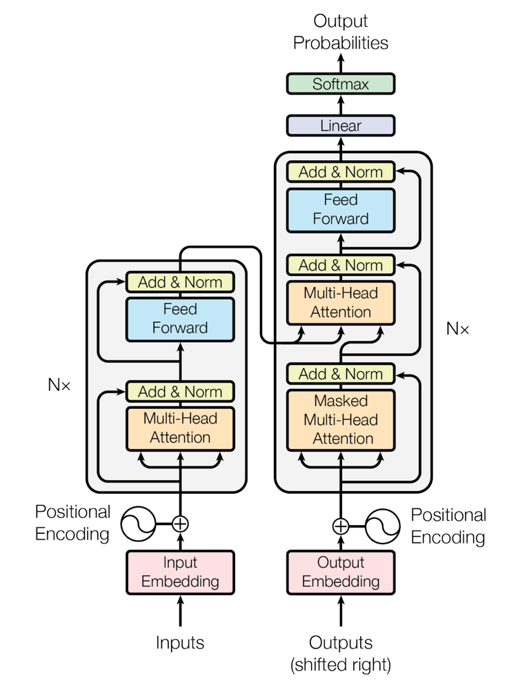

Tatsu 每年会翻阅所有新出的模型论文来准备这堂课。2025 年有 Qwen2、Gemma 3、InternLM2、Nemotron-4 等 **19 个新 dense 模型**；2026 年虽 dense 模型减少（Qwen3、Gemma 4、OLMo 3 等），但 **MoE 模型大量涌现**。

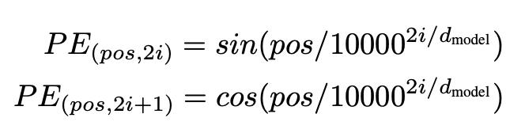


**本讲的三层结构**：

| 层次 | 内容 |
|------|------|
| **架构变体** | Norm 位置、非线性激活、位置编码等 |
| **超参数细节** | ff_dim、head 数量、词表大小、宽深比等 |
| **稳定性技巧** | z-loss、QK norm、logit soft-capping 等 |

> 为什么稳定性技巧和架构放在一讲？因为"这些稳定性技巧与架构变体之间存在紧密联系——它们最终都被 baked straight into the architecture。"

**架构的三重约束**：Tatsu 指出，架构设计本质上是三者的复杂权衡——**从数据中学习**（泛化）、**在 GPU 上高效训练**（系统效率）、**训练过程中不爆炸**（稳定性）。

> "这些不同的需求最终都被 baked straight into the architecture。这就是为什么架构的东西有点 messy、有点 complex。"

---

## 2. 历史脉络：从实验到收敛再到新探索

Tatsu 从历史视角梳理了架构研究的大阶段：

| 阶段 | 时期 | 特征 |
|------|------|------|
| **实验期** | Transformer ~ GPT-3 (2017-2020) | 大量实验，没有统一标准 |
| **收敛期** | Llama 2 (2023) 发布后 | "Wow, Llama 2 is great, I want my own Llama 2."——大家都开始训练 Llama 2-alike |
| **稳定性期** | 2024 | 架构修改转向使训练更稳定 |
| **长上下文期** | 2025-2026 | 架构变体聚焦于长上下文依赖 |


本讲涉及的模型家族：GPT-3, Chinchilla, PaLM, Llama 2/3/4, Qwen2/3/3.5, Gemma 2/3/4, OLMo 2/3, Cohere Command A, Falcon, Nemotron, T5, OPT

以下是课件中 Tatsu 整理的 14 个代表性模型的逐一详览（从左到右、从上到下按时间排列）：

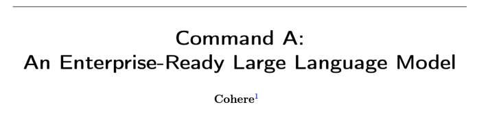


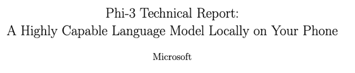


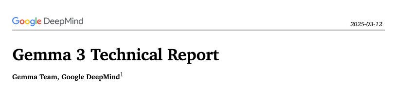
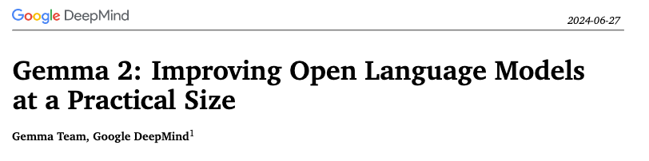
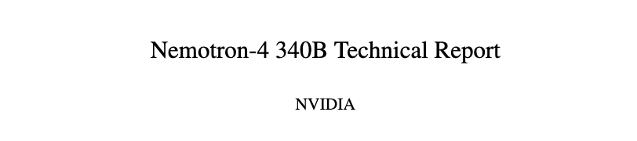


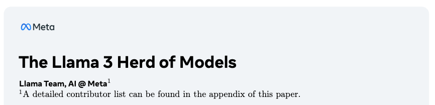


通过对全部模型的逐一对比，Tatsu 汇总出下面这张特征总表：


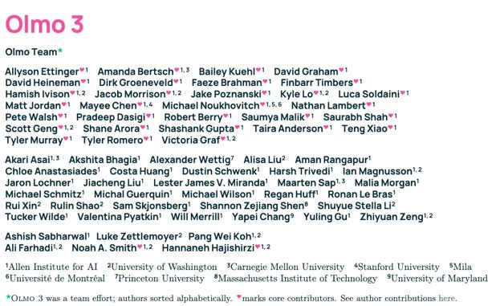

> Tatsu 会在讲完全部细节后回到这张表："蓝色 = RMSNorm，黑色 = LayerNorm——你看绝大多数现代模型都是 RMSNorm。并行层只有蓝色（PaLM, Cohere Command A），其余全部串行。GLU 一侧几乎全是 gated。这就是共识。"

---

## 3. LayerNorm：Postnorm vs Prenorm

### 3.1 基本概念

> Tatsu 说："我认为 Transformer 论文中大家公认唯一没做对的一件事——就是 LayerNorm 放在哪儿。"

**原始 Transformer（Postnorm）**——LayerNorm 在残差路径中：

```
x → Attention → Add(x) → LayerNorm → FFN → Add → LayerNorm → output
    （LayerNorm 在残差流内部，每次 Add 之后做 Norm）
```

**现代做法（Prenorm）**——LayerNorm 在残差流之外：

```
x → LayerNorm → Attention → Add(x) → LayerNorm → FFN → Add → output
    （残差流 x 从输入直通到最顶层，不含 LayerNorm）
```

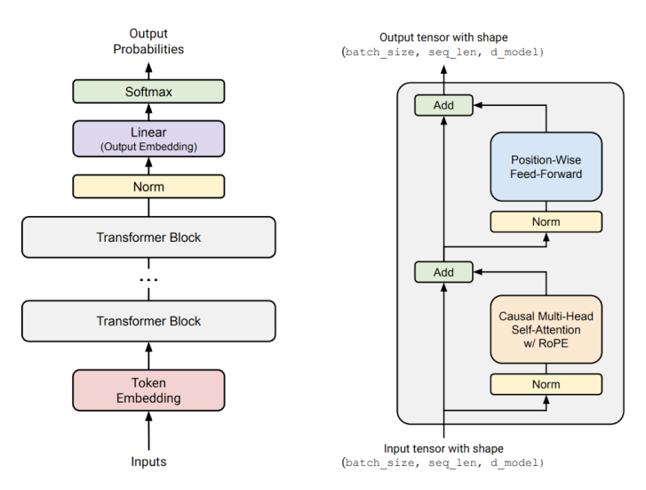

> "基本上所有现代语言模型都把 LayerNorm 移到了残差流之外。唯一的例外是 **OPT 350M**。"Tatsu 补刀："OPT 整体上就是一个 mess of a language model，OPT 350M 更是如此——我不知道为什么只有那个模型还在残差流里放 LayerNorm。"


### 3.2 为什么 Prenorm 更好

这项研究的**初始动机**非常实际——**能不能去掉 warmup？**

**背景补充**：在 postnorm 中，训练初期模型非常脆弱。残差流经过每层 LayerNorm 时梯度范数不断被缩放，各层梯度大小不一致。随机初始化的 γ 让某些层梯度过大，产生 **gradient spikes** 导致训练崩溃。Warmup（从极小学习率逐步增大到目标 LR）就是用来"缓冲"这个不稳定期的——但它需要调 warmup 步数、初始 LR 等额外超参数。所以很自然地，有人想：**能不能直接去掉 warmup？**

**Salazar & Nguyen 的早期研究**发现：
- 紫色虚线（postnorm + LayerNorm）——不做 warmup **直接不收敛**
- 蓝色实线（prenorm）——不做 warmup 也能**顺利收敛**


但人们很快发现好处远不止"去掉 warmup"。

**核心原则——"Keep your residual stream clean"（保持残差流干净）**：
- Prenorm 中，残差流 x 从第一层直通到最顶层输出，中间没有任何 LayerNorm 干扰
- 反向传播时梯度通过恒等映射**直通（straight through）**
- 蓝色（prenorm）在初始化时各层梯度大小保持一致；紫色虚线（postnorm）梯度不断衰减

这带来了三层次的好处：
1. **梯度传播稳定**——各层梯度范数一致，不衰减不放大
2. **支持更深网络**——postnorm 加深后梯度问题加剧，prenorm 天然可扩展
3. **减少全训练过程的 gradient spikes**——不仅限于训练初期


> Tatsu 强调："Stability 和 ability to go deep——这两者对现代大语言模型都极其重要。这就是为什么这个方案经久不衰。"

### 3.3 双 Norm 策略

既然残差流外放 LayerNorm 是好的，**放在计算前还是计算后**？

近年部分模型（**Grok、Gemma 2、OLMo 2**）将 LayerNorm 放在计算**之后**但仍然在残差流外：

```
双 Norm（Pre + Post，都在残差流外）：
x → LayerNorm → Attention → LayerNorm → Add → LayerNorm → FFN → LayerNorm → Add → output
```

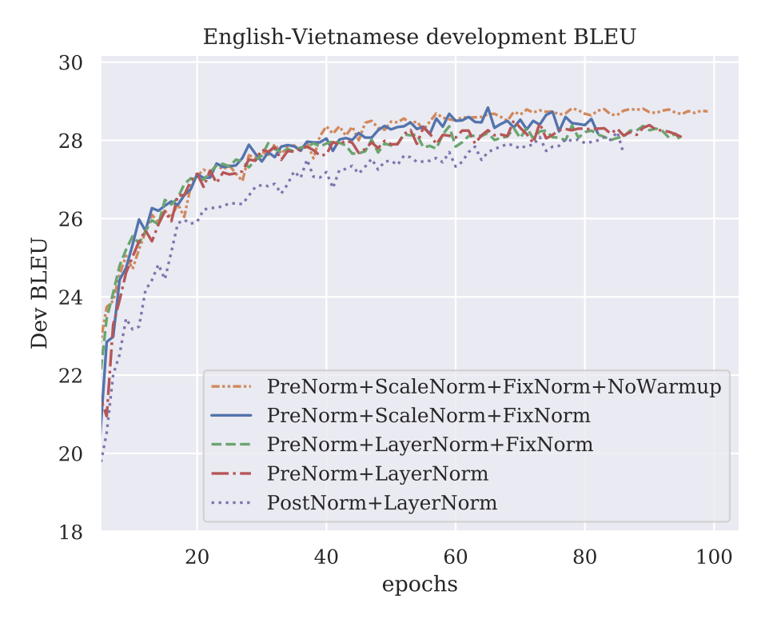


> "如果你有稳定性问题，你可以在各处撒 LayerNorm——这几乎是一个被反复验证为真的'荒谬'经验法则。虽然听起来很 ridiculous，但每次人们遇到稳定性问题，都发现'再扔一个 LayerNorm 进去就好了'。连 attention 里面扔 LayerNorm 也管用——这就是后面的 QK Norm。"


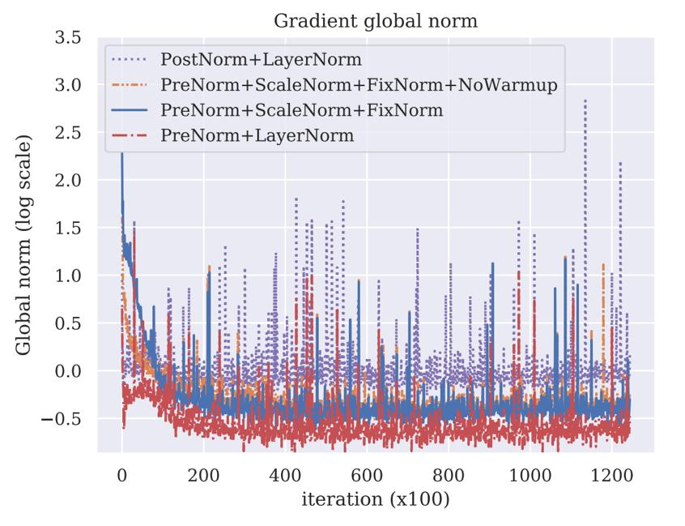

---

## 4. RMSNorm 与去 Bias

### 4.1 LayerNorm vs RMSNorm

**LayerNorm**（原始 Transformer）：
$$y = \gamma \cdot \frac{x - \mu}{\sigma} + \beta$$

去均值 → 除标准差 → 缩放 → 平移。三个步骤。

**RMSNorm**（现代模型，几乎全部使用）：
$$y = \gamma \cdot \frac{x}{\text{RMS}(x)}$$

**仅缩放**——去掉均值减法和 bias。两步变一步。

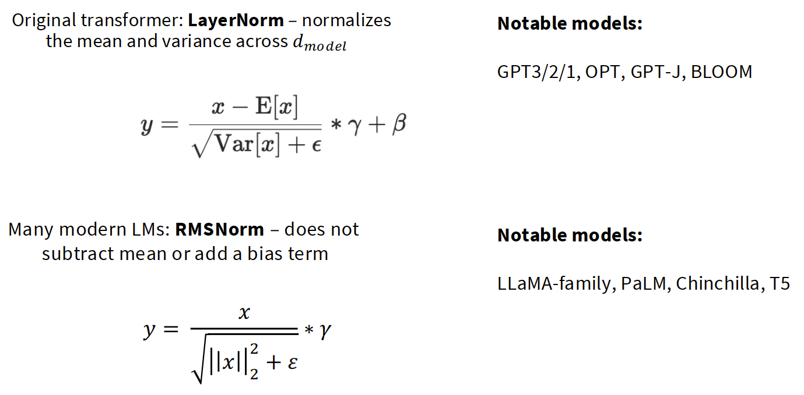

> "LayerNorm 表示能力更强（更 expressive），所以没有纯粹的表示论据支持必须用 RMSNorm。但实践中 RMSNorm 不仅**没有性能损失**，而且**更快**。"

### 4.2 为什么更快？算术强度的视角

这里就是**系统与架构协同设计**的关键案例：

- LayerNorm 的 FLOPs 仅占总计算量的 **0.17%**——看起来不值得优化
- 但在小模型上，它可以占 **~25% 的运行时间**（runtime ≠ FLOPs）

> Tatsu 用上一讲 Percy 的概念解释："FLOPs 只是浮点运算次数——矩阵乘法的成本。但 runtime 是更复杂的对象。LayerNorm 这类 statistical normalization 的算术强度（arithmetic intensity）极低——意味着大部分时间花在**数据搬运**而非计算上。GPU 在空转等数据从显存搬过来。"

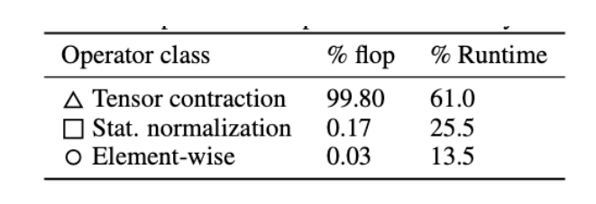

Tatsu 展示的图中：白色柱 = 算术强度（越低越 memory-bound），黑色柱 = FLOPs。LayerNorm 的白色柱极低。**即使只省掉均值减法和 bias 这两个微小操作，也显著减少了数据移动量。**

> Tensor contraction（矩阵乘法）的 workload 主要是真正的乘法计算；而 stat normalization 的 workload 主要是 memory movement——内存搬运很慢。如果搬运几乎占用了所有时间，即使 FLOPs 很小，runtime 也会很大。

### 4.3 实验验证

来自 **Narang et al. (2020)**（Google 的大规模架构比较论文，基于 T5 encoder-decoder 架构而非自回归 LM）：

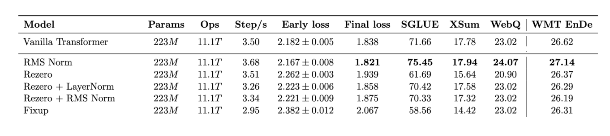

- 在 2 亿参数的 Transformer 上，切换到 RMSNorm 后 **steps/sec 增加**（第三列）
- 性能还**略有提升**——"a free systems win"

> Tatsu 补充说这种 FLOPs 很低但 runtime 很高的情况在小模型上尤其极端——"在大模型上矩阵乘法占主导所以比例没那么夸张，但这张图让你理解**为什么这是一个免费优化**。"

### 4.4 去 Bias：一个更普遍的原则

Tatsu 将 RMSNorm 的成功放到一个更大的图景中：

> **"Transformers 和神经网络中的 bias 项基本上没什么用。"**

原始 Transformer 的所有线性层都带 bias。现代实现中：
- 线性层的 bias 几乎全部被移除
- RMSNorm 的 bias 也被移除
- 理由相同：**低算术强度 + 内存密集 → 免费系统优化**
- 部分情况下 bias 甚至可能**诱发稳定性问题**

> "我们无法事先推理出'去掉 bias 没问题'——这是大量实验和集体经验积累的结果。但典型语言模型训练中，去掉线性层和 RMSNorm 的 bias 是安全的。"

---

## 5. 激活函数：从 ReLU 到 Gated Linear Units

### 5.1 常用的激活函数

Tatsu 列出了一长串名字：ReLU, GeLU, Swish, ELU, GeGLU, SeLU, SwiGLU, LiGLU...

> "曾几何时，我以'永远不知道什么是 SwiGLU'为荣。但现在，理解这些东西的哪些部分对性能真正重要，变得很必要。"

标准 ReLU 前馈层：

```
FFN_ReLU(x) = ReLU(x · W₁) · W₂
```


> GeLU（Gaussian Error Linear Unit）和 ReLU 的唯一本质区别是：GeLU 在零点附近有一个**小凹槽（divot）**。"对大部分激活值没影响，但改变了零点附近的梯度行为。这让你能训练出 GPT-3 级别的模型。"

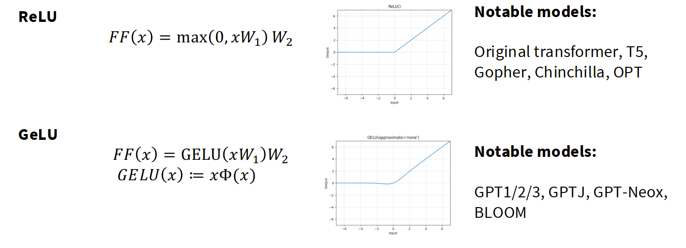

（课件中 ReLU 和 GeLU 的函数对比图——GeLU 在零点附近有一个小凹槽，对大部分激活值没影响但改变了零点附近的梯度行为。）

### 5.3 Gated activations (*GLU)

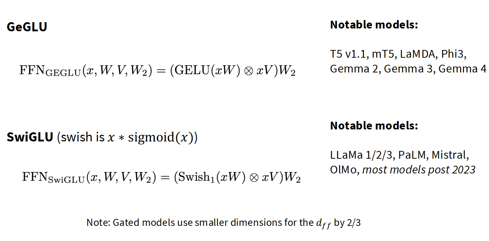

核心直觉来自架构设计的一个常用箴言：**"Gating is often very helpful."**

从标准 ReLU FFN 出发，加入一个**门控矩阵 V**：

```
FFN_ReGLU(x) = (ReLU(x · W₁) ⊙ (x · V)) · W₂
```

- W₁ 输出经 ReLU 后的激活值（"内容"）
- V 输出是一个**门控信号**，entrywise 乘到 ReLU 输出上（"要不要通过"）
- 命名规则：`激活函数名 + GLU` → ReGLU, GeGLU, SwiGLU
- **SwiGLU** = (Swish(x·W₁)) ⊙ (x·V)，其中 Swish(x) = x·σ(x)


> Tatsu 解释命名："ReLU + gated = ReGLU。GeLU + gated = GeGLU。 Swish + GLU = SwiGLU, 其中 Swish = x·sigmoid(x)——'squish times the rest of it.'"

**家族偏好**：
- **Google 系**（Gemma、T5）→ GeGLU
- **Llama 系**（PaLM 及所有 Llama 衍生）→ SwiGLU
- "SwiGLU 目前更占主导，但在 gated units 之间，其实选哪个差别不大"

### 5.4 参数匹配的 2/3 修正

GLU 引入了**三个矩阵**（W₁, V, W₂）而非原来的两个（W₁, W₂）。为保证总参数量相同，需要将 ff_dim 缩小：

$$\text{ff\_dim}_{\text{GLU}} = \frac{2}{3} \times \text{ff\_dim}_{\text{non-GLU}}$$

> 这是 **Noam Shazeer** 原始论文的设计。Tatsu 特别称赞其实验标准："Shazeer 的论文做了 error bar 评估——训练了多个 replicate 来检查结果一致性——这在当时非常罕见。"

**实验结果**（Shazeer 原论文；Narang et al., 2020）：
- GLU 变体在参数匹配比较下**几乎总是优于**非 GLU 变体
- 增益**一致但不大**（small but consistent deltas）

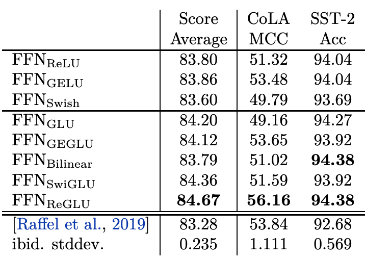


> "几乎所有现代可信的语言模型都使用某种 GLU。例外是 GPT-3（GeLU, 非 GLU）和 **Nemotron 340B** 用了 Squared ReLU——一个疯狂的选择，但也能用。如果你扫一遍现代模型，基本找不到不用 gated linear unit 的。"

---

## 6. 并行层 vs 串行层

### 6.1 想法

正常 Transformer block 是**串行**的：先算 Attention，再算 MLP。

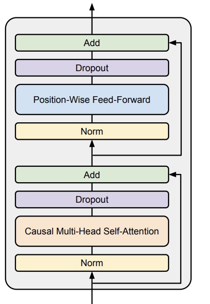

**并行化思路**（来自 **GPT-J**，后被 **PaLM, GPT-NeoX** 也采用）：

```
串行：x → Attention → Add → MLP → Add → output
并行：x → Attention ↘
                    → Add → output（各自独立计算后加回残差流）
      x → MLP       ↗
```

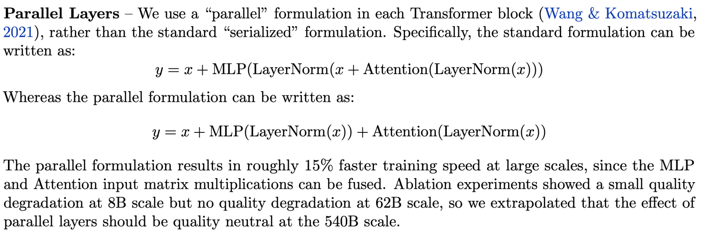

系统动机：
- 串行有瓶颈——必须等 attention 算完才能做 MLP
- 并行可以**融合 LayerNorm**、**融合矩阵乘法**（fuse matmuls）
- PaLM 论文声称：**无性能损失 + 15% 系统利用率提升**

> Tatsu 补充背景："GPT-J 是一个开源尝试复制 GPT-3 的项目——但它在传播各种架构思想方面的影响力惊人。PaLM 和 Google 也用了，Google 在架构方面其实出人意料地大胆。"

### 6.2 为什么过时了

> "这个想法在过去两年已经**真的不流行了**（has really fallen out of popularity）。"

原因：
1. **串行形式的系统优化已经足够好**，并行的优势不再明显
2. **并行相当于损失了一半深度**——同一层内 attention 和 MLP 信息不再级联，对表示能力造成 subtle 损害
3. Google 后续模型（Gemma 等）已逐渐**放弃并行层**——"这是一个隐式信号"
4. **没有人做过严格的受控消融**来量化并行 vs 串行的性能差距

> "如果你只读 PaLM 论文，他们说没有性能损失+15% 利用率提升，你会觉得很好。但后来 Google 模型不再用了——你能读懂这个信号。"

> **结果**：课件对比表显示，仅 **PaLM 和 Cohere Command A**（由前 Transformer 作者创立）使用了并行层，其他全部串行。

## 总结：架构设计

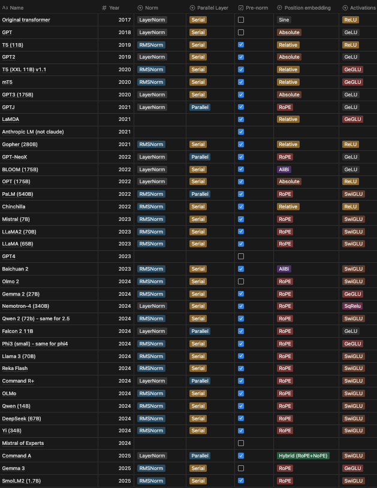


#### 1. Pre-vs-post norm

- 除了 OPT350M 之外，所有模型都采用非残差归一化（non-residual norm ），这很可能是有充分理由的。

#### 2. Layer vs RMSnorm

- RMSnorm 在计算方面明显更胜一筹，

有时甚至在性能方面也更胜一筹。

#### 3. 门控 Gating 

- GLU 门控现在已成为共识。

#### 4. 串行层与并行层：

- 大多数模型现在都使用串行层。

---

## 7. 位置编码：从 Sine/Cosine 到 RoPE

### 7.1 为什么需要位置编码

Attention 本身是**位置无关**的，它只是内积操作，打乱顺序结果不变。位置编码是 Transformer 获取顺序信息的唯一途径。


### 7.2 三种经典方案

| 方案 | 代表 | 做法 | 缺陷 |
|------|------|------|------|
| **Sine/Cosine** | 原始 Transformer | Fourier 直觉：正余弦中可恢复绝对位置；直接加到词嵌入上 | 存在**交叉项**，不是纯相对的——内积包含绝对位置信息 |
| **绝对位置嵌入** | GPT-3, Llama 早期 | 每个位置一个独立可学习的嵌入向量 | 显然是绝对的，无法泛化到训练时没见过的位置 |
| **相对位置嵌入** | T5, Chinchilla | 不嵌入词向量，而是**直接加到注意力矩阵**上（按距离 offset） | 虽是相对的，但**没有内积结构**——不能因子分解为 f(x_i)·f(y_j) |

> Tatsu 解释相对嵌入为什么没有内积结构："你直接在 attention matrix 上加 offset，但它不能写成 f(x_i) 和 f(y_j) 的内积形式。这其实是个 aesthetic 问题——但如果你的约束是'既要相对，又要保持内积结构'，那这条路走不通。"

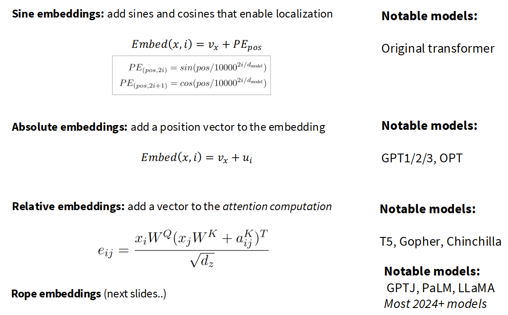


### 7.3 RoPE：旋转位置编码

> "RoPE 某种程度上是横空出世的（came out of nowhere），来自中国作者苏剑林一篇不太知名的博文+论文组合，最早由 GPT-J 推广。但现在，**2024 年后几乎全部模型都用 RoPE**。"

**设计约束**（RoPE 试图满足的数学性质）：

$$\langle f(x, i), f(y, j) \rangle = g(x, y, i - j)$$

即两个嵌入的内积**只依赖于相对位置差 i-j**，不依赖绝对位置 i 和 j。所有之前的方案都不严格满足这个等式。


**2D 几何直觉**（Tatsu 用了一个非常直观的例子）：

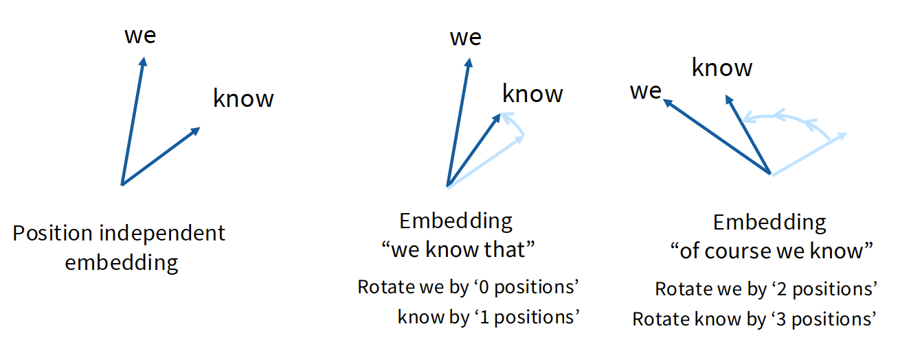

> 序列 "We know that."：
> - "We" 在位置 0 → 不旋转（保持原位）
> - "know" 在位置 1 → 旋转 θ
> - "that" 在位置 2 → 旋转 2θ
>
> 序列 "Of course we know."：
> - "Of" 位置 0, "course" 位置 1, "we" 位置 2, "know" 位置 3
> - "we"（旋转 2θ）和 "know"（旋转 3θ）的**相对角度差仍是 1·θ**

"为什么行得通？因为任意旋转下内积不变。我只用旋转量来编码位置。"

有很多种旋转方式，你会选择哪一种？


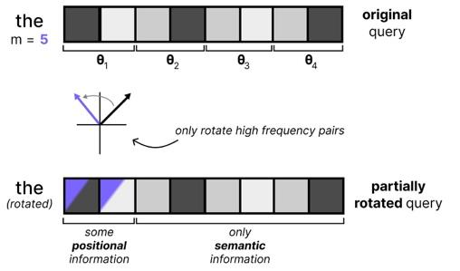

**高维扩展**：2D 只有顺时针/逆时针两种旋转；D 维中有无穷多种。RoPE 的做法是：

- 将 D 维向量**拆成 D/2 对**
- **每一对独立做 2D 旋转**——"最简单的方案，但它就是 work"
- 不同对的旋转频率（θ）不同：**低频** → 旋转慢 → 捕获长程依赖；**高频** → 旋转快 → 捕获局部邻接关系

> "RoPE 的论文用复数给出非常复杂的推导——但直觉上就是：归结为二维旋转的重复，旋转每一对坐标。一旦你接受了这个几何直觉，它就非常直观。"

**实际实现**：
- 用**乘法**（旋转矩阵 × 向量）而非加法（sine 嵌入 + 词嵌入）
- 乘法不产生交叉项 → 保证了**纯相对性**
- 在**每次 attention 计算前**对 Q 和 K 做旋转（不旋转 V）
- 实践中用稀疏的 sin/cos 乘法实现，或直接用旋转矩阵

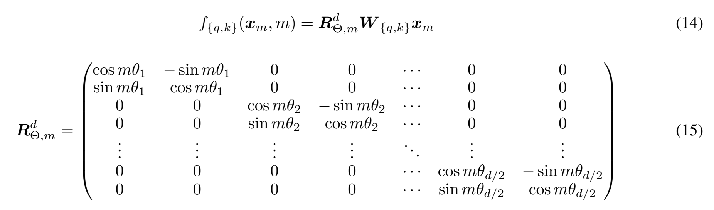

> 被问到"有没有人试过高维旋转而非 2D 旋转对"时，Tatsu 回答："我没见过。任何 2D 旋转在子空间就只是这个的变体。你可以选择任何 closed-loop manifold 来做，但我还没看到有人做。"

### 7.4 P-RoPE（Gemma 4, 2026 年 5 月 29 日发布）

**P-RoPE（proportional RoPE）**：只旋转**前两个坐标**，其余保持不变。

> "理由是低频部分旋转量很小——在小模型中 hidden dim 有限，可以省略以节省计算。本质上是一个针对 tiny models 的优化。"

---

## 8. 超参数全景

你可能在 224n 中遇到过以下关于 Transformer 超参数的问题……

- 前馈层大小应该比隐藏层大小大多少？
- 应该设置多少个头节点？num_heads 是否总是能整除隐藏层大小？
- 词汇表大小应该是多少？

以及其他模型设置问题
- 人们会对这些庞大的语言模型进行正则化吗？
- 人们如何扩展这些模型？深度要非常深还是宽度要非常宽？

> "超参数是你一旦真的要训练模型就开始面对的东西。当你的认知停留在抽象层面时你不用关心这些。但一旦要实例化，'ff_dim 应该是多少？多少个 head？vocab 多大？要不要正则化？'你会发现这是一个极其高维的搜索空间。但好消息是，人们实际尝试的空间其实**非常小**。"


### 8.1 Feedforward Ratio


有两个相关维度，feedforward dim $d_{ff}$ 和 model dim $d_{model}$，他们之间的关系是什么？通常有 $d_{model}$ = 4 $d_{model}$ ，但也有一些例外，例如使用了 GLU 变体。这意味着大多数 GLU 变体 $d_{model} = 4 × 2/3 = (8/3) d_{model}$ 

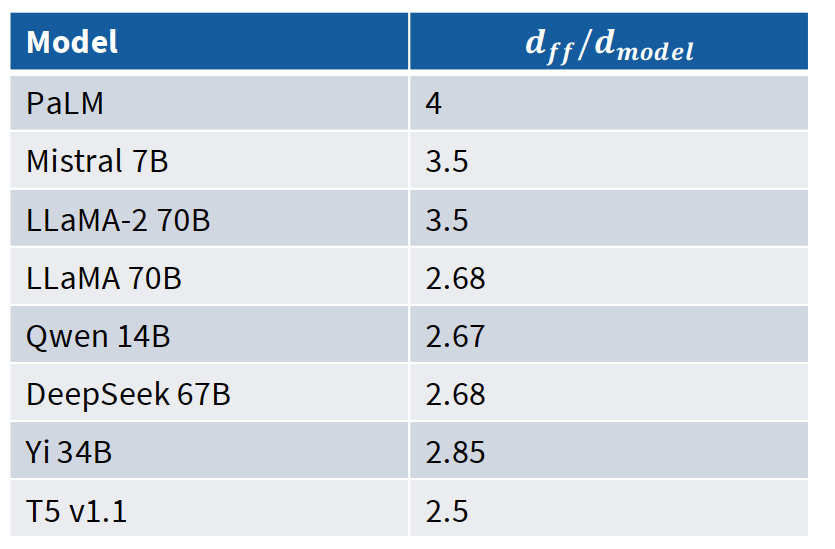

**经验法则**：

| 模型类型 | Ratio | 推导 |
|----------|-------|------|
| 非 GLU（原始 Transformer, GPT-3） | **4x** | 经典默认 |
| GLU（含 2/3 参数修正） | **~2.67x** | 4 × 2/3 = 8/3 |
| Llama 2+（GLU + MQA） | **~3.5x** | 2.67 × 1.33 |


> 关于 Llama 2 的 1.33 额外因子："Llama 2 的人说——因为我们用了 MQA，attention heads 非常高效，所以可以把 MLP 做得更大一点。于是乘了一个相当任意的 1.33。这让你得到约 3.5 的比值，略微更强调 MLP。"

正如我们已经（并将继续）看到的，大多数语言模型都具有平庸且保守的超参数。T5 [Raffel et al 2020] 是一个例外，它有一些非常大胆的设置。对于 11B 的模型，他们在 v1 版本中设置如下：

- $d_{𝑓𝑓}$ = 65,536
- $d_{𝑚𝑜𝑑𝑒𝑙}$ = 1024

高达惊人的 64 倍。作者在文章中解释他们特意选择扩大 $d_{ff}$，因为现代加速器（例如我们训练模型所用的 TPU）在处理大型稠密矩阵乘法时效率最高）。而在T5 v1.1（改进版）中改回标准 **2.5x**。虽然没有明确说明为什么，但你显然能读懂这个信号。

其他的例外，Gemma 2 (8x), SmolLM/Gemma 3/Gemma 4 (4x, GLU)。

#### 为什么选择这个乘数范围？

经验表明，在 1 到 10 之间存在一个区间，在这个区间内，该超参数接近最优。

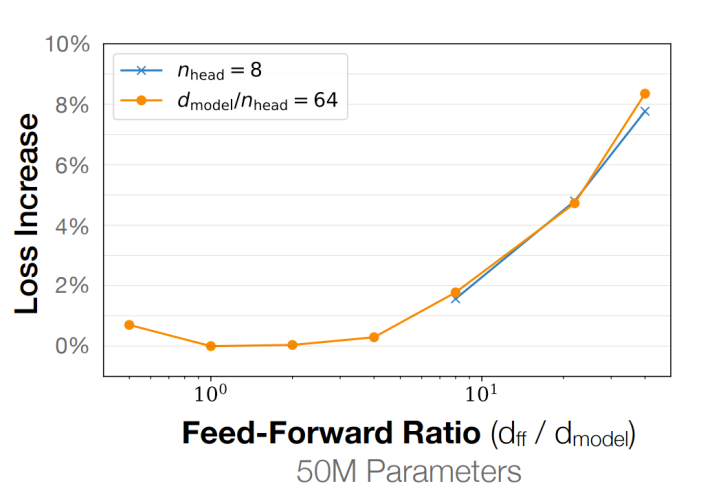

**Kaplan et al. (2020) Scaling Laws 论文的实验**表明：
- ratio ≈ 1 到 10 之间，loss 曲线**非常平坦**，存在一个宽容的 basin
- ratio > 10 后，loss **二次方急剧上升**
- 2.6 ~ 4 之间的任何选择都落在这个安全 basin 内

> "默认选择 4x / 2.67x / 3.5x 都没问题。即使像 T5 v1 那样的极端选择也能训练出好模型，但它大概是 compute-inefficient 的。"

### 8.2 Head Dimension Ratio

**头维度 (head-dim) × 头数量 (num-heads) 与模型维度 (model-dim) 的比率。**

> #### **多头自注意力在计算上是高效的**
>
> *   即使我们计算了 $h$ 个注意力头，其成本并没有真正增加多少。
>     *   我们首先计算 $XQ \in \mathbb{R}^{n \times d}$，然后将其重塑 (reshape) 为 $\mathbb{R}^{n \times h \times d/h}$。（对 $XK$ 和 $XV$ 也进行同样的操作。）
>     *   然后我们将其转置 (transpose) 为 $\mathbb{R}^{h \times n \times d/h}$；此时，“头”这个轴就像一个“批次 (batch)”轴。
>     *   几乎所有其他操作都是相同的，并且矩阵的尺寸也保持不变。

**这并不一定是必须的：我们可以让 <span style="background-color: yellow;">头维度 > （模型维度 / 头数量）</span>。** 但是，大多数模型确实遵循这一准则。

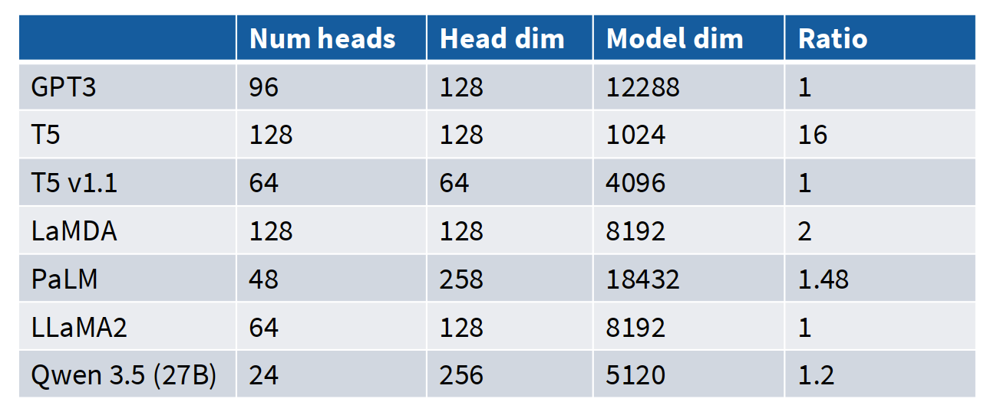

大部分模型的 head dimension ratio 接近于 1。**例外**：T5 和 Lambda（均为 Google 模型）偏离。

### 8.3 Aspect Ratio（宽深比）

我的模型应该做深还是宽？应该多深多宽？

大多数模型在这方面也出奇地一致！

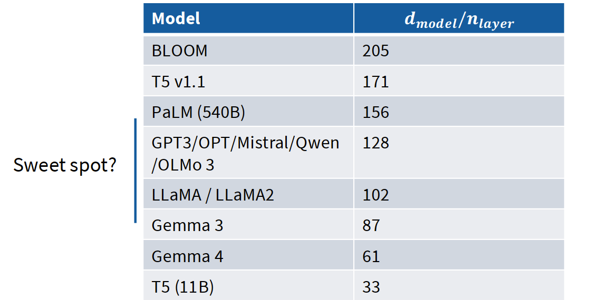

**经验法则**：**约 100**，每层对应约 100 维的宽度。

> "GPT-3 如此，Llama 如此，几乎所有模型如此。当你 scale 模型时，通常固定 aspect ratio，然后让模型整体变大。所以 aspect ratio 从某种意义上**控制了整个 depth-to-width tradeoff**。"

#### 关于宽高比（aspect ratio）的考量

极深的模型更难并行化，并且具有更高的延迟

> **深度与宽度的局限性** 我们注意到我们的建议存在一个明显的局限性。扩展深度有一个明显的限制因素，即它们无法在不同的机器或设备上进行并行化，并且每一次计算都必须等待前一层的完成。这与宽度不同，宽度可以轻松地在上千甚至数十万台设备上进行并行化。在扩展的限制范围内。[Tay et al 2021]


#### 关于宽高比（aspect ratio）缩放的证据 

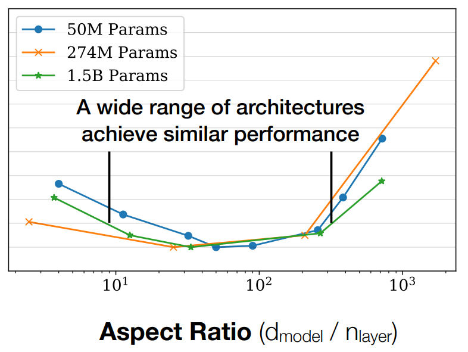

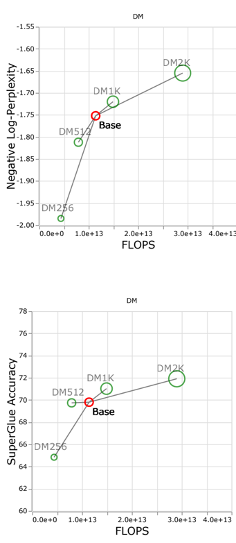


**Kaplan 和 EK et al. 的实验**：在很宽的 depth/width 范围内做 sweep，**真正决定性能的是 FLOPs**。相同 FLOPs 下，宽深比影响不大。存在一个**宽容的 band**，ratio ≈ 100 附近任选都差不多


> "真正重要的不是 ratio 本身，而是选了合适的 ratio 之后，你唯一需要担心的是**系统利用率**，而不是表示能力。表示能力的差异在这些对比中几乎不存在。"

### 8.4 词表大小

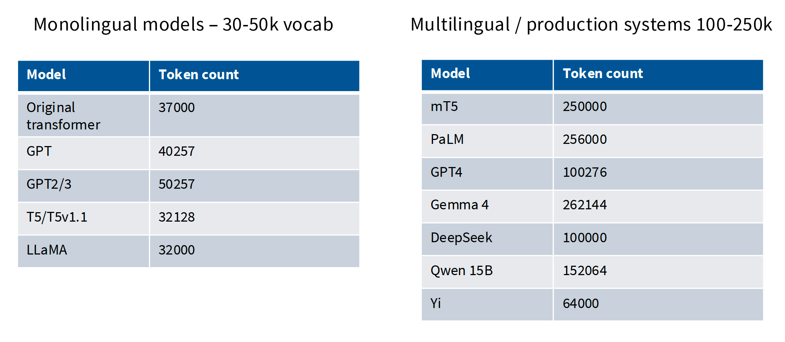

| 模型类型 | 范围 | 代表 |
|----------|------|------|
| 单语（英语） | ~30K-50K | GPT-3 早期开源模型 |
| 多语/生产 | **100K ~ 250K** | GPT-4, Llama 系, 所有现代大模型 |

> "没有人再训练大型单语模型了——post-Llama 时代，几乎所有大模型都是多语的。"

- Llama 衍生模型统一约 **100K tokens**
- Google 模型（Gemma 等）通常**更大**
- 有 scaling law 研究：模型越大，能有效处理的词表越大
- 多模态模型（含图像 tokenizer）词表更大，通常有独立的 image tokenizer，词表本身就很庞大

---

## 9. Dropout 和其他正则化

### 9.1 在预训练期间，我们需要正则化吗？

反对意见：
- 数据量巨大（数万亿个词元），远超参数数量。
- SGD 仅对语料库进行一次遍历（难以记忆）。

这些论点都很有道理，但实际应用中人们是怎么做的呢？

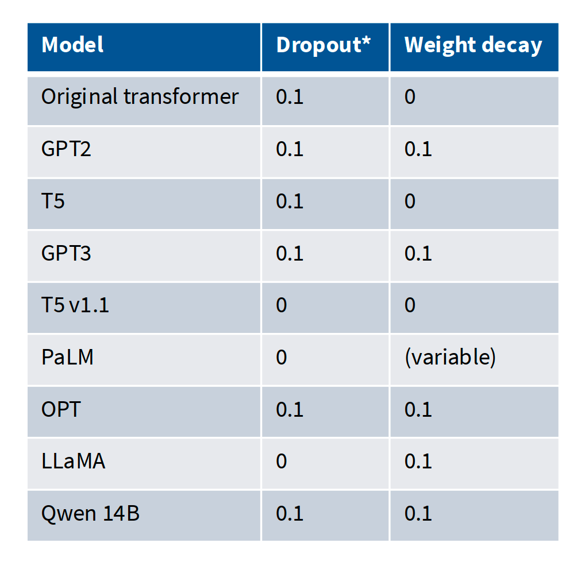

许多老模型在预训练期间使用了 dropout，新模型（Qwen 除外）仅依赖于权重衰减

大多数情况下，论文根本不讨论dropout。对于开源模型而言，这基本上等同于不进行 dropout 处理。但对于闭源模型而言，情况可能并非如此。


### 9.2 在 LLMs 中为什么需要 Weight Decay？ 

但令人困惑的是，**Weight Decay 在现代 LLM 训练中仍然非常流行**。如果不过拟合，为什么还要用？

[Andriushchenko et al 2023] 对 LLM 权重衰减有有趣的观察结果：

**1. 这不是为了控制过拟合**


不同 weight decay 设置下，train 和 val 落在 x=y 线上，**验证了没有 overfitting**，weight decay 没有起正则化作用

**2. 权重衰减与学习率（余弦函数调度）相互作用**


**Weight Decay + Learning Rate Decay 的交互**：
   - 恒定 LR → weight decay 效果不明显
   - **LR 衰减** + 更强 weight decay → 虽然起步慢（虚线），但最终收敛到**显著更好的最小值**

**结论**：Weight decay 实际上是一个**优化干预**，它可能与 LR schedule 配合，允许使用更高的学习率或更快地衰减。

> "你可能会在实验中自己发现这个现象，weight decay 竟然是个优化干预而非正则化干预。这就是为什么设计这门课让你亲手去试——因为有些东西靠理论推理不出来。"

**Dropout 的衰落**：Dropout 在 LLM 训练中已基本被弃用，因为它"与优化的交互不好"。

---

## 总结：hyperparameters


#### 前馈

- 4 倍经验法则（GLU 为 8/3）是标准做法（有一定证据支持）

#### Head dim

• `head 维度 * head 数量 = 模型维度D` 是标准做法，但验证较少或没有验证

#### Aspect ratio

• “良好”值范围很广（100-200），系统层面的考量决定了具体取值。

#### 正则化

- 你仍然需要对大语言模型 (LMs) 进行“正则化”，但其效果主要体现在优化动态 (optimization dynamics) 上。

---

## 10. 稳定性技巧

> "如果模型训到一半突然爆炸，training loss 本来在下降，然后突然一个大 spike，你花了数百万美元，结果模型无法继续训练了。这是最糟糕的事情。"

最新，大量研究关注模型的稳定性训练：


不要训练模型像蓝色曲线那样震荡！


**从哪里找问题？** 两个 softmax 位置是"危区"：
1. **输出端 softmax**（计算 log probability 时，log normalizer 可能爆炸）
2. **Attention 中的 softmax**（Q·K 值过大/过小 → softmax 退化 → 梯度消失/爆炸）


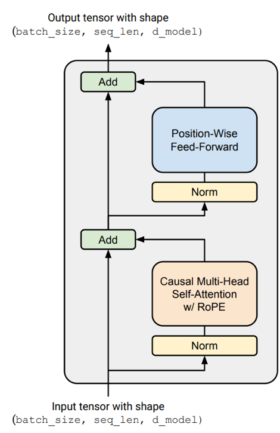

> Softmax 函数——由于指数运算/除以零运算，可能会出现异常行为。

### 10.1 输出 softmax 稳定性 Z-loss

回顾 softmax 计算：


PaLM 使用了 `z loss` 技巧，这是有用的对于训练稳定性。


其他案例：Baichuan 2 (2023), DCLM (2024), OLMo 2 (2025), OLMo 3 (2025)


### 10.2 Attention softmax 稳定性 QK Norm

**问题定位**：Attention 中 Q 和 K 相乘后进 softmax。如果 Q·K 值过大 → softmax 退化为 near-one-hot → 梯度消失/爆炸。

**QK Norm 方案**：

```
标准：x → Pre-LN → QKV投影 → Q·K → Softmax → ×V → Output
QK Norm：x → Pre-LN → QKV投影 → [LN(Q), LN(K)] → Q·K → Softmax → ×V → Output
```

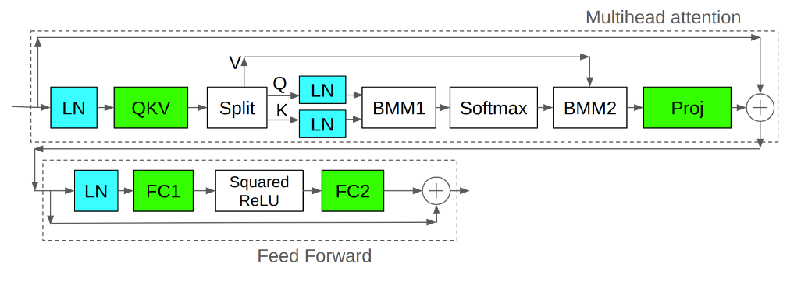
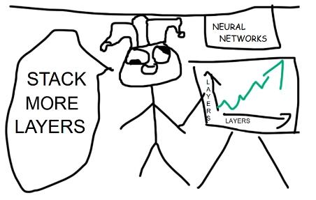

- Q 和 K 的尺度**始终约为 1**（被 RMSNorm 归一化）
- softmax 输入 Q·K 不会过大或过小
- 设计哲学："Just throw a LayerNorm in there."

> **来源**：最初来自**多模态模型**（Idefics, Chameleon），做多模态的人最早发现 QK Norm 有效，然后纯语言模型社区意识到同样的技巧完全适用。现在**非常标准**——大多数大模型都使用。训练中几乎不影响性能，但确实能防止 attention 退化。

> Tatsu 总结 LayerNorm 演进路线："最初在 prenorm → 然后加到每个 block 的非线性之后 → 现在连 Q 和 K 里都加了。这就是现代架构中 LayerNorm 不断扩散的故事。"

### 10.3 Logit Soft-Capping

**方案**：在 attention logits 进入 softmax 前用 **tanh** 做软截断：

$$\text{logits}_{\text{capped}} = \text{soft\_cap} \cdot \tanh(\text{logits} / \text{soft\_cap})$$

> **Logit 软截断** 我们（Bello et al., 2016）对每个注意力层和最终层的 logits 进行截断 ，使得 logits 的值保持在 −soft_cap 和 +soft_cap 之间。更具体地说，我们使用以下函数对 logits 进行截断：logits ← soft_cap × tanh(logits/soft_cap)。我们将自注意力层的 soft_cap 参数设置为 50.0，将最终层的 soft_cap 参数设置为 30.0。

- 比 QK Norm **更强**的干预——"harder intervention"
- 由 **Gemma 2/3/4** 专属使用——属于 Google 特有技巧
- **优势**：绝对保证 attention logits 不会爆炸
- **劣势**：**牺牲表达能力**——模型永远无法表达超过某个阈值的确信信号

防止 logits 爆炸，但也可能带来性能问题？


---

## 11. 注意力头（Attention heads）

大多数模型几乎不会对注意力头做太多改动，仅有少数例外。
- GQA / MQA：通过减少注意力头的数量来节省推理成本
- 稀疏或滑动窗口注意力机制（Sparse or sliding window attention，如 GPT-4 / Mistral）：限制注意力模式以降低计算开销
- 奇特的 SSM 相关技术（Exotic SSM stuff，如 Jamba、Falcon 3、Qwen 3.5 等）：留待下一讲讲解！

### 11.1 MQA/GQA：降低注意力头成本

#### 1. 让我们思考一下注意力机制所涉及的计算


> 图中展示了标准多头注意力（Multi-Head Attention）的计算过程：
> - 输入 $X$ 分别投影为 Query ($XQ$)、Key ($K^\top X^\top$)、Value ($XV$)
> - 计算注意力分数：$XQ K^\top X^\top \in \mathbb{R}^{3 \times n \times n}$ （三组所有配对的注意力得分！）
> - 经过 softmax 后与 Value 相乘，再经投影层 $P$ 混合，最终输出 $\in \mathbb{R}^{n \times d}$
>
> 变量含义：
> - $d =$ 隐藏层维度 (hidden dim)  
> - $b =$ 批次大小 (batch)  
> - $n =$ 序列长度 (<d)  
> - $h =$ 注意力头数 (heads)  
> - $k =$ 头维度 = $d/h$ (head dim)

- **总算术运算量**：$(bnd^2)$  
- **总内存访问量**：$(bnd + bhn^2 + d^2)$ (注：分别对应图中的 “X”、“softmax”、“projection” 三个阶段)*

**算术强度（计算/内存比）** 很高，约为：

$$
O\left( \left( \frac{1}{k} + \frac{1}{bn} \right)^{-1} \right)
$$

这意味着我们可以让 GPU 保持高效运行（不会被内存带宽瓶颈拖累）。

#### 2. 问题的根源：KV Cache 与推理阶段算术强度的退化

> "到此为止我们都在讨论训练，当我们推理阶段生成文本时，增量情况（incremental case）又如何呢？现在切换视角，你训好了一个大模型，要给大量用户服务。你要为两种资源付费：FLOPs 和内存访问。"


- **训练/Prefill 时（batch processing，整个序列并行）**：算术强度好。类似矩阵乘法，compute-bound。

- **推理/Decode 时（无法并行化生成，只能逐 token 生成，必须串行）**：算术强度急剧恶化

$$\text{Arithmetic Intensity}_{\text{decode}} \propto \frac{n}{d} + \frac{1}{b}$$

在这种情况下，我们需要通过 **“KV 缓存”（KV cache）** 来增量式地重新计算/更新注意力机制。即在推理（自回归生成）时，我们维护 **KV Cache**（缓存所有历史 token 的 Key 和 Value），每步只算新的 Q·K 交互。


动画来源：https://medium.com/@joaolages/kv-caching-explained-276520203249

实际上，在第一步时，“With Cache” 和 “Without Cache” 的计算**完全相同**，因为还没有历史可缓存；但从第二步开始，差异显现：新 token 只需与自身及之前所有 token 的 KV 做注意力，而无需重复计算旧 token 之间的注意力。

**KV Cache 的作用**：
  - 避免重复计算：每个新生成的 token 只需要计算自己的 Q，并与之前所有 token 的 K、V 做注意力。之前的 K、V 已被缓存，无需重新投影和存储。
  - 显著减少计算量和内存带宽压力 —— 尤其是在长上下文生成时。

#### 3. 增量情况下的算术强度是多少？

> **总算术运算量**：$(bnd^2)$  
> **总内存访问量**：$(bn^2d + nd^2)$  
> *(注：分别对应图中的 “K,V” 和 “projection” 阶段)*

**算术强度并不理想**，约为：

$$
O\left( \left( \frac{n}{d} + \frac{1}{b} \right)^{-1} \right)
$$

这意味着我们需要：
- **大批次（large batches）**
- **短序列长度（short seq length, n）**
- 或者 **大模型维度（big model dimensions, d）**

才能维持较高的计算效率。

**有没有办法绕过这个问题呢？**

$\frac{n}{d}$ 这一项很难减小，因为 $n$（序列长度）和 $d$（隐藏层维度）通常是模型设计时固定的超参数，且在推理场景中往往无法随意调整。

 **延伸思考**：这也是为什么像 Mamba、Jamba 等基于 SSM 的模型受到关注——它们天生没有 KV cache，避免了这个内存瓶颈，更适合长序列推理。

📌 *下一讲将量化展示 GQA/MQA 如何具体压缩 KV cache 并改善这一瓶颈。*

#### 4. MQA（Multi-Query Attention）

**方案**：所有 attention heads **共享同一组 K 和 V**，只保留不同的 Q。

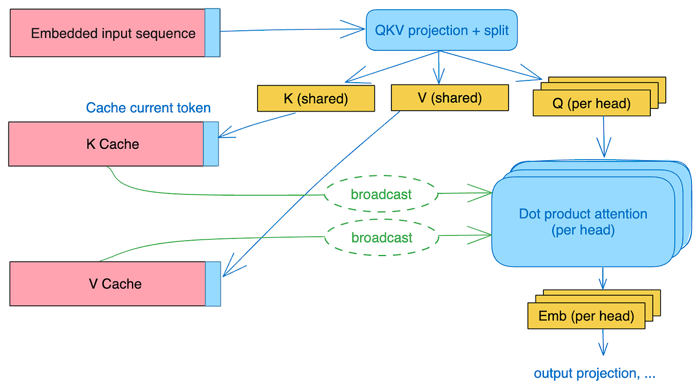

我们需要在内存中进出的数据项大大减少（即 **KV Cache**）。

- **总内存访问量**：$(bnd + bn^2k + nd^2)$  
- **算术强度**：$O\left( \left( \frac{1}{d} + \frac{n}{dh} + \frac{1}{b} \right)^{-1} \right)$

*(注：相比标准 MHA 的 $bn^2d$，这里变为 $bn^2k$，其中 $k = d/h$ 是头维度，远小于 $d$)*

总结：
- KV cache 缩小为原来的 **1/h**（h = head 数量）
- 显著减少内存访问 → 提高推理吞吐
- 代价：**表示能力显著损失**

#### 5. GQA（Grouped Query Attention）

**方案**：在 MHA 和 MQA 之间取折中，将 h 个 Q heads 分成 g 组，每组共享一套 K 和 V。


| 方案 | 推理成本 | 下游性能 |
|------|----------|----------|
| MHA（全多头，每头独立 K/V） | 高 | 最优 |
| MQA（所有头共享 K/V） | 低 | 显著下降 |
| **GQA（分组共享 K/V）** | 低 | **几乎与 MHA 持平** |

> "GQA 真正的妙处在于 tradeoff 非常有利。你只需要稍微减少 K/V head 数量（比如从 32 降到 8），就能保留大部分 gains，MHA 的绝大部分性能 + MQA 的绝大部分推理效率提升。这就是为什么今天几乎所有的模型都采用 GQA 结构。"


> Tatsu 提到 **DeepSeek V2 的 Multi-head Latent Attention (多头潜在注意力，MLA)** 是另一种不同的分解结构，是 DeepSeek 在 2024 年提出的一种新型注意力机制，通过引入“潜在空间投影”进一步压缩 KV cache，同时保持高表达能力。它不是简单地减少头数，而是对 K/V 进行低秩或隐式编码，属于更前沿的优化方向。

#### 6. MHA/GQA/MQA 在 KV Cache 上的具体差异与性能收益

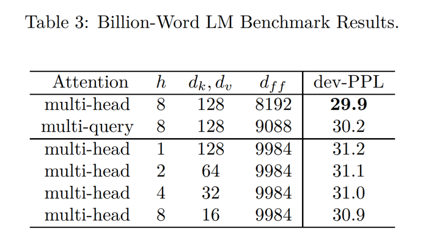
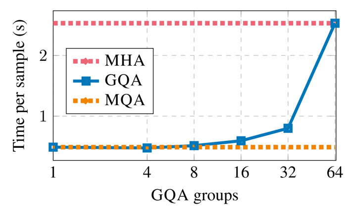


---

## 11.2 稀疏 / 滑动窗口注意力机制

关注整个上下文可能代价高昂（二次复杂度）。构建稀疏/结构化注意力机制，在表达能力与运行时开销之间进行权衡（如 GPT-3、GPT-OSS、Gemma4 等模型采用）。

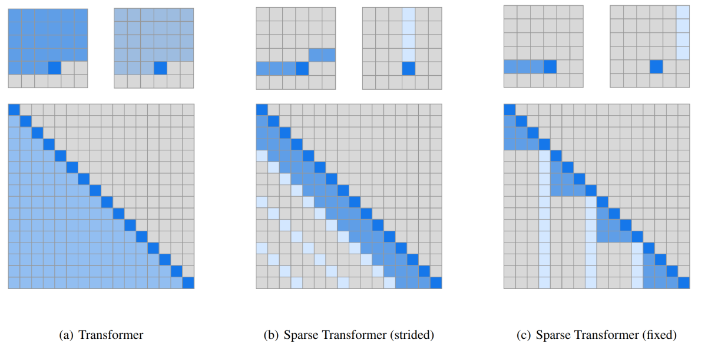

> - **(a) Transformer（标准全连接注意力）**
>   - 所有 token 对所有其他 token 计算注意力 → 注意力矩阵为下三角满阵（自回归掩码后）
>   - 计算复杂度：$O(n^2)$，内存占用高
>
> - **(b) Sparse Transformer (strided) —— 步长式稀疏注意力**
>   - 每个 token 只关注“局部邻近 + 固定步长跳跃”的位置
>   - 例如：当前 token 关注前几个邻居 + 每隔 k 个位置的一个远程 token
>   - 显著减少蓝色区域（实际计算量），但仍保留一定长程依赖能力
>
> - **(c) Sparse Transformer (fixed) —— 固定窗口稀疏注意力**
>   - 每个 token 只关注一个**固定大小的滑动窗口**内的历史 token（如最近 128 或 512 个）
>   - 超出窗口的历史完全忽略 → 注意力矩阵呈带状对角线
>   - 计算复杂度降至 $O(n \cdot w)$，其中 $w$ 是窗口大小，远小于 $n$

#### 当前标准技巧 —— 交错“全注意力”与“局部范围（LR）注意力”

> "这是一个**非常古老**的想法，GPT-3 论文里就写了：在全注意力和局部注意力（banded/local attention，只看到固定窗口内的 token）之间交替。OpenAI 有一些关于不同 attention 模式的早期工作。"

**Cohere Command A** 是 Tatsu 看到的第一个在现代开源模型中复兴此想法的：


```
每 4 层一个 block：
  Layer 1-3: Sliding window attention（局部）
  Layer 4:   Full attention（全局）
→ 随着层数递进，局部信息逐步聚合为全局信息
```
长程信息通过 `NoPE`，短程信息通过 `RoPE + SWA`：
- NoPE = No Positional Embedding（无位置编码）→ 用于全注意力层，依赖模型自身学习长距离依赖
- RoPE = Rotary Positional Embedding（旋转位置编码）→ 用于局部注意力层，提供精确的相对位置信号
- SWA = Sliding Window Attention（滑动窗口注意力）→ 限制每个 token 只关注局部邻域

→ 这种设计让模型在局部细节上靠 RoPE+SWA 精准建模，在全局语义上靠稀疏分布的全注意力层捕捉长程依赖

其他模型也采用类似策略：LLaMA 4、Gemma 3、Gemma 4 和 OLMo 3，它们均采用 SWA+Full RoPE 的混合架构（即部分层用滑动窗口+RoPE，部分层用全注意力+RoPE 或无位置编码）。

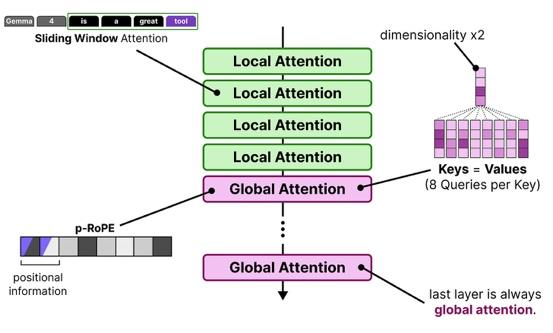
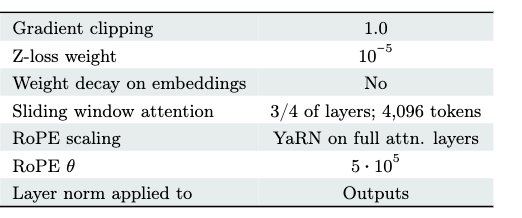
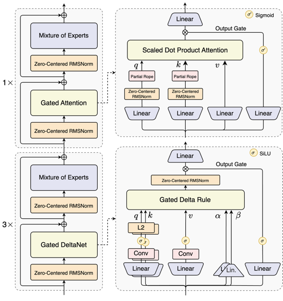

**2025-2026 年广泛采用**：
- **Llama 4**：交替滑动窗口 + 全注意力（RoPE）
- **Gemma 4**：交替滑动窗口 + 全注意力（p-RoPE）
- **OLMo 3**：同样采用交替结构
- **Qwen 3.5**：交替 **Gated DeltaNet**（State Space Model）+ 全注意力，"局部层换成了 SSM，但交替模式完全一样"


> Tatsu 总结："这是过去一年里开源模型的一个大主题。long context performance 的当前最佳方案是这些**混合模型**——不全是全局注意力，也不全是局部注意力/SSM，而是两者的混合。而且这个领域仍然非常活跃，是架构变化最多的地方。"

---

## 13. 总结

### 全景回顾

以下图片来自 Tatsu 课件中的架构调研结论汇总：

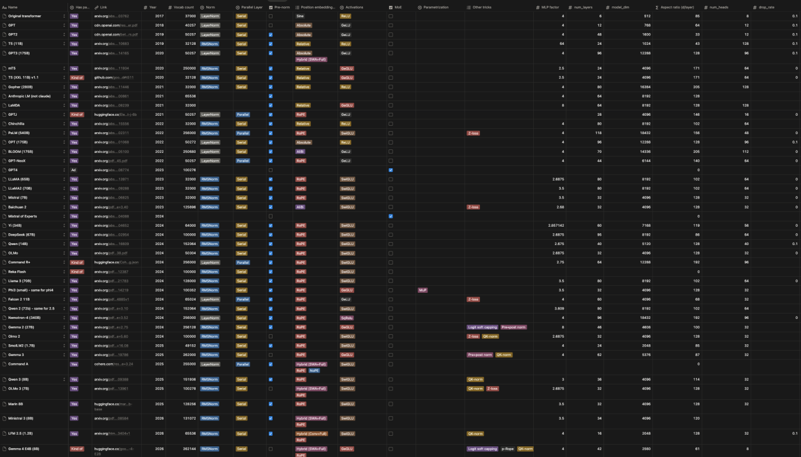

### 十大要点

1. **架构是三重权衡**：泛化、系统效率、稳定性，三者互相制约
2. **Keep residual stream clean**：Prenorm 让梯度直通——这是从"能否去掉 warmup"这个窄问题中发现的深刻原则
3. **RMSNorm + 去 Bias**：免费的加速优化，源自算术强度分析——0.17% FLOPs 可占 25% runtime
4. **Gated Linear Units 几乎成为必需品**：SwiGLU/GeGLU 是主流，门控带来小而一致的增益
5. **RoPE 统治位置编码**：纯相对性的旋转编码，2024 年后几乎统一
6. **超参数有宽容盆地**：ff_ratio ≈ 4, aspect ratio ≈ 100, h×d_head/d_model ≈ 1——选在 basin 里就安全
7. **Weight Decay 是优化干预**：与 LR decay 配合帮助找到更好的极小值，而非防止过拟合
8. **稳定性靠"到处撒 LN"**：z-loss 稳定输出端 + QK norm 稳定注意力内部的 softmax
9. **GQA 是推理效率标准**：MHA 的性能 + MQA 的效率——所有现代模型统一的选择
10. **长上下文靠混合架构**：交替全局注意力和局部/廉价注意力是当前最佳实践

---

## 参考文献

- [Vaswani et al. (2017)](https://arxiv.org/abs/1706.03762) — Attention Is All You Need
- [GPT-3 (Brown et al., 2020)](https://arxiv.org/abs/2005.14165) — GeLU + 交替注意力模式
- [Chinchilla (Hoffmann et al., 2022)](https://arxiv.org/abs/2203.15556) — ReLU + 相对位置嵌入 + scaling laws
- [PaLM (Chowdhery et al., 2022)](https://arxiv.org/abs/2204.02311) — SwiGLU + 并行层
- [Llama 2 (Touvron et al., 2023)](https://arxiv.org/abs/2307.09288) — 架构收敛关键节点，SwiGLU + RoPE + prenorm
- [Llama 3](https://arxiv.org/abs/2407.21783) — GQA + RoPE + SwiGLU
- [Llama 4](https://ai.meta.com/blog/llama-4-multimodal-intelligence/) — 滑动窗口交替注意力
- [Salazar & Nguyen](https://arxiv.org/abs/1910.07467) — 最早系统研究 LayerNorm 放置位置
- [Narang et al. (2020)](https://arxiv.org/abs/2009.06732) — Google 大规模架构比较（T5 架构）
- [Noam Shazeer (2020) — GLU Variants](https://arxiv.org/abs/2002.05202) — GeGLU/SwiGLU 等 GLU 变体原始提出
- [Kaplan et al. (2020) — Scaling Laws](https://arxiv.org/abs/2001.08361) — 神经语言模型 scaling laws + 超参数 sweep
- [RoPE (Su et al., 2021)](https://arxiv.org/abs/2104.09864) — 旋转位置编码，中国作者的创新
- [GPT-J](https://github.com/kingoflolz/mesh-transformer-jax) — 开源 GPT-3 复现，推广 RoPE 和并行层
- [T5 (Raffel et al., 2020)](https://arxiv.org/abs/1910.10683) — 64x ff ratio + 相对位置嵌入
- [Jacob Devlin et al. (2014)](https://arxiv.org/abs/1411.5710) — z-loss 原始提出
- [Gemma 2 (Google, 2024)](https://arxiv.org/abs/2408.00118) — GeGLU + logit soft-capping + 双 norm
- [Gemma 3 (Google, 2025)](https://arxiv.org/abs/2503.19786) — GeGLU + 滑动窗口
- [Gemma 4 (Google, 2026)](https://blog.google/technology/developers/gemma-4/) — P-RoPE + 每层独立嵌入
- [OLMo 2 (Ai2, 2024)](https://arxiv.org/abs/2501.00656) — 全开源，z-loss + 双 norm
- [OLMo 3 (Ai2, 2025)](https://allenai.org/olmo) — 滑动窗口交替注意力
- [Qwen 2 (Alibaba, 2024)](https://arxiv.org/abs/2407.10671) — GQA + SwiGLU
- [Qwen 3 (Alibaba, 2025)](https://arxiv.org/abs/2505.02588) — GQA + SwiGLU
- [Qwen 3.5](https://qwenlm.github.io/blog/qwen3.5/) — Gated DeltaNet 交替全注意力
- [Cohere Command A (2025)](https://cohere.com/blog/command-a) — 滑动窗口复兴先驱
- [Falcon (TII, 2023)](https://arxiv.org/abs/2306.01116) — Gated Linear Unit
- [Nemotron 340B (NVIDIA, 2024)](https://arxiv.org/abs/2406.11704) — Squared ReLU
- [Nemotron 3 Super (NVIDIA, 2026)](https://research.nvidia.com/labs/nemotron/files/NVIDIA-Nemotron-3-Super-Technical-Report.pdf) — NVFP4 精度训练
- [DeepSeek V2 — MLA](https://arxiv.org/abs/2405.04434) — Multi-head Latent Attention
- [Idefics / Chameleon](https://arxiv.org/abs/2405.09818) — 多模态模型，QK Norm 早期使用者
- [Baichuan](https://arxiv.org/abs/2309.10305) — 首个使用 z-loss 的开源语言模型
- [CS336 Course Website](https://cs336.stanford.edu/)
