# CS336 Lecture 4: 注意力替代方案与混合专家模型

> **课程**: Stanford CS336 — Language Models From Scratch (Spring 2026)
> **讲师**: Tatsunori Hashimoto (Tatsu)
> **视频**: [YouTube Playlist (Spring 2026)](https://www.youtube.com/watch?v=l9ILgTgHlGQ)
> **课程网站**: [https://cs336.stanford.edu/](https://cs336.stanford.edu/)

---

## 目录

**Part I: 注意力替代方案**

1. [长上下文的成本问题](#1-长上下文的成本问题)
2. [线性注意力：乘法结合律的妙用](#2-线性注意力乘法结合律的妙用)
3. [Mamba-2：从线性注意力加一个门开始](#3-mamba-2从线性注意力加一个门开始)
4. [Gated Delta Net：双门控+选择性擦除](#4-gated-delta-net双门控选择性擦除)
5. [混合架构的受控实验](#5-混合架构的受控实验)
6. [DSA：稀疏注意力作为替代方案](#6-dsa深度求索稀疏注意力作为替代方案)

**Part II: 混合专家模型 (MoE)**

7. [MoE 基本概念](#7-moe-基本概念)
8. [为什么 MoE 如此流行](#8-为什么-moe-如此流行)
9. [MoE 的设计空间](#9-moe-的设计空间)
   - [9.1 路由函数](#91-路由函数)
   - [9.2 DeepSeek 的创新：共享专家与细粒度专家](#92-deepseek-的创新共享专家与细粒度专家)
10. [训练 MoE：启发式辅助损失的胜利](#10-训练-moe启发式辅助损失的胜利)
    - [10.1 负载均衡损失](#101-负载均衡损失)
    - [10.2 DeepSeek 的系统和设备级均衡](#102-deepseek-的系统和设备级均衡)
11. [MoE 的系统层面](#11-moe-的系统层面)
12. [MoE 的稳定性、微调和 Upcycling](#12-moe-的稳定性微调和-upcycling)
13. [DeepSeek MoE 的演进：v1 → v2 → v3](#13-deepseek-moe-的演进v1--v2--v3)
14. [总结](#14-总结)

---

## 1. 长上下文的成本问题

### 1.1 Context window 的军备竞赛

Tatsu 展示了一张对数刻度的图表：近年来，各大 LLM 厂商的 context window 呈爆发式增长。

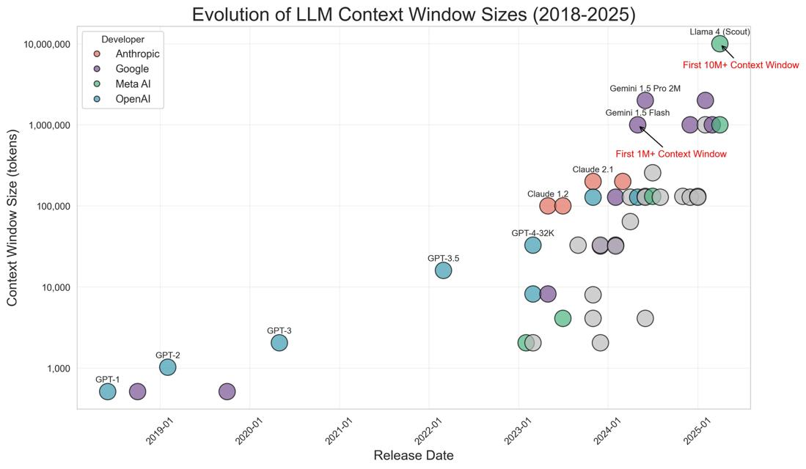

> "很明显，人们想要更长的上下文。你希望把很多东西塞进上下文里，这样模型就有更多的知识——也许它是个 agent，需要处理很多东西。"

### 1.2 Attention 成本的质变

随着序列长度增加，模型的总计算成本中 attention 的占比会发生质变：

- **短序列时**：Feed Forward Network（FFN）占计算主导
- **长序列时**：Attention 是 O(n²) 的 all-to-all connection，很快**超越** FFN 成本


> Tatsu 指出："对于大模型和较短序列长度，feed forward 曾经是主导成本。但当 context 越来越长时，attention 越来越成为瓶颈。"

### 1.3 基础工具箱

Tatsu 回顾了两种已有的成本控制策略：

| 策略 | 思路 | 代表 |
|------|------|------|
| **局部+全局混合注意力** | 大部分层用 local attention，少量层做 global attention | Lecture 3 讲的 Llama 4, Gemma 4 |
| **系统工程** | 常数因子优化，如 Flash Attention | Lecture 3 提到 |

> "对于训练在经典理论导向的计算机科学传统中的人来说，很容易觉得'大 O 才重要，线性还是二次'。但 Flash Attention 告诉我们——常数因子真的非常非常重要。"

**Flash Attention 的效果**（课件中的 TFLOPs 图）：
- 基础 PyTorch 在短序列约 30-40 TFLOPS/s
- Flash Attention 带来 **2 倍以上的提升**
- 更重要的是，基础 PyTorch 在某些上下文长度下**直接 OOM**，而 Flash Attention 不需要 materialize 大的 attention 矩阵，可以继续运行（虽然较慢）

> Tatsu 强调："Flash Attention 不解决任何二次成本问题——但常数因子非常非常强大。然而，当我们要到 500 万、1000 万 token 时，这些技巧可能还不够。我们需要更激进的、更大的改进。"

---

## 2. 线性注意力：乘法结合律的妙用

### 2.1 结合律改变复杂度

Tatsu 说整个线性注意力领域只需要理解**一个核心思想**：乘法的结合律。

标准 Attention：
$$\text{Attn}(Q, K, V) = \rho(QK^\top)V$$

其中 QK^T 是 O(n² · d_k)，这是灾难性的（n 可能达百万级别）。

**关键观察**：如果暂时"忘掉" softmax（令 ρ 为恒等映射）：

$$QK^\top V = Q(K^\top V)$$

- 左边：n² · d_k + n² · d_v → **n² 主导**
- 右边：n · d_v · d_k + n · d_v · d_k → 2n · d_v · d_k，**线性依赖 n**

> "这很'蠢'但极其重要。我们改变了哪个部分是二次的。n 可能是百万级别，但 d_v 和 d_k 通常是几千或几万——没有人有百万维的 hidden dimension。"

### 2.2 RNN 形式的对偶性

更妙的是，这种重新排序让线性注意力呈现出**RNN 的形式**：

$$S_t = S_{t-1} + k_t v_t^\top$$
$$y_t = q_t^\top S_t$$

- **Dense（并行）形式**适合训练——可以矩阵乘法并行
- **RNN（串行）形式**适合推理——固定大小的状态 S 不断向前传递

> "这就是对偶性（duality）——你可以两全其美。RNN 的推理友好性 + Transformer 的训练并行性。"

Tatsu 提到：如果在 S_{t-1} 前乘以 γ，就得到了 RetNet。

### 2.3 Minimax M1：纯线性注意力的实践

**Minimax M1**（一个大规模、高性能的中国开源模型）使用了 **7:1 混合**——7 层线性注意力 + 1 层完整 softmax 注意力。

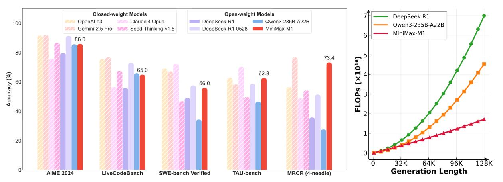


- 性能与 OpenAI O3、DeepSeek-R1 等强模型相比**有竞争力**
- 大部分对 context length 的依赖是线性的（不完全是，因为有少量 softmax 层）

> Tatsu 特别指出："至今尚无人在大规模上真正验证过全线性时间的注意力机制。我将要讨论的所有东西都是**混合架构**。"

---

## 3. Mamba-2：从线性注意力加一个门开始

### 3.1 核心修改

线性注意力的主要问题是"总是不加区分地传递状态"。我们在 LSTM 时代就知道：**什么时候传递信息、什么时候遗忘信息很重要**。

Mamba-2 的解决方案——加一个**门控** γ_t：

$$S_t = \gamma_t S_{t-1} + k_t v_t^\top$$
$$y_t = q_t^\top S_t + v_t^\top D$$

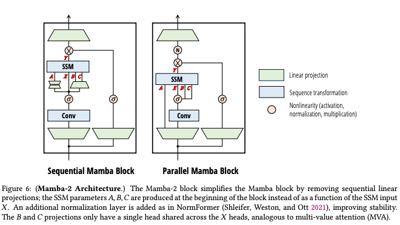

其中 γ_t = f(x_t)，**仅依赖当前输入，不依赖状态**。这意味着：
- γ_t 计算简单
- 仍然保持 parallel/serial 的对偶性

> Tatsu 为 `v_t^T D` 项致歉："这不是状态更新的核心，是 Mamba-2 的一个额外残差连接。你可以暂时忽略它。"

### 3.2 来自不同传统的统一

Mamba 系列由 Albert Gu、Tri Dao 等人从**状态空间模型（State Space Model, SSM）**理论推导而来。但 Tatsu 选择从线性注意力的视角去解释，因为"在机制层面，它们其实一样"。

> "这是我教学的选择——如果你从 SSM 理论开始讲起，学生通常什么也记不住。但从线性注意力出发，然后是 Mamba-2，然后是 Gated Delta Net，这是一个非常自然的渐进故事。"

### 3.3 Nemotron-3

**Nemotron-3**（NVIDIA）使用 Mamba-2 作为其"轻量层"，与完整的 softmax 注意力交替使用：
- 与 Qwen3、GPT-OSS 相比性能不错
- 因为大量 Mamba-2 层，在长上下文时有很好的吞吐量

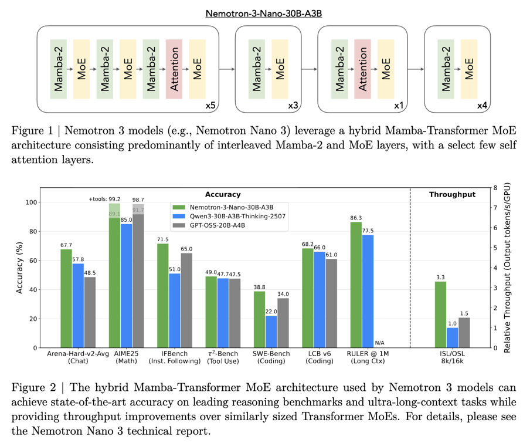

> Tatsu 形容它为"小规模 frontier 模型"——不是最大规模的，但是开源且有效的。

---

## 4. Gated Delta Net：双门控+选择性擦除

### 4.1 再加一个门

Mamba-2 有一个门 γ_t（遗忘门）。Gated Delta Net **增加第二个门** β_t：

$$S_t = \gamma_t (I - \beta_t k_t k_t^\top) S_{t-1} + \beta_t k_t v_t^\top$$
$$y_t = q_t^\top S_t$$

其中 γ_t = f(x_t), β_t = f(x_t)。

**β_t 的作用**：
- β_t = 0 → "不要拿任何当前信息，别添加到状态中"——**无输入操作门**
- 这与 LSTM 的遗忘门 + 输入门的直觉**高度相似**
- "尽管它当然是从完全不同的路径推导出来的"

**Key Projection Term**（蓝色项 `I - β_t k_t k_t^T`）：
- 不仅要**写入**新信息，还要**擦除**当前 key 方向上已有的旧信息
- 直觉上这是一个**投影算子**——把 k_t 维度上的东西投影掉（虽然不是严格的单位标准化）

### 4.2 理论与实践的交叉

Tatsu 指出这个更新规则在多处被"重新发明"：
- 解决某些**元学习最小二乘问题**时自然出现
- **Fast weight programming**、**Test-time training** 研究中出现了同样的解

> "从非常不同的设计原则出发的研究者们，最终得到了完全相同的解决方案。"

### 4.3 Qwen 3.5 / Qwen Next

**Qwen 3.5** 和 **Qwen Next**（Tatsu 认为是目前最好的开源模型之一）：

- **3:1** Gated Delta Net + Attention 混合
- 推理吞吐量在长上下文时远超 Qwen 3

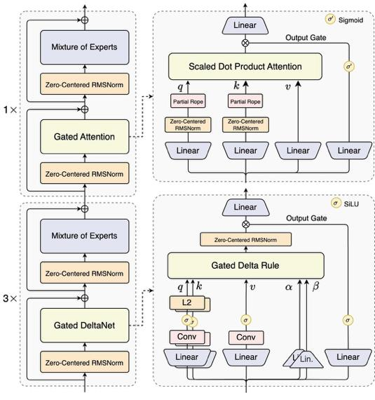
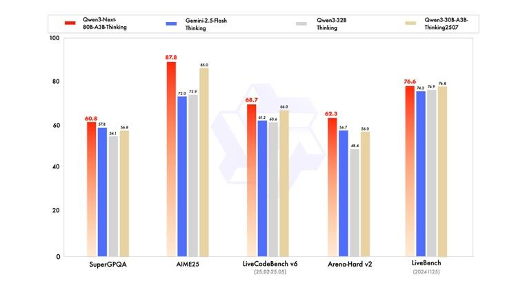


---

## 5. 混合架构的受控实验

Tatsu 引用了**ByteDance Seed 和 UC Santa Cruz** 的一项受控研究：

- 横轴：增加非全注意力（RNN 式）层的数量
- 纵轴：性能

**关键发现**：

| 混合比例 | 性能表现 |
|----------|----------|
| 低比例 RNN（如 3:1 全注意力:RNN） | **几乎没有损失** |
| 超过某个阈值 | 开始出现显著退化 |
| 全 RNN（无边注） | **明显退化** |

> "这就是为什么至今所有成功的方案都是混合架构——不是全部 softmax，也不是全部 RNN/SSM，而是两者的结合。"

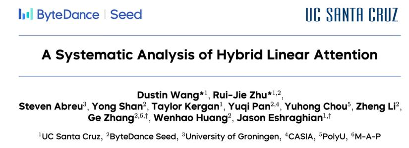
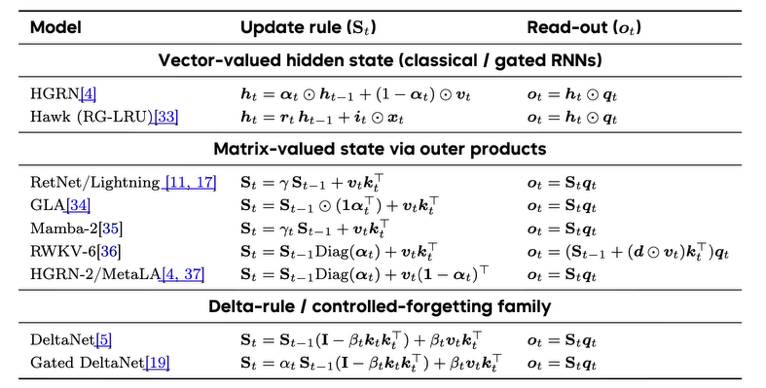

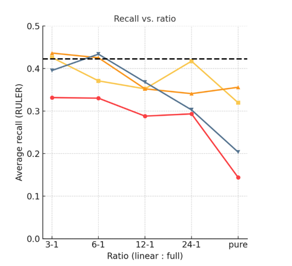

**单 Key 检索 vs QA**：
- 所有长上下文架构在"单 key 检索"任务上都做过显式优化
- 但在 QA 性能上，随着 RNN 比例增加，性能会**稳定并清晰地下降**

**关于未来**（Tatsu 被学生问到预测未来注意力架构时）：
> "我的'敷衍'回答是，我们会把所有成功技巧都扔进去。就像架构变得复杂是因为把所有成功配方都扔进去一样。但还有一个更高的层面——用 post-training 让模型管理自己的上下文，包括 compaction、retrieval 这些。"

---

## 6. DSA：深度求索稀疏注意力作为替代方案

### 6.1 不完全是线性时间的替代方案

Tatsu 强调，DSA（DeepSeek Sparse Attention）**不是线性时间的**——索引器仍然需要对所有 QK 内积进行操作。但它的核心思想完全不同：

**DSA 的工作流程**：

```
输入 → Lightweight Indexer → Top-K 选择 → 仅对 top-K 做 Full Attention
```


**Indexer 的算法**：
1. 计算正常的 Q、K
2. 通过索引器：QK 内积 → ReLU → 基于前面 token 的权重
3. 取 **TopK** 激活值最大的位置
4. 仅对这些 top-K 位置做完整的 attention

### 6.2 后置添加的策略

> "你不必在预训练时就用 DSA 训练——那可能会很烦人且复杂。你只需要训练一个正常的 Transformer。然后在长上下文扩展阶段，把索引器插进去，再训练模型适应它。"

这非常经济：
- 正常预训练（短上下文）
- 长上下文扩展阶段同时加上索引器
- "所有人都要在第二阶段做长上下文扩展——为什么不顺便把节省成本的索引器也加上？"

### 6.3 DeepSeek V3.2 和 GLM5 的验证

**DeepSeek V3.2**：
- 与 Claude 4.5 Sonnet、Gemini 3 等当时的前沿模型相匹敌
- Prefill 和 Decode **两者的时延都显著优于**前代不用稀疏注意力的 DeepSeek 模型

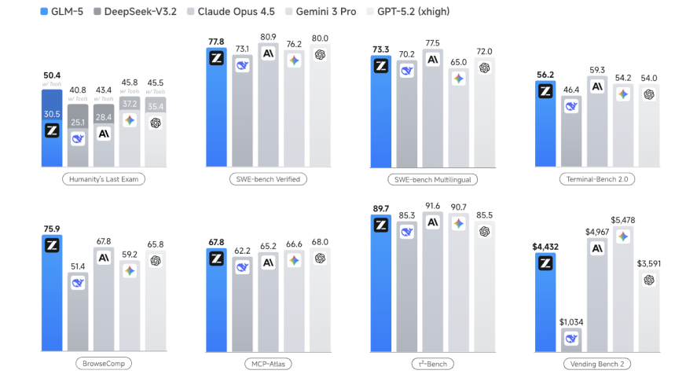


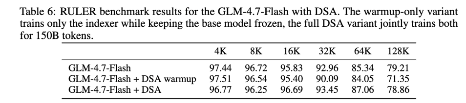

**GLM5**（Tatsu 高度评价）：
> "GLM5 是目前最好的开源模型之一，period。他们也采用了 DSA。他们在论文中有相当不错的 ablation——做全 DSA 训练，对比全注意力的性能损失非常小，即使是在那些对 RNN 式架构来说非常困难的长上下文检索任务上。"

### 6.4 DSA 的设计理念

Tatsu 比较了 DSA 和线性注意力类方法的核心差异：
- **线性注意力/SSM**：改变复杂度（O(n²) → O(n)）
- **DSA/稀疏注意力**：降低常数因子（索引器轻量 + 实际 attention 只在小子集上）

> "有时候不要太纠结于二次 vs 不二次。常数因子同样非常重要。"

---

## 7. MoE 基本概念

### 7.1 什么是 MoE

Tatsu 给出了最简单的定义：

> "MoE 就是一个**更高效的 MLP**。把你的 MLP 拿过来，然后有人给你一个更高效的 MLP——这就是混合专家。"

**结构上**：

```
标准 Transformer Block:          MoE Transformer Block:
x → Attention → LN → FFN         x → Attention → LN → [Expert 1, Expert 2, ..., Expert N]
                                                       ↕ Router（门控选择器）
```

- 将原来一个大的 FFN 替换为**多个同样大小（或稍小）的 FFN（专家）**
- 通过**路由器（Router）**选择每个 token 走哪个/哪些专家
- 参数翻倍（N 个专家 = N 倍 FFN 参数），但**每个 token 只经过 1 个专家 → FLOPs 不变**


> "核心心智模型：你想增加参数但不想影响 FLOPs。"

Tatsu 将其与 dense transformer 的 Llama 设计类比：
> "就像 dense transformer 中 Llama 的设计几乎成为标准一样，DeepSeekMoE 和 DeepSeek v3 已成为 MoE 领域的标准设计。"

### 7.2 路由的粒度

学生问：专家切换的粒度是什么？

Tatsu 答：**Token 级别**——每个 token 被独立路由到不同的专家。

> "路由器超级简单——就是你的输入和一个矩阵做一次内积而已。你不会做任何复杂的事情。你不会判断'这是不是一个医学问题'——你只是看到'哦，这个 token 看起来像日文，发给专家 7'。"

### 7.3 MoE 与注意力专家

Tatsu 简要提到：有人也尝试过对**注意力头**做 MoE（MoE for attention heads），但：
> "这些远不如替换 FFN/MLP 层常见。我看到的情况是它们不那么容易被驯服、不那么容易工作。所有大模型都在做左边的（FFN MoE），没人做右边的（Attention MoE）。"

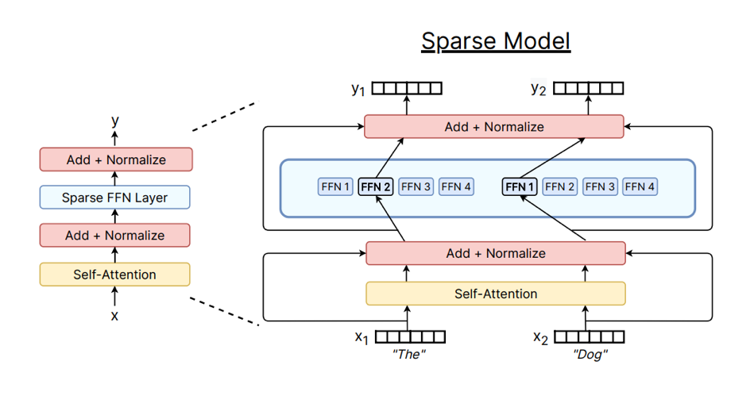


---

## 8. 为什么 MoE 如此流行

Tatsu 从两个角度论证 MoE 的流行：

### 8.1 经验证据

**训练损失**（Fedus et al., 2022 — Switch Transformer）：
- 相同活跃参数 → 专家越多，test loss 越低
- 随着 training compute 增加，更多专家的优势**持续存在**

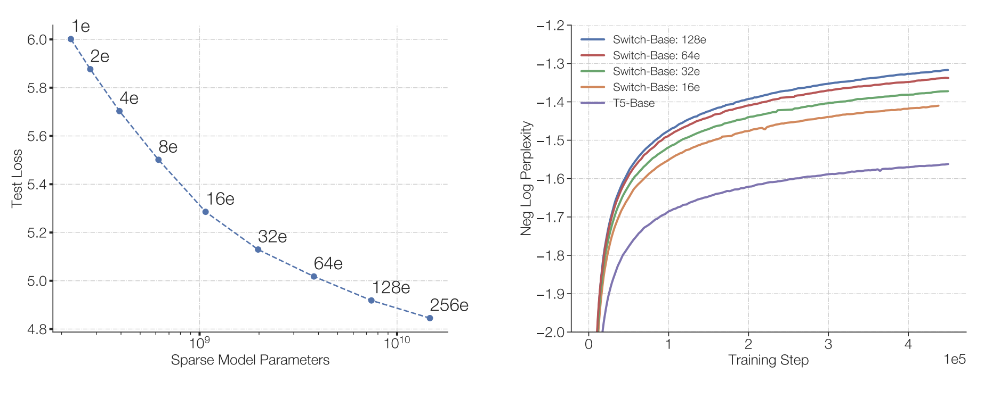

**训练速度**（OlMoE，AI2 2025）：
- MoE 比同规模 dense 模型训练快约 **2 倍**
- 在 training loss、validation loss、downstream benchmark 上全面领先


> "在 Hugging Face 上到一定规模以上，你能获得的每个模型似乎都是 MoE。"

### 8.2 实际竞争力

Tatsu 展示 DeepSeek v2 / DeepSeekMoE 早期模型：
- 更少的活跃参数
- 与其他 dense 模型相当甚至更好的性能
- "这是真正的大转变。"


**西方 vs 中国的 MoE 格局**：

> "在西方，开源模型发布基本停滞了。Llama 4 和 GPT OSS 是两个好的大模型例子，但很多 MoE 的研究和训练都发生在中国——Qwen、DeepSeek、miniCPM 做了最早的 MoE 训练和推广工作。"

> "如果你看早期的 Qwen MoE 模型，Qwen 1.5 MoE 用 2.7B 活跃参数击败了当时很多 7B 模型。DeepSeek 和 Qwen 的这些早期成果说服了开源社区的其他所有人——这条路是对的。"


### 8.3 为什么过去不流行

尽管 Google 早在 2022 年就在推动 MoE，但直到 2024 年才真正爆发：


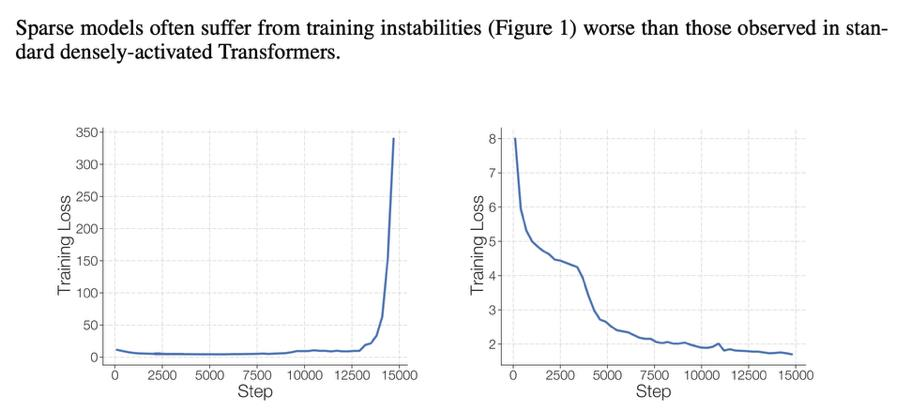

| 障碍 | 说明 |
|------|------|
| **基础设施复杂** | 很难在保持利用效率的同时并行化专家 |
| **训练不稳定** | 路由 softmax 引入额外的稳定性风险 |
| **参数多** | 难以放进单设备 |

> Tatsu 说："如果你做 LLM 研究，你可能还在用 dense 模型。为什么不直接用 MoE 省钱？因为 MoE 真的不太容易训练和使用。但现在有了好的经验法则。"

### 8.4 额外的并行化轴

MoE 提供了一种**新的并行化维度**：
- 数据并行：batch size 有限制
- 模型并行：天然的分割点有限
- **专家并行**：每个专家天然是一个 chunk，可以放在不同设备上，让 MoE 训练的并行效率更高

---

## 9. MoE 的设计空间

MoE 的**三个变化轴**：
1. **路由函数**（怎么选专家）
2. **专家大小**（多而小 vs 少而大）
3. **训练目标**（怎么处理不可微的路由）

### 9.1 路由函数

#### 9.1.1 Token 选择 vs 专家选择 vs 全局优化

| 方式 | 描述 | 流行度 |
|------|------|--------|
| **Token 选专家（Token Choice）** | 每个 token 选 top-k 专家 | **绝对主流** |
| **专家选 Token（Expert Choice）** | 每个专家选最喜欢的 tokens | 有成功的例子（未发布的 Llama 4），但不常见 |
| **全局优化（Linear Assignment）** | 求解全局匹配问题 | 概念上最优，但太贵，**未见大规模使用** |

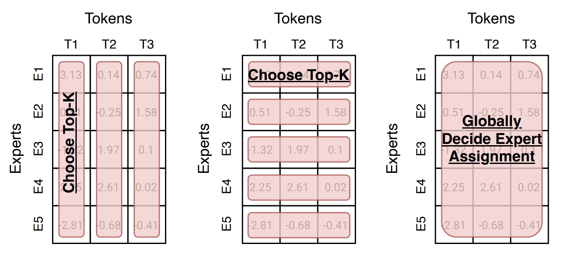
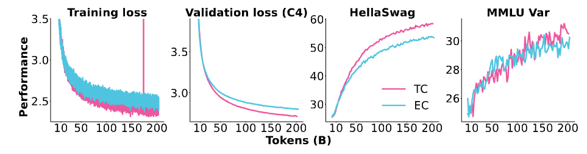

> Tatsu："OlMoE 的 ablation 显示，token choice 在验证 loss 和下游 benchmark 上都优于 expert choice。Token choice 已经成为标准。"

#### 9.1.2 Top-K 路由（核心方案）

```
算法：
1. 输入 x 经过线性投影 → 与每个专家的向量做内积 → 得到 scores
2. scores → softmax → 选择 top-k
3. 仅将输入发送给被选中的 k 个专家
```

**Top-K 的一个关键细节**：门控分数通过 softmax 后选择 top-k，而门控本身的学习是通过**内积**完成的——每个专家有一个可学习的向量 w_i，与输入的内积决定分数。

**历史渊源**：
> "这在 DSA 的幻灯片中已经出现过。如果你在关注，你会发现这是同一个模式。它还会出现在 H-Nets 等其他论文中——这是一个你应该学会识别的好模式。"

**不同模型的 k 值**：

| 模型 | k 值 |
|------|------|
| Switch Transformer (Google) | k=1 |
| GShard (Google), Grok, Mixtral | k=2 |
| Qwen MoE, DBRX | k=4 |
| DeepSeek | 可变（6-8 等） |

#### 9.1.3 其他路由方法

**Hash 路由**：
- 直接对输入做哈希，根据哈希值分派专家
- "很多论文都用它做 baseline"
- 完全不需要学习，"神奇的是居然也能有些 gain"
- 但**不被用于生产部署**

**RL 路由**：
- 将路由视为 bandit 问题，用 REINFORCE 训练
- "在最早的 MoE 工作中使用过（Bengio 2013）"
- **目前不常用**："RL 方法的梯度方差和复杂性带来了大量开销，而简单的启发式方法已经足够好"

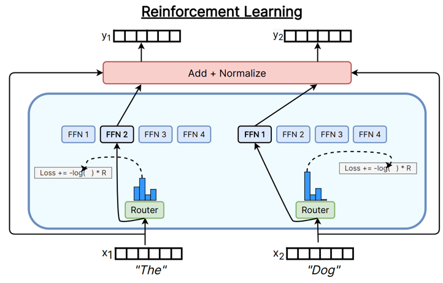


> Tatsu 自我吐槽："作为一个喜欢'有意义的事'的人，线性指派方法真的很酷——但它在实际中太贵了。"

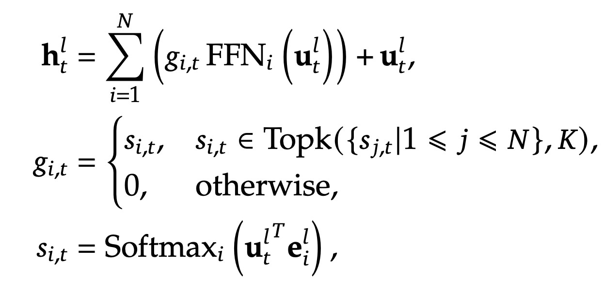

### 9.2 DeepSeek 的创新：共享专家与细粒度专家

这是 DeepSeekMoE **最具影响力的贡献**：

#### 9.2.1 共享专家（Shared Experts）

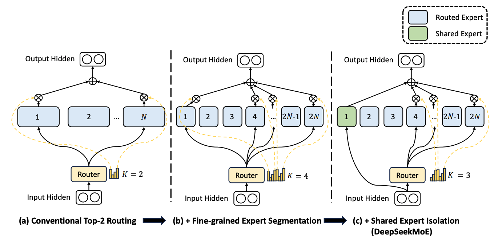

**直觉**："有些处理是所有 token 都需要的。"

将专家分为两类：
- **共享专家**：始终激活，绕过路由器，处理所有 token
- **路由专家**：由路由器选择性地激活

> "在经典设计中，专家们其实大量重复做相同的基础建模工作。把这块卸载到共享专家上，让路由专家更专业化。"

#### 9.2.2 细粒度专家（Fine-grained Experts）

- 将专家切得更小、更多
- DeepSeek 将从 16 个粗粒度专家 → 64 个细粒度专家（每个大小为原专家的 1/4）
- 结合共享专家，效果显著提升

#### 9.2.3 消融实验

**DeepSeek 的消融**：
- 0 shared → 有 shared：TriviaQA 和 NaturalQuestions 上**大幅提升**
- 粗粒度 → 细粒度：更多专家 + 更小 → **持续增益**

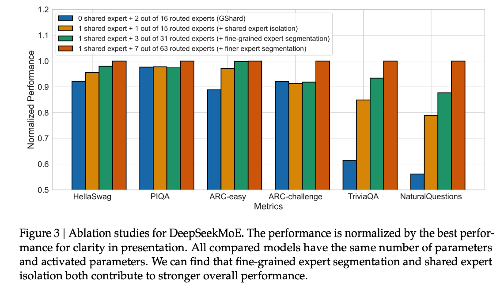

**OlMoE 的消融**（西方最严谨的受控 MoE 研究）：
- 细粒度、多专家**有帮助**
- 共享专家在 OlMoE 的设置下**帮助不大**（与 DeepSeek 略有分歧）


> Tatsu 暗示这可能与研究设置差异有关，但两者都确认了"细粒度+多专家"的方向。

**近期 MoE 的专家配置快照**：

| 模型 | 路由专家数 | 激活数 | 共享专家 | 细粒度比例 |
|------|-----------|--------|---------|-----------|
| GShard | 2048 | 2 | 0 | - |
| Switch Transformer | 64 | 1 | 0 | - |
| Mixtral | 8 | 2 | 0 | - |
| Grok | 8 | 2 | 0 | - |
| DeepSeek v1 | 64 | 6 | 2 | 1/4 |
| Qwen 1.5 | 60 | 4 | 4 | 1/8 |
| DeepSeek v3 | 256 | 8 | 1 | 1/14 |
| OlMoE | 64 | 8 | 0 | 1/8 |
| Llama 4 (Maverick) | 128 | 1 | 1 | 1/2 |

---

## 10. 训练 MoE：启发式辅助损失的胜利

### 10.1 为什么训练 MoE 是困难的

Tatsu 总结了核心困境：

> "如果在训练时激活所有专家，事情就容易了——你能看到哪个专家对哪个输入好。但那样就要支付全部 FLOPs 成本。所以我们**需要训练时的稀疏性**。但稀疏性意味着门控决策**不可微**，而且你看不到那些没被选中的专家的反事实结果。这是一个 bandit 问题。"

三种解决方法：
1. **强化学习** → 不流行（梯度方差太大，太复杂）


2. **随机扰动** → 早期用过，现在基本弃用

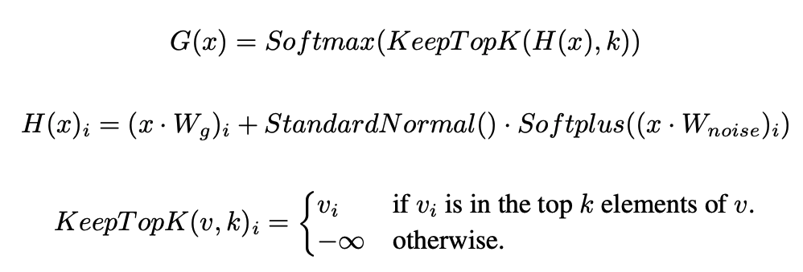
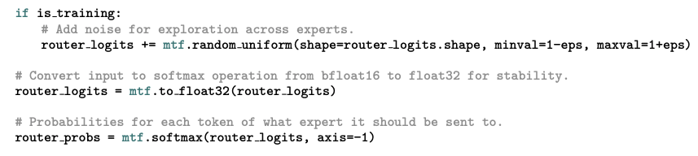


3. **启发式辅助损失** → **实际使用的方法**

> "当我刚学 MoE 时，我觉得这些东西不可能训练好。但事实证明，一大堆启发式技巧组合在一起，就能稳健地工作。"

### 10.2 负载均衡损失（Load Balancing Loss）

**核心问题**：如果不加干预，训练中会出现**富者愈富**效应（rich gets richer）：
- 被选中的专家获得更多梯度信号 → 更强 → 被选中更多 → 最终**专家坍缩**到少数几个

**Switch Transformer 的解决方案**——添加辅助损失：


$$\mathcal{L}_{\text{balance}} = \alpha \cdot N \cdot \sum_{i=1}^{N} F_i \cdot P_i$$

- F_i：分配给专家 i 的 token **比例（硬分配）**
- P_i：路由器分配给专家 i 的**概率质量（软分配）**

> Tatsu 承认："目标函数本身可能看起来不直观。但如果你对 P_i 求梯度，你会得到 α·N/T² · Σ 1[argmax p(x)=i]——越频繁被使用，梯度越负。这就是**根据使用频率来惩罚热门专家**。"

**移除负载均衡损失的效果**（OlMoE 的消融图）：

| 有负载均衡损失 | 无负载均衡损失 |
|--------------|--------------|
| 粉色线：正常平滑的训练曲线 | 训练 loss 显著升高的尖刺曲线 |
| 所有专家均匀被使用 | **几乎所有 token 都去了 2 个专家**（黄色和粉色），其他专家完全浪费 |

> Tatsu："没有负载均衡损失的话，你扔掉了大量参数——那些专家在整个训练过程中几乎什么都没做。"

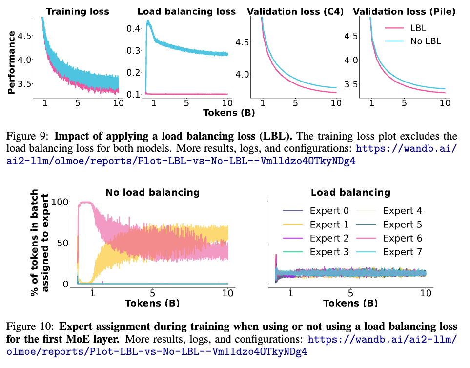

**DeepSeek v3 的新负载均衡方案**：


### 10.3 DeepSeek 的系统和设备级均衡

**DeepSeek v1-v2** 的多层均衡设计：

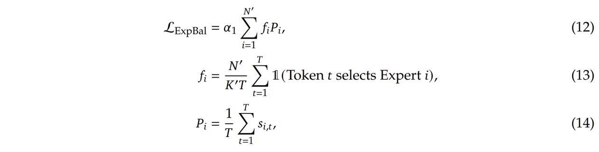
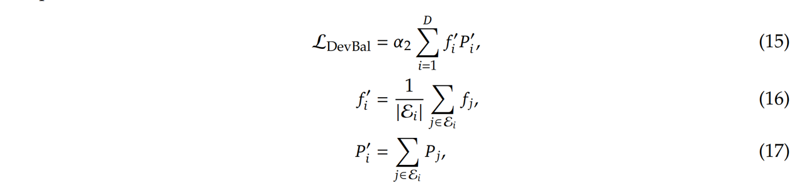

1. **Per-expert balancing**（与 Switch Transformer 相同）
2. **Per-device balancing**：确保分配给不同设备的专家整体负载均衡

> "DeepSeek 的人对系统设计非常敏锐。如果专家被分配到不同设备上，你不能只让专家均衡——你想让设备也均衡，这样两台机器都能全利用率运行。"

**DeepSeek v3** 的新尝试——**辅助损失自由的负载均衡**：

- 为每个专家设置一个**可学习的 bias 项**
- 使用**在线学习**来动态调整 bias
- 偏高的 expert bias → 该专家更可能被选中
- 声称是"aux-loss-free"

> Tatsu 的评论："但事实上这个方法并不完全是无辅助损失的——在极端不均衡出现时，他们仍然需要加回一些辅助损失。"

---

## 11. MoE 的系统层面

### 11.1 专家并行与通信

**三种并行化范式**：

| 范式 | 限制 |
|------|------|
| 数据并行 | 受 batch size 限制 |
| 模型并行 | 受天然切分点数限制 |
| **专家并行** | 专家天然可以分布到不同设备 |


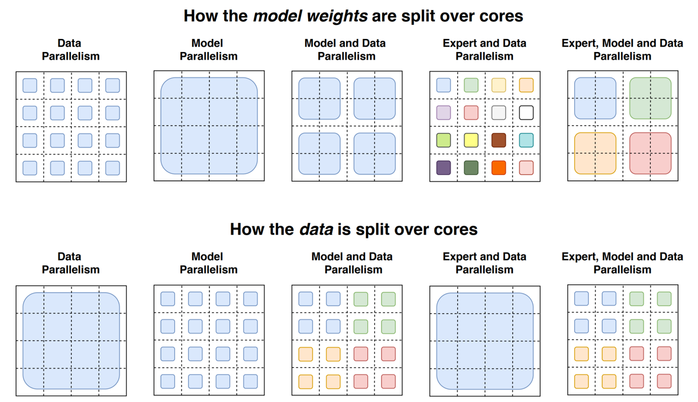

**通信瓶颈**：需要将 token 的 activation 发送到对应专家所在的设备。

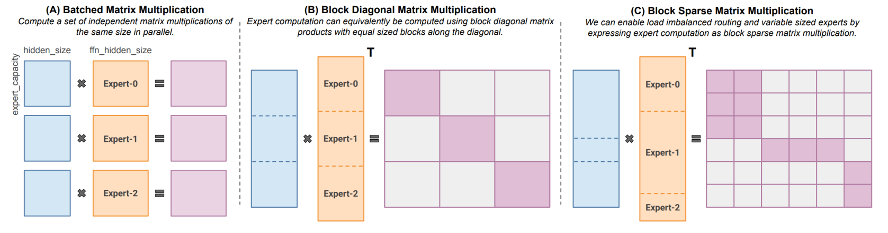

### 11.2 Nemotron-3 的通信优化

**Nemotron-3** 的解决方案——**Down-projection**：
- 共享专家：大维度，不通信（每设备拷贝一份）
- 路由专家：**先降维**再发送 → 减少通信量
- 这样在 hidden dimension 大的情况下，通信成本（由降维后的向量承担）显著降低


> "你可以这样控制 communications vs expressiveness 的权衡"

### 11.3 稀疏矩阵乘法与硬件协同

- MoE 的计算模式天然接近**分块对角矩阵乘法**（block-diagonal sparse MM）
- 现代 GPU 硬件已原生支持结构化稀疏
- **MegaBlocks** 等开源 MoE 框架使用更智能的稀疏矩阵乘法
- 硬件-架构协同设计正在发生

### 11.4 推理中的 Token Dropping 问题

> "一个有趣的旁注：早期 MoE 推理基础设施中，如果某个专家太热门，请求队列堆积——系统会**静默丢弃 token**，返回一个零向量，假装什么都没有发生。这意味着：**其他人的查询会影响你的结果质量**——如果另一个用户的 query 恰好用了跟你相同的专家，他会把你从专家队列中挤出。"


现在（MegaBlocks 等现代框架下）这个问题**已基本解决**。

---

## 12. MoE 的稳定性、微调和 Upcycling

### 12.1 路由器 Softmax 的稳定性

MoE 引入了**额外的 softmax**（在路由器中），这增加了训练中数值不稳定的风险。

> "Barret Zoph 等人在 Google 早期 MoE 设计中，专门写了一整篇论文讲 MoE 稳定性。"

**两个常见的解决方案**：

| 方案 | 说明 |
|------|------|
| **Float32 路由器** | 仅路由器部分用 FP32，其余用更低精度 |
| **Z-loss** | 对路由器的 log_Z 加惩罚（与 Lecture 3 中的 z-loss 原理相同） |

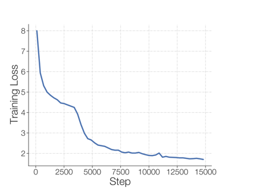

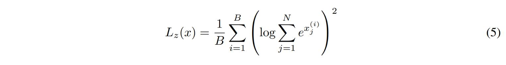


**Z-loss 的消融**（OlMoE）：
- 去掉 z-loss → 训练曲线出现**大量尖刺**（loss spikes）
- 加上 z-loss → 平滑稳定

> "Z-loss 在 MoE 路由器稳定性方面非常流行，甚至在早期就是如此。"

### 12.2 MoE 微调的过拟合问题

MoE 参数极多，在较小的微调数据集上会产生**严重的过拟合**：

| 模型 | Train-Val Gap |
|------|--------------|
| Dense | 较小，正常的泛化 gap |
| Sparse (MoE) | **极大差距** |


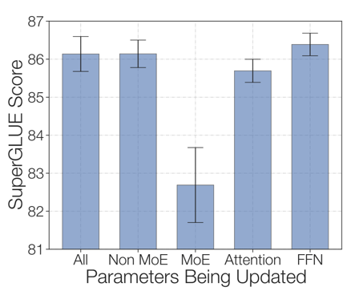
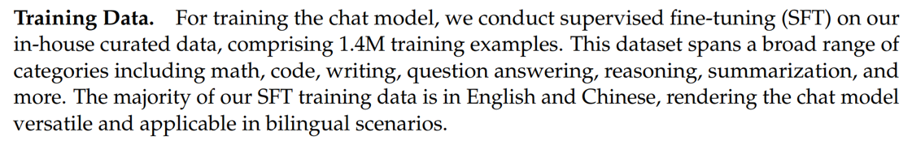

**三种解决方案**：

1. **微调非 MoE 的 FFN 层**（如果有的话）
2. **仅微调 Attention 层**——"在最近的 MoE 工作中非常常见"
3. **The Bitter Lesson 版本**：用大量 SFT 数据（DeepSeek 用了 140 万条）——"如果你数据多，就相当于重新训练 MoE，没有严重的泛化 gap"

### 12.3 Upcycling（上循环）

**核心思想**：从已训练好的 dense 模型初始化 MoE。

```
Dense Model → 拷贝 MLP N 份 → 随机初始化路由器 → 继续训练 → 专家自然分化
```


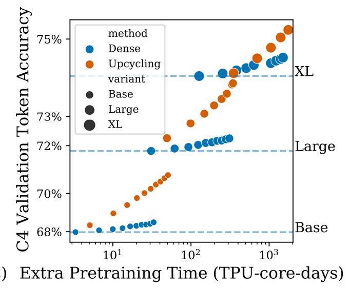

**成功案例**：
- **MiniCPM**：从 2.4B dense → 13.4B MoE，"几乎免费的提升"

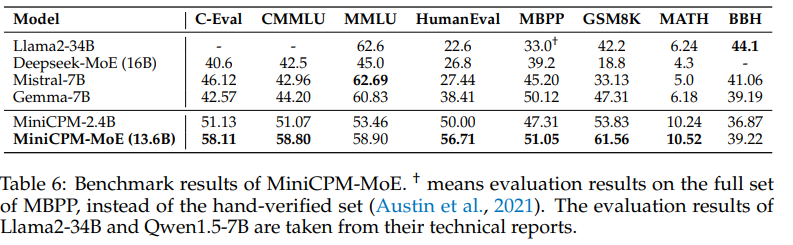

- **Qwen MoE**：从 Qwen 1.8B → Qwen 1.5 MoE 2.7B，"最早的 upcycling 成功之一"

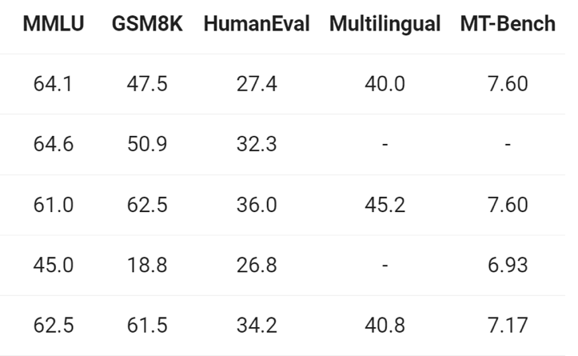
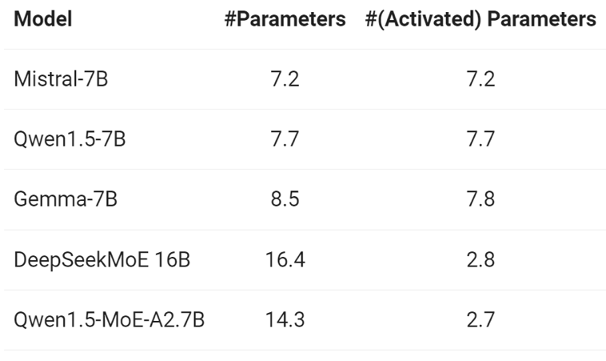

> "2026 年已经没有人做 upcycling 了——因为没有人再先训练 dense 再转 MoE。不如直接用你的大算力 run 一个 MoE。但这个想法本身很酷，也曾经催生过很好的模型。"

---

## 13. DeepSeek MoE 的演进：v1 → v2 → v3

Tatsu 用 DeepSeek MoE 系列作为结语，认为"从中可以学到很多"：

### DeepSeekMoE v1（16B total, 2.8B active）

- 标准 Top-K 路由
- **共享专家（2） + 细粒度专家（64，每个大小为正常的 1/4）**
- 标准辅助损失均衡（专家级 + 设备级）

> Tatsu 称 v1 已经"是现代 MoE 的原型"——"如果你愿意，这就是柏拉图式的 MoE 理想模型。"

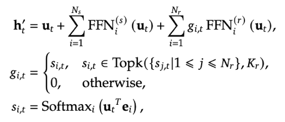


### DeepSeekMoE v2（236B total, 21B active）

**新增**：
- 更多专家：2 共享 + 160 细粒度（1/10），激活 6 个
- **通信均衡损失**：同时均衡通信的 in 和 out
- **Top-M 设备路由**

> "成功的语言模型训练不仅仅是深度学习——也是真正尊重你的系统。DeepSeek v2 是这种哲学的真正体现。"


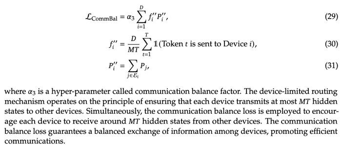

### DeepSeekMoE v3（671B total, 37B active）

**新增**：
- 更多专家：1 共享 + 258 细粒度，激活 8 个
- **Sigmoid+Softmax TopK + TopM** 路由机制
- **辅助损失自由均衡 + 序列级辅助损失**


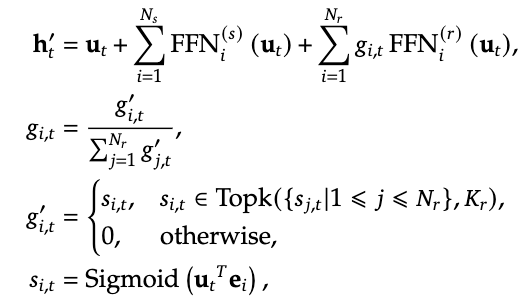
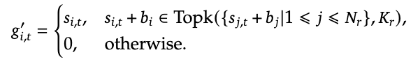

### 附：DeepSeek V3 还需要什么

#### MLA（Multi-head Latent Attention）

通过**低维潜在表示 c** 来参数化 Q、K、V：

```
x → c (低维) → Q, K, V
```

- KV Cache 只需存储 **c**（低维），而非完整的 K 和 V
- W_U^K 可以合并到 Q 的投影中
- **但 RoPE 会与之冲突**：RoPE 需要在 K 上做旋转，破坏了低维分解

**解决方案**：保留少量**非潜在（non-latent）的 key 维度**专门用于 RoPE 旋转。

> Tatsu 说："下次课会简要提及 MLA，但它是一种与 GQA 不同的分解结构，有另一种权衡。"

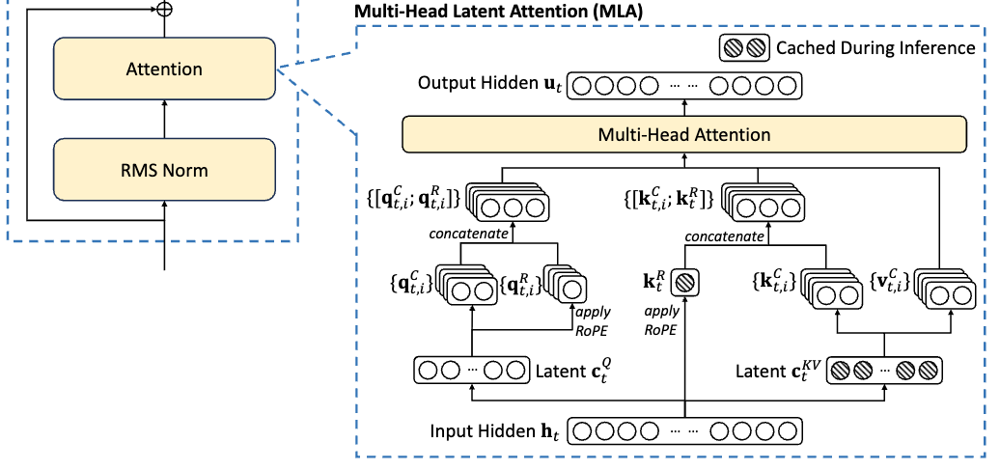
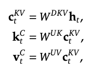
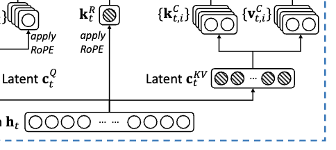
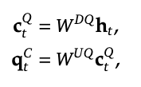

#### MTP（Multi-Token Prediction）

- 不是只预测下一个 token，而是一次预测**多个未来 token**
- **统计学论点**：可以更好地预测未来
- **系统论点**："你得到了一个内建的 speculative decoder——Percy 讲到推理时会展开。"

> "但他们实际上只做了一层的多 token 预测。"


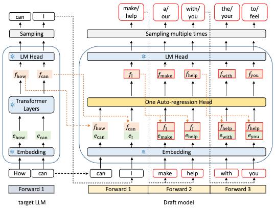
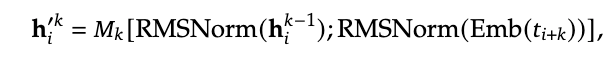
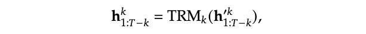
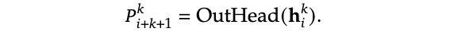

---

## 14. 总结

Tatsu 用三个关键要点收束本讲：

### Part I: 注意力替代方案

1. **长上下文的成本由 attention 的二次项主导**——这是我们寻求替代方案的动机
2. **线性注意力的核心是乘法的结合律**——去掉 softmax 后重新排列括号，变 O(n²) 为 O(n)
3. **对偶性（Parallel/Serial duality）**是训练高效和推理高效兼顾的关键
4. **Mamba-2 = 线性注意力 + 遗忘门**；**Gated Delta Net = Mamba-2 + 输入门 + 选择性擦除**
5. **纯 RNN/SSM 会损失性能**——当前最佳实践是**混合架构**（如 Qwen 3.5 的 3:1 混合）
6. **DSA 提供了另一条路**：稀疏索引 + 子集注意力，常数因子优化而非复杂度降低

> "线性时间注意力的事情在过去两年'终于'变得 ready 了。一个有趣的观察是，很多具有不同名称的方法最终都收敛到了非常 LSTM-like 的对象上。"

### Part II: 混合专家模型

7. **MoE = 参数换 FLOPs**——更多参数，相同计算，更好的性能
8. **Top-K 路由几乎是唯一的标准**——哈希和 RL 都有尝试，但简单的内积+softmax+topK 实际效果最好
9. **DeepSeek 的两大创新**：共享专家（处理通用知识）+ 细粒度专家（更专业化的分工）
10. **训练 MoE 靠启发式**——负载均衡损失不是从第一性原理推导的，但它就是 works
11. **系统与架构的协同设计**——设备均衡损失、通信降维、稀疏矩阵乘法
12. **MoE 的稳定性靠 Float32 路由器和 z-loss** 来保障

> "MoE 利用了稀疏性——不是所有输入都需要完整的模型。离散路由是困难的，但 top-k 启发式似乎就是能 work。现在有大量的经验证据表明 MoE 有效且成本效益高。"

---

## 关键公式速查

| 公式 | 含义 |
|------|------|
| `Attn(Q,K,V) = Q(K^T V)` | 线性注意力：结合律降低复杂度 |
| `S_t = S_{t-1} + k_t v_t^T` | 线性注意力的 RNN 形式 |
| `S_t = γ_t S_{t-1} + k_t v_t^T` | Mamba-2：加遗忘门 |
| `S_t = γ_t(I - β_t k_t k_t^T)S_{t-1} + β_t k_t v_t^T` | Gated Delta Net：双门控+选择性擦除 |
| `L_balance = α·N·Σ F_i·P_i` | Switch Transformer 负载均衡损失 |
| `MoE(x) = Σ g_i(x) · FFN_i(x)` | MoE 层的前向计算 |

---

## 参考文献与延伸阅读

**注意力替代方案**：
- [Shen et al. (2018)](https://arxiv.org/abs/1810.10125) — 早期线性注意力的核方法
- [Katharopoulos et al. (2020)](https://arxiv.org/abs/2006.16236) — 线性注意力的 Transformers are RNNs
- [Mamba-2 (Dao & Gu, 2024)](https://arxiv.org/abs/2405.21060) — 从 SSM 到结构化矩阵的注意力统一框架
- [Gated Delta Net (Qwen Team / Alibaba)](https://arxiv.org/abs/2412.10903) — 双门控状态空间模型
- [Nemotron-3 (NVIDIA, 2026)](https://research.nvidia.com/labs/nemotron/files/NVIDIA-Nemotron-3-Super-Technical-Report.pdf) — Mamba-2 + Attention 混合
- [Qwen 3.5 / Qwen Next](https://qwenlm.github.io/blog/qwen3.5/) — Gated Delta Net + Attention 混合的顶级开源模型
- [DeepSeek V3.2 — DSA](https://arxiv.org/abs/2503.24088) — 深度求索稀疏注意力
- [GLM-5 (Zhipu AI, 2025)](https://arxiv.org/abs/2508.12884) — 采用 DSA 的顶级开源模型
- [Hybrid Architecture Ablation Study (ByteDance Seed & UC Santa Cruz)](https://arxiv.org/abs/2410.12563) — 混合架构的受控比较
- [RetNet (Sun et al., 2023)](https://arxiv.org/abs/2307.08621) — 带权重衰减的线性注意力
- [Minimax M1](https://www.minimaxi.com/en/news/minimax-m1) — 7:1 线性注意力混合

**混合专家模型**：
- [Shazeer et al. (2017)](https://arxiv.org/abs/1701.06538) — Outrageously Large Neural Networks，MoE 的早期奠基（含随机路由）
- [Fedus et al. (2022)](https://arxiv.org/abs/2101.03961) — Switch Transformer
- [Zoph et al. (2022)](https://arxiv.org/abs/2204.07656) — MoE 稳定性研究
- [DeepSeekMoE v1](https://arxiv.org/abs/2401.06066) — 共享专家 + 细粒度专家的首次提出
- [DeepSeek V2](https://arxiv.org/abs/2405.04434) — MLA 和通信均衡损失
- [DeepSeek V3](https://arxiv.org/abs/2412.19437) — 辅助损失自由均衡 + MTP
- [DeepSeek V3.2 — DSA](https://arxiv.org/abs/2503.24088) — 稀疏注意力
- [OlMoE (AI2, 2025)](https://arxiv.org/abs/2502.05764) — 西方最严谨的 MoE 受控消融研究
- [Mixtral (Mistral AI, 2023)](https://arxiv.org/abs/2401.04088) — 早期西方成功的开源 MoE
- [Grok (xAI, 2024)](https://x.ai/blog/grok-os) — 开源 MoE
- [DBRX (Databricks, 2024)](https://www.databricks.com/blog/introducing-dbrx) — 细粒度 MoE
- [Qwen 1.5 MoE (Alibaba, 2024)](https://arxiv.org/abs/2403.08268) — 早期 upcycling 成功
- [MiniCPM (2024)](https://arxiv.org/abs/2404.06395) — Upcycling MoE 的案例
- [Clark et al. (2022)](https://arxiv.org/abs/2209.06055) — 线性指派路由
- [Clark et al. (2020)](https://arxiv.org/abs/2002.07964) — RL 路由
- [Bengio et al. (2013)](https://arxiv.org/abs/1312.6082) — 最早的有条件计算思想
- [MegaBlocks (Databricks)](https://arxiv.org/abs/2211.15841) — 现代 MoE 稀疏矩阵乘法框架
- [ModuleFormer / JetMoE](https://arxiv.org/abs/2308.04819) — Attention 头的 MoE 尝试
- [EAGLE](https://arxiv.org/abs/2401.15093) — 多 token 预测的投机解码方法
- [CS336 Course Website](https://cs336.stanford.edu/)
