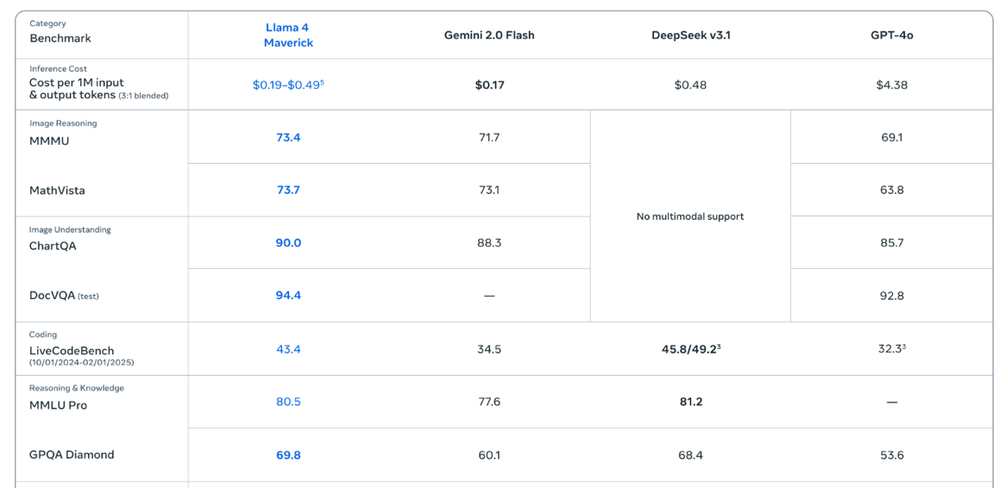
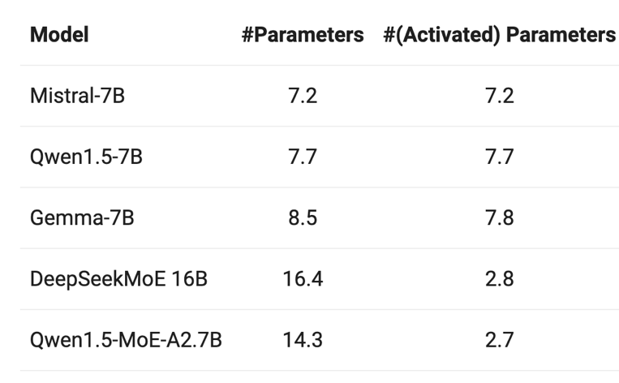
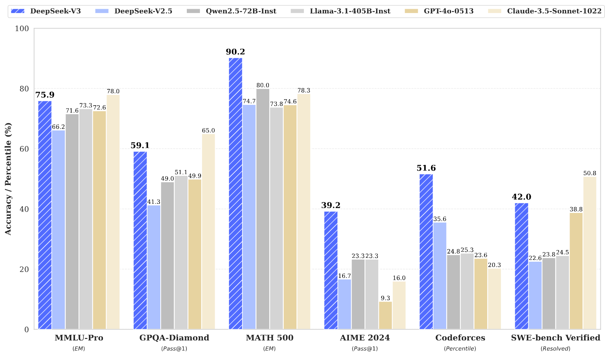
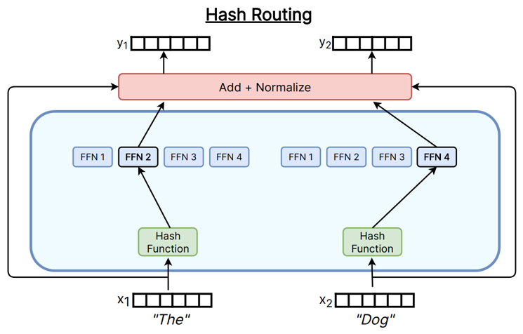
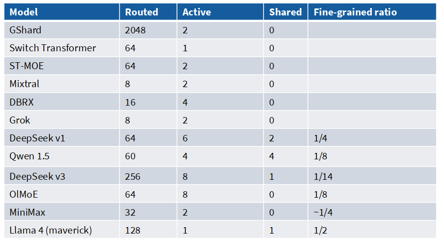

# CS336 Lecture 4: 注意力替代方案与混合专家模型

> **课程**: Stanford CS336 — Language Models From Scratch (Spring 2026)
> **讲师**: Tatsunori Hashimoto (Tatsu)
> **视频**: [YouTube Playlist (Spring 2026)](https://www.youtube.com/watch?v=l9ILgTgHlGQ)
> **课程网站**: [https://cs336.stanford.edu/](https://cs336.stanford.edu/)

---

## 目录

**Part I: 注意力替代方案**

1. [长上下文的成本问题](#1-长上下文的成本问题)
2. [线性注意力：乘法结合律的妙用](#2-线性注意力乘法结合律的妙用)
3. [Mamba-2：从线性注意力加一个门开始](#3-mamba-2从线性注意力加一个门开始)
4. [Gated Delta Net：双门控+选择性擦除](#4-gated-delta-net双门控选择性擦除)
5. [混合架构的受控实验](#5-混合架构的受控实验)
6. [混合架构的替代方案：稀疏适配（Sparse Adaptation）](#6混合架构的替代方案稀疏适配sparse-adaptation)
   - [6.1 Deepseek 稀疏注意力（DSA）](#61-deepseek-稀疏注意力dsa)
   - [6.2 DeepSeek V3.2 和 GLM5 的验证](#62-deepseek-v32-和-glm5-的验证)

**Part II: 混合专家模型 (MoE)**

7. [混合专家模型（MoE, Mixture of experts）基础](#7-混合专家模型moe-mixture-of-experts基础)
   - [7.1 什么是 MoE](#71-什么是-moe)
   - [7.2 为什么 MoE 如此流行](#72-为什么-moe-如此流行)
   - [7.3 国内外一些 Moe 模型的结果](#73-国内外一些-moe-模型的结果)
   - [7.4 为什么过去不流行](#74-为什么过去不流行)
   - [7.5 MoE（混合专家模型）通常长什么样？](#75-moe混合专家模型通常长什么样)
8. [MoE 的设计空间](#8-moe-的设计空间)
   - [8.1 路由函数](#81-路由函数)
   - [8.2 来自 DeepSeek 及其他中国大语言模型的最新变体](#82-来自-deepseek-及其他中国大语言模型的最新变体)
   - [8.3 MoE 的训练](#83-moe-的训练)
   - [8.4 MoE 的训练-系统层面](#84-moe-的训练-系统层面)
   - [8.5 MoE 模型的随机性](#85-moe-模型的随机性)
   - [8.6 MoE 的稳定性](#86-moe-的稳定性)
   - [8.7 MoE 微调的过拟合问题](#87-moe-微调的过拟合问题)
   - [8.8 其他训练方法 Upcycling](#88-其他训练方法-upcycling)
   - [8.9 DeepSeek MoE 的演进：v1 → v2 → v3](#89-deepseek-moe-的演进v1--v2--v3)
9. [总结](#9-总结)

---

## 1. 长上下文的成本问题

### 1.1 Context window 的军备竞赛

Tatsu 展示了一张对数刻度的图表：近年来，各大 LLM 厂商的 context window 呈爆发式增长。


> "很明显，人们想要更长的上下文。你希望把很多东西塞进上下文里，这样模型就有更多的知识。也许它是个 agent，需要处理很多东西。"

### 1.2 Attention 成本的质变

随着序列长度增加，模型的总计算成本中 attention 的占比会发生质变：

- **短序列时**：Feed Forward Network（FFN）占计算主导
- **长序列时**：Attention 是 O(n²) 的 all-to-all connection，很快**超越** FFN 成本


> Tatsu 指出："对于大模型和较短序列长度，feed forward 曾经是主导成本。但当 context 越来越长时，attention 越来越成为瓶颈。"

### 1.3 基础工具箱

Tatsu 回顾了两种已有的成本控制策略：

| 策略 | 思路 | 代表 |
|------|------|------|
| **局部+全局混合注意力** | 大部分层用 local attention，少量层做 global attention | Lecture 3 讲的 Llama 4, Gemma 4 |
| **系统工程** | 常数因子优化，如 Flash Attention | Lecture 3 提到 |


> "对于训练在经典理论导向的计算机科学传统中的人来说，很容易觉得'大 O 才重要，线性还是二次'。但 Flash Attention 告诉我们，常数因子真的非常非常重要。"

**Flash Attention 的效果**（课件中的 TFLOPs 图）：
- 基础 PyTorch 在短序列约 30-40 TFLOPS/s
- Flash Attention 带来 **2 倍以上的提升**
- 更重要的是，基础 PyTorch 在某些上下文长度下**直接 OOM**，而 Flash Attention 不需要 实现大的 attention 矩阵，可以继续运行（虽然较慢）

> Tatsu 强调："Flash Attention 不解决任何二次成本问题，但常数因子非常非常强大。然而，当我们要到 500 万、1000 万 token 时，这些技巧可能还不够。我们需要更激进的、更大的改进。"

---

## 2. 线性注意力：乘法结合律的妙用

### 2.1 结合律改变复杂度

Tatsu 说整个线性注意力领域只需要理解**一个核心思想**：乘法的结合律。

标准 Attention：
$$\text{Attn}(Q, K, V) = \rho(QK^\top)V$$

其中 $QK^T$ 是 $O(n² · d_k)$，这是灾难性的（n 可能达百万级别）。

**关键观察**：如果暂时"忘掉" softmax（令 ρ 为恒等映射）：

$$QK^\top V = Q(K^\top V)$$

- 左边：$n² · d_k + n² · d_v$ → **n² 主导**
- 右边：$n · d_v · d_k + n · d_v · d_k → 2n · d_v · d_k$，**线性依赖 n**

> "这很'蠢'但极其重要。我们改变了哪个部分是二次的。n 可能是百万级别，但 d_v 和 d_k 通常是几千或几万——没有人有百万维的 hidden dimension。"

### 2.2 RNN 形式的对偶性

回顾一下，在纯线性注意力机制中，我们考虑以下重排方式：

$$QK^\top V = Q(K^\top V)$$


这种计算方式是线性时间复杂度（很好！），但更妙的是这种重新排序让线性注意力呈现出**RNN 的形式**：

$$S_t = S_{t-1} + k_t v_t^\top$$
$$y_t = q_t^\top S_t$$

这种“对偶性”使我们能够：
- 高效训练 → 使用并行、二次型形式（即原始矩阵乘法形式）
- 高效推理 → 使用串行、线性形式（即 RNN 式递推）

> "这就是对偶性（duality），你可以两全其美。RNN 的推理友好性 + Transformer 的训练并行性。"

Tatsu 提到：如果在 $S_{t-1}$ 前乘以标量 γ，就得到了 RetNet。

**线性注意力**通过数学上的“结合律重排”，意外地获得了 RNN 的递归结构。这一特性让它既能享受 Transformer 的训练并行优势，又能拥有 RNN 的推理内存效率，是大模型走向“低成本部署”的关键技术路径之一。

### 2.3 Minimax M1：纯线性注意力的实践

**Minimax M1**（一个大规模、高性能的中国开源模型）使用了 **7:1 混合**（7 层线性注意力 + 1 层完整 softmax 注意力）。


- 性能与 OpenAI O3、DeepSeek-R1 等强模型相比**有竞争力**
- 大部分对 context length 的依赖是线性的（不完全是，因为有少量 softmax 层）

> Tatsu 特别指出："至今尚无人在大规模上真正验证过全线性时间的注意力机制。我将要讨论的所有东西都是**混合架构**。"

---

## 3. Mamba-2：从线性注意力加一个门开始

### 3.1 核心修改

线性注意力的主要问题是"总是不加区分地传递状态"。我们在 LSTM 时代就知道：**什么时候传递信息、什么时候遗忘信息很重要**。

Mamba-2 的解决方案：加一个**门控** $γ_t$：

$$S_t = \gamma_t S_{t-1} + k_t v_t^\top$$
$$y_t = q_t^\top S_t + v_t^\top D$$


其中 $γ_t = f(x_t)$，**仅依赖当前输入，不依赖状态**。这意味着：
- $γ_t$ 计算简单
- 仍然保持 parallel/serial 的对偶性

> Tatsu 为 $v_t^T D$ 项致歉："这不是状态更新的核心，是 Mamba-2 的一个额外残差连接。你可以暂时忽略它。"

Mamba-2 不是推翻线性注意力，而是通过“**轻量级门控 + 残差连接**”对其进行增强，在几乎不增加计算成本的前提下大幅提升表达能力。同时，它完美继承了线性注意力的“训练-推理对偶性”，成为兼具性能与效率的理想替代方案。

Mamba 系列由 Albert Gu、Tri Dao 等人从 **状态空间模型（State Space Model, SSM）** 理论推导而来。但 Tatsu 选择从线性注意力的视角去解释，因为"在机制层面，它们其实一样"。

> "这是我教学的选择，如果你从 SSM 理论开始讲起，学生通常什么也记不住。但从线性注意力出发，然后是 Mamba-2，然后是 Gated Delta Net，这是一个非常自然的渐进故事。"

### 3.2 Nemotron-3

**Nemotron-3**（NVIDIA）使用 Mamba-2 作为其"轻量层"，与完整的 softmax 注意力交替使用：
- 与 Qwen3、GPT-OSS 相比性能不错
- 因为大量 Mamba-2 层，在长上下文时有很好的吞吐量


> Tatsu 形容它为"小规模 frontier 模型"——不是最大规模的，但是开源且有效的。

---

## 4. Gated Delta Net：双门控+选择性擦除

### 4.1 再加一个门

Mamba-2 有一个门 $γ_t$（遗忘门），让我们进一步泛化**增加第二个门** $ β_t$，对输入进行门控，并选择性地擦除状态。

> - **Mamba-2**：
>   $$
>   S_t = \gamma_t S_{t-1} + k_t v_t^\top \quad \text{和} \quad y_t = q_t^\top S_t + v_t^\top D \quad \text{其中 } \gamma_t = f(x_t)
>   $$
>
> - **Gated Delta Net（门控 Delta 网络）**：
>   $$
>   S_t = \gamma_t (I - \beta_t k_t k_t^\top) S_{t-1} + \beta_t k_t v_t^\top \quad \text{和} \quad y_t = q_t^\top S_t
>   $$
>   其中 $\gamma_t = f(x_t),\ \beta_t = f(x_t)$


**$β_t$ 的作用**：$β_t = 0$ → "不要拿任何当前信息，别添加到状态中"，即**无输入操作门**

这与 LSTM 的遗忘门 + 输入门的直觉**高度相似**，尽管它当然是从完全不同的路径推导出来的

$(I - β_t k_t k_t^T)$：
- 不仅要**写入**新信息，还要**擦除**当前 key 方向上已有的旧信息
- 直觉上这是一个**投影算子**，把 $k_t$ 维度上的东西投影掉（虽然不是严格的单位标准化）

> Tatsu 指出这个更新规则在多处被"重新发明"：
> - 解决某些**元学习最小二乘问题**时自然出现
> - **Fast weight programming**、**Test-time training** 研究中出现了同样的解
>
> "从非常不同的设计原则出发的研究者们，最终得到了完全相同的解决方案。"

### 4.3 Qwen 3.5 / Qwen Next

**Qwen 3.5** 和 **Qwen Next**（Tatsu 认为是目前最好的开源模型之一）：

- **3:1** Gated Delta Net + Attention 混合
- 推理吞吐量在长上下文时远超 Qwen 3


---

## 5. 混合架构的受控实验

Tatsu 引用了**ByteDance Seed 和 UC Santa Cruz** 的一项受控研究：

- 横轴：增加非全注意力（RNN 式）层的数量
- 纵轴：性能

**关键发现**：

| 混合比例 | 性能表现 |
|----------|----------|
| 低比例 RNN（如 3:1 全注意力:RNN） | **几乎没有损失** |
| 超过某个阈值 | 开始出现显著退化 |
| 全 RNN（无边注） | **明显退化** |

受控消融案例不多，但这些证据表明，在低混合比例下损失较低。

> "这就是为什么至今所有成功的方案都是混合架构，不是全部 softmax，也不是全部 RNN/SSM，而是两者的结合。"


**单 Key 检索 vs QA**：
- 所有长上下文架构在"单 key 检索"任务上都做过显式优化
- 但在 QA 性能上，随着 RNN 比例增加，性能会**稳定并清晰地下降**

**关于未来**（Tatsu 被学生问到预测未来注意力架构时）：
> "我的'敷衍'回答是，我们会把所有成功技巧都扔进去。就像架构变得复杂是因为把所有成功配方都扔进去一样。但还有一个更高的层面，用 post-training 让模型管理自己的上下文，包括 compaction、retrieval 这些。"

---

## 6.混合架构的替代方案：稀疏适配（Sparse Adaptation）

与其关注每一个 token，不如采用稀疏注意力（DSA）

### 6.1 Deepseek 稀疏注意力（DSA）

> DSA 的原型主要由两个组件构成：一个**轻量级索引器（lightning indexer）**和一个**细粒度 token 选择机制**。
>
> - **轻量级索引器**计算查询 token $\mathbf{h}_i \in \mathbb{R}^d$ 与前序 token $\mathbf{h}_s \in \mathbb{R}^d$ 之间的索引分数 $l_{t,s}$，从而决定哪些 token 被该查询 token 选中：
>
>   $$
   I_{t,s} = \sum_{j=1}^{H^I} w_{t,j}^I \cdot \text{ReLU}\left( \mathbf{q}_{t,j}^I \cdot \mathbf{k}_s^I \right)
>   \tag{1}
>   $$
>
>   其中：
>   - $H^I$ 表示索引器的头数；
>   - $\mathbf{q}_{t,j}^I \in \mathbb{R}^{d^I}$ 和 $w_{t,j}^I \in \mathbb{R}$ 是从查询 token $\mathbf{h}_i$ 派生而来；
>   - $\mathbf{k}_s^I \in \mathbb{R}^{d^I}$ 是从前序 token $\mathbf{h}_s$ 派生而来。
>   - 我们选用 ReLU 作为激活函数以兼顾吞吐量。鉴于轻量级索引器头数较少且可用 FP8 实现，其计算效率非常显著。
>
> - 给定每个查询 token $\mathbf{h}_i$ 的索引分数集合 $\{l_{t,s}\}$，我们的**细粒度 token 选择机制**仅检索对应于 top-k 最高分数的键值对条目 $\{\mathbf{c}_s\}$。
> - 然后，注意力输出 $\mathbf{u}_i$ 通过查询 token $\mathbf{h}_i$ 与稀疏选中的键值对条目 $\{\mathbf{c}_s\}$ 之间的注意力机制计算得出：
>
>   $$
   \mathbf{u}_i = \text{Attn}\left( \mathbf{h}_i, \{ \mathbf{c}_s \mid l_{t,s} \in \text{Top-k}(l_{t,\cdot}) \} \right)
>   \tag{2}
>   $$


Tatsu 强调，DSA（DeepSeek Sparse Attention）**不是线性时间的**，索引器仍然需要对所有 QK 内积进行操作。但它的核心思想完全不同：

```
输入 → Lightweight Indexer → Top-K 选择 → 仅对 top-K 做 Full Attention
```

**Indexer 的算法**：
1. 计算正常的 Q、K
2. 通过索引器：QK 内积 → ReLU → 基于前面 token 的权重
3. 取 **TopK** 激活值最大的位置
4. 仅对这些 top-K 位置做完整的 attention

> "此外，你不必在预训练时就用 DSA 训练，那可能会很烦人且复杂。你只需要训练一个正常的 Transformer。然后在长上下文扩展阶段，把索引器插进去，再训练模型适应它。"

### 6.2 DeepSeek V3.2 和 GLM5 的验证

**DeepSeek V3.2**：
- 与 Claude 4.5 Sonnet、Gemini 3 等当时的前沿模型相匹敌
- Prefill 和 Decode **两者的时延都显著优于**前代不用稀疏注意力的 DeepSeek 模型


**GLM5**（Tatsu 高度评价）：
> "GLM5 是目前最好的开源模型之一，训练期间，他们也采用了 DSA。他们在论文中有相当不错的 ablation，做全 DSA 训练，对比全注意力的性能损失非常小，即使是在那些对 RNN 式架构来说非常困难的长上下文检索任务上。"

### 总结

Tatsu 比较了 DSA 和线性注意力类方法的核心差异：
- **线性注意力/SSM**：改变复杂度（O(n²) → O(n)）
- **DSA/稀疏注意力**：降低常数因子（索引器轻量 + 实际 attention 只在小子集上）

> "有时候不要太纠结于二次 vs 不二次，常数因子同样非常重要。"

---

## 7. 混合专家模型（MoE, Mixture of experts）基础

### 7.1 什么是 MoE

Tatsu 给出了最简单的定义：

> "MoE 就是一个**更高效的 MLP**。把你的 MLP 拿过来，然后有人给你一个更高效的 MLP，这就是混合专家。"

**结构上**：

```
标准 Transformer Block:          MoE Transformer Block:
x → Attention → LN → FFN         x → Attention → LN → [Expert 1, Expert 2, ..., Expert N]
                                                       ↕ Router（门控选择器）
```

- 将原来一个大的 FFN 替换为**多个同样大小（或稍小）的 FFN（专家）**
- 通过 **路由器（Router）** 选择每个 token 走哪个/哪些专家
- 参数翻倍（N 个专家 = N 倍 FFN 参数），但**每个 token 只经过 1 个专家 → FLOPs 不变**


Tatsu 将其与 dense transformer 的 Llama 设计类比：
> "就像 dense transformer 中 Llama 的设计几乎成为标准一样，DeepSeekMoE 和 DeepSeek v3 已成为 MoE 领域的标准设计。"

#### 路由的粒度

学生问：专家切换的粒度是什么？

Tatsu 答：**Token 级别**，每个 token 被独立路由到不同的专家。

> "路由器超级简单，就是你的输入和一个矩阵做一次内积而已。你不会做任何复杂的事情。你不会判断'这是不是一个医学问题'，你只是看到'哦，这个 token 看起来像日文，发给专家 7'。"

#### MoE 与注意力专家

Tatsu 简要提到：有人也尝试过对**注意力头**做 MoE（MoE for attention heads），但：
> "这些远不如替换 FFN/MLP 层常见。我看到的情况是它们不那么容易被驯服、不那么容易工作。所有大模型都在做左边的（FFN MoE），没人做右边的（Attention MoE）。"


### 7.2 为什么 MoE 如此流行

Tatsu 从三个角度论证 MoE 的流行：

1. **训练损失**（Fedus et al., 2022 — Switch Transformer）：
- 相同活跃参数 → 专家越多，test loss 越低
- 随着 training compute 增加，更多专家的优势**持续存在**


2. **训练速度**（OlMoE，AI2 2025）：
- MoE 比同规模 dense 模型训练快约 **2 倍**
- 在 training loss、validation loss、downstream benchmark 上全面领先


> "在 Hugging Face 上到一定规模以上，你能获得的每个模型似乎都是 MoE。"


3. **激活参数**：更少的激活参数，与其他 dense 模型相当甚至更好的性能


4. **可并行化至多个设备**：MoE架构通过将不同的前馈网络（FFN）专家分配至不同设备，实现跨设备的并行化。门控网络负责将token路由至相应专家，而All-to-All通信原语则用于在设备间分发和聚合token。


MoE 提供了一种**新的并行化维度**：
- 数据并行：batch size 有限制
- 模型并行：天然的分割点有限
- **专家并行**：每个专家天然是一个 chunk，可以放在不同设备上，让 MoE 训练的并行效率更高

### 7.3 国内外一些 Moe 模型的结果

#### Llama4

目前性能最强的开源模型大多采用 MoE 架构，而且推理速度相当快。




#### Qwen

中国团队在 MoE 领域早有成果——例如 Qwen。此外，中国的 LLM 公司在小规模 MoE 模型方面也开展了大量工作




#### DeepSeek

最近还有一些不错的 MoE 消融研究工作，进一步证实了其架构的普遍有效性。





### 7.4 为什么过去不流行

尽管 Google 早在 2022 年就在推动 MoE，但直到 2024 年才真正爆发，主要是以下两个问题未解决：

#### 1. 基础设施复杂 / 优势主要体现在多节点环境下


> 从宏观层面来看，当你拥有大量加速器（例如 GPU/TPU）来容纳因使用稀疏性而带来的额外参数时，稀疏性才是有益的。通常，模型训练采用数据并行方式，即不同的机器获取训练/推理数据的不同切片。现在，这些用于处理不同数据切片的机器可以被用来托管更多的模型参数。因此，稀疏模型非常适合在采用数据并行进行训练的场景下使用，和/或在服务时具有高吞吐量：即在能够托管所有参数的多台机器上进行训练或服务。
—— [Fedus et al 2022]

#### 2. 训练目标带有一定的启发式性质（且有时不稳定）

> 稀疏模型经常遭受比标准稠密激活 Transformer 更严重的训练不稳定性问题（图 1）。
—— [Zoph et al 2022]


> Tatsu 说："如果你做 LLM 研究，你可能还在用 dense 模型。为什么不直接用 MoE 省钱？因为 MoE 真的不太容易训练和使用。但现在有了好的经验法则。"

> **西方 vs 中国的 MoE 格局**："在西方，开源模型发布基本停滞了。Llama 4 和 GPT OSS 是两个好的大模型例子，但很多 MoE 的研究和训练都发生在中国，Qwen、DeepSeek、miniCPM 做了最早的 MoE 训练和推广工作。如果你看早期的 Qwen MoE 模型，Qwen 1.5 MoE 用 2.7B 激活参数击败了当时很多 7B 模型。DeepSeek 和 Qwen 的这些早期成果说服了开源社区的其他所有人——这条路是对的。"


### 7.5 MoE（混合专家模型）通常长什么样？

- 典型做法：用 MoE 层替换 MLP
- 较少见的做法：对注意力头使用 MoE


用 MoE 层替换 MLP很好理解，因为我们前面提到过随着模型规模增长， MLP 层占模型总参数量的比例在增加，在 MLP 层应用可以很好的稀疏化。但是我们不仅要问一句，为什么不能在 attention 层也同时应用呢？其实主要有以下三个原因：
- **路由复杂度高**：Attention 头之间共享 Key/Value cache，若每个 token 动态选择不同的 Att 头，会导致 KV cache 管理混乱、内存碎片化。
- **并行困难**：不同 token 可能选择不同的 Attention 头，难以批量处理，影响 GPU 利用率。
- **收益有限**：Attention 的核心作用是建模 token 间关系，其表达能力更多依赖全局交互而非“专家多样性”。相比之下，MLP 更适合承担“非线性变换+知识存储”的角色，因此更适合稀疏化。

**总结**：当前工业界和学术界普遍采用“MoE 替换 MLP”作为扩展模型规模而不增加推理成本的主要手段。而“MoE for Attention Heads”虽具理论吸引力，但因工程复杂性和收益不确定性，尚未成为主流。不过，它仍是前沿研究的重要方向，尤其在与 SSM、线性注意力等新型架构结合时可能焕发新生。


## 8. MoE 的设计空间

MoE 的**三个变化轴**：
1. **路由函数**（怎么选专家）
2. **专家大小**（多而小 vs 少而大）
3. **训练目标**（怎么处理不可微的路由）

### 8.1 路由函数

#### Token 选择 vs 专家选择 vs 全局优化

许多路由算法归根结底都可以看作是“选择前 top-k 个路径”。


| 方式 | 描述 | 流行度 |
|------|------|--------|
| **Token 选专家（Token Choice）** | 每个 token 选 top-k 专家 | **绝对主流** |
| **专家选 Token（Expert Choice）** | 每个专家选最喜欢的 tokens | 有成功的例子（未发布的 Llama 4），但不常见 |
| **全局优化（Linear Assignment）** | 求解全局匹配问题 | 概念上最优，但太贵，**未见大规模使用** |

几乎所有 Moe 模型都采用标准的“Token Choice topk”路由。一些最近的消融结果：


> Tatsu："OlMoE 的 ablation 显示，token choice 在验证 loss 和下游 benchmark 上都优于 expert choice。Token choice 已经成为标准。"


#### 常见路由变体详解

##### 1. Top-k 路由（Top-k Routing）


- 输入 token `x₁ = "The"` 和 `x₂ = "Dog"` 分别进入各自的 Router，Router 为每个专家（FFN1~4）计算一个概率分数（如 p=0.65, 0.3, 0.8, 0.15）。
- 选择概率最高的 **k 个专家**进行激活（例如 Top-2：选 FFN1+FFN2 或 FFN3+FFN1）。
- 输出是所选专家输出的加权和（权重即概率），再经 Add + Normalize 得到最终输出 y₁/y₂。

✅ **广泛应用于大多数 MoE 模型** → k 值越大，模型表达能力越强，但计算成本和路由复杂度也越高：


- Switch Transformer (k=1)
- Gshard (k=2), Grok (k=2), Mixtral (k=2)
- Qwen (k=4), DBRX (k=4)
- DeepSeek (k=7)


##### 2. 哈希路由（Hashing / Hash Routing）



- 不再使用可学习的 Router，而是用一个**确定性哈希函数**（Hash Function）直接映射输入 token 到固定专家。例如：“The” → hash → FFN2；“Dog” → hash → FFN4。
- 无概率、无梯度、无负载均衡问题，完全静态分配。
- 输出仅为单个专家的结果（或少数几个，若允许多哈希桶），再经 Add + Normalize。

✅ **很多论文都用它作为基线方法（Common baseline）**

→ 优点：极简、零训练开销、完全可预测  
→ 缺点：缺乏适应性、无法根据上下文动态调整、可能负载不均

##### 3. RL 路由

将路由视为 bandit 问题，用强化学习（RL）学习路由路径。在最早的 MoE 工作中使用过（Bengio 2013），**但目前不常用**，因为 RL 方法的梯度方差和复杂性带来了大量开销，而简单的启发式方法已经足够好。


输入 token x₁ = "The" 和 x₂ = "Dog" 进入 Router，Router 不是直接输出概率，而是通过强化学习策略选择激活哪个专家（如 FFN1 或 FFN3）。每个选择会伴随一个 **“损失 + 正则项”** 信号（虚线框），用于指导 RL 策略优化。最终输出仍为 Add + Normalize 后的结果 y₁/y₂。


##### 4. 线性指派路由（Linear assignment for routing）


输入 token x₁, x₂ 与所有专家（FFN1~4）之间建立二分图，使用 **“线性分配算法”（Linear Assignment）** 为每个 token 分配最优专家组合，使得总代价最小（或收益最大）。图中绿色模块 “Solve Linear Assignment” 即执行该优化过程，输出同样是加权求和后经 Add + Normalize 得到 y₁/y₂。

✅ 应用于多篇论文（如 Clark ‘22）
→ 优点：全局最优解、避免局部贪心错误
→ 缺点：计算复杂度高（O(n³)）、难以并行、不适合实时推理

> Tatsu 自我吐槽："作为一个喜欢'有意义的事'的人，线性指派方法真的很酷，但它在实际中太贵了。"

#### Top-K 路由的细节

1. DeepSeek (V1-2) 、Grok 和 Qwen 采用的路由方式


$$
   \mathbf{h}_t^l = \sum_{i=1}^{N} \left( g_{i,t} \cdot \text{FFN}_i(\mathbf{u}_t^l) \right) + \mathbf{u}_t^l
$$

即：对所有专家 FFN 的输出进行加权求和（权重为门控值 $g_{i,t}$），再加上残差连接 $\mathbf{u}_t^l$。

2. Mixtral, DBRX 和 DeepSeek v3 采用的方式

- **门控值 $g_{i,t}$ 的计算**：

$$
   g_{i,t} = 
   \begin{cases}
   s_{i,t}, & \text{若 } s_{i,t} \in \text{TopK}\left( \{s_{j,t} \mid 1 \le j \le N\}, K \right) \\
   0, & \text{否则}
   \end{cases}
$$

只保留得分最高的 K 个专家的门控值，其余设为 0。

- **原始得分 $s_{i,t}$ 的计算**：
$$
   s_{i,t} = \text{Softmax}_i \left( \mathbf{u}_t^{lT} \mathbf{e}_i^l \right)
$$

通过一个“逻辑回归器”（logistic regressor）计算每个专家的得分：输入是当前层激活 $\mathbf{u}_t^l$，参数是专家嵌入向量 $\mathbf{e}_i^l$，然后对全部 N 个专家做 Softmax 得到概率分布。

不同模型采用的变体：

| 模型             | 路由策略                          |
|------------------|-----------------------------------|
| **DeepSeek (V1–2)**<br>**Grok, Qwen** | 先选 Top-K，再对这些 K 个专家重新做 Softmax 归一化（即“softmax after TopK”）→ 更平滑、更稳定 |
| **Mixtral, DBRX,<br>DeepSeek v3**     | 直接使用原始得分 $s_{i,t}$ 作为门控权重（不重新归一化）→ 更简单、更快 |

### 8.2 来自 DeepSeek 及其他中国大语言模型的最新变体

#### 共享专家与细粒度专家


> 图例说明：
> - 🟦 **Routed Expert（路由专家）**：由 Router 动态选择激活的专家。
> - 🟩 **Shared Expert（共享专家）**：始终被激活、不参与路由的固定专家。

**(a) 传统 Top-2 路由（Conventional Top-2 Routing）**

- 输入隐藏状态 → Router → 从 N 个专家中选择 **K=2** 个激活 → 输出加权求和 + 残差 → 输出隐藏状态。
- 所有专家均为“路由专家”，无共享部分。
- 是早期 MoE（如 GShard, Switch Transformer）的标准做法。

**(b) 细粒度专家分割（Fine-grained Expert Segmentation）**

- 专家总数翻倍（从 N → 2N），但每个专家尺寸减半（更轻量）。
- Router 现在选择 **K=4** 个专家（因为专家更小，多选几个成本可控）。
- 目标：在相同计算预算下，通过增加专家数量提升模型表达能力与稀疏性。

**(c) 共享专家隔离（Shared Expert Isolation）— DeepSeekMoE**

- 在 2N 个专家中，**前几个设为“共享专家”**（如专家1，绿色），其余为路由专家。
- Router 仅对剩余专家进行选择（如 K=3），但**共享专家始终参与计算**。
- 优势：
  - 共享专家提供稳定基础能力（如通用语法、常见知识）；
  - 路由专家负责专业化、上下文敏感的任务；
  - 减少路由压力，提升训练稳定性。

以 DeepSeekMoE 为代表的新一代 MoE 架构演进路径，其核心思想是：**更小、更多数量的专家 + 少量始终开启的共享专家**

#### 消融实验

**DeepSeek 的消融**：
- 0 shared → **有 shared**：TriviaQA 和 NaturalQuestions 上**大幅提升**
- 粗粒度 → 细粒度：**更多专家 + 更小** → **持续增益**


**OlMoE 的消融**（西方最严谨的受控 MoE 研究）：
- 细粒度、多专家**有帮助**
- 共享专家在 OlMoE 的设置下**帮助不大**（与 DeepSeek 略有分歧）


> Tatsu 暗示这可能与研究设置差异有关，但两者都确认了"细粒度+多专家"的方向。

**近期 MoE 模型的专家路由配置**：



---

### 8.3. MoE 的训练

#### 我们如何训练 MoE？

为什么训练 MoE 是困难的？Tatsu 总结了核心困境：

> "如果在训练时激活所有专家，事情就容易了——你能看到哪个专家对哪个输入好。但那样就要支付全部 FLOPs 成本。所以我们**需要训练时的稀疏性**。但稀疏性意味着门控决策**不可微**，也就是说 Top-K 选择、硬阈值等操作无法直接通过反向传播优化，而且你看不到那些没被选中的专家的反事实结果。这是一个 bandit 问题。"

**解决方案**：
1. **强化学习（Reinforcement Learning）来优化门控策略**
→ 将路由看作一个“动作选择”问题，用 RL 算法（如 REINFORCE）更新 Router 参数。缺点是训练不稳定、方差大、难扩展到大模型。
2. **随机扰动（Stochastic perturbations）**
→ 在门控得分中加入噪声（如 Gumbel-Softmax），使选择过程可微或近似可微。缺点是引入额外超参、可能影响收敛稳定性。
3. **启发式“平衡”损失（Heuristic ‘balancing’ losses）**
→ 添加辅助损失函数，鼓励专家负载均衡、避免某些专家过载或闲置。例如：Load Balancing Loss, Auxiliary Loss for Router, Entropy Regularization 等。优点是简单、有效、易于实现、与主任务联合训练。

猜猜人们在实践中用的是哪一个？

💡 答案：第 3 种 —— 启发式“平衡”损失，几乎所有主流大模型（Mixtral, DeepSeek, Qwen, Grok, DBRX 等）都采用这种方式！

#### 用于 MoE 的强化学习（RL for MoEs）

通过 REINFORCE 实现的强化学习确实有效，但优势并不明显到足以成为“明确赢家”。

下方四张子图展示不同路由策略下，验证损失随专家数量变化的趋势


强化学习是“理论上正确的解决方案”，但由于梯度方差大、实现复杂，导致其未被广泛采用。

#### 随机近似（Stochastic approximations）

##### 1. 加性高斯噪声（Shazeer 2017）

在门控得分中加入 StandardNormal() * Softplus(...) 项：


来自 Shazeer et al. 2017，路由决策是带有高斯扰动的随机过程。

关键优势：
- **自然导致更鲁棒的专家**：加入噪声使模型不能过度依赖某个特定专家，从而提升泛化能力。
- **Softmax 让模型学会对 K 个专家排序**：不是硬选择，而是学习“哪些专家更重要”，即使被选中的专家之间也有权重差异。

##### 2. 乘性均匀噪声 / 输入抖动（Fedus 2022）

直接在 logits 上加 [1-eps, 1+eps] 范围内的均匀噪声：


这种“随机抖动（stochastic jitter）”方法出自 Fedus et al. 2022，其目标同样是让专家不那么脆弱（less brittle）。但该方法后来在 Zoph et al. 2022 中被移除（可能因效果不显著或增加复杂度）。


Baseline 最优，Input jitter 和 Dropout 虽提高稳定性，但牺牲了性能


#### 启发式平衡损失（Heuristic balancing losses）

另一个关键问题是系统效率要求我们均匀地使用专家

> （来自 Switch Transformer [Fedus et al 2022]）
>
> 对于每个 Switch 层，在训练期间会将此辅助损失添加到模型总损失中。  
> 给定 $N$ 个专家（索引为 $i = 1$ 到 $N$）和一个包含 $T$ 个 token 的批次 $\mathcal{B}$，该辅助损失计算为向量 $f$ 和 $P$ 的缩放点积：
>
> $$
\text{loss} = \alpha \cdot N \cdot \sum_{i=1}^{N} f_i \cdot P_i \tag{4}
 $$
>
> 其中：
> - $f_i$ 是被分配给专家 $i$ 的 token 比例：
>   $$
   f_i = \frac{1}{T} \sum_{x \in \mathcal{B}} \mathbb{1}\{\arg\max p(x) = i\}
   \tag{5}
   $$
> - $P_i$ 是路由器为专家 $i$ 分配的概率比例：
>   $$
   P_i = \frac{1}{T} \sum_{x \in \mathcal{B}} p_i(x)
   \tag{6}
   $$

> Tatsu 承认："目标函数本身可能看起来不直观。但如果你对 $P_i$ 求梯度，你会得到 $α·N/T² · Σ 1[argmax p(x)=i]$，越频繁被使用，梯度越负。这就是**根据使用频率来惩罚热门专家**。"

**对 $p_i(x)$ 的导数是：**
$$
\frac{\partial \text{loss}}{\partial p_i(x)} = \frac{\alpha N}{T^2} \sum \mathbb{1}_{\arg\max p(x)=i}
$$

所以，**使用越频繁，则下权重越强（stronger downweighting）**

> "当我刚学 MoE 时，我觉得这些东西不可能训练好。但事实证明，一大堆启发式技巧组合在一起，就能稳健地工作。"

#### 来自 DeepSeek (v1-2) 的示例

DeepSeek v1–v2 在 MoE 训练中采用的双重负载均衡机制 ，不仅关注“专家是否均衡”，还关注“设备是否均衡”。

**每专家平衡（Per-expert balancing），与 Switch Transformer 相同**

> ##### 公式定义：
>
> $$
 \mathcal{L}_{\text{ExpBal}} = \alpha_1 \sum_{i=1}^{N'} f_i P_i,
 \tag{12}
 $$
>
> $$
 f_i = \frac{N'}{K'T} \sum_{t=1}^{T} \mathbb{1}\{\text{Token } t \text{ selects Expert } i\},
 \tag{13}
 $$
>
> $$
 P_i = \frac{1}{T} \sum_{t=1}^{T} s_{i,t},
 \tag{14}
 $$

其中：
- $N'$：当前层参与路由的专家总数。
- $K'$：每个 token 激活的专家数（Top-K’）。
- $T$：批次中的 token 总数。
- $f_i$：实际被分配给专家 $i$ 的 token 比例（经缩放）。
- $P_i$：路由器为专家 $i$ 分配的平均概率。
- $\alpha_1$：平衡损失权重系数。

目标：**鼓励所有专家被均匀使用**，避免某些专家过载、其他闲置。

**每设备平衡（Per-device balancing），与上述目标相同，但按设备聚合。**

> ##### 公式定义：
>
> $$
 \mathcal{L}_{\text{DevBal}} = \alpha_2 \sum_{i=1}^{D} f'_i P'_i,
 \tag{15}
 $$
>
> $$
 f'_i = \frac{1}{|\mathcal{E}_i|} \sum_{j \in \mathcal{E}_i} f_j,
 \tag{16}
 $$
>
> $$
 P'_i = \sum_{j \in \mathcal{E}_i} P_j,
 \tag{17}
 $$

其中：
- $D$：参与计算的物理设备数量（如 GPU/TPU 卡数）。
- $\mathcal{E}_i$：第 $i$ 个设备上部署的专家集合。
- $f'_i$：设备 $i$ 上所有专家的平均“实际负载”。
- $P'_i$：设备 $i$ 上所有专家的“预期概率总和”。
- $\alpha_2$：设备级平衡损失权重系数。

目标：**确保不同设备之间的负载均衡**，防止某张卡过热或显存溢出，提升多机训练效率。


#### DeepSeek v3 变体 —— 每专家偏置（per-expert biases）

DeepSeek V3 在 MoE 路由平衡上做了重大创新，用 **“可学习偏置 + 在线调整”** 替代传统辅助损失，但仍保留轻量级后备方案以防万一。

为每个专家设置一个偏置项（使其更可能获得 token），并使用在线学习机制

> ##### 路由决策公式：
>
> $$
 g'_{i,t} = 
 \begin{cases}
 s_{i,t}, & \text{若 } s_{i,t} + b_i \in \text{TopK}\left( \{s_{j,t} + b_j \mid 1 \le j \le N_r\}, K_r \right) \\
 0, & \text{否则}
 \end{cases}
 $$

其中：
- $s_{i,t}$：token $t$ 对专家 $i$ 的原始得分。
- $b_i$：专家 $i$ 的可学习偏置项（bias）。
- $N_r$：参与路由的专家总数。
- $K_r$：每 token 激活的专家数（Top-K’）。
- $g'_{i,t}$：最终门控值（选中则为原始得分，否则为 0）。

**核心思想**：通过给“冷门”专家加分（增大 $b_i$），让它们更容易被 Top-K 选中；反之，“热门”专家会被减分。这是一种**动态负载均衡机制**。他们称此为 **“无辅助损失平衡”（auxiliary loss free balancing）**


> ##### 补充说明：序列级辅助损失（Complementary Sequence-Wise Auxiliary Loss）
>
> 尽管 DeepSeek-V3 主要依赖上述“无辅助损失”策略进行负载均衡，但为了防止在**单个序列内**出现极端不平衡，我们仍采用一种补充性的序列级平衡损失：
>
> $$
 \mathcal{L}_{\text{Bal}} = \alpha \sum_{i=1}^{N_r} f_i P_i,
 \tag{17}
$$
>$$
f_i = \frac{N_r}{K_r T} \sum_{t=1}^{T} \mathbb{1}\left( s_{i,t} \in \text{TopK}\left( \{s_{j,t} \mid 1 \le j \le N_r\}, K_r \right) \right),
\tag{18}
$$
>
> $$
 s'_{i,t} = \frac{s_{i,t}}{\sum_{j=1}^{N_r} s_{j,t}},
 \tag{19}
 $$
>
> $$
 P_i = \frac{1}{T} \sum_{t=1}^{T} s'_{i,t},
 \tag{20}
 $$

注意：这里的 $s'_{i,t}$ 是对原始得分做**归一化**（而非 softmax），$P_i$ 是归一化后得分的平均值。

> 注意：“无辅助损失”不是真的零损失，在极端不均衡出现时，他们仍然需要加回一些辅助损失。

DeepSeek V3 的“每专家偏置 + 在线学习”代表了 MoE 路由平衡的下一代范式 —— 从“被动惩罚”转向“主动调节”。它既保留了理论优雅性，又具备工程实用性，是当前最接近“真正无辅助损失”的解决方案之一。虽然仍留有少量辅助损失作为保险，但这已足以证明：**未来的 MoE 训练，将越来越依赖内置于架构本身的智能调控机制，而非外部损失函数**。


#### 移除负载均衡损失的效果

当移除负载均衡损失时会发生什么？


图 9 的四张子图对比了“有 LBL”（粉色线）与“无 LBL”（青色线）在训练过程中的表现。结论是虽然训练损失差异不大，但加入负载均衡损失能显著提升泛化能力（验证损失更低），并使训练更稳定。


图 10 的左图无负载均衡（No load balancing）初期所有专家均分负载；很快出现“专家坍塌”，少数专家（如 Expert 0, 1, 6）垄断大部分 token（峰值达 100%），其他专家几乎闲置；后期虽略有缓解，但仍严重不均。右图有负载均衡（Load balancing）在整个训练过程中保持近乎均匀的负载分布。

> Tatsu："没有负载均衡损失的话，你扔掉了大量参数，那些专家在整个训练过程中几乎什么都没做。"

---

### 8.4 MoE 的训练-系统层面

MoE 能很好地并行化，每个 FFN（前馈网络）可以适配单个设备


**支持更多类型的并行方式**：

#### 📊 **模型权重如何在 cores 间划分？**

| 并行类型                     | 权重分布示意                                                                 |
|------------------------------|------------------------------------------------------------------------------|
| **Data Parallelism**         | 所有副本相同，数据分片                                                       |
| **Model Parallelism**        | 模型层垂直切分，每块放在不同核心                                             |
| **Model and Data Parallelism** | 模型切分 + 数据分片组合                                                      |
| **Expert and Data Parallelism** | 专家按设备分布，数据也分片；同一专家可能被多个数据分片访问                   |
| **Expert, Model and Data Parallelism** | 三者混合：专家跨设备、模型层内切分、数据再分片 → 最复杂但最灵活              |


#### 📊 **数据如何在核心间划分？**

| 并行类型                     | 数据分布示意                                                                 |
|------------------------------|------------------------------------------------------------------------------|
| **Data Parallelism**         | 整个批次数据均匀分给所有核心                                                 |
| **Model Parallelism**        | 数据不分割，每个核心处理完整批次的不同模型部分                               |
| **Model and Data Parallelism** | 数据先分片，再对每片做模型并行                                               |
| **Expert and Data Parallelism** | 数据分片后，每个分片只调用本地专家；需跨设备通信获取非本地专家结果           |
| **Expert, Model and Data Parallelism** | 数据分片 + 模型切分 + 专家分布式部署 → 需复杂调度与通信优化                  |


#### MoE 路由支持并行化，但也带来一些复杂性


图中展示了三种专家计算在矩阵乘法层面的不同实现方式：

**(A) 批处理矩阵乘法（Batched Matrix Multiplication）**
- 并行计算一组**独立且尺寸相同**的矩阵乘法。
- 示例：每个专家（Expert-0, Expert-1, Expert-2）接收一个固定大小（`expert_capacity × hidden_size`）的输入块，与自身权重（`hidden_size × ffn_hidden_size`）相乘，输出固定大小的结果。
- ✅ 优点：简单、易于硬件优化（如 GPU Tensor Core）。
- ❌ 缺点：要求所有专家负载均匀、输入长度一致 → 不灵活。


**(B) 块对角矩阵乘法（Block Diagonal Matrix Multiplication）**
- 专家计算可等价地表示为沿对角线排列的**等尺寸块对角矩阵乘积**。
- 示例：将所有专家的输入拼接成一个大向量，权重拼成大块对角矩阵，一次性完成乘法。
- ✅ 优点：减少内核启动开销，适合批量处理。
- ❌ 缺点：仍要求所有专家“容量”相同 → 无法应对动态负载均衡或变长输入。

**(C) 块稀疏矩阵乘法（Block Sparse Matrix Multiplication）**
- 通过将专家计算表达为**块稀疏矩阵乘法**，我们可以支持：
  - **负载不均的路由**（某些专家处理更多 token）
  - **可变尺寸的专家**（不同专家有不同参数量或处理能力）
- 示例：只有被选中的专家对应位置有非零块（粉色），其余为空（白色）。
- ✅ 优点：最灵活，适配真实 MoE 场景（如 DeepSeek/Qwen 中的细粒度+共享专家）。
- ️ 缺点：实现复杂，需专用库支持稀疏运算。

**现代库（如 MegaBlocks，广泛用于开源 MoE 模型）采用更智能的稀疏矩阵乘法（sparse MMs）**。这些库能自动根据路由决策生成稀疏结构，并调用高效底层算子（如 cuSPARSE、Triton kernels），在保持灵活性的同时逼近稠密计算性能。

⚙️ 性能对比：

| 方法             | 灵活性 | 计算效率 | 内存效率 | 实现难度 |
|------------------|--------|----------|----------|----------|
| Batched MM       | 低     | 高       | 低       | 低       |
| Block Diag MM    | 中     | 高       | 中       | 中       |
| Block Sparse MM  | 高     | 中高*    | 高       | 高       |

> *注：随着硬件对稀疏计算支持增强（如 NVIDIA Hopper SMX），稀疏 MM 效率已接近稠密版本。


#### MoE 并行化与架构修改

在标准 MoE 中，All-to-All 通信传输的是完整隐藏状态（如 4096 维），当专家分布在数百张卡上时，带宽成为主要瓶颈。

LatentMoE：面向硬件感知的专家设计，以提升每字节精度（Accuracy per Byte）


来自 Nemotron 3 的新思路，通过引入轻量级投影层，它在几乎不牺牲性能的前提下，对激活值进行下投影以减少通信开销，显著缓解了分布式训练中最头疼的通信瓶颈。

用计算换通信，先压缩再分发，最后解压，从而降低跨设备带宽压力。


### 8.5 MoE 模型的随机性

标准 Transformer 一般是确定性的，相同输入在同一参数条件下会得到相同输出。MoE 模型可能比普通模型具有额外的随机性，为什么 MoE 会有额外的随机性？


MoE 中，由于：
- Router 基于概率选择专家（即使 Top-K，也可能因浮点误差或噪声微调而不同）
- 专家容量有限：当多个 token 竞争同一专家时，必须丢弃一部分
- 丢弃决策依赖整个 batch 的分布：你的 token 是否被保留，取决于别人发了什么！

这会导致即使你重复发送完全相同的请求，只要 batch 中其他内容变化，你的 token 可能被不同地处理甚至丢弃！


> **推理中的 Token Dropping 问题**
>
> 早期 MoE 推理基础设施中，如果某个专家太热门，请求队列堆积，系统会**静默丢弃 token**，返回一个零向量，假装什么都没有发生。这意味着：**其他人的查询会影响你的结果质量**，如果另一个用户的 query 恰好用了跟你相同的专家，他会把你从专家队列中挤出。现在（MegaBlocks 等现代框架下）这个问题**已基本解决**。


### 8.6 MoE 的稳定性


左侧图表：训练损失随步数下降曲线


> **指数函数具有这样的特性：输入的微小扰动可能导致输出的巨大差异。**
>
> 举个例子：考虑将 10 个 logits 输入 softmax 函数，其中 9 个值为 128，1 个值为 128.5。在 `bfloat16` 精度下，0.5 的舍入误差会使 softmax 输出改变 36%，并错误地使所有 logits 显得相等。
>
> 计算过程从：
> $$
> \frac{\exp(0)}{\exp(0) + 10 \cdot \exp(-0.5)} \approx 0.142
> $$
> 变为：
> $$
> \frac{\exp(0)}{\exp(0) + 10 \cdot \exp(0)} \approx 0.091
> $$
>
> 这是因为在 softmax 操作中，为了数值稳定性，会从所有 logits 中减去最大值；而舍入误差将 128.5 变成了 128。
>
> 此例发生在 `bfloat16`，但在 `float32` 中，当 logits 值更大时也会出现类似情况。
>
> *[Zoph 2022]*

**两个常见的解决方案**：

| 方案 | 说明 |
|------|------|
| **Float32 路由器** | 仅路由器部分用 FP32，其余用更低精度 |
| **Z-loss** | 对路由器的 log_Z 加惩罚（与 Lecture 3 中的 z-loss 原理相同） |


> Z-Loss 公式：
>
> $$
 L_z(x) = \frac{1}{B} \sum_{i=1}^{B} \left( \log \sum_{j=1}^{N} e^{x_j^{(i)}} \right)^2
> \tag{5}
> $$
>
> 其中：
> - $ B $：批次大小
> - $ N $：专家数量
> - $ x_j^{(i)} $：第 $ i $ 个样本对第 $ j $ 个专家的原始得分（logit）
> - 目标：惩罚过大的 logit 总和，防止数值爆炸和 softmax 饱和

**Z-loss 的消融**（OlMoE）：


- 去掉 z-loss → 训练曲线出现**大量尖刺**（loss spikes）
- 加上 z-loss → 平滑稳定

> "Z-loss 在 MoE 路由器稳定性方面非常流行，甚至在早期就是如此。"

### 8.7 MoE 微调的过拟合问题

MoE 参数极多，在较小的微调数据集上会产生**严重的过拟合**：


稀疏 MoE 在小数据微调时极易“记住”训练样本，泛化能力差；而稠密模型更稳健。

#### Zoph 等人解决方案：仅微调非 MoE 的 MLP 层


核心思想：**冻结 MoE 专家层，只微调其他部分，避免在小数据上破坏已学到的稀疏路由模式**。

#### DeepSeek 解决方案：使用大量数据进行 SFT（1.4M 样本）


> **Training Data.**
为训练聊天模型，我们在内部 curated 数据上进行监督式微调（SFT），包含 1.4M 训练样例。该数据集涵盖广泛类别，包括数学、代码、写作、问答、推理、摘要等。我们的 SFT 训练数据主要为英文和中文，使聊天模型具备双语场景下的通用性和适用性。

核心思想：用海量多样化数据淹没过拟合风险。当数据足够多、分布足够广时，MoE 不易陷入局部记忆，而是真正学习泛化模式。

> MoE 的微调难题本质是“大模型小数据论”—— 容量越大，越需要数据喂养；否则就会“消化不良”。目前工业界通过“冻结专家”或“喂饱数据”两种方式绕过此坑，但尚未有统一理论解法。理解这一点，有助于你在项目初期就规划好微调策略，避免后期返工。

### 8.8 其他训练方法 Upcycling

#### 什么是 Upcycling ？

**Upcycling MoE**（Mixture of Experts）是一种将**预训练的稠密语言模型转换为稀疏专家混合（MoE）模型**的技术方法，旨在在保留原有模型知识的基础上，提升模型容量和性能，同时控制计算成本。


核心思想是不从头训练 MoE，而是“继承”已预训练稠密模型的知识和结构，仅扩展 MLP 为稀疏专家形式。Upcycling 模型在极少额外训练成本下（如 10~100 TPU-core-days），即可超越同规模稠密模型，表明 upcycling 是极具性价比的 MoE 初始化策略。

#### Upcycling 案例

##### MiniCPM-Moe

采用 MiniCPM 模型（topk=2, 8个专家，约 4B 激活参数），从 **2.4B dense → 13.4B MoE**


简单的 MoE 架构，展示了从基座模型获得的性能增益，训练使用了约 520B tokens

##### Qwen-MoE

从 Qwen 1.8B → Qwen-1.5-MoE 2.7B，top-k=4，60个专家 + 4个共享专家


类似 DeepSeekMoE 的架构/设置，但是最早（已确认）的 upcycling 成功案例之一

> "2026 年已经没有人做 upcycling 了，因为没有人再先训练 dense 再转 MoE。不如直接用你的大算力 run 一个 MoE。但这个想法本身很酷，也曾经催生过很好的模型。"

---

### 8.9 DeepSeek MoE 的演进：v1 → v2 → v3

我们将梳理 DeepSeek MoE 的架构发展路径：

#### DeepSeekMoE v1（16B 总参数, 2.8B 激活参数）

- 路由机制：**标准 Top-K 路由**
- 架构特点：
   - 共享专家（Shared）：2个
   - 细粒度路由专家（Fine-grained Routed）：**64个专家，每 token 激活4个** → “64/4”
- **标准辅助损失均衡（专家级 + 设备级）**

> Tatsu 称 v1 已经"是现代 MoE 的原型"——"如果你愿意，这就是柏拉图式的 MoE 理想模型。"


总结：引入“共享+路由”混合专家结构，采用经典 Top-K 路由与双层次负载均衡损失。

### DeepSeekMoE v2（236B 总参数, 21B 激活参数）

- 架构升级：
   - 共享专家（Shared）：仍为2个
   - 细粒度路由专家（Fine-grained Routed）：**160个专家，每 token 激活10个** → “160/10”
- **新特性一：Top-M 设备路由（Top-M device routing）**。对于 DeepSeek-V2，除了朴素的 top-K 选择路由专家外，我们还确保每个 token 的目标专家最多分布在 M 个设备上。具体来说，对每个 token，我们首先选择拥有最高亲和力得分专家的 M 个设备；然后在这 M 个设备内的专家中进行 top-K 选择。实践中我们发现，当 M ≥ 3 时，这种设备限制路由可实现与无限制 top-K 路由相当的性能。
- **新特性二：通信平衡损失，同时平衡“传入”和“传出”通信**

> "成功的语言模型训练不仅仅是深度学习——也是真正尊重你的系统。DeepSeek v2 是这种哲学的真正体现。"


### DeepSeekMoE v3（671B 总参数, 37B 激活参数）

- 架构再升级：
   - 共享专家（Shared）：减少至1个
   - **细粒度路由专家（Fine-grained Routed）**：256个专家，每 token 激活8个 → “256/8”
- **新特性一：Sigmoid + Softmax TopK + TopM 路由**
- **新特性二：无辅助损失平衡 + 序列级辅助损失（Aux-loss-free + seq-wise aux）**

**新增**：
- 更多专家：1 共享 + 258 细粒度，激活 8 个
- **Sigmoid+Softmax TopK + TopM** 路由机制
- **辅助损失自由均衡 + 序列级辅助损失**


#### 构建 DeepSeek MoE v3 还需要什么？

##### 1. MLA（Multi-head Latent Attention）

传统 MoE + Attention 仍面临长上下文推理时 KV cache 巨大的问题，MLA 是将 Q、K、V 表达为一个更低维度的“潜在”激活值的函数，使 cache 体积缩小 5~10x。

```
x → c (低维) → Q, K, V
```


##### 2. 除了 MLA，还需要什么？

基本思想重申：


同样地，Query 也可压缩：


优势：
- **KV Cache 极小化**：只需存储 $\mathbf{c}_t^{KV}$（低维），而非完整的 K/V 矩阵。
- **权重合并优化**：$W^{UK}$ 可合并进 Q 投影中，减少计算步骤。
- **训练期内存节省**：Queries 也被压缩，降低中间激活占用。

复杂性：
- **RoPE 与 MLA 式缓存冲突**：
  - 无 RoPE：$\langle Q, K \rangle = \langle h W^Q, W^{UK} c_t^{KV} \rangle = \langle h W^Q W^{UK}, c_t^{KV} \rangle$ → 可合并
  - 有 RoPE：$\langle R_Q Q, R_K K \rangle = \langle h W^Q R_q, R_k W^{UK} c_t^{KV} \rangle = \langle h W^Q R_q R_k W^{UK}, c_t^{KV} \rangle$ → $R_q R_k$ 无法提前合并到权重中！

**解决方案**：保留少量非潜在的关键维度（non-latent key dimensions），这些维度可以被旋转（rotated），从而兼容 RoPE。

> Tatsu 说："下次课会简要提及 MLA，但它是一种与 GQA 不同的分解结构，有另一种权衡。"

##### 3. MTP（Multi-Token Prediction）

- 不是只预测下一个 token，而是一次预测**多个未来 token**
- **统计学论点**：可以更好地预测未来
- **系统论点**："你得到了一个内建的 speculative decoder——Percy 讲到推理时会展开。"

> "但他们实际上只做了一层的多 token 预测。"

DeepSeek v3 的 MTP 结构：


EAGLE 架构对比：


公式说明（DeepSeek v3）：


不是让主模型一次猜多个 token（像 EAGLE 那样），而是用多个轻量级“辅助头”分别预测第2、3、4...个 token。
- 优点：
   - 无需额外草稿模型
   - 可与主模型并行训练
   - 推理时可通过 speculative decoding 提升吞吐量 1.5~2x
- 缺点：实现复杂，需精细调度 loss 权重。


### 📝 MoE 总结
- MoE 利用稀疏性，并非所有输入都需要完整模型参与计算。
- 离散路由很难处理，但 Top-K 启发式方法似乎行之有效。
- 现在已有大量实证证据表明 MoE 不仅可行，而且具有成本效益

---

## 9. 总结

Tatsu 用三个关键要点收束本讲：

### Part I: 注意力替代方案

1. **长上下文的成本由 attention 的二次项主导**——这是我们寻求替代方案的动机
2. **线性注意力的核心是乘法的结合律**——去掉 softmax 后重新排列括号，变 O(n²) 为 O(n)
3. **对偶性（Parallel/Serial duality）** 是训练高效和推理高效兼顾的关键
4. **Mamba-2 = 线性注意力 + 遗忘门**；**Gated Delta Net = Mamba-2 + 输入门 + 选择性擦除**
5. **纯 RNN/SSM 会损失性能**——当前最佳实践是**混合架构**（如 Qwen 3.5 的 3:1 混合）
6. **DSA 提供了另一条路**：稀疏索引 + 子集注意力，常数因子优化而非复杂度降低

> "线性时间注意力的事情在过去两年'终于'变得 ready 了。一个有趣的观察是，很多具有不同名称的方法最终都收敛到了非常 LSTM-like 的对象上。"

### Part II: 混合专家模型

7. **MoE = 参数换 FLOPs**——更多参数，相同计算，更好的性能
8. **Top-K 路由几乎是唯一的标准**——哈希和 RL 都有尝试，但简单的内积+softmax+topK 实际效果最好
9. **DeepSeek 的两大创新**：共享专家（处理通用知识）+ 细粒度专家（更专业化的分工）
10. **训练 MoE 靠启发式**——负载均衡损失不是从第一性原理推导的，但它就是 works
11. **系统与架构的协同设计**——设备均衡损失、通信降维、稀疏矩阵乘法
12. **MoE 的稳定性靠 Float32 路由器和 z-loss** 来保障

> "MoE 利用了稀疏性——不是所有输入都需要完整的模型。离散路由是困难的，但 top-k 启发式似乎就是能 work。现在有大量的经验证据表明 MoE 有效且成本效益高。"

---

## 参考文献与延伸阅读

**注意力替代方案**：
- [Shen et al. (2018)](https://arxiv.org/abs/1810.10125) — 早期线性注意力的核方法
- [Katharopoulos et al. (2020)](https://arxiv.org/abs/2006.16236) — 线性注意力的 Transformers are RNNs
- [Mamba-2 (Dao & Gu, 2024)](https://arxiv.org/abs/2405.21060) — 从 SSM 到结构化矩阵的注意力统一框架
- [Gated Delta Net (Qwen Team / Alibaba)](https://arxiv.org/abs/2412.10903) — 双门控状态空间模型
- [Nemotron-3 (NVIDIA, 2026)](https://research.nvidia.com/labs/nemotron/files/NVIDIA-Nemotron-3-Super-Technical-Report.pdf) — Mamba-2 + Attention 混合
- [Qwen 3.5 / Qwen Next](https://qwenlm.github.io/blog/qwen3.5/) — Gated Delta Net + Attention 混合的顶级开源模型
- [DeepSeek V3.2 — DSA](https://arxiv.org/abs/2503.24088) — 深度求索稀疏注意力
- [GLM-5 (Zhipu AI, 2025)](https://arxiv.org/abs/2508.12884) — 采用 DSA 的顶级开源模型
- [Hybrid Architecture Ablation Study (ByteDance Seed & UC Santa Cruz)](https://arxiv.org/abs/2410.12563) — 混合架构的受控比较
- [RetNet (Sun et al., 2023)](https://arxiv.org/abs/2307.08621) — 带权重衰减的线性注意力
- [Minimax M1](https://www.minimaxi.com/en/news/minimax-m1) — 7:1 线性注意力混合

**混合专家模型**：
- [Shazeer et al. (2017)](https://arxiv.org/abs/1701.06538) — Outrageously Large Neural Networks，MoE 的早期奠基（含随机路由）
- [Fedus et al. (2022)](https://arxiv.org/abs/2101.03961) — Switch Transformer
- [Zoph et al. (2022)](https://arxiv.org/abs/2204.07656) — MoE 稳定性研究
- [DeepSeekMoE v1](https://arxiv.org/abs/2401.06066) — 共享专家 + 细粒度专家的首次提出
- [DeepSeek V2](https://arxiv.org/abs/2405.04434) — MLA 和通信均衡损失
- [DeepSeek V3](https://arxiv.org/abs/2412.19437) — 辅助损失自由均衡 + MTP
- [DeepSeek V3.2 — DSA](https://arxiv.org/abs/2503.24088) — 稀疏注意力
- [OlMoE (AI2, 2025)](https://arxiv.org/abs/2502.05764) — 西方最严谨的 MoE 受控消融研究
- [Mixtral (Mistral AI, 2023)](https://arxiv.org/abs/2401.04088) — 早期西方成功的开源 MoE
- [Grok (xAI, 2024)](https://x.ai/blog/grok-os) — 开源 MoE
- [DBRX (Databricks, 2024)](https://www.databricks.com/blog/introducing-dbrx) — 细粒度 MoE
- [Qwen 1.5 MoE (Alibaba, 2024)](https://arxiv.org/abs/2403.08268) — 早期 upcycling 成功
- [MiniCPM (2024)](https://arxiv.org/abs/2404.06395) — Upcycling MoE 的案例
- [Clark et al. (2022)](https://arxiv.org/abs/2209.06055) — 线性指派路由
- [Clark et al. (2020)](https://arxiv.org/abs/2002.07964) — RL 路由
- [Bengio et al. (2013)](https://arxiv.org/abs/1312.6082) — 最早的有条件计算思想
- [MegaBlocks (Databricks)](https://arxiv.org/abs/2211.15841) — 现代 MoE 稀疏矩阵乘法框架
- [ModuleFormer / JetMoE](https://arxiv.org/abs/2308.04819) — Attention 头的 MoE 尝试
- [EAGLE](https://arxiv.org/abs/2401.15093) — 多 token 预测的投机解码方法
- [CS336 Course Website](https://cs336.stanford.edu/)
