# CS336 Lecture 5: GPU 工作原理与性能优化

> **课程**: Stanford CS336 — Language Models From Scratch (Spring 2026)
> **讲师**: Tatsunori Hashimoto (Tatsu)
> **课程网站**: [https://cs336.stanford.edu/](https://cs336.stanford.edu/)

---

## 目录

1. [开篇：为什么要理解 GPU](#1-开篇为什么要理解-gpu)
2. [GPU 架构基础](#2-gpu-架构基础)
   - [2.1 CPU vs GPU：两种设计哲学](#21-cpu-vs-gpu两种设计哲学)
   - [2.2 GPU 的解剖学](#22-gpu-的解剖学)
   - [2.3 执行模型：Thread、Block、Warp](#23-执行模型threadblockwarp)
   - [2.4 内存模型与层级](#24-内存模型与层级)
3. [TPU 对比：收敛进化](#3-tpu-对比收敛进化)
4. [GPU 的历史：从图形着色器到 Tensor Core](#4-gpu-的历史从图形着色器到-tensor-core)
5. [GPU 的性能优化：Six Tricks](#5-gpu-的性能优化six-tricks)
   - [5.0 Roofline 模型与矩阵谜题](#50-roofline-模型与矩阵谜题)
   - [5.1 控制分歧](#51-控制分歧control-divergence)
   - [5.2 低精度计算](#52-低精度计算)
   - [5.3 算子融合](#53-算子融合operator-fusion)
   - [5.4 重计算](#54-重计算recomputation)
   - [5.5 内存合并访问](#55-内存合并访问memory-coalescing)
   - [5.6 Tiling：分块计算](#56-tiling分块计算)
6. [Wave Quantization：矩阵谜题解析](#6-wave-quantization矩阵谜题解析)
7. [Flash Attention 深度解析](#7-flash-attention-深度解析)
8. [总结](#8-总结)

---

## 1. 开篇：为什么要理解 GPU

> "现在我们要进入课程的系统部分。系统是最合理的——你可以逐步推理每一部分，一步步得到结果。但第一次接触 GPU 时，它们会感觉像魔法，像一个非常奇怪的设备。"

Tatsu 展示了这张图——**矩阵乘法的吞吐量随维度变化的奇怪图案**：

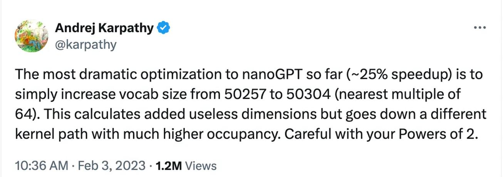

> "你可能会想，矩阵越大，吞吐量越高，因为你有更多工作要做。但你看，某些尺寸下你的 matmul 要慢得多。为什么？到这堂课结束时，你会理解这张图的每一个细节。"

**为什么 GPU 知识对每个人都有用**：

> "即使你不是系统方向的人——如果你想设计架构或只是理性讨论这些事，你**必须**理解你的模型在什么硬件上执行。Percy 第一节课就说了：scaling 的关键是有效利用资源。不理解系统，你永远无法高效利用资源。"

Tatsu 推荐的三个关键资源：
- **Horace He 的博客**——GPU 性能的深度解释
- **CUDA Mode / GPU Mode**——GPU 编程爱好者社区
- **JAX Scaling Book（TPU → GPU book）**——"Google 的这本资源非常棒，有配套练习。你的作业会跟这些练习有点像。"

**本讲的三部分结构**：

| 部分 | 内容 |
|------|------|
| **Part 1** | GPU 硬件基础——了解这个"异质设备"的哲学 |
| **Part 2** | 六个让 GPU 跑快的技巧——基本的性能优化积木 |
| **Part 3** | 实战：用这些积木重新发明并理解 FlashAttention——"这是我们的 victory lap" |

---

## 2. GPU 架构基础

### 2.1 CPU vs GPU：两种设计哲学

> Tatsu 首先建立两种芯片的根本差异："CPU 是为**快速串行执行**设计的——复杂的条件分支、复杂的控制流。因为要跑得快，CPU 有非常大的控制单元和少量 ALU。它的目标是最小化延迟——从发指令到完成指令之间的时间要极短。"

> "GPU 则完全不同——它的目标是**吞吐量（throughput）**。你分发一个任务，它可能很久才完成。你可能处理一个任务然后又暂停它去做另一个任务。但从整体看，你的总吞吐量远超 CPU。"

| 维度 | CPU | GPU |
|------|-----|-----|
| 目标 | **低延迟**（单个任务快速完成） | **高吞吐量**（总处理数据量最大） |
| 硬件 | 大量控制单元 + 少量 ALU | 少量控制单元 + **数百个轻量级计算核心** |
| 分支支持 | 强大的分支预测、乱序执行 | 弱（SIMT 模型——所有线程执行同一指令） |
| 类比 | 几个聪明的人快速完成不同任务 | 上千人同时做简单重复的工作 |

> "GPU 从 K20 和 M40 时代的'还算体面'到今天 H100 的超指数增长——没有 GPU scaling 就没有 LLM scaling。"

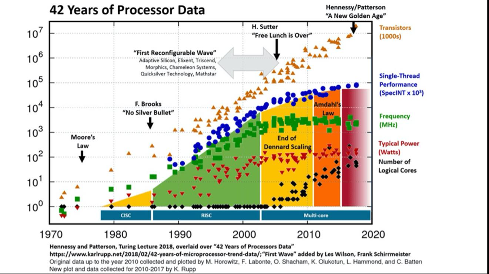

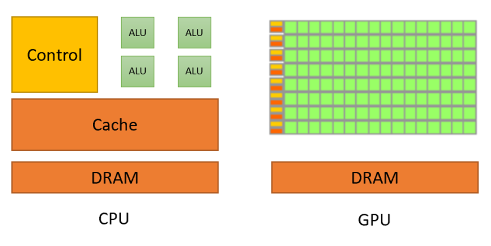
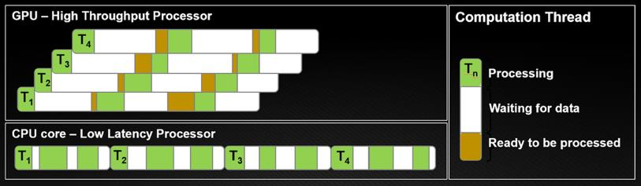

### 2.2 GPU 的解剖学

> "我不想让你把 GPU 看成 nvidia-smi 上的一串文字。我想让你能**在脑中可视化 GPU 的硬件**。"

**计算单元**：

- **SM（Streaming Multiprocessor，流式多处理器）**——GPU 的基本独立计算单元，像一个"核心"。"A100 有 108 个 SM（Tatsu 口误说成 128），每个 SM 可以独立编程、独立运行不同任务。"
- **SP（Streaming Processor）**——每个 SM 内部的执行单元。"SM 不是单个计算单元——它内部有 SP，可以并行执行不同线程。"

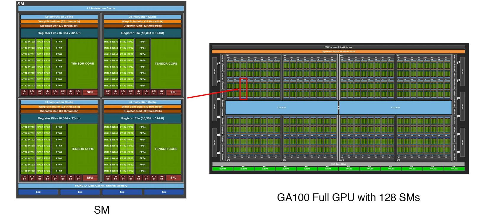

**内存层级**：

> "GPU 的优化更多是关于内存，而非计算。现代硬件和 LLM 的优化是由内存定义的。"

| 层级 | 位置 | 速度 | 容量 | 编程访问 |
|------|------|------|------|----------|
| **寄存器** | SM 内部 | 最快（~1 cycle） | 极小（每线程几十个） | 编译器自动管理 |
| **L1 / Shared Memory** | SM 内部 | 快（~20-30 cycles） | KB 级（~128KB/SM） | Shared Memory 可**编程**控制；L1 是透明缓存 |
| **L2 Cache** | 芯片上 | 中等（~200 cycles） | MB 级（40-50MB） | 透明 |
| **Global Memory (HBM/DRAM)** | 芯片旁边 | **慢**（~600 cycles） | GB 级（40-192GB） | 程序员可控 |

> **Shared Memory vs L1 Cache**："缓存对你是透明的——你无法控制它。Shared Memory 是你可以**编程**的——你手动把东西放进去、取出来。两者物理上都是 SRAM，区别在于**可编程性**和**物理距离**。"

> "既然 Shared Memory 这么棒，为什么不把整块芯片都做成 Shared Memory？因为它**贵几百倍**，而且能耗高得多。所以你必须尊重这个内存层级——把尽可能多的工作放在 Shared Memory 中完成。"

> Groq（后被 NVIDIA 收购）是一个例外——他们用巨大的 SRAM 设计了芯片。"对于推理等极度 memory-bound 的 workload，这种做法有优势。但对大多数加速器来说，内存层级是必需的。"

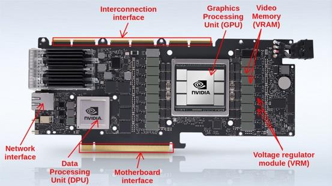
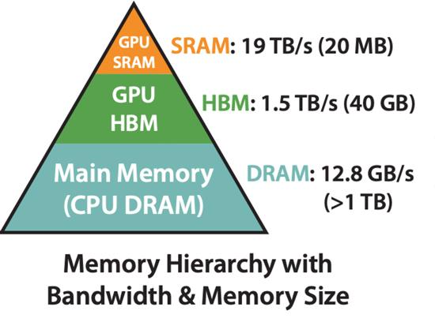
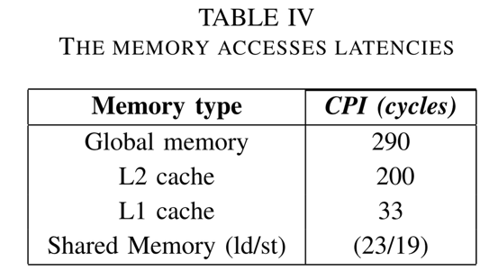
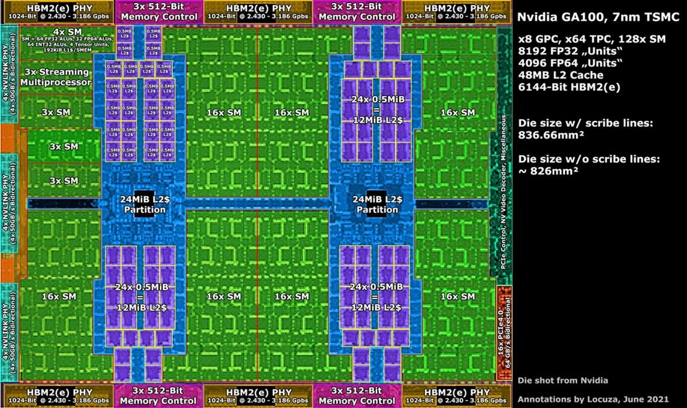

### 2.3 执行模型：Thread、Block、Warp

> "现在，我们有了硬件的脑内模型。接下来讨论软件和编程模型。"

| 概念 | 定义 | 关键特征 |
|------|------|----------|
| **Thread（线程）** | 最小执行单元 | 所有线程执行**相同指令**（SIMT: Single Instruction, Multiple Threads），但对不同数据操作 |
| **Block（线程块）** | 一组线程的组合 | 保证**在同一个 SM 上运行** → 可以共享该 SM 的 Shared Memory |
| **Warp（线程束）** | **32 个连续编号的线程** | GPU **指令调度的基本单位**——线程以 Warp 为单位一起执行 |

> 学生 Q："是 Block 内所有线程执行同一指令，还是 Warp 内？" Tatsu 答："是 **Warp 内的所有线程**执行同一指令。调度器决定哪个 Warp 接下来执行。"

> "为什么要有 Block？Warp 是调度单位，但 Shared Memory 需要在线程之间共享。Block 保证这些线程在同一个 SM 上，从而可以使用共同的 Shared Memory。这就是为什么 Tiling（后面会讲）能工作——同一个 Block 的线程重复使用同样的 Shared Memory 数据。"

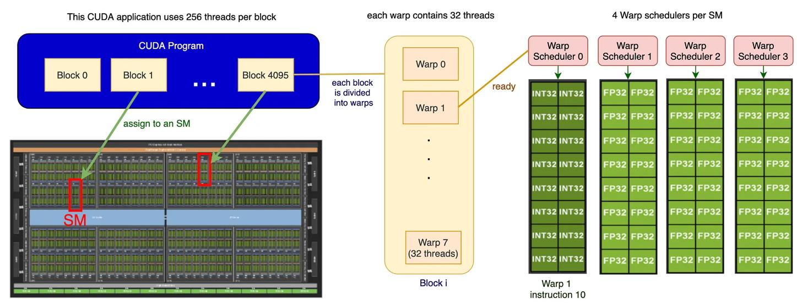

### 2.4 内存模型与层级

> "一旦你需要跨 Block 共享数据，就必须经过 Global Memory——这就是慢的来源。所以，**让 Block 内部尽量多用 Shared Memory、减少 Global Memory 读写——这是贯穿整堂课的主题**。"

- **寄存器**：线程私有，最快，编译器管理
- **Shared Memory**：Block 内共享，可编程，用于线程间数据复用
- **Global Memory**：所有 SM 可访问，慢，必须"心甘情愿地付出延迟代价"
- **Constant Memory / Host Memory**：较少使用/CPU 内存 Offload

> "线程是**轻量级**的——调度器可以随时暂停一个 Warp、切换到另一个就绪的 Warp，零开销。当某个 Warp 在等 Global Memory 数据时，SM 直接切换到别的 Warp 去用计算单元——这就是**延迟隐藏（latency hiding）**。"

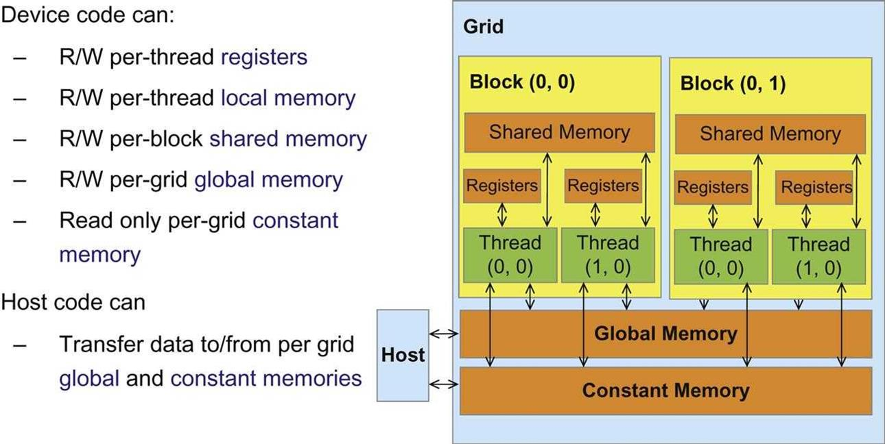

---

## 3. TPU 对比：收敛进化

> "如果你出去写代码、做模型，大部分人会选 GPU。但了解 TPU 很重要——不仅因为它们很酷，也因为 TPU 是 GPU 的**替代进化路径**。对比两者会让你看到什么相同、什么不同。"

**核心相似性**：如果你想做一个节能的 ML 加速器，你最终会在**同一个地方**结束——"这是收敛进化"。两者都有：
- 专用矩阵乘法电路（GPU: Tensor Core, TPU: MXU——两者底层都是**脉动阵列（systolic array）**）
- 可做并行向量运算的组件
- 某种控制逻辑
- **快慢内存的层级结构**（GPU: HBM ↔ Shared Mem, TPU: HBM ↔ SMEM）

> "TPU 某种意义上更简单——它们更针对 ML workload 优化。控制单元更轻量，矩阵乘法单元更大。"

**GPU vs TPU 对比**：

| 维度 | GPU（A100） | TPU（v5e） |
|------|------------|-----------|
| 处理器数量 | ~132 SM | 2 TXC（Tensor Core） |
| 矩阵乘法单元 | 528 个 Tensor Core | 8 个 MXU |
| 设计哲学 | 更多、更小的 matmul 单元 → 灵活 | 更少、更大的 matmul 单元 → 批处理效率极高 |

> "TPU 被锁在大矩阵乘法里。我们写论文做 batch size sweep 时，曲线在 64 就停了——为什么？因为 Tensor Core 拒绝接受小于 64 维的输入。"

> **⚠️ 命名陷阱**："TPU 把它们的 SM 叫成 **Tensor Core**。GPU 把它们的矩阵乘法单元叫成 **Tensor Core**。完全重名。你必须根据上下文区分——如果讲 TPU 的 Tensor Core = 处理器，GPU 的 Tensor Core = 矩阵乘法硬件。"

**TPU ↔ GPU 概念映射**（from JAX Scaling Book）：

| GPU 概念 | TPU 对应概念 |
|----------|-------------|
| Tensor Core（矩阵乘法单元） | MXU |
| SM | TXC |
| Shared Memory | SMEM |
| Warp | 无对应（TPU 不用 Warp） |

> "两者的根本区别不在单个芯片——最大的区别在**网络互联**。但这个 lecture 不讲，放到并行化的 lecture。"

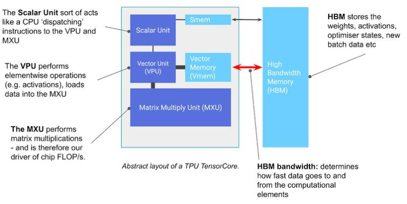
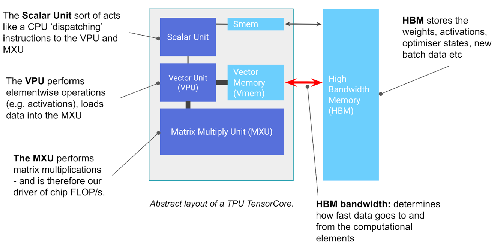

---

## 4. GPU 的历史：从图形着色器到 Tensor Core

> Tatsu 讲了一个"很酷的计算机科学 hack"故事：

在 Tensor Core 出现之前的早期 GPU 时代，**没有专门的矩阵乘法硬件**。人们意识到 GPU 的**可编程着色器（shaders）** 可以被 hack 来做矩阵乘法——通过不同的渲染设置可以"意外地"实现更快的 matmul。

> "这是最早的 GPU 上的通用科学计算——用图形硬件做矩阵乘法。但现在你不需要手动 hack 了。从 V100 开始，NVIDIA 直接给了你**专门的硬件来帮你做矩阵乘法**。"

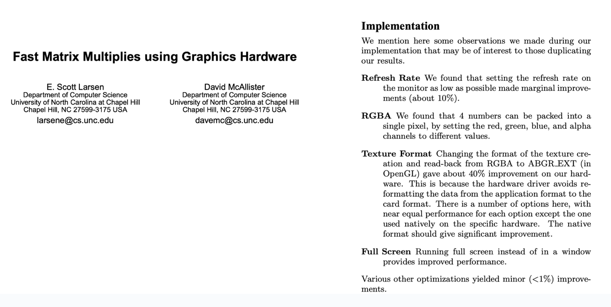

**Tensor Core 带来的革命**：

> "一旦 Tensor Core 存在，**matmul 成为机器学习中唯一被特权化的操作**——它的吞吐量比其他浮点运算高出 **10 倍以上**。这就是为什么在任何可预见的未来，任何随计算扩展的 ML 架构都必须包含矩阵乘法——这是你唯一能真正高效利用大量计算吞吐的方式。"

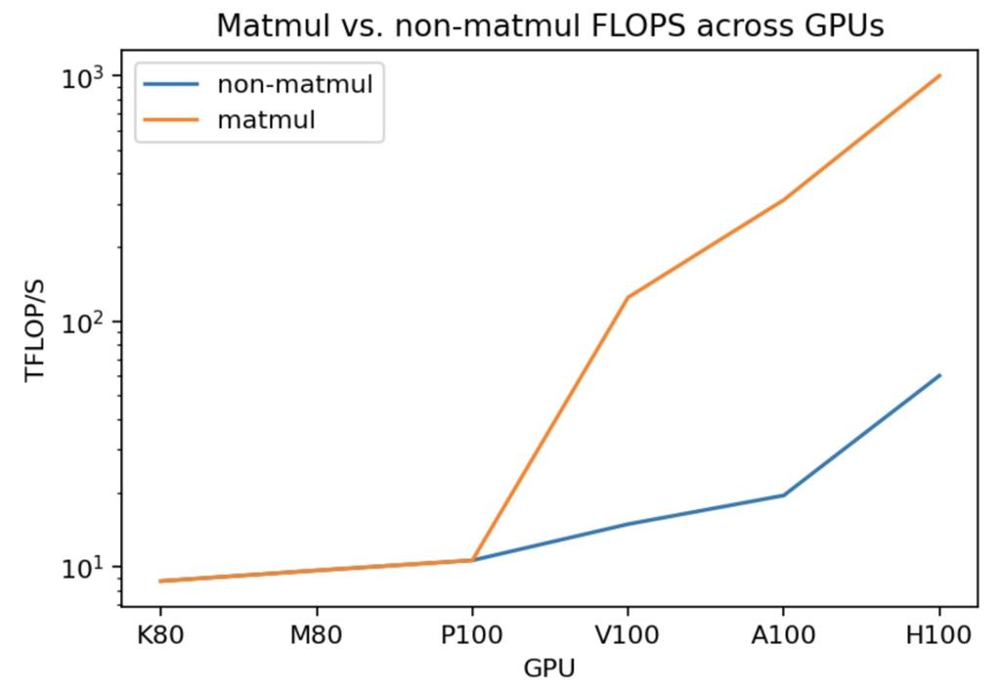

**Compute vs Memory 的剪刀差**：

> "不同组件以不同的速率在扩展。计算（灰线）增长飞快。内存带宽（绿线）增长相对缓慢。互联带宽（蓝线）增长更慢。这意味着，我们越往右走，**compute 和 memory 之间的鸿沟越大**——memory 和 communication 的瓶颈越来越严重。这就是为什么今天讲的几乎所有优化都是 memory 优化。"

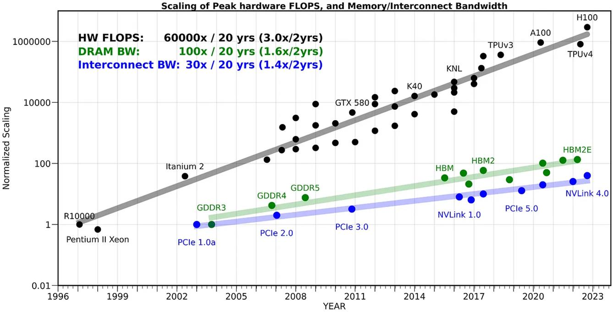

---

## 5. GPU 的性能优化：Six Tricks

> "你现在对 GPU 有了基本认识。第二部分的核心目标是：理解六个让 ML workload 在 GPU 上跑快的基础技巧。"

### 5.0 Roofline 模型与矩阵谜题

Tatsu 再次展示了那张矩阵性能谜题图，并引入 **Roofline 模型**来框架化所有后续讨论：

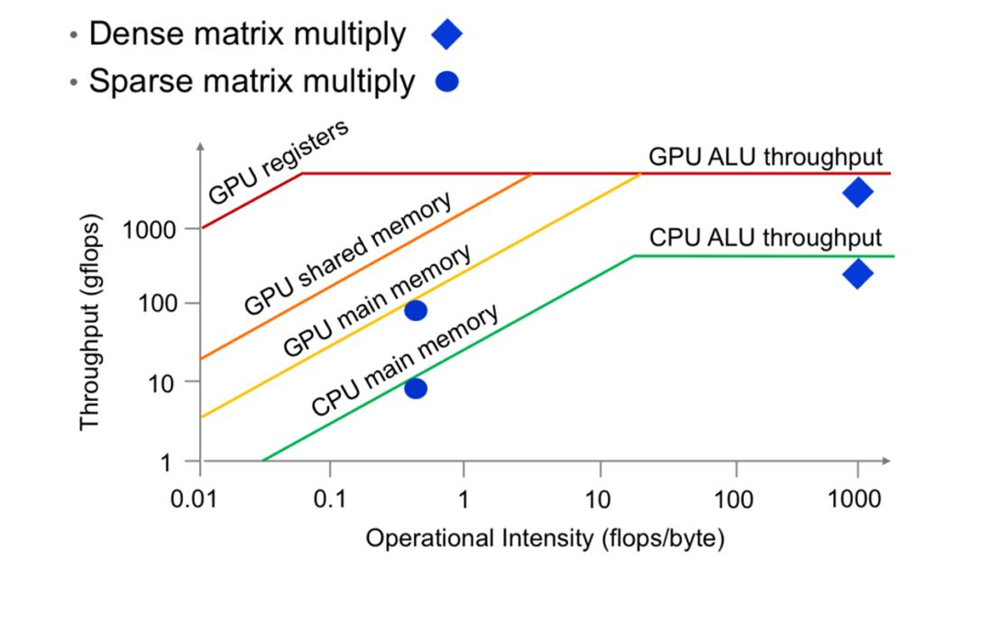

> "Roofline 模型告诉我们：在某个点之前，你是 memory-limited——再多计算也无法提升吞吐量，因为你被内存搬运速度卡住了。当你有了足够的计算密度（arithmetic intensity）后，你进入 compute-bound 的平坦区域——此时你已经完全饱和了你的计算单元，再多的 work 也不会帮你加速。"

> "**我们的目标就是让自己始终处于这个平坦的 compute-bound 区域——这意味着我们需要增加算术强度（每字节内存搬运对应多少 FLOPs）。** 以下六个技巧中，五个都是关于如何减少内存搬运、提高算术强度。"

### 5.1 控制分歧（Control Divergence）

> "这是唯一跟内存无关的一个——但它是 GPU 独有的关键坑。"

**问题**：Warp 内所有 32 个线程必须执行相同的指令。如果遇到 If/Else 分支：

- **CPU 的做法**：选一个分支，执行，继续——高效
- **GPU 的做法**：**两个分支都执行！** 不属于当前分支的线程被 mask 掉、**干等着**

> "每当你有条件分支，你的脑内图应该是：一部分线程先去一个分支（另一部分干等），然后反过来，再汇合。这导致严重的控制分歧——本来一 cycle 完成的，变成两个或更多 cycle。"

**解决方案**：用**算术操作替代分支**。例如 ReLU："你不会写 if x>0 then x else 0——你会用 `x * (x>0)` 或者 `max(0,x)`，这些操作作为乘法和比较，在 SIMT 模型下可以全部同时执行，不需要分支。"

> "如果你去看 GPU 代码，你会发现很多地方本该用 if 的，却用了 mask 乘法。"

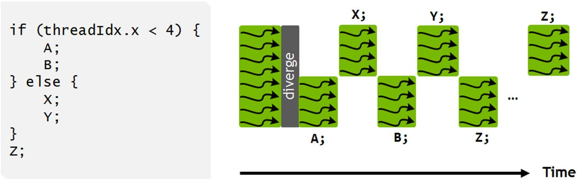
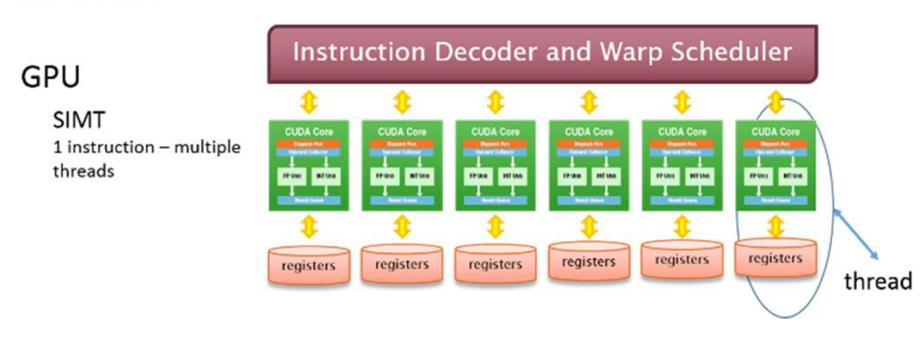

### 5.2 低精度计算

> "这是 NVIDIA 投入最大、我认为硬件层面最重要的一个方向。看 Bill Dally 那张超指数增长图 ——超出的那部分，很大程度来自**数值表示（number format）的演进**：FP32 → BF16/FP16 → Int8 → FP8 → ..."

**核心原理**：比特数越少 → 需要搬运的数据越少 → 算术强度（计算/搬运比）提高。

**以 ReLU 为例的简单算术**：

| 精度 | 内存访问 | 算术强度 |
|------|----------|----------|
| Float32 | 读 4B + 写 4B = **8B** | **8 bytes/FLOP** |
| Float16 | 读 2B + 写 2B = **4B** | **4 bytes/FLOP**（提升 2x） |

> "ReLU 是极度 memory-bound 的——几乎没有计算，全是内存搬运。精度翻倍直接砍半数据搬运量。"

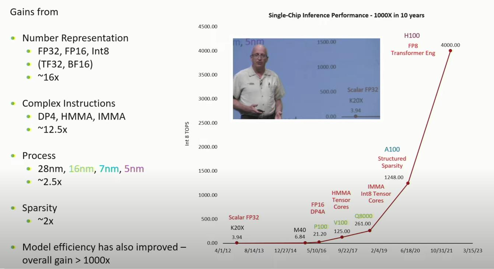

#### 低精度的艺术——不是简单的减少比特

> "低精度真正的'玄学'之处在于——**你不需要把所有东西都降到低精度**。你需要决定：哪些操作用什么精度。"

**实践中**：
- 矩阵乘法：权重和激活值都可以低精度（BF16 → FP8）
- **累加/部分和**：必须用 FP32（否则精度损失太大）
- **Softmax / 指数**：可能需要 FP32
- 一些层（尤其是第一层和最后一层）**很难量化**："最后一层对 loss 贡献太大了，量化它会导致不稳定和 loss 剧增。"

> "业界花了**好几年**才把低精度训练弄到今天这个状态——大量的增量式、经验性工作，一点点搞清楚哪些操作可以降精度、怎么降、如何保持训练稳定性。"

**Tensor Core 的低精度加速**（混合精度训练的标准做法）：
1. 将权重和激活值 cast 到 BF16/FP8
2. **在 Tensor Core 上以低精度做矩阵乘法**
3. **部分和累加到 FP32**
4. 输出为 FP32

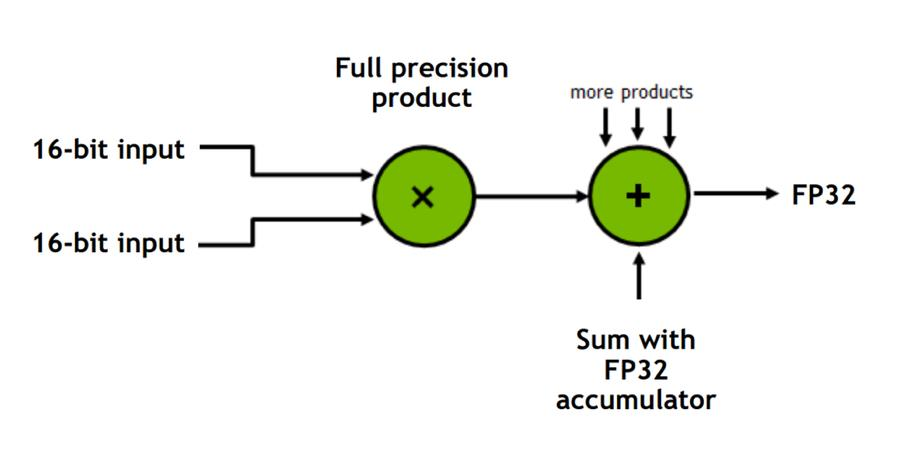
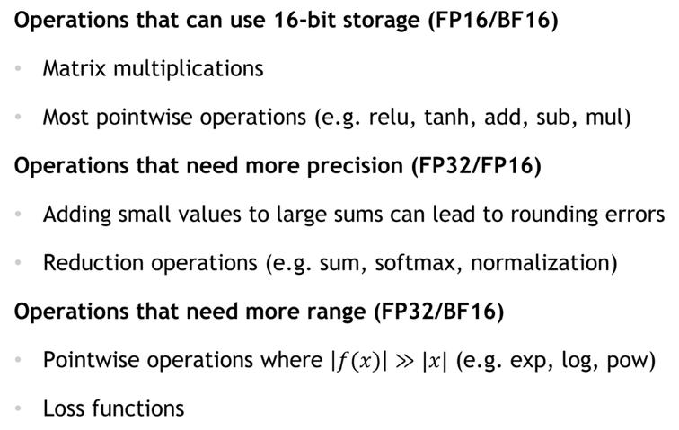

#### FP8 与 MXFP8

> "一旦到 FP8，没有一个通用的'标准'格式了。BF16 大家公认了。FP8 有两种：E4M3（4 位指数 + 3 位尾数）和 E5M2（5 位指数 + 2 位尾数），用于不同场景——没有一体适用的方案。"

**MXFP8（Microscaling FP8，Blackwell 架构引入）** 的核心创新：

- 拥有**多个 scale factors**，"因为矩阵的不同部分可能有截然不同的数值尺度"
- 每 32 个元素一个 scale factor，scale factor 本身也是 FP8（E8M0——只有指数），所以是 **power-of-2 scaling**
- 因为 scale factor 比传统 FP8 更细粒度 → MXFP8 的元素可以用 E4M3（更多 mantissa、少一点 exponent）

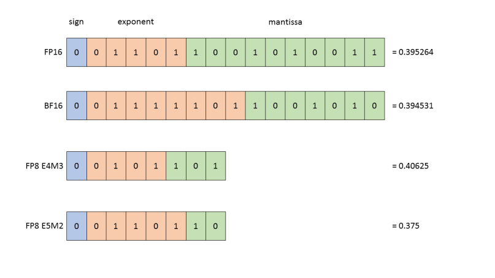
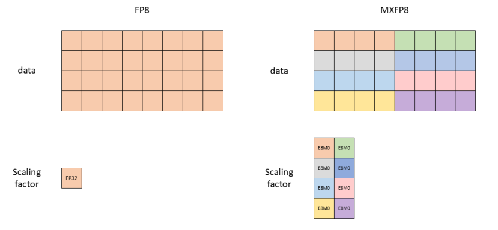
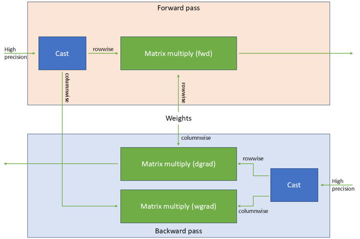

> **MXFP8 带来的一个奇怪后果**：**转置不再 trivial**。转置后 scale factor 的模式不对了，需要重新量化。实际做法是在训练时维护两个副本——原始矩阵的量化版和转置后的量化版。"我觉得这又疯狂又酷。"

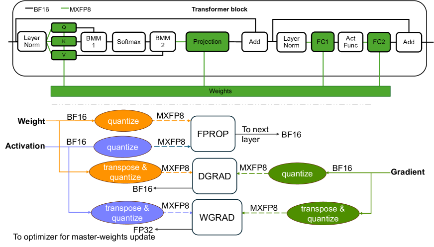

#### MXFP4——下一代

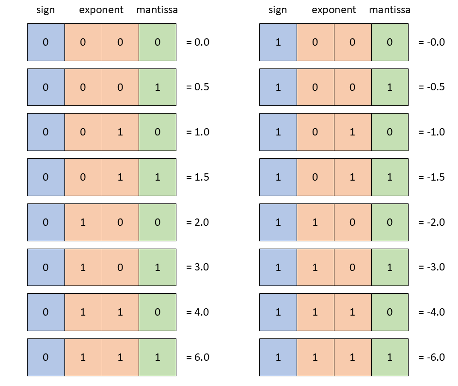

> "这是 MXFP4 能表示的所有值——-6 到 +6。它的 block size 是每 16 个元素一个 scale factor（E4M3）。"已经有论文用 FP4 训练了。我还没听说有人在生产环境中用 FP4 训出了真正的大模型——但这正在到来。下一代模型可能都是 FP4 训练的。"

### 5.3 算子融合（Operator Fusion）

> Tatsu 用"工厂生产线"的类比：

"想象 GPU 是一个工厂。你有原料仓库（Global Memory），有小工厂（SM）。然后有一条传送带（内存总线）来回运输。如果你有好多的小工序——每个都需要从仓库运来原料、加工、送回去——传送带会成为瓶颈。"

**解决方案**：把所有小工序合并成一个**巨型工厂**——"原料进来一次，在 SM 内部完成所有加工，成品直接送回仓库。"

> "这就是 **operator fusion**。原理极其简单，但你会惊讶于有多少地方它还没发生。"

**sin²x + cos²x 的例子**：

- **Naive PyTorch**：5 个运算 = 5 次 CUDA kernel launch = 5 次 HBM read + 5 次 HBM write
- **融合后**：1 次 **fused kernel** = 1 次 HBM read（x） + 所有计算在寄存器内完成 + 1 次 HBM write（output）

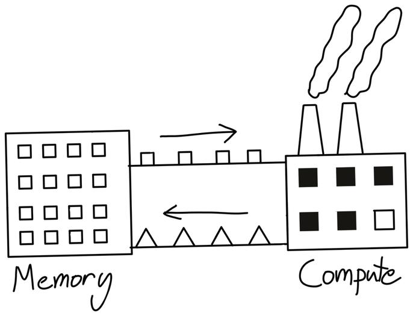
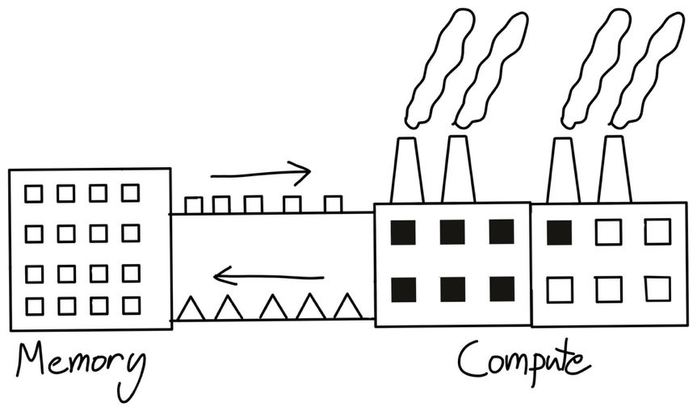

> "像这种'容易'的逐点操作融合——**编译器可以自动做**。`torch.compile` 或 JAX 编译器会自动检测这种模式并融合成单个 CUDA kernel，你不需要手动写 CUDA。"

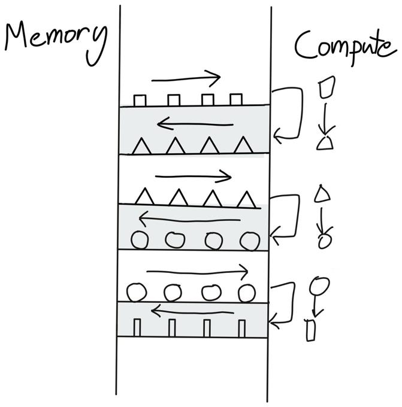
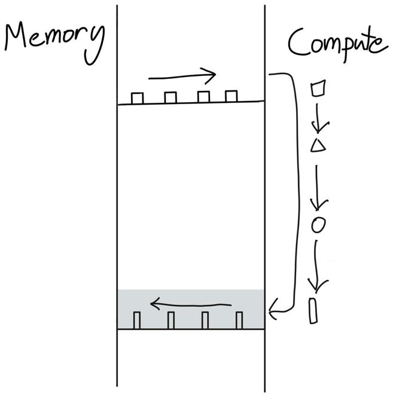

> "但**高级的融合**——比如把 softmax 和 matmul 融合在一起的 FlashAttention——需要手工设计和实现。编译器目前做不了这种。"

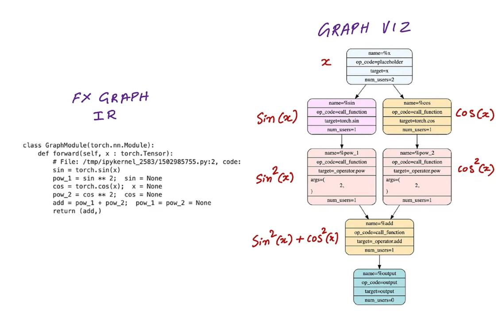
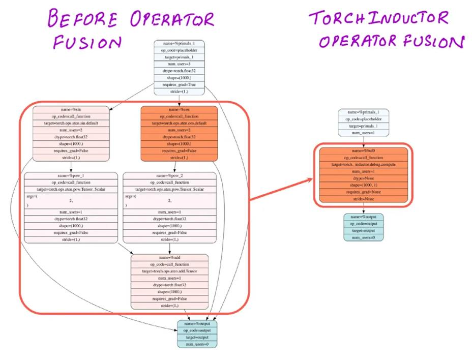

### 5.4 重计算（Recomputation）

> "我们不是在从数学角度思考'怎么算梯度'——我们在从**系统角度**思考：'怎么减少内存使用？'"

**反向传播的内存成本**：需要存储前向的所有中间激活值，然后在反向时逐一读出。

**例子——3 层 sigmoid**：8 次内存读写，算术强度极低。

> "**扔掉中间值，反向时重新计算**——这在系统上可能是最优的。"

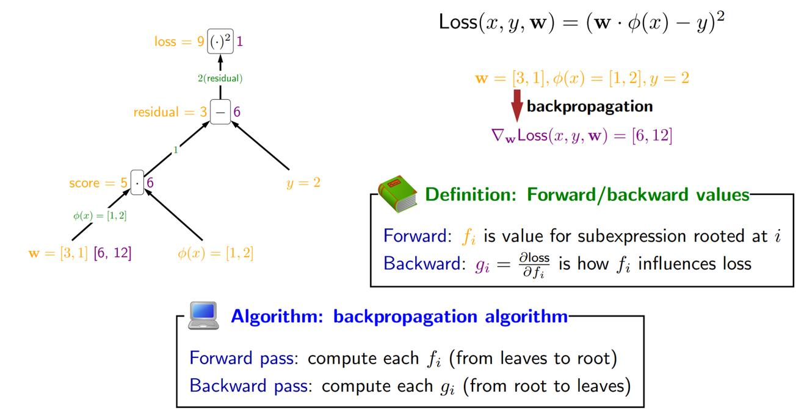
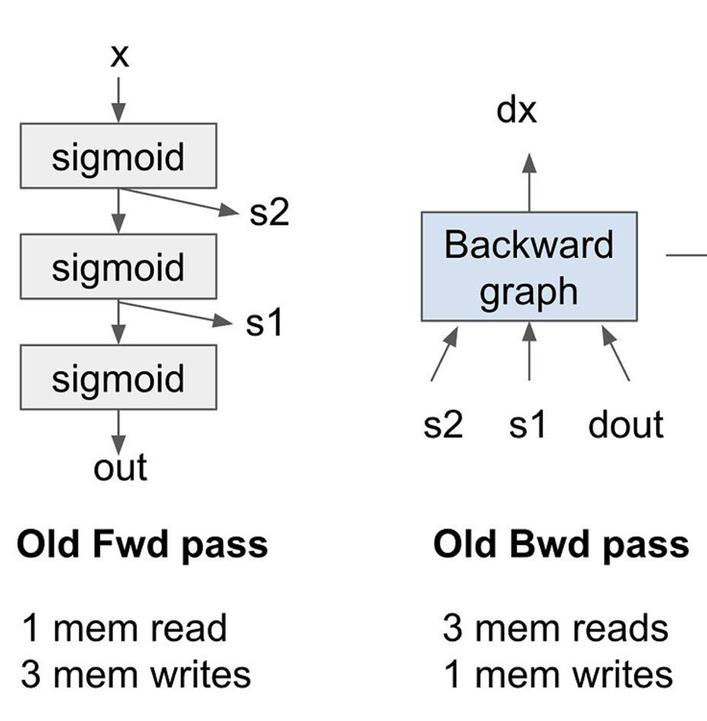
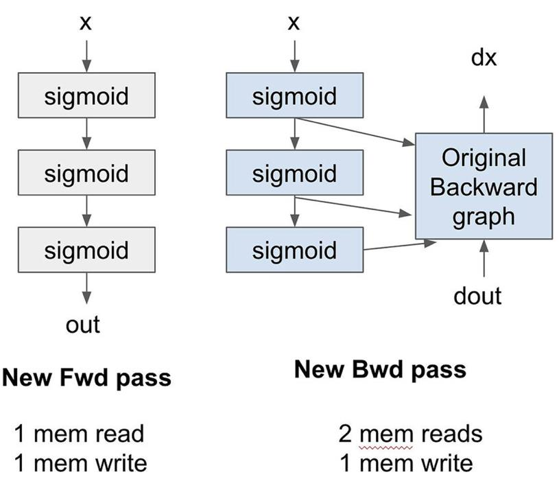

> 这在大模型训练中被广泛使用——PyTorch 的 `torch.utils.checkpoint` 就提供了 **activation checkpointing** 功能。用额外计算换取更少的显存。——"在显存是瓶颈的情况下，这是关键优化。"

### 5.5 内存合并访问（Memory Coalescing）

> Tatsu 解释 DRAM 的物理原理：

**DRAM 读数据的方式**：不是读单个字节，而是以 **burst mode（突发模式）** 读取一整行——一整行数据被复制到 sense amplifier（感应放大器），然后可以快速连续读取。

- **最佳情况**：Warp 中 32 个线程访问的所有数据恰好落在同一个 128 字节的 cache line 内 → **1 次内存事务**就完成全部 32 个线程的读取
- **最差情况**：32 个线程分散在 32 个不同的 cache line → **32 次内存事务**

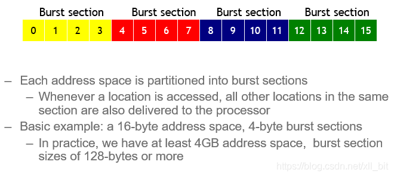
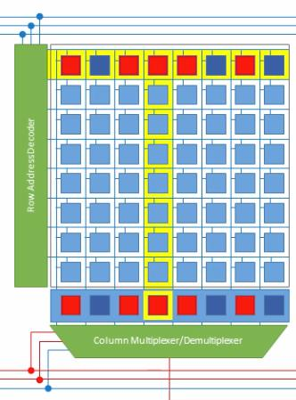

**在矩阵乘法中的应用**：

> "行优先存储的矩阵中，沿着行移动的线程——访问是分散的，无法 coalescing。沿着列移动——访问是连续的，可以 coalescing。"

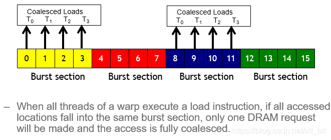
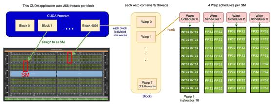
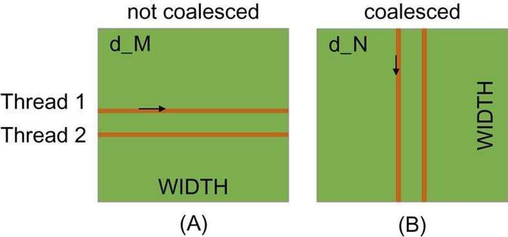
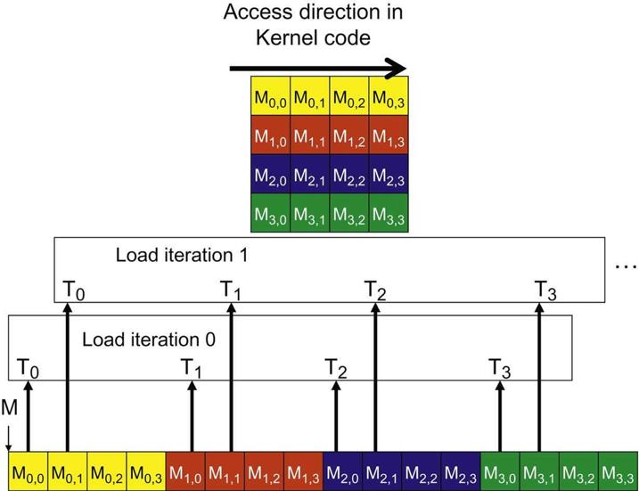

### 5.6 Tiling：分块计算

> Tatsu 称 Tiling 为 "the big one"（最重要的那个）。

**核心思想**："把大矩阵切成小块（tile），把 tile 加载到 Shared Memory 中重复使用——避免反复从 Global Memory 读取同一数据。"

**以矩阵乘法 P = M × N 为例的分阶段执行**：

| 步骤 | 操作 |
|------|------|
| 1 | 加载 M₀,₀ 和 N₀,₀ 的 tile → Shared Memory |
| 2 | Shared Memory 内计算 P 的部分和 |
| 3 | 加载 M₀,₁ 和 N₁,₀ 的 tile → Shared Memory |
| 4 | 累加到 P... |

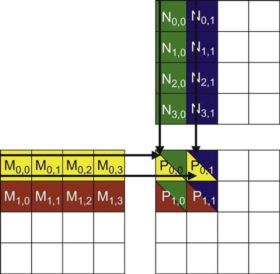
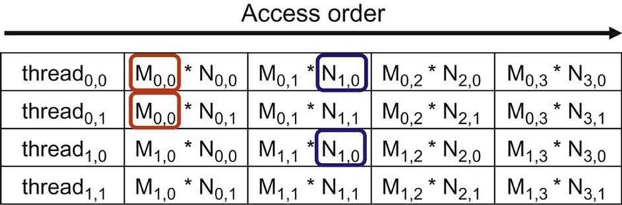

**关键收益**：
- 重复读取的数据从 Shared Memory（快）获取，而非 Global Memory（慢）
- 内存访问可以被合并（coalesced）

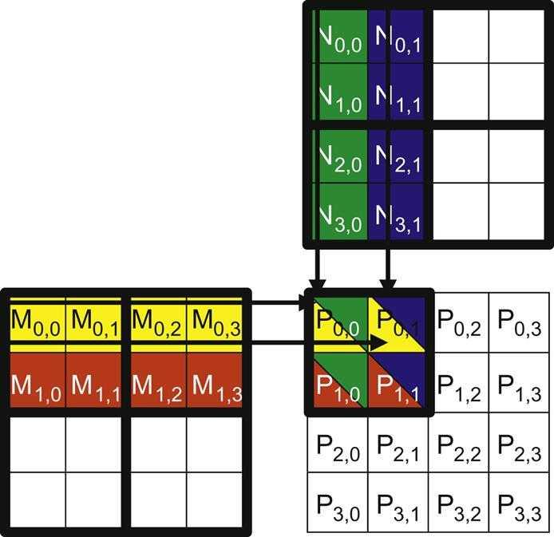

**量化分析**：

| 方案 | 每个输入被读几次 | |
|------|-----------------|------|
| 无 Tiling | **N 次**（全部从 Global Memory） | 基准 |
| 有 Tiling（tile size = T） | **N/T 次**（Global Memory）+ **T 次**（Shared Memory） | Global Memory 访问减少 **T 倍** |

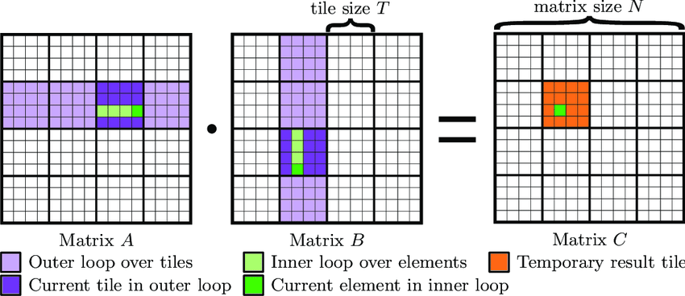

**两个实际挑战**：

1. **Tile Quant 问题**：tile size 可能无法整除矩阵维度 → 部分 tile 利用率低下
2. **内存对齐（Memory Alignment）**："内存以 burst 读取——当 burst 与矩阵对齐时，tile 加载才快。某些维度下合并访问是不可能的（需要 padding）。"

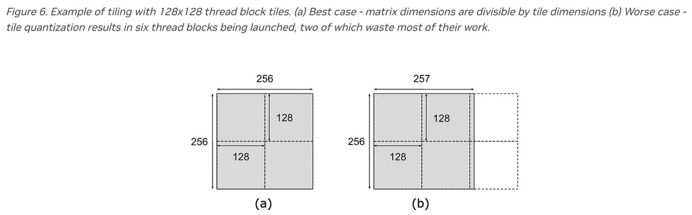
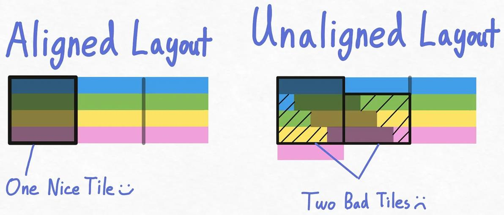

---

## 6. Wave Quantization：矩阵谜题解析

> "还记得我开篇承诺的吗？你现在应该能解释这个奇怪图形了。"

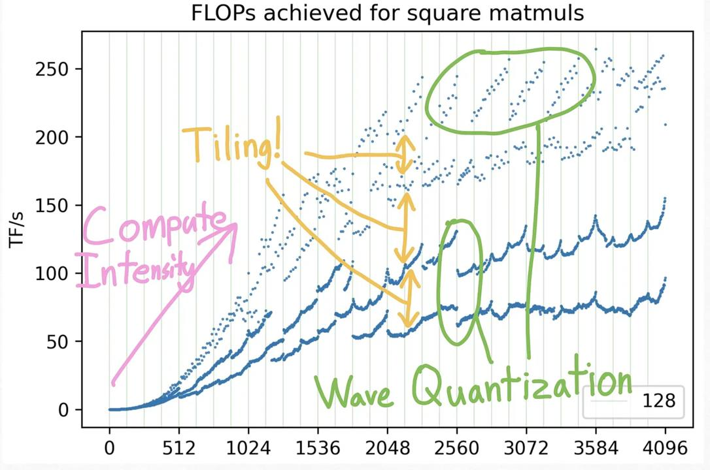
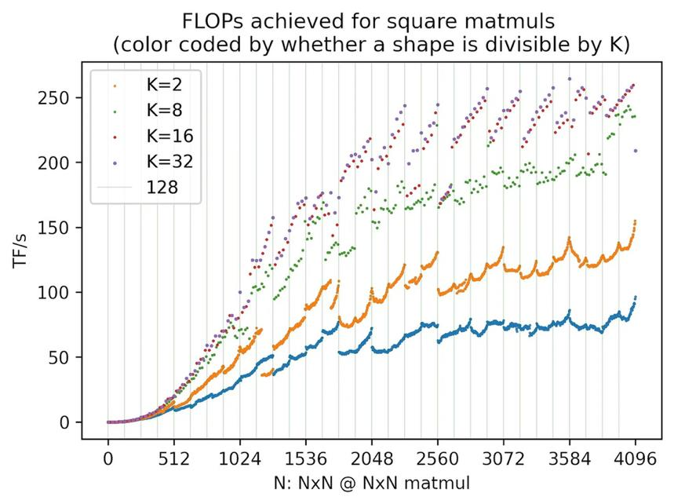
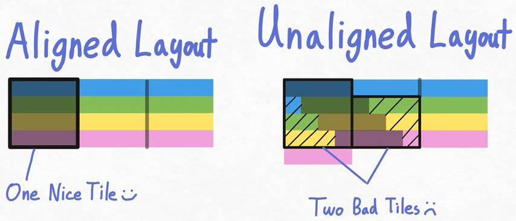

**Part 1: Tiling 的对齐效应**——更大的矩阵可能恰好与 tile size 更好对齐，浪费的 tile 空间更少。

**Part 2: Wave Quantization（"波量化"）**：

以 A100 GPU（108 个 SM）、256×128 的 tile size 为例：

| 矩阵大小 | tile 数量 | SM 调度 |
|----------|----------|---------|
| **1792×1792** | 7×14 = **98** tile → **1 次 wave**（<108 SM） |
| **1793×1793** | 8×15 = **120** tile → **需要 2 次 wave**（>108 SM，第二个 wave 只有 12 tile） |

> "矩阵只大了 1，但 tile 数量从 98 跃升到 120——因为无法整除的部分也占满了整个 tile。一个 SM 做不完，必须两轮 wave，延迟翻倍。这就是为什么 1793 比 1792 出现了戏剧性的性能下降。"

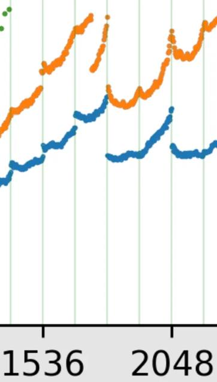

---

## 7. Flash Attention 深度解析

> "这是我们整堂课的**胜利巡礼**。到此为止，你拥有了理解并重新发明 Flash Attention 所需的所有工具。"

Flash Attention（[Dao et al.](https://arxiv.org/abs/2205.14135)）是如何工作的？答案就是前面讲的几项技术的组合。

**标准 Attention 计算** = 3 次矩阵乘法 + 一个 softmax 在中间。

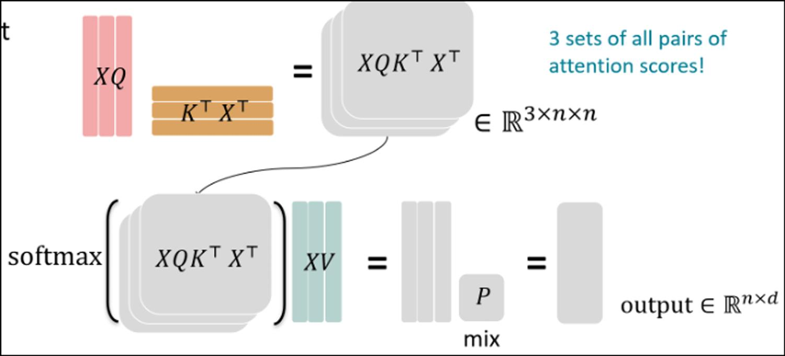

**Step 1: Tiling KQV**——对 KQV 的矩阵乘法做 tiling，和普通 matmul 一样。但有一个问题：**softmax 怎么办？** Softmax 需要全局归一化。

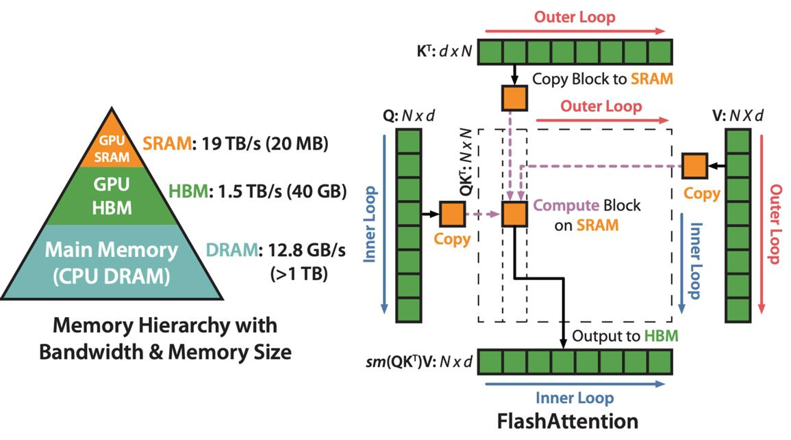

**Step 2: Online Softmax**（Milakov & Gimelshein, 2018）：

> 标准 softmax 需要两次遍历（找 max → 算 sum → 归一化）。Online softmax 的核心是**增量式维护最大值和累加和，使用 telescoping sum**：
> 1. 看到新数据时：比较新老 max，更新 max
> 2. 用新旧 max 的差值重新缩放已有的累加和
> 3. 新数据用新 max 归一化后加入累加和
>
> 这使得 softmax 可以**逐 tile 增量计算**，无需先看完所有数据。

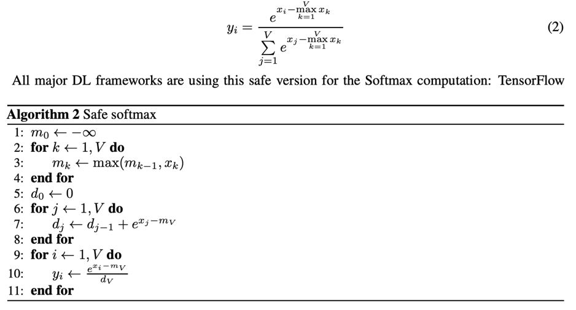
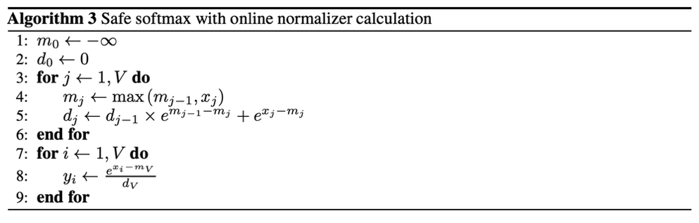

**Step 3: 组合一切**：

1. **Tile-wise 内积计算**：逐 tile 算 S = Q×K
2. **融合指数操作**：同一个 kernel 内计算 exp
3. **Tile-wise Softmax**：online softmax 的 telescoping sum 技巧
4. **中间结果不触及全局内存**——整个 attention matrix **从未被 materialize 到 HBM**，所有中间计算都在 Shared Memory 和寄存器内完成

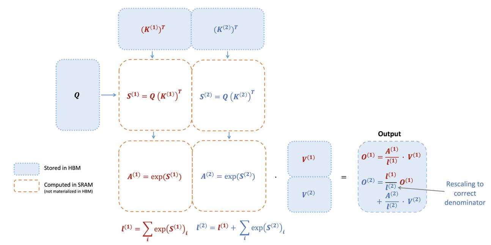

> "反向 pass 的原理类似——重新计算每个 tile 而不是存储整个 attention matrix。"

**总结：为什么 Flash Attention 快？**

| 技术 | 贡献 |
|------|------|
| **Tiling** | 数据在 Shared Memory 重复使用，减少 Global Memory 访问 |
| **Online Softmax** | 逐 tile 增量计算 softmax，无需两次全局遍历 |
| **Operator Fusion** | matmul + exp + normalization 融合为单个 CUDA kernel |
| **Recomputation**（反向） | 不存储 attention matrix，反向时 tile-by-tile 重算 |

这就是 Lecture 3 中说的 "Flash Attention 让你不需要 implement 完整 attention matrix"——它从根本上解决了 O(n²) 显存的 materialization 问题。

---

## 8. 总结

Tatsu 的三大要点：

1. **计算驱动 scaling**，底层细节决定了什么能 scale
2. **Memory 是核心瓶颈**——Compute 增长快于 Memory，差距在扩大。所有优化归根结底是 **减少数据搬运**
3. **理解硬件才能高效编程**——CPU 为低延迟设计，GPU 为高吞吐设计，TPU 是"更极端的 ML 专用版"

**六大优化技巧一览**：

| 技巧 | 一句话 | 解决什么 |
|------|--------|---------|
| **控制分歧** | 用 mask 乘法替代 if/else | Warp 内分支串行化的效率损失 |
| **低精度** | 减少每个值的比特数 | Memory-bound 的根源——数据搬运量 |
| **算子融合** | 合并多个 kernel 为一个 | 减少 HBM 往返（工厂流水线） |
| **重计算** | 扔掉中间值、反向时重算 | 节省显存带宽 |
| **内存合并** | Warp 访问对齐到同一 cache line | DRAM burst 事务数 |
| **Tiling** | 分块在 Shared Memory 中复用数据 | Global Memory 的重复读写——最核心的优化 |

**Flash Attention** = Tiling + Online Softmax + Operator Fusion + 反向重计算。它将 attention 的核心计算完全移到了 Shared Memory/寄存器内，避免了 O(n²) attention matrix 的 HBM 显存占用。

---

## 关键概念速查

| 概念 | 含义 |
|------|------|
| SIMT | Warp 内所有线程执行同一指令（Single Instruction, Multiple Threads） |
| SM | Streaming Multiprocessor — Block 所运行的独立硬件单元 |
| Warp | 32 个连续线程，GPU 指令调度的基本单位 |
| Shared Memory | SM 内部 SRAM，Block 内共享——可编程、极快 |
| Tensor Core | 专用矩阵乘法硬件，比普通浮点运算快 10x+；底层是脉动阵列 |
| Roofline | 算术强度 vs 吞吐的分析框架——memory-bound 区域 vs compute-bound 区域 |
| Tiling | 分块在 Shared Memory 中复用数据——减少 Global Memory 访问的核心技术 |
| Coalescing | Warp 访问合并为少量 DRAM burst 事务 |
| Wave Quantization | Tile 数不能被 SM 数整除导致的性能周期性波动 |

---

## 参考文献

- [Horace He 的博客](https://www.thonking.ai/p/what-shapes-do-matrix-multiplications) — 矩阵谜题和 Wave Quantization 的深入讨论
- [JAX Scaling Book — GPUs](https://jax-ml.github.io/scaling-book/gpus/) — GPU 性能的详细资源
- [Flash Attention (Dao et al., 2022)](https://arxiv.org/abs/2205.14135)
- [Flash Attention 2 (Dao, 2023)](https://arxiv.org/abs/2307.08691)
- [Online Softmax (Milakov & Gimelshein, 2018)](https://arxiv.org/abs/1805.02867)
- [Bill Dally, HotChips Keynote](https://www.youtube.com/watch?v=9BjVUmaXaCQ) — GPU scaling 趋势
- [Nemotron-3 Super (NVIDIA, 2026)](https://arxiv.org/html/2506.08027v2) — MXFP8 训练实践
- [GPU Performance Guide (NVIDIA)](https://docs.nvidia.com/deeplearning/performance/dl-performance-matrix-multiplication/index.html)
- [Larson & Chung (1999)](https://dl.acm.org/doi/abs/10.1145/190052.190058) — 最早的 GPU matmul hack 论文
- [EECV 2020 Mixed Precision Tutorial](https://nvlabs.github.io/eccv2020-mixed-precision-tutorial/files/dusan_stosic-training-neural-networks-with-tensor-cores.pdf)
- [CS336 Course Website](https://cs336.stanford.edu/)
