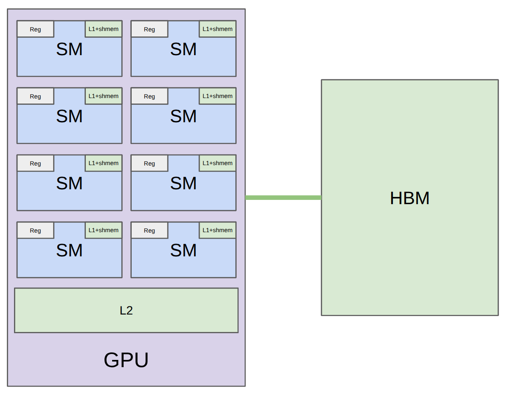

# CS336 Lecture 6: GPU Kernel 编程 — Benchmarking, Profiling, Triton

> **课程**: Stanford CS336 — Language Models From Scratch (Spring 2026)
> **讲师**: Percy Liang（本讲）、Tatsu（上讲）
> **课程网站**: [https://cs336.stanford.edu/](https://cs336.stanford.edu/)
> **课件**: `lecture_06.py` — 交互式 Jupyter notebook 风格代码

---

## 目录

1. [上讲到本讲：从理解到实践](#1-上讲到本讲从理解到实践)
2. [GPU 硬件深化复习](#2-gpu-硬件深化复习)
   - [2.1 三代 GPU 的关键数字](#21-三代-gpu-的关键数字)
   - [2.2 编程模型：Grid → Block → Thread](#22-编程模型grid--block--thread)
   - [2.3 硬件细节决定性能](#23-硬件细节决定性能)
3. [Benchmarking 与 Profiling](#3-benchmarking-与-profiling)
   - [3.1 Benchmarking：端到端时间测量](#31-benchmarking端到端时间测量)
   - [3.2 Profiling：时间花在哪里 + 底层到底在做什么](#32-profiling时间花在哪里--底层到底在做什么)
4. [案例分析：GeLU 的三种实现](#4-案例分析gelu-的三种实现)
5. [Triton：以 Block 为中心的编程范式](#5-triton以-block-为中心的编程范式)
6. [Triton Kernel 实战四阶梯](#6-triton-kernel-实战四阶梯)
   - [6.1 GeLU — 最简单的逐元素操作](#61-gelu--最简单的逐元素操作)
   - [6.2 Softmax — 整行放在一个 Block 内的行级归约](#62-softmax--整行放在一个-block-内的行级归约)
   - [6.3 Row Sum — 行超出 Block 大小：引入 Tiling](#63-row-sum--行超出-block-大小引入-tiling)
   - [6.4 Matmul + ReLU — 二维 Tiling + 共享内存 + Kernel Fusion](#64-matmul--relu--二维-tiling--共享内存--kernel-fusion)
7. [总结](#7-总结)

---

## 1. 上讲到本讲：从理解到实践

> "上堂课 Tatsu 做了很好的高层次概述——GPU 是什么，如何思考性能，以及 GPU 的各种'怪癖'。本讲是延续——我们会**深入代码**，亲手写 Triton kernel，做 benchmarking 和 profiling。"

本讲的**四阶段递进**：

```
GPU 硬件复习 → Benchmarking & Profiling → GeLU 案例三种实现对比 →
    → 写 4 个难度递增的 Triton kernel：
       GeLU（逐元素）→ Softmax（行内归约，整行在 Block）→ 
       Row Sum（行超 Block，Baby Tiling）→ Matmul+ReLU（完整 Tiling + Fusion）
```

---

## 2. GPU 硬件深化复习

### 2.1 三代 GPU 的关键数字

Percy 从量化角度对比了三代 NVIDIA GPU：

| 规格 | A100 | H100 | B200 |
|------|------|------|------|
| **SM 数量** | 108 | 132 | 148 |
| **寄存器 / SM** | 256 KB (65,536 个 32-bit 寄存器) | 256 KB | 256 KB |
| **L1 / Shared Memory / SM** | 192 KB | 256 KB | 256 KB |
| **L2 Cache（全芯片共享）** | 40 MB | 50 MB | 96-126 MB |
| **HBM 容量** | 80 GB | 80 GB | **192 GB** |
| **HBM 带宽** | 2 TB/s | 3.35 TB/s | **8 TB/s** |

> Percy 点明趋势："SM 数量和寄存器大小基本没变。**HBM 是增长最快的那个数字**。越往右，内存容量和带宽都在涨，但计算涨得更快——memory wall 在加剧。"

每个 SM 内部的带宽呈反比关系：寄存器最快 → L1 次之 → L2 较慢 → HBM 最慢（但"8 TB/s 在绝对意义上也不算慢"）。

> "大内存（HBM）是慢的、远的但是大的。快内存（寄存器、L1）是 SM 本地、快速的但是小的。这就是你需要在脑中维持的环境。"

**B200 的新特性**（对程序员透明）：
- **Tensor Memory (TMEM)**：介于寄存器和 Shared Memory 之间的专用缓存，服务于 Tensor Core
- **Thread Block Clusters**：允许跨 Block 的分布式 Shared Memory（H100 起）

### 2.2 编程模型：Grid → Block → Thread

```
Grid ─── 所有 Thread Block 的集合
  ├── Thread Block (CTA) ─── 一组线程 + 共享 Shared Memory
  │     ├── Thread₀  Thread₁  ...  Threadₙ
  │     └── 所有线程可以访问同一个 Shared Memory
  └── 跨 Block 通信 → 只能通过 HBM（慢）
```



> "当你 launch 一个 kernel，你实际上在 launch 一个 **grid**——所有 thread block 中的所有线程同时并行运行。"

**为什么要有 Thread Block？**——Percy 给出了清晰的解释：

> "如果所有操作都是逐元素的（element-wise），你完全可以没有 Block——每个线程处理一个元素就够了。`f(i), i = 0, ..., N-1`。线程是最自然的。"

> "但一旦你需要**线程间通信**——比如 Softmax（需要整行归一化）、矩阵乘法（需要部分和）——纯线程模型就不够了。**你当然可以全部通过 HBM 读写来通信——但那太慢了。**"

> "所以你需要 Shared Memory（SM 本地、快速）。**Thread Block 就是一组可以访问同一 Shared Memory 的线程的集合**。一个 Thread Block 被调度到一个 SM 上。它做的事情是：从 HBM 读一块数据 → 在 Shared Memory 中通信和计算 → 写回 HBM。"

> "在 Triton 中，你天生就以 Thread Block 为单位思考。一旦你习惯了这种思维模式，生活就简单多了。"

### 2.3 硬件细节决定性能

> "编程模型很简洁——你定义 Thread Block、每个 Block 做什么。**只要正确性，这些就够了**。但在实践中，**性能对硬件非常敏感**。你必须深入理解硬件才能获得高性能。"

Percy 用五个具体例子说明了编程模型与硬件之间的差距：

#### 1. Warp 与控制分歧

- Warp = 32 个连续线程，是 GPU 指令调度的基本单位
- 同一 Warp 内所有线程**必须执行同一指令（lockstep）**
- 遇到 `if A else B` → A 线程先执行（B 线程干等），然后 B 线程执行（A 线程干等）→ **串行化**，效率减半
- **但要避免分支**——用 mask 乘法替代 if

> "SM 同时跑多个 Warp。当某个 Warp 在等 HBM 数据时，warp scheduler 可以**零开销切换**到另一个就绪的 Warp。这对隐藏延迟至关重要。"

#### 2. Warp Occupancy（占用率）

- 每个线程最多用 **255 个寄存器**
- SM 有固定数量的寄存器 → 每个线程用越多寄存器 → 可并发运行的 Warp 越少 → Occupancy 越低
- **但低 Occupancy 不一定是坏事**：如果每个线程做更多工作（thread coarsening），低 Occupancy 也可以高效
- 例如一个线程处理 8 个元素（而非 1 个）→ 更少的线程 → 更少的调度开销 + 更粗粒度的工作

**计算示例**（课件代码）：128 threads/block × 160 regs/thread = 20,480 regs/block → 65,536 ÷ 20,480 = 3 blocks/SM → 12 warps → 12/64 = **18.75% occupancy**

#### 3. Bank Conflicts（Shared Memory）

- Shared Memory 分为 **32 个 bank**，每个 bank 4 字节宽
- 每个 clock cycle，每个 bank **只能被 1 个线程访问**
- 多线程访问同一 bank → 访问串行化 → **bank conflict**
- **最坏情况**：32 个线程访问同一 bank → **32-way bank conflict**（比如矩阵第一列的 32 个元素）
- **无法完全避免**——matmul 需要同时访问行和列，总有一个方向会遇到 bank conflict
- 解决方案：**swizzling**（地址重排，如 row XOR col）

#### 4. Memory Coalescing（HBM）

- Warp 中 32 个线程访问 HBM 时，访问被合并为 **128 字节的 cache line 事务**
- **Best case**（full coalescing）：全部 32 个线程访问同一 cache line → 1 次事务
- **Worst case**：32 个线程分散在 32 个 cache line → 32 次事务

> "这跟 bank conflict 感觉很相似，但**是完全不同的约束**——bank conflict 是 Shared Memory 的问题，coalescing 是 HBM 的问题。"

#### 5. Block Occupancy 与 Wave Quantization

- B200 有 148 个 SM。如果你 launch 160 个 Thread Block：
  - **第一 wave**：148 个 → 全 SM 被利用
  - **第二 wave**：只剩 12 个 → 剩下 136 个 SM**空闲**
- **解决方案**：让 Thread Block 的总数是 SM 数量的整数倍

> "当最后一个 wave 得不到足够的 thread block 填满所有 SM 时，这就叫 block occupancy 低。改变 block size 来控制 block 数量可以解决这个问题。"

**总结 — 编程模型 vs 硬件现实**：

> "编程模型很优雅：Grid → Thread Block → Thread，HBM 全局 → Shared Memory 局部 → 寄存器私有。但**硬件的所有细节——warp、bank conflict、coalescing、occupancy——才真正决定性能**。很多细节你可能根本不知道——profiler 给你一些信息，但 scheduler 的行为你无法完全控制。这比编程模型要 messy 得多。"

---

## 3. Benchmarking 与 Profiling

> "我总是强调 benchmarking 和 profiling 先于写 kernel。**先测量瓶颈在哪里，再动手改代码**。"

### 3.1 Benchmarking：端到端时间测量

Benchmarking 告诉你"跑多久"——就一个数字。但这很有用：
- 比较不同实现（哪个更快？）
- 观察如何随 dimension 变化（scaling trend）

**三个关键 Benchmarking 细节**：

1. **Warmup**——"因为有些东西是 lazy compiled 的，首次运行偏慢。你关心的是**重复运行时的稳态时间**，初始的编译开销不应计入。"
2. **CUDA Events（而非 `time.time()`）**——"因为 GPU 是异步的，你需要用 CUDA events 来精确测量**GPU 端的时间**。"

```python
start_event = torch.cuda.Event(enable_timing=True)
end_event = torch.cuda.Event(enable_timing=True)
start_event.record()
run()                        # 执行操作
end_event.record()
torch.cuda.synchronize()     # 等待 GPU 完成
elapsed_ms = start_event.elapsed_time(end_event)
```

3. **多次运行取平均**——有 variance。"如果你非常在意，可能需要看 P95 或整个分布，但这里取平均就够了。"

**Scaling trend 的观察**：

> "矩阵乘法在小 dim 下时间基本常数——因为 GPU 就是为大矩阵乘法设计的。你在 2×2 的矩阵上跑，效率极低。到了 ~2000 维以后，才开始看到 cubic scaling。这就是 GPU 的甜区。"

### 3.2 Profiling：时间花在哪里 + 底层到底在做什么

Profiling 告诉你**时间花在哪个 kernel 上**。更重要的是——"即使不关心时间，profiling 也能帮助你**理解底层到底发生了什么**。"

PyTorch 内置 profiler 的使用：

```python
with torch.profiler.profile(activities=[ProfilerActivity.CUDA]) as prof:
    run()
    torch.cuda.synchronize()
print(prof.key_averages().table(sort_by="cuda_time_total", row_limit=10))
```

**两个重要观察**：

1. **CUDA kernel 的名字暴露了实现细节**：
   ```
   cutlass3x_sm100_simt_sgemm_f32_f32_64x64x16...
   ```
   - `cutlass` = NVIDIA 线性代数库
   - `sm100` = Blackwell 架构
   - `f32` = Float32 精度
   - `64x64x16` = **tile 形状**（M×N×K）

2. **不同维度调用不同 kernel**——"128×128 matmul 用的 tile 是 32×32×16，而 2048×2048 用的是 64×64×16。PyTorch 在底层根据 tensor 维度选择最优实现。"

> "作业中你会用到 Nsight——比 PyTorch profiler 更详细的 profiling 工具。"

---

## 4. 案例分析：GeLU 的三种实现

Percy 用 GeLU 作为第一个完整的 Benchmarking + Profiling 案例。

**三种实现**：

| 实现 | 代码 | 速度 |
|------|------|------|
| **naive_gelu** | `0.5*x*(1+tanh(0.7979*(x+0.0447*x³)))` 在 PyTorch 中逐操作写 | **慢**（3.75ms） |
| **builtin_gelu** | `F.gelu(x, approximate='tanh')` | **快** |
| **compiled_gelu** | `torch.compile(naive_gelu)` | **快**（接近 builtin） |

> "三者算出的答案完全一样——但性能天差地别。为什么？把 profiler 拉出来看看。"

**Profiling 揭示的真相**：

- **Naive**：profiler 显示**多个 CUDA kernel**——`binary functor`、`unary add`、`tanh` 等分别调用。"每个运算都是一个独立 kernel。Kernel 间必须从 HBM 读、写回 HBM。**没有 kernel fusion。这就是慢的原因**。"
- **Builtin**：**一个 kernel**——`gelu CUDA kernel`。"因为 GeLU 被广泛使用，有人为它写了融合 kernel 放进标准库。**没什么魔法**。"
- **Compiled**：**一个 kernel**——而且是**Triton kernel**。"编译器看了你的计算图，自动生成了融合的 Triton kernel。这就是 `torch.compile` 做的事。"

> "Naive 需要多次 HBM 读/写——因为 kernel 间必须通过 HBM 通信。Builtin 和 compiled 都是一次 HBM 读 + 所有计算在 SM 内 + 一次 HBM 写。**这就是 operator fusion**。"

---

## 5. Triton：以 Block 为中心的编程范式

> "Triton 由 OpenAI 开发，现在已经相当标准。你用 Python 写 kernel——但同时你在直接管理内存读写。"

**CUDA vs Triton 的对比**：

| | CUDA（NVIDIA, 传统） | Triton（OpenAI, 现代） |
|------|---------------------|----------------------|
| **编程模型** | 每个 **Thread** 做什么 | 每个 **Thread Block** 做什么 |
| **优势** | 细粒度控制，与硬件一一对应 | 概念上更简洁，不需要显式管理同步 |
| **劣势** | 需要管理同步、Shared Memory 等细节 | 不够灵活（对最新硬件特性的利用有限） |

> "在 CUDA 中，你以线程为单位——每个线程有个 ID，你写它在自己的数据上做什么。好处是跟硬件模型精确对应。但对于需要线程间通信的操作（如 softmax），CUDA 会变得**非常烦人**——你需要显式同步、显式管理 Shared Memory。这就是 Triton 的价值——**你以 Block 为单位**，Block 内的同步和 Shared Memory 管理由 Triton 编译器处理。"

> "Triton 的概念框架：**将数据加载到 Shared Memory → 在 Shared Memory 中操作 → 写回 Global Memory**。这是一种介于 PyTorch（巨大矩阵整体操作）和 CUDA（逐元素/逐线程）之间的中间抽象。"

**Triton 的编译流程**：

> "你写的 Triton 代码实际上**不是 GPU 上执行的**。它是一种 specification。Triton 编译器把它编译成 **PTX**（Parallel Thread Execution）——GPU 的中间汇编语言——然后再编译成实际硬件可执行的代码。"

---

## 6. Triton Kernel 实战四阶梯

Percy 设计了四个难度递增的 kernel，从逐元素到完整 tiling：

> "GeLU 虽然计算本身看起来 messy，但在概念的层面上它是最简单的——纯逐元素。然后是 Softmax（需要行级归约但整行在 Block 内），然后是 Row Sum（行超过 Block 大小——引入 tiling），最后是 Matmul——完整 tiling 的典范例子。到那时，你就有所有写 Flash Attention 所需的素材了。"

### 6.1 GeLU — 最简单的逐元素操作

**Host 端配置**（把数据切分成 Block）：

```python
num_elements = x.numel()         # 比如 8192
BLOCK_SIZE = 1024                 # 每个 Block 处理 1024 个元素
num_blocks = triton.cdiv(num_elements, BLOCK_SIZE)  # 8 个 Block

# | T₀...T₁₀₂₃ | T₁₀₂₄...T₂₀₄₇ | ... | T₇₁₆₈...T₈₁₉₁ |
#     Block 0         Block 1              Block 7
```

**Kernel 函数**：

```python
@triton.jit
def triton_gelu_kernel(x_ptr, y_ptr, num_elements, BLOCK_SIZE: tl.constexpr):
    # "我醒过来——我是谁？"
    pid = tl.program_id(axis=0)            # 哪个 Block？
    start = pid * BLOCK_SIZE               # 这个 Block 的起始位置
    offsets = start + tl.arange(0, BLOCK_SIZE)  # Block 内的所有偏移
    mask = offsets < num_elements          # 边界保护（最后一个 Block 可能不满）

    # "读 → 算 → 写" 一次往返
    x = tl.load(x_ptr + offsets, mask=mask)     # HBM → Shared Memory/Register
    a = 0.79788456 * (x + 0.044715 * x * x * x)
    tanh = (tl.exp(2*a) - 1) / (tl.exp(2*a) + 1)
    y = 0.5 * x * (1 + tanh)
    tl.store(y_ptr + offsets, y, mask=mask)     # Shared Memory/Register → HBM
```

> Percy 强调 pointer 的概念："`x_ptr` 是一个整数——HBM 中的内存地址。在 Triton 中，你不是在返回值——你在显式地从地址读、向地址写。你需要习惯这种指针运算。"

#### 生成的 PTX（GPU 汇编）

Triton → 编译 → PTX → 硬件执行。

> "这是现在**一个线程**实际执行的代码——不是 thread block，因为 block 的抽象已经被编译掉了。"

关键观察：
- `ld.global.*` = 从 HBM 加载到寄存器
- `st.global.*` = 从寄存器写回 HBM
- `%ctaid.x` = Block 索引，`%tid.x` = 线程索引
- 编译器做了 **thread coarsening**——一个线程处理 **8 个元素**而不是 1 个

> "编译器判断这个线程太轻量了，决定'增肥'它——让它处理 8 个元素而不是 1 个。看 PTX 可以让你对底层实际发生的事情有更直观的感受。"

**被问到"PTX 是每个线程都生成一份吗"**："PTX 编译一次，所有线程执行**同一份代码**。线程靠 `ctaid.x`（block 索引）和 `tid.x`（线程索引）来区分自己。"

**被问到 `tl.load` 时发生了什么**："这行代码在某个线程、某个 warp、某个 SM 上执行。当遇到 `tl.load`，它会阻塞等待数据从 HBM 来——但这需要很多周期。SM 上同时运行多个 warp——warp scheduler 直接切换到另一个就绪的 warp。等数据到了，scheduler 再把你切回来。这就是 GPU 隐藏内存延迟的方式。"

> "很多底层细节——比如在哪个 SM、warp 怎么调度——在 PTX 层面也是不可见的。这些都是硬件决定的。"

### 6.2 Softmax — 整行放在一个 Block 内的行级归约

> "从这里开始不再是 element-wise 了。Softmax 需要对整行做归一化——这需要**跨线程通信**。"

**为什么一行 = 一个 Block？**——"每行需要独立的 max、sum、normalize。行与行之间不需要通信。这恰好匹配 Block 的隔离模型——每个 Block 负责一行，独立计算。"

**Naive PyTorch 的 IO 量**：每个运算（max、subtract、exp、sum、divide）都是独立 kernel → **5MN 读 + 3MN 写**。理想情况下（融合后）只需要 **MN 读 + MN 写**。

**Triton Kernel（假设 N ≤ BLOCK_SIZE，整行可放进一个 Block）**：

```python
@triton.jit
def triton_softmax_kernel(x_ptr, y_ptr, x_row_stride, y_row_stride,
                           num_cols, BLOCK_SIZE: tl.constexpr):
    row_idx = tl.program_id(0)           # 我负责哪一行？
    col_offsets = tl.arange(0, BLOCK_SIZE)

    # 一次读取整行（mask 之外填 -inf → exp(-inf) = 0）
    x_row = tl.load(x_ptr + row_idx * x_row_stride + col_offsets,
                    mask=col_offsets < num_cols, other=float("-inf"))

    # 和 naive softmax 一样——但都在寄存器/Shared Memory 内
    x_row = x_row - tl.max(x_row, axis=0)     # Triton 自动处理 warp 级归约
    numerator = tl.exp(x_row)
    denominator = tl.sum(numerator, axis=0)
    y_row = numerator / denominator

    tl.store(y_ptr + row_idx * y_row_stride + col_offsets, y_row,
             mask=col_offsets < num_cols)
```

> "如果你整行能放进一个 Block，Triton 让这件事变得极其简单——几乎就像在写普通 PyTorch 代码。这就是 Triton 的价值：Block 内的归约由它自动处理。"

### 6.3 Row Sum — 行超出 Block 大小：引入 Tiling

> "现实中，行通常远大于 Block Size。例如 4096 列，BLOCK_SIZE = 1024。不能整个 Block 处理一整行了。怎么办？"

**策略 — Tiling（分块迭代）**：

```
一行（4096 列）：| Tile₀ | Tile₁ | Tile₂ | Tile₃ |
每个 tile = BLOCK_SIZE 个元素
每个 Block 负责一整行 → 遍历该行的所有 4 个 tile
```

```python
@triton.jit
def row_sum_kernel(x_ptr, out_ptr, N, BLOCK_SIZE: tl.constexpr):
    row = tl.program_id(0)                # 哪个行？

    acc = tl.zeros([BLOCK_SIZE], dtype=tl.float32)  # 每个线程有自己的累加器

    # "遍历这行的所有 tile"
    for start in range(0, N, BLOCK_SIZE):        # 0, 1024, 2048, 3072
        cols = start + tl.arange(0, BLOCK_SIZE)
        mask = cols < N
        x = tl.load(x_ptr + row * N + cols, mask=mask, other=0.0)
        acc += x                                  # 累加到本线程的累加器

    # "最终归约：所有线程的累加器 → 1 个标量"
    result = tl.sum(acc, axis=0)
    tl.store(out_ptr + row, result)
```

> "这是**baby tiling**——每个线程维护一个累加器，在行内遍历所有 tile。与 GeLU 的关键区别：**GeLU 把行切成 Block（每个 Block 是独立的一块）、Block 间不通信；Row Sum 的 Block 负责一整行，在内部迭代遍历 tile**。到这里你会发现，代码开始不太像 PyTorch 了——因为你的数据不能一次性装进 Shared Memory。"

### 6.4 Matmul + ReLU — 二维 Tiling + 共享内存 + Kernel Fusion

> "矩阵乘法是 deep learning 的 bread and butter，也是 tiling 的典范例子。"

**Naive 方法**：对每个 M、N、K → 从 HBM 读 A[m,k]、B[k,n] → 乘累加 → 写回 C[m,n]
- 读次数：M×K×N（**三次方**）
- 算术强度：**O(1)**——极度 memory-bound

**冗余读的观察**：

> "计算 C4 需要读 A4, A5, A6。计算 C5 也需要读 A4, A5, A6。如果能把这行 A 读进 Shared Memory 一次，两个输出 tile 都从 Shared Memory 里取——就能**消除冗余的 HBM 读**。"

**理想化方法（不能直接用）**：把整个 A 和 B 加载到 Shared Memory → 一次算完 C。算术强度 = **O(N)**。但 A 和 B 通常太大，**放不进 Shared Memory**。

**Tiling 方案**（实际做法）：

> "把 C 切成 tile。每个 C tile 是一个 Thread Block。对于这个 tile，沿 K 维度扫过去——每次加载对应的一对 (A tile, B tile) 到 Shared Memory，做局部乘法，累加到部分和。"

```
全局看起来像 naive 方法（遍历 K），
局部看起来像理想化方法（Shared Memory 内的块乘法）。
算术强度 = O(tile_size)
```

**Kernel 实现**：

```python
@triton.jit
def matmul_relu_kernel(a_ptr, b_ptr, c_ptr, M, N, K,
    stride_am, stride_ak, stride_bk, stride_bn, stride_cm, stride_cn,
    BLOCK_M: tl.constexpr, BLOCK_N: tl.constexpr, BLOCK_K: tl.constexpr):
    # "我醒过来——我是负责 C 的 (pid_m, pid_n) 这个 tile 的 Block"
    pid_m = tl.program_id(0)
    pid_n = tl.program_id(1)

    indices_m = pid_m * BLOCK_M + tl.arange(0, BLOCK_M)  # [BLOCK_M]
    indices_n = pid_n * BLOCK_N + tl.arange(0, BLOCK_N)  # [BLOCK_N]
    indices_k = tl.arange(0, BLOCK_K)                     # [BLOCK_K]

    # 指向当前 A tile 和 B tile 的指针
    a_ptrs = a_ptr + indices_m[:, None] * stride_am + indices_k[None, :] * stride_ak
    b_ptrs = b_ptr + indices_k[:, None] * stride_bk + indices_n[None, :] * stride_bn

    acc = tl.zeros([BLOCK_M, BLOCK_N], dtype=tl.float32)  # Shared Memory

    # "遍历所有 K 维度的 tile 对"
    for k in range(0, K, BLOCK_K):
        a = tl.load(a_ptrs, mask=..., other=0.0)
        b = tl.load(b_ptrs, mask=..., other=0.0)
        acc += tl.dot(a, b)             # Shared Memory 内的矩阵乘法

        a_ptrs += BLOCK_K * stride_ak   # 前进到下一个 A tile
        b_ptrs += BLOCK_K * stride_bk   # 前进到下一个 B tile

    # "Bonus: kernel fusion!" — 在写回 HBM 之前，顺便做 ReLU
    acc = tl.maximum(acc, 0.0)

    # 写回 HBM
    c_ptrs = c_ptr + indices_m[:, None] * stride_cm + indices_n[None, :] * stride_cn
    tl.store(c_ptrs, acc, mask=...)
```

> "因为你在写一个 kernel 做这件事——如果你在最后想加一个 element-wise 的激活函数，**顺手就加上了**——这就是 **kernel fusion**。回想实际场景：一个 linear layer 就是 matmul + ReLU 的组合——这完全不是牵强附会。"

**关于 Shared Memory**："当数据在 Shared Memory 中时，你可以像在 PyTorch 中一样直接 `tl.dot(a, b)`——Triton 处理剩下的。Triton 编译器会决定累加器在 Shared Memory 还是寄存器中——如果 block size 足够大，它必须在 Shared Memory 中。"

---

## 7. 总结

Percy 用三个层次收束全讲：

| 层次 | 内容 |
|------|------|
| **编程模型** | PyTorch → Triton → PTX：从高到低的抽象层次，保证**正确性** |
| **硬件约束** | SM、Warp、寄存器、Bank、Occupancy——决定**性能**的边界 |
| **测量与观测** | Benchmarking（端到端）+ Profiling（分解每个 kernel）——了解瓶颈 |

> "编程模型只给你正确性的保证。硬件的 messy 细节——有限 SM、有限 bank、有限寄存器和内存——才真正决定性能。**这就是为什么 benchmark 和 profile 如此重要**。"

**四个 Kernel 的递进路线**：

```
GeLU（逐元素, 无通信, 最简）
  → Softmax（行内归约, 整行在 Block, 自动 warp 级归约）
    → Row Sum（行超过 Block, for 循环遍历 tile, baby tiling）
      → Matmul+ReLU（二维 tile, Shared Memory 块乘法, Kernel Fusion）
```

在 Triton 中的通用编程模式：

```python
# 1. 识别自己（哪个 Block？）
pid = tl.program_id(0)

# 2. 计算自己负责的索引范围
offsets = pid * BLOCK_SIZE + tl.arange(0, BLOCK_SIZE)

# 3. 创建 mask
mask = offsets < N

# 4. HBM → Registers/Shared Memory
data = tl.load(ptr + offsets, mask=mask, other=default)

# 5. 如果需要 → for 循环遍历 tile → 累加

# 6. 计算 + 可选的 kernel fusion

# 7. Registers/Shared Memory → HBM
tl.store(ptr + offsets, result, mask=mask)
```

> "下次课——多 GPU 编程。"

---

## 参考文献与延伸阅读

- **Triton 官方教程**
  - [Fused Softmax](https://triton-lang.org/main/getting-started/tutorials/02-fused-softmax.html)
  - [Matrix Multiplication](https://triton-lang.org/main/getting-started/tutorials/03-matrix-multiplication.html)
- **NVIDIA 文档**
  - [CUDA Programming Guide](https://docs.nvidia.com/cuda/cuda-c-programming-guide/)
  - [PTX ISA](https://docs.nvidia.com/cuda/parallel-thread-execution/)
- **PyTorch**
  - [Profiler Recipe](https://pytorch.org/tutorials/recipes/recipes/profiler_recipe.html)
  - [Benchmark Tutorial](https://pytorch.org/tutorials/recipes/recipes/benchmark.html)
- **JAX Scaling Book — GPUs** (Google)
- [Horace He's Blog](https://horace.io/brrr_intro.html)
- [CS336 Course Website](https://cs336.stanford.edu/)
