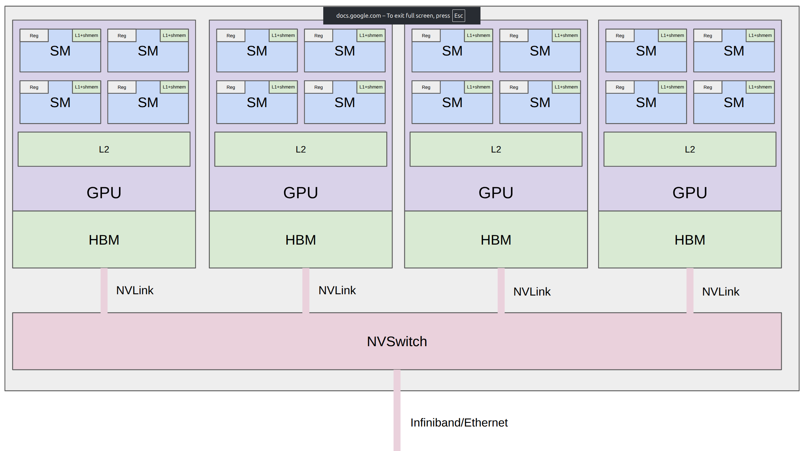
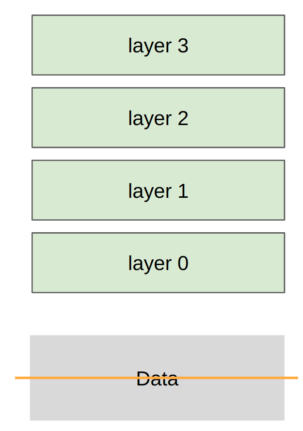

# CS336 Lecture 7: 分布式并行训练 — 从单 GPU 到多 GPU

> **课程**: Stanford CS336 — Language Models From Scratch (Spring 2026)
> **讲师**: Percy Liang（本讲）
> **课程网站**: [https://cs336.stanford.edu/](https://cs336.stanford.edu/)
> **课件**: `lecture_07.py` — 619 行交互式 Python 代码（multiprocessing + PyTorch distributed）
> **预告**: 下讲（Lecture 8）Tatsu 会深入 FSDP、ZeRO 等更高级的数据并行方案

---

## 目录

1. [从单 GPU 到多 GPU](#1-从单-gpu-到多-gpu)
2. [集合通信操作（Collective Operations）](#2-集合通信操作collective-operations)
   - [2.1 基础概念与四种 warm-up 原语](#21-基础概念与四种-warm-up-原语)
   - [2.2 三种主力操作（workhorse）](#22-三种主力操作workhorse)
   - [2.3 All-to-all — MoE 的核心](#23-all-to-all--moe-的核心)
3. [硬件互联架构](#3-硬件互联架构)
4. [NCCL 与 PyTorch 分布式编程](#4-nccl-与-pytorch-分布式编程)
5. [通信带宽的 Benchmarking](#5-通信带宽的-benchmarking)
6. [数据并行（Data Parallelism / DDP）](#6-数据并行data-parallelism--ddp)
7. [张量并行（Tensor Parallelism）](#7-张量并行tensor-parallelism)
8. [流水线并行（Pipeline Parallelism）](#8-流水线并行pipeline-parallelism)
9. [总结](#9-总结)

---

## 1. 从单 GPU 到多 GPU

> "上星期我们讲的是如何让**单个 GPU** 跑快——写 kernel。上周 HBM 被我们痛骂'太慢了'。但今天，**HBM 会被认为是快的**——因为我们要讨论的是 GPU 之间通过 NVLink、InfiniBand 通信，那比 HBM 还慢。"

**统一主题**："不管是单 GPU 还是多 GPU，情况是一样的——计算单元（ALU、Tensor Core）离数据很远。单 GPU 中，数据在远端的 HBM。多 GPU 中，数据在**另一张 GPU** 上。你得想办法把它们搬运过来。主题就是**精心编排计算来避免数据传输瓶颈**。"



**层级化的速度结构**：

| 层级 | 速度 | 上讲的策略 | 本讲的策略 |
|------|------|-----------|-----------|
| SM 内 Shared Memory | 最快（~19 TB/s） | Tiling | — |
| GPU 内 HBM | 快（2-8 TB/s） | Fusion | — |
| **节点内 NVLink/NVSwitch** | 中等（1.8 TB/s） | — | Tensor Parallelism |
| **Pod 内 InfiniBand** | 慢（~0.05 TB/s） | — | Data / Pipeline Parallelism |
| **跨 Pod Ethernet** | 最慢 | — | Pipeline Parallelism |

> "很容易用很多 GPU——但很难**有效**用它们。"

**为什么需要多 GPU？**——两个原因：

1. **放不下**：参数 + 梯度 + 优化器状态 + 激活值超过单 GPU 的 HBM。"B200 有 192GB。如果你训 1 万亿参数模型，单 GPU 装不下。"
2. **想更快**：即使能放下，更多 GPU = 更多 FLOPs = 更快训练。

> "注意一个取舍：如果你把模型分散到更多 GPU，你需要**支付通信带宽**。这是你需要做的计算——如何并行化的决策。"

---

## 2. 集合通信操作（Collective Operations）

> "集合操作是从 1980 年代分布式编程遗留下来的概念原语。**并行编程不是为 LLM 训练发明的**——今天用的仍然是这些 primitive。'Collective' 意味着你指定一个跨多个设备的通用通信模板，而不是自己管理点对点通信。这比你手工管理**更好更快**。"

### 2.1 基础概念与四种 warm-up 原语

| 术语 | 含义 |
|------|------|
| **Rank** | 特定设备/进程（我们的 case 中是 GPU） |
| **World Size** | 设备总数 |


**Broadcast（广播）**——从 rank 0 复制到所有 rank：

```
输入: rank0 = [0,1,2,3]
输出: rank0-3 = [0,1,2,3]（全部一样）
```

> 场景："基本不在训练的核心路径中出现。主要用于初始化——load 一个 checkpoint 然后广播给所有 rank。只做一次的那种。"

**Scatter（分散）**——将 rank 0 上的张量切分到所有 rank：

```
输入: rank0 = [0,1,2,3]
输出: rank0=[0], rank1=[1], rank2=[2], rank3=[3]
```

> "Scatter 本身不是直接用的——但它是**理解 reduce-scatter 的垫脚石**。"

**Gather（收集）**——从所有 rank 收集到 rank 0（scatter 的逆）：

```
输入: rank0=[0], rank1=[1], rank2=[2], rank3=[3]
输出: rank0 = [0,1,2,3]
```

> "Gather 也不是直接用的——它是**理解 all-gather 的垫脚石**。你可以把 gather 看作是操作是 concatenation 的 reduce。"

**Reduce（归约）**——从所有 rank 收集到 rank 0，施加某个操作（sum/min/max 等）：

```
输入: rank0=[0], rank1=[1], rank2=[2], rank3=[3]
输出: rank0 = [6]（0+1+2+3）
```

> "如果你做函数式编程，reduce 对你应该不陌生。这也是理解 all-reduce 的垫脚石。"

**被问到和 NumPy broadcasting 的关系**："概念上是同一个 idea——一个东西变很多个。但这里的 instantiation 是**集合通信**——完全不同。"

### 2.2 三种主力操作（workhorse）

这三个是分布式训练中**反复出现**的操作：

**All-gather**：= gather 的结果发送到**所有** rank（不只是 rank 0）。"All 就是 destination 是所有设备。"

```
输入: rank0=[0], rank1=[1], rank2=[2], rank3=[3]
输出: rank0-3 = [0,1,2,3]（全部都有完整数据）
```

> 场景（FSDP/ZeRO）：每个 rank 只持有参数的一个 shard。前向时，all-gather 获取完整参数来做完整的 forward pass。

**Reduce-scatter**：对每个维度做 reduce，结果**分散**到各 rank。

```
输入: rank0=[0,1,2,3], rank1=[1,2,3,4], rank2=[2,3,4,5], rank3=[3,4,5,6]
输出: rank0=[6]（dim0: 0+1+2+3）, rank1=[10]（dim1）, rank2=[14], rank3=[18]
```

> 场景（FSDP/ZeRO）：反向传播后，每个 GPU 的梯度来自不同数据 shard，需要 sum（reduce）+ 梯度存储也要分散（scatter）来节省显存。

**All-reduce**：= **Reduce-scatter + All-gather**。

```
输入: 同上
步骤 1 (reduce-scatter): rank0=[6], rank1=[10], rank2=[14], rank3=[18]
步骤 2 (all-gather):    rank0-3 = [6,10,14,18]
```

> "All-reduce 在某种意义上最容易理解——reduce + replicate 在所有节点上。我们是先从 all-reduce 开始的（DDP中）。后面在 FSDP/ZeRO 中，我们需要把 all-reduce 拆成 reduce-scatter + all-gather——因为中间你可以**介入**，可以做更灵活的管理。"

### 2.3 All-to-all — MoE 的核心

> "这是最通用的集合操作——每个 rank 向每个其他 rank 发送特定的一段数据。"

```
输入: rank0=[0,1,2,3]（发0→r0, 1→r1, 2→r2, 3→r3）
      rank1=[4,5,6,7]（发4→r0, 5→r1, 6→r2, 7→r3）
      rank2=[8,9,10,11], rank3=[12,13,14,15]
输出: rank0=[0,4,8,12], rank1=[1,5,9,13], rank2=[2,6,10,14], rank3=[3,7,11,15]
```

> "在 MoE 中，每个 rank 有数据的一个 split + 专家的一个子集。核心是**动态路由**——你需要看数据来决定把 activation 路由到哪个专家。这就是 all-to-all 通信。如果每个 rank 向每个其他 rank 发送的数据量是**均衡**的（same number of bytes），all-to-all 本质上就是一个**转置**。但在一般情况下，它也处理不均衡的分片——尽管你总是想让它们尽可能均衡（recall load balancing）。"

**记忆诀窍**：

| 关键词 | 含义 |
|--------|------|
| **Reduce** | 做某种结合/交换操作（sum, min, max） |
| **Scatter** | Gather 的逆——分散、分布 |
| **All-** | destination 是所有设备 |

---

## 3. 硬件互联架构

> "从这张老图片（PCIe 总线图）你能看出这大概是 multinode 训练最原始的形式——是你买游戏 GPU 跟朋友一起训大模型的配置。而在现实中如果你真的 serous about training，情况是这样——"

**三层互联结构**：

| 层级 | 互联方式 | 带宽（B200） | 性质 |
|------|----------|-------------|------|
| **节点内**（8 GPU） | NVLink → NVSwitch | 1.8 TB/s | **全连接**——编程视角下每个 GPU 可以直接与任何其他 GPU 通信，交换机处理路由 |
| **Pod 内**（~256 节点） | InfiniBand（经 PCIe → HCA/NIC → InfiniBand 线缆） | ~0.05 TB/s | 节点间通信，速度骤降 |
| **跨 Pod** | Ethernet（经 PCIe → **CPU →** 网络栈） | 更慢 | **必须经过 CPU** |

> "NVLink 1.8 TB/s vs HBM 8 TB/s——大约慢 4 倍。这还是很快的，但显然不如 HBM，更不如 Shared Memory。"

> "你不可能用一个 NVSwitch 处理 10 万张 GPU——就像内存层级一样，节点越多，通信越慢。"

**绕过 CPU — RDMA vs RoCE**：

> "标准 Ethernet 通信必须**经过 CPU**——数据要拷贝到 kernel socket buffer、构建 TCP 包、拷贝到 NIC ring buffer——这引入了大量延迟。"

| 技术 | 说明 |
|------|------|
| **RDMA**（Remote Direct Memory Access） | GPU **直接**读写另一 GPU 的显存，**完全绕过 CPU** |
| **NVLink/NVSwitch** | 天然支持 RDMA |
| **InfiniBand** | 也支持 RDMA |
| **RoCE**（RDMA over Converged Ethernet） | 在标准 Ethernet 上实现 RDMA——"Meta 有论文在探索这个，Llama 可能就是在 RoCE 上训的。InfiniBand 太贵了。" |

> 学生问"RDMA 和 InfiniBand/NVLink 有什么区别"——Percy："RDMA 更接近一种 **desiderata**（期望达成的目标）——GPU 能读写另一 GPU 的内存。NVLink 和 InfiniBand 是**具体硬件**——什么线缆和交换机。RoCE 是另一种实现 RDMA 的方式。"

**最前沿 — NVL72**：

- 每个 tray 8 GPU + 2 CPU，9 个 tray 堆叠成一个 rack
- **72 个 GPU 全部在一个 NVLink domain 内**——全 NVSwitch 互联，NVLink 级速度
- > "如果你有钱买这种 fancy hardware，你可以在**72 GPU 范围内**拥有极快的互联。"

**关于 NCCL 是否针对多节点优化**（学生 Q&A）——Percy："NVIDIA 的整个 stack 一直在为 training 和 inference of large models 做优化——因为他们的主要客户就是 LLM 提供商。如果他们没有考虑这些 workload 的优化，我会很惊讶。"

---

## 4. NCCL 与 PyTorch 分布式编程

**NCCL**（NVIDIA Collective Communications Library，读作 "nickel"）：

> "NCCL 把集合操作翻译成实际的底层网络包。它**检测硬件拓扑**、**优化 GPU 间的路径**（NVLink 还是 InfiniBand？）、然后**launch GPU kernel** 来做实际的数据收发——因为 GPU 上运行的一切都是 kernel，通信也不例外。"

**PyTorch `torch.distributed`**——提供了一个简洁接口：

> "我们在这个课程中**不会用** `FullyShardedDataParallel` 之类的高层 API——因为我们正在 from scratch。但在实践中你通常不需要自己管理这些。"

关键 API：

```python
# 初始化（master_addr 只是 metadata/协调用，真正的数据传输走 NCCL）
dist.init_process_group("nccl", rank=rank, world_size=world_size)

# All-reduce（就地修改 tensor）
dist.all_reduce(tensor=data, op=dist.ReduceOp.SUM)

# Reduce-scatter
dist.reduce_scatter_tensor(output=output, input=input, op=dist.ReduceOp.SUM)

# All-gather
dist.all_gather_into_tensor(output_tensor=output, input_tensor=input)
```

要点：
- NCCL 后端用于 GPU，gloo 用于 CPU（"Percy 的笔记本没有 GPU"）
- `dist.barrier()` 是**同步屏障**——"所有进程在异步跑，我不知道它们谁先完成。如果我需要某段代码在所有进程到达同一点后再执行，我就放 barrier。但你放越多 barrier，你就等得越多。"
- `async_op=True` 允许通信与计算重叠——"下讲会讲"

**验证 "all-reduce = reduce-scatter + all-gather" 的课件代码**：两步走——先 reduce-scatter（每 rank 得到一个 scaler sum），再 all-gather（所有 rank 都拿到完整结果）→ 与直接 all-reduce 结果一致。

---

## 5. 通信带宽的 Benchmarking

课件用 100M 元素（~400MB float32）的 benchmark 测量有效带宽。

**All-reduce 带宽公式**：

$$\text{bandwidth} = \frac{\text{size\_bytes} \times 2 \times (W-1)}{W \times \text{duration}}$$

- `×2`：每个元素既要发送又要接收
- `×(W-1)`：all-reduce 需要 W-1 步
- 分母 `W × duration`：所有 rank 的总时间
- **有效带宽与 W 和拓扑无关**（在 bandwidth-limited 场景下）

**Reduce-scatter 带宽**：同理但不乘 2（没有接收端）→ all-reduce = reduce-scatter + all-gather，传输 2 倍数据、耗时 2 倍 → 带宽相同。

---

## 6. 数据并行（Data Parallelism / DDP）



> "数据并行是非常优雅的——**你只切数据，模型视为一个模块**。与 tensor/pipeline 并行不同，你不需要 'muck around with the model'。DDP 不关心你的 forward pass 长什么样。"

**分片策略**：沿 **batch 维度**切分数据，每个 rank **持有完整参数副本**。

**完整训练循环**（课件代码）：

```python
# 数据分片
local_batch_size = batch_size // world_size
data = data[rank * local_batch_size : (rank+1) * local_batch_size]

params = [get_init_params(dim, dim, rank) for _ in range(num_layers)]
optimizer = torch.optim.AdamW(params, lr=1e-3)

for step in range(num_steps):
    # 前向（各 rank 独立，用本地数据）
    x = data
    for param in params:
        x = F.gelu(x @ param)
    loss = x.square().mean()

    # 反向（各 rank 独立）
    loss.backward()

    # ⭐ 唯一与标准训练不同的一步：同步梯度
    for param in params:
        dist.all_reduce(tensor=param.grad, op=dist.ReduceOp.AVG)

    optimizer.step()
```

> "Loss 在各 rank 上不同（算自不同数据）。Gradient 一开始也不同。但经过 all-reduce 后**梯度相同**——因此 optimizer.step() 后**参数始终一致**。"

**DDP 的局限与下讲预告**：

> "DDP 的一个大问题是需要把**全部模型参数都放在显存中**——all-reduce 是一个 monolithic 操作，它假设你有完整的参数。但如果参数放不下呢？这就引出了 FSDP 和 ZeRO——下讲 Tatsu 会深入这些更 fancy 的数据并行方案。核心是把 all-reduce 拆成 reduce-scatter + all-gather——这样你可以在中间介入做更灵活的管理。"

---

## 7. 张量并行（Tensor Parallelism）


> "现在我们要 **muck around with the model**——不再是简单地切数据了。"

**分片策略**：沿 **width（hidden dim）维度**切分参数。每个 rank 持有**每个层的一部分参数**（列切——column tensor parallel）。

```python
local_num_dim = num_dim // world_size   # 每个 rank 只负责一部分维度
params = [get_init_params(num_dim, local_num_dim, rank) for _ in range(num_layers)]

x = data  # 所有 rank 拿到相同数据（完整 batch）
for layer in range(num_layers):
    # 1. 局部计算（只用自己持有的那部分参数）
    x = F.gelu(x @ params[layer])     # batch × local_num_dim

    # 2. ⭐ All-gather：收集所有 rank 的激活值 ⭐
    activations = [torch.empty(batch_size, local_num_dim, device=f'cuda:{rank}')
                   for _ in range(world_size)]
    dist.all_gather(tensor_list=activations, tensor=x)

    # 3. 拼接回完整维度
    x = torch.cat(activations, dim=1)   # batch × num_dim
```

> "这是利用了矩阵乘法可以拆分成子矩阵乘法的性质——各 rank 独立计算，然后 all-gather 结果。"

**关于 backward pass**（学生 Q&A）：
- "前向时你 all-gather，反向时你需要 **reduce-scatter**。All-gather 和 reduce-scatter 有这种对偶性（duality）。"
- Q: "PyTorch autograd 会自动做吗？" A: "如果你只是调用 `.backward()`——不会。这里我们显式管理一切。在实践中你可能不需要。但在 336，我们 from scratch。"

**TP 的特点**：

> "每层都要 all-gather——通信量很大。所以 TP**只在节点内使用**（NVLink/NVSwitch）。你永远不会在 NVLink domain 之外做 tensor parallel。"

| 优点 | 缺点 |
|------|------|
| 无 bubble（同步集合通信） | **每层都需通信**，通信量大 |
| 参数 + 激活值显存缩减 1/W | 要求 NVLink 级带宽 |
| 不需要大 batch size | 需要改模型结构（column/row splitting） |

---

## 8. 流水线并行（Pipeline Parallelism）


> "这是**最自然的切分深度网络的方式**——把不同层放在不同 GPU 上。但它有一个大问题——pipeline bubbles。"

**分片策略**：沿 **depth（层数）维度**切分。每个 rank 持有**若干连续层**。

```python
local_num_layers = num_layers // world_size
local_params = [get_init_params(dim, dim, rank) for _ in range(local_num_layers)]

# ⭐ 关键：Micro-batching 来减少 bubble
micro_batch_size = batch_size // num_micro_batches
micro_batches = data.chunk(num_micro_batches, dim=0)

for x in micro_batches:
    # 1. 从前一个 rank 接收激活值
    if rank > 0:
        dist.recv(tensor=x, src=rank - 1)

    # 2. 计算本 rank 负责的层
    for param in local_params:
        x = F.gelu(x @ param)

    # 3. 发送到下一个 rank
    if rank < world_size - 1:
        dist.send(tensor=x, dst=rank + 1)
```

**Pipeline Bubble 与 Micro-batching**：

> "如果不用 micro-batch，一个 rank 在等前一个 rank 完的时候完全空闲——这就是 pipeline bubble。Micro-batching 的思路是把 batch 切成小块——process 得很快、马上传给下一个、然后开始下一个 micro-batch。这减少了等待时间。"

```
无 micro-batch（大 bubble）：
  GPU0: [████████████████]..................  ← 空闲
  GPU1: ..................[████████████████]

有 micro-batch（缩小 bubble）：
  GPU0: [████][████][████][████]............
  GPU1: ....[████][████][████][████]........
```

**未处理的关键优化**（课件未实现，但 Perccy 点出）：
- **通信与计算的重叠**：`send/recv` 前加 `I`（async 版本）→ 在计算当前层的同时收发下一批数据。"这对 pipeline parallel 至关重要。"

**PP 的特点**：

> "Pipeline parallelism 可以**容忍较慢的互联**——因为只是点对点通信（激活值的大小为 b×s×h，相对较小）。你可能会看到 decentralized training 的工作用 pipeline parallel——因为 GPU 可能散落在世界各地。但你绝对不会想在那个场景下用 tensor parallel。"

> "然而，你需要努力减少 pipeline bubbles。这也包括 overlapping communication and computation——下讲会展开。"

| 优点 | 缺点 |
|------|------|
| 对互联带宽要求最低 | pipeline bubble（需 micro-batching 压制） |
| 点对点通信（非集合操作） | 需改模型结构（层分配给不同 rank） |
| 适合跨节点/跨 Pod | 需精细调度才能维持高利用率 |

---

## 9. 总结

> "有很多种并行方式——按数据切、按 tensor/expert 切、按 pipeline 切、按 sequence 切。**没有一种方案是 silver bullet——你需要组合多种方法。**"

**三种并行策略对比**：

| 策略 | 切分维度 | 通信原语 | 通信频率 | 互联要求 | 典型范围 |
|------|---------|---------|---------|---------|---------|
| **Data Parallel (DDP)** | Batch | All-reduce（梯度） | 每步一次 | 中等（IB） | 跨节点 |
| **Tensor Parallel** | Width | All-gather（激活） | **每层都需通信** | **极高（NVLink）** | 节点内 8 GPU |
| **Pipeline Parallel** | Depth | Send/Recv（激活） | 逐 micro-batch | 低（Ethernet） | 跨 Pod |

> "你可能会看到 TP 在节点内（NVLink），DP/FSDP 在节点间，PP 只在必要时用——这取决于硬件。如果 batch size 太大（超过 critical batch size），data parallel 的收益递减，那你可能转向 tensor parallel。这些都是相互关联的考虑。"

**高阶视角**："你可以 **Re-compute**（像 activation checkpointing）vs **Store in memory** vs **Store in another GPU's memory and Communicate**——这是在分布式训练中持续存在的三元权衡。"

> "硬件在不断变快，但我们永远想要更大的模型——所以这种层级化的并行结构会一直存在。"

**PyTorch vs Jax/TPU**：Perccy 特别提到本课程用 PyTorch 而且**不使用高层 API** 的原因——"这样你才能看到机制上的细节。在 Jax/TPU 生态中，你只需要定义模型和 sharding strategy，编译器就处理一切。但这会剥夺你 from scratch 的乐趣。"

---

## 关键公式速查

| 概念 | 公式 |
|------|------|
| All-reduce 带宽 | `bandwidth = size_bytes × 2 × (W-1) / (W × duration)` |
| Reduce-scatter 带宽 | `bandwidth = data_bytes × (W-1) / (W × duration)` |
| DDP 梯度同步 | `dist.all_reduce(grad, op=AVG)` — 各 rank 梯度取平均 |
| TP 激活重组 | `all_gather(local_acts) → concat → full_acts`（每层） |
| PP 层间通信 | `send/recv(activation)` — 逐 micro-batch 点对点传递 |

---

## 参考文献与延伸阅读

- [NCCL Performance Guide](https://github.com/NVIDIA/nccl-tests/blob/master/doc/PERFORMANCE.md#allreduce)
- [NCCL GTC Talk](https://www.nvidia.com/en-us/on-demand/session/gtcspring21-s31880/)
- [PyTorch Distributed](https://pytorch.org/docs/stable/distributed.html)
- [Wikipedia: Collective Operation](https://en.wikipedia.org/wiki/Collective_operation)
- [Levanter (Stanford CRFM)](https://crfm.stanford.edu/2023/06/16/levanter-1_0-release.html) — Jax 自动分片
- [GPipe (Huang et al., 2019)](https://arxiv.org/abs/1811.06965)
- [Megatron-LM (Shoeybi et al., 2019)](https://arxiv.org/abs/1909.08053)
- [ZeRO (Rajbhandari et al., 2020)](https://arxiv.org/abs/1910.02054)
- [FSDP (Zhao et al., 2023)](https://arxiv.org/abs/2304.11277)
- [All-reduce Benchmarking Code](https://github.com/stas00/ml-engineering/blob/master/network/benchmarks/all_reduce_bench.py)
- [CS336 Course Website](https://cs336.stanford.edu/)
