# CS336 Lecture 8: 分布式并行训练进阶 — ZeRO, FSDP, 与混合策略

> **课程**: Stanford CS336 — Language Models From Scratch (Spring 2026)
> **讲师**: Tatsunori Hashimoto (Tatsu)
> **课程网站**: [https://cs336.stanford.edu/](https://cs336.stanford.edu/)
> **关联**: 上讲 Percy 讲了底层原语，本讲是**知识、细节、行业 trivia** 的补充 — 从算法到产业实践

---

## 目录

**Part I: 硬件与网络拓扑**

1. [开篇：从单 GPU 到数据中心的思维转变](#1-开篇从单-gpu-到数据中心的思维转变)
2. [GPU vs TPU 网络的深层差异 — 及 Convergent Evolution](#2-gpu-vs-tpu-网络的深层差异--及-convergent-evolution)
3. [华为昇腾：全连接的极端案例](#3-华为昇腾全连接的极端案例)

**Part II: 数据并行进阶 — ZeRO 系列**

4. [Naive Data Parallel 的内存灾难](#4-naive-data-parallel-的内存灾难)
5. [ZeRO Stage 1：优化器状态分片 — 免费](#5-zero-stage-1优化器状态分片--免费)
6. [ZeRO Stage 2：梯度分片 — 也免费](#6-zero-stage-2梯度分片--也免费)
7. [ZeRO Stage 3 / FSDP：全分片 + 通信计算重叠](#7-zero-stage-3--fsdp全分片--通信计算重叠)

**Part III: 模型并行与激活值并行**

8. [Model Parallelism 三剑客：Pipeline, Tensor, Expert](#8-model-parallelism-三剑客pipeline-tensor-expert)
9. [激活值显存与 Sequence Parallel](#9-激活值显存与-sequence-parallel)

**Part IV: 组合策略与产业实践**

10. [3D/4D 并行：组合一切](#10-3d4d-并行组合一切)
11. [实际大模型训练配置一览](#11-实际大模型训练配置一览)

---

## 1. 开篇：从单 GPU 到数据中心的思维转变

> "上节课 Percy 讲了并行化的底层 mechanics。今天，我要做我最爱的事——讲所有你应该知道的知识、细节和 trivia。"

Tatsu 强调本讲的核心脉络：

1. 不同的并行策略需要**同时使用**——"到幻灯片最后，你会看到我写的是 '4D parallelism'，因为四种不同的东西需要同时做。实际上，只会更多。要在大规模上做并行化，你需要**全部或大部分**。"
2. **intranode（节点内，高速 NVLink）** vs **internode（节点间，慢速 IB/Ethernet）** 的区别贯穿始终——"你必须同时用快慢两种通信，用不同的策略分别应对。"
3. 讨论全在 **collective communication primitives** 层面——"我们不会发 packet，我们在这 lecture 里是 algorithmic 的——all-reduce, all-gather 等。要实现这些 efficiently，你需要深入到 hardware，但讨论是 algorithmic。"
4. 本讲的最终产出：**给定网络拓扑和模型，找到最优并行策略**——"这就是你 assignment 要做的事。"

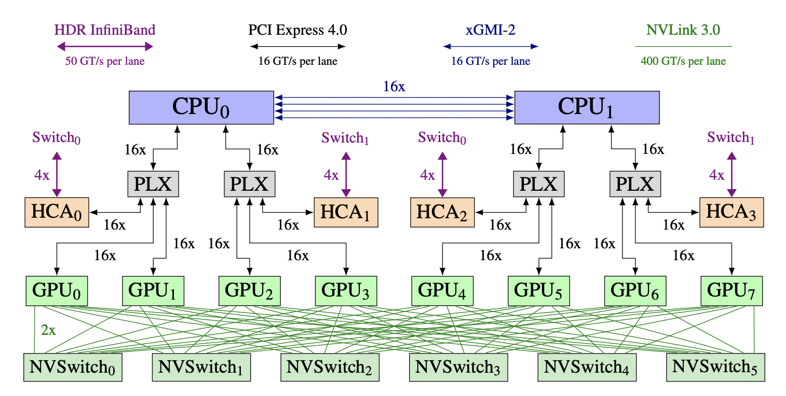

> "新的计算单元不是 GPU——而是**整个数据中心**。我们需要线性显存缩放、线性计算缩放，且希望这些是 lossless 的——充分利用所有资源。"

---

## 2. GPU vs TPU 网络的深层差异 — 及 Convergent Evolution

> "TPU 在我们的 GPU lecture 中被描述为 'lite GPU'——最大的区别其实是**网络**。"

### 2.1 传统设计哲学

| 方面 | TPU（传统） | GPU（NVLink/NVSwitch） |
|------|-----------|----------------------|
| **拓扑** | **Toroidal Mesh**（3D 环形网格）——芯片只连邻居，邻居 wrap around | **Fat Tree / All-to-all**——低层 NVLink 极快、往上层走越来越慢 |
| **核心优势** | 邻居连接数恒定（不论网络多大）→ **无限扩展**、成本低、每连接可以做更 beefy | 灵活——任意两 GPU 可达，适合 **非结构化通信** |
| **适合什么** | Dense model 的**可预测的分片模式**（Tensor Parallel） | **MoE**（token 路由到任意 expert——通信模式不可预测） |

> "TPU mesh 的 beautiful 之处：不管你的网络多大，每个芯片的邻居数目不变。这意味着你可以无限 scale up 且成本可控。GPU 的 tree 越来越大——通信成本越来越高、拓扑越来越复杂。"

### 2.2 2026 年的转折 — Convergent Evolution

> "今天早上，Google 恰好发布了 TPU8i 和 TPU8t。TPU8i 是 **tree topology**——他们居然切换到更像 GPU 的 all-to-all 连接了！还有 TPU8t 的 'Virgo' 网络——更像 GPU 的 switched network。"

**为什么？**——"因为现代语言模型是 **MoE**。如果你要 serve MoE，inference 时 token 在不同 expert 间路由，通信就成了 real bottleneck。你需要更强的 all-to-all 连接。这就是**收敛进化（convergent evolution）**——workload 定义了网络。"

> "这是非常有意思的发展。GPU 和 TPU 都在向彼此靠拢——workload（尤其是 MoE）在重新定义硬件设计。"

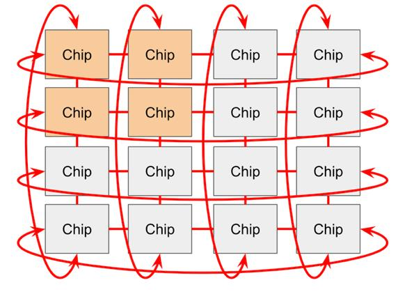
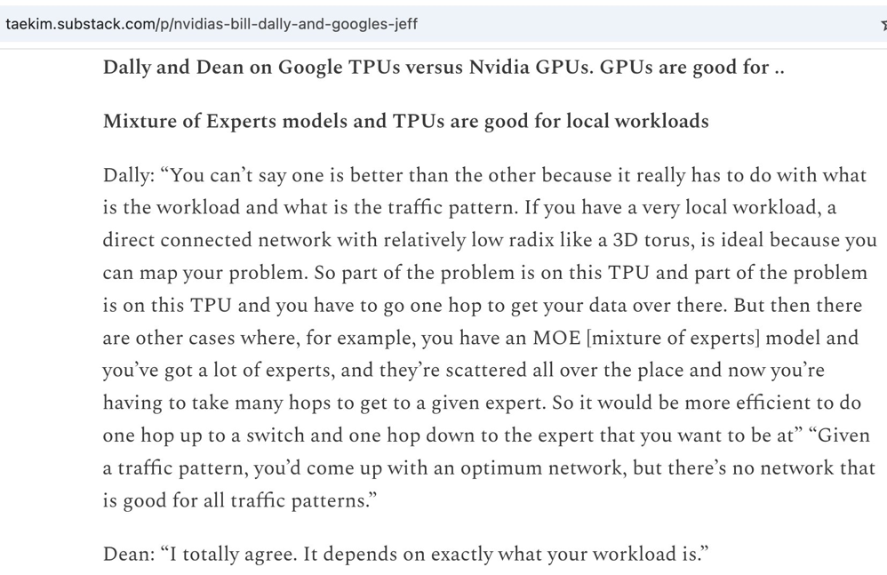
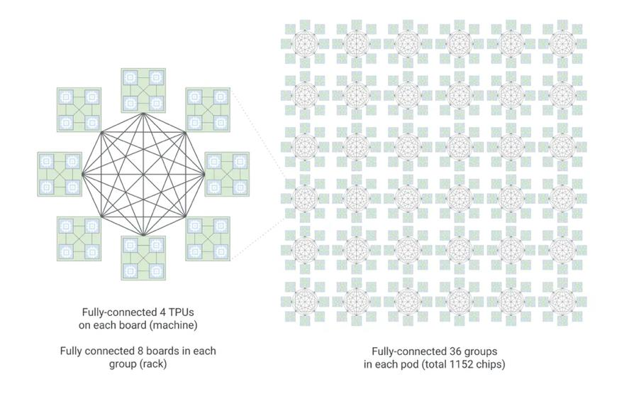

---

## 3. 华为昇腾：全连接的极端案例

> "有人问过——如果 SRAM 这么好，为什么不做全 SRAM 芯片？那就是 Groq。现在同样的问题：如果 all-to-all 这么好，为什么不把一切都用最快的光纤连起来？那就是**华为昇腾 910**。"

**昇腾的特点**：
- 每个芯片的 **matmul 速度远不如 H200**——各方面都明显更慢
- 但通过**巨大的 fiber optic switch 机架**，把一个 rack 内的 **384 个芯片**全部全连接
- 代价：**功耗是等效 NVIDIA 系统的 4 倍**

> "如果你愿意付出功耗代价，你可以 brute force 很多通信问题，把 scale out 做得非常 aggressive。这就像 SRAM 的故事一样——想 efficiency（cost + power），你 end up at one place；想 brute force，你 end up at a very different place。"

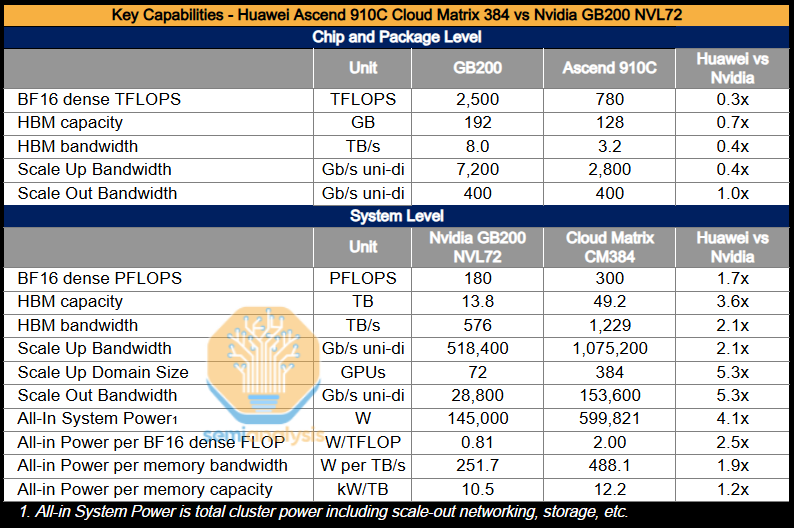

**Part I 小结**：新的计算单元 = 数据中心。三个目标：线性显存、线性计算、用简单集合通信原语做到 lossless。

---

## 4. Naive Data Parallel 的内存灾难

> "数据并行是概念上最简单的——'最标准的方式'。Forget Adam for a moment, 先想 naive SGD。"

**Naive SGD 思路**：B 大小的 batch → 切成 B/M 分给 M 台机器 → 各自算梯度 → 同步（all-reduce 交换）→ 更新。

| 维度 | 评估 |
|------|------|
| Compute scaling | **完美**——只要每 GPU 有足够的 examples |
| Communication | 每 batch 传输 **2×#params**（all-reduce） |
| Memory scaling | **零**——每个 GPU 都需要完整的参数、梯度、优化器状态副本 |

> "所以 compute 解决了（有限程度上），但 memory 完全没解决。让我们看看 memory 有多糟糕——不是 bad，是 **terrible**。"

**实际显存占用**（Tatsu 一条条数给你看）：

| 组件 | 精度 | 每参数字节 |
|------|------|-----------|
| FP16/BF16 模型参数 | 2B | 2 |
| FP16/BF16 梯度 | 2B | 2 |
| FP32 Master Weights（SGD 累加器） | 4B | 4 |
| Adam 一阶矩 (m) | 4B（可能需 FP32） | 4 |
| Adam 二阶矩 (v) | 4B（可能需 FP32） | 4 |
| **合计** | | **~16 bytes/param** |

> "你不仅需要存很多东西——你还需要存**五份权重**。优化器状态（Adam 的 m 和 v）才是 memory 的大头！"

**Tatsu 用颜色标注了比例**：绿色（optimizer state）占绝大多数，橙色（gradients）和蓝色（params）一样大。"Naive data parallel——你复制了所有这些东西到每个 GPU。Memory consumption 随 accelerator 数量线性增长——**not good**。"

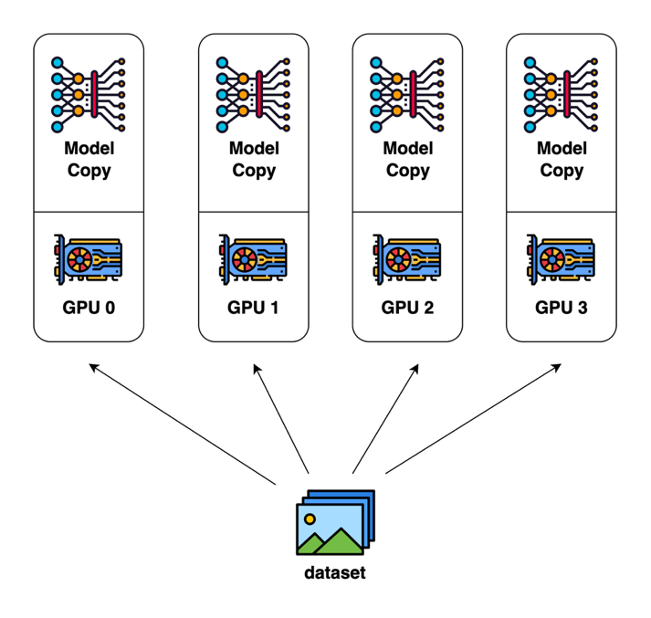

---

## 5. ZeRO Stage 1：优化器状态分片 — 免费

> "我认为这个领域的 elegant and nice 之处在于——你可以用**结构化的方式**切分内存，**基本上是免费的**。"

**核心思想**：只切 optimizer state。参数和梯度保持完整。

**工作流程**（Tatsu walk-through）：

| 步骤 | 做什么 | 通信 |
|------|--------|------|
| 1 | 每个 rank 在自己的数据上算**完整梯度** | 无 |
| 2 | **Reduce-scatter**：把我的梯度按照"谁负责哪部分参数"切分、发送到对应 rank | #params |
| 3 | 每个 rank 用收到的梯度 + 自己的 optimizer state slice，**只更新自己负责的参数** | 无 |
| 4 | **All-gather**：将我更新好的参数发送给所有其他 rank | #params |

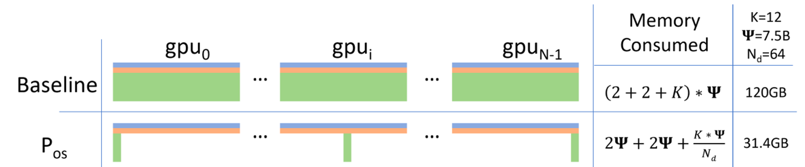

> "在 naive DDP 中，我做**一次 all-reduce**——通信量是 2×#params。在 ZeRO-1，我做 reduce-scatter + all-gather——但 all-reduce = reduce-scatter + all-gather！所以**通信量完全一样**——ZeRO-1 **就是免费的**。"

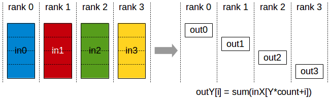

> "这就是 all-reduce = reduce-scatter + all-gather 等价关系**真正有用**的地方。因为你可以在两个操作之间**介入**——让每个 rank 负责自己的那部分 update——但仍然保持总通信量不变。"

**显存收益**：optimizer state 从 (4+K)×#params → (4+K)/Ngpu × #params

---

## 6. ZeRO Stage 2：梯度分片 — 也免费

> "既然 ZeRO-1 是免费的，能不能继续 push？Can we do more？"

**核心思想**：也把梯度分片——**永不完全实例化（materialize）完整梯度**。

> "这里 tricky 在于——之前我依赖能 compute the entire gradient。现在我不能了。怎么办？"

**Tatsu 的解决方案 — 增量式通信/计算**：

> "我在 backward 的过程中，一边走 compute graph 一边做。每算完一层的梯度，**立即 reduce** 发送给负责该层参数的 rank。一旦梯度在 backward graph 中不再被需要，**立即释放**。我不需要等整个 backward 完成、所有梯度都算出来——我 incremental 地算、incremental 地传。"

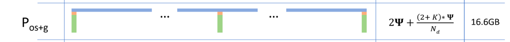

> "最终通信量：还是 2×#params。所以 ZeRO-2 **也基本上是免费的**——和 naive DDP、ZeRO-1 一样的通信量，但显存进一步缩减。"

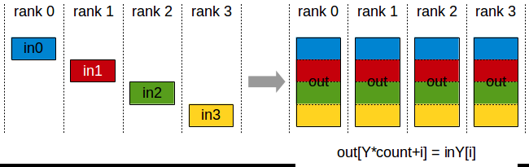

---

## 7. ZeRO Stage 3 / FSDP：全分片 + 通信计算重叠

> "这是最 hairy 的部分。我第一次学的时候觉得——这简直是 magic。我们已经拿了两次免费午餐了——let's keep pushing。"

**核心思想**：所有东西全分片——参数、梯度、优化器状态。参数按需请求、用完释放。

> "每个 GPU 在任何时刻只能看到它负责的那 slice。这就是 **FSDP**——如果你在 PyTorch 中 parallelize 过，你应该见过。"

**FSDP 的完整流程**（Tatsu walk-through）：

1. 前向：all-gather 某层的参数 → 做该层的前向 → **释放参数**（不需要了！）
2. 反向：需要该层的参数 → all-gather 回来 → 做反向 → reduce-scatter 梯度 → 释放参数
3. 这样一层层 "grab → compute → send → free" 循环

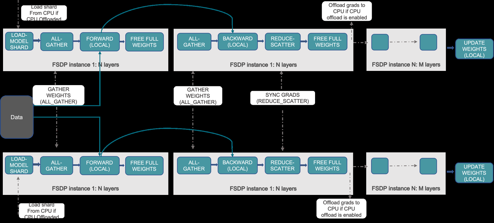
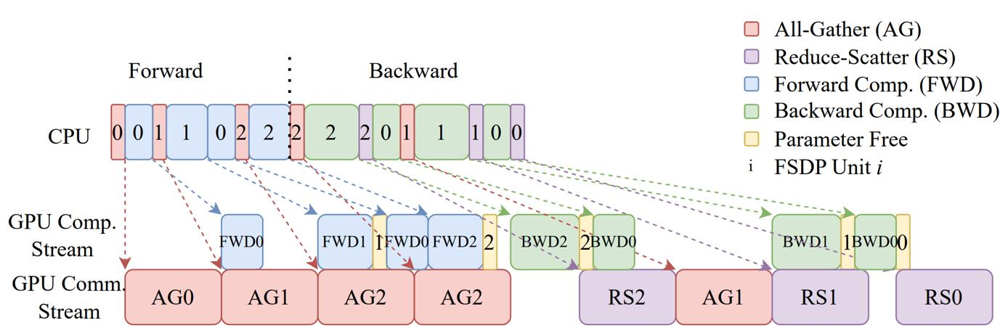

**通信量**：2 次 all-gather + 1 次 reduce-scatter = **3×#params**（比 naive 多了 1.5×）

> "多了一个 all-gather——看起来不太妙。但这还不是全部故事。"

**两个让 FSDP "almost free" 的关键技巧**：

1. **Incremental comm/computation**（ZeRO-2 也用了）：参数/梯度用时请求、用完即释。"Always freeing things. Never holding onto anything for longer than you need."

2. **通信与计算重叠（Overlapping comm and computation）**：

> "这是反直觉但非常关键的一点。你在做 layer 0 的前向时，**同时**在 all-gather layer 1 的参数。当你在做 layer 0 的计算，通信已经在为 layer 1 做准备了。计算花的时间比通信长时，你几乎感觉不到通信的存在。"

> "如果 computation 足够大、comms 足够快，FSDP 的额外通信基本上可以**被完全隐藏在计算时间下面**。你会得到 dramatical memory improvement **without paying the cost**。"

**ZeRO 系列总结**（Tatsu）：

| 级别 | 通信量 | vs Naive DDP | Tatsu 的评价 |
|------|--------|-------------|-------------|
| DDP | 2×#params | 基准 | — |
| **ZeRO-1** | 2×#params | **免费**！"literally free" | "你应该永远默认用" |
| **ZeRO-2** | 2×#params | **也免费**！ | "几乎 free（忽略一些 overhead）" |
| **ZeRO-3/FSDP** | 3×#params | 1.5× 通信 | "多了 1 个 all-gather，但因为 overlap，不太糟" |

**8×A100 80G BF16 下各方案最大模型大小**（课件数据）：

| 方案 | 最大参数量 |
|------|-----------|
| Naive DDP | 6.67B |
| ZeRO-1 | 16B |
| ZeRO-2 | 24.6B |
| **ZeRO-3** | **53.3B** |

---

## 8. Model Parallelism 三剑客：Pipeline, Tensor, Expert

> "数据并行在 memory 和 batch size 方面仍有局限。接下来我们切模型本身。"

**三种切分方式的直观对比**：

| 并行类型 | 切分维度 | 直观理解 |
|------|---------|---------|
| **Pipeline Parallel** | Depth（层） | 不同 GPU 负责不同层 |
| **Tensor Parallel** | Width（hidden dim） | 同一层矩阵被竖切到不同 GPU |
| **Expert Parallel**（MoE） | Experts | 不同专家放在不同 GPU 上 |

### 8.1 Pipeline Parallelism

> "Layer-wise parallel 的最大问题是 pipeline bubble——每个 GPU 只有 1/N 的时间在工作。Micro-batching 通过切分 batch 来压制 bubble——但你需要**很大的 batch size**。Zero Bubble 把反向拆成 activation grad 和 weight grad 两个阶段——weight grad 可以插到 bubble 里。"

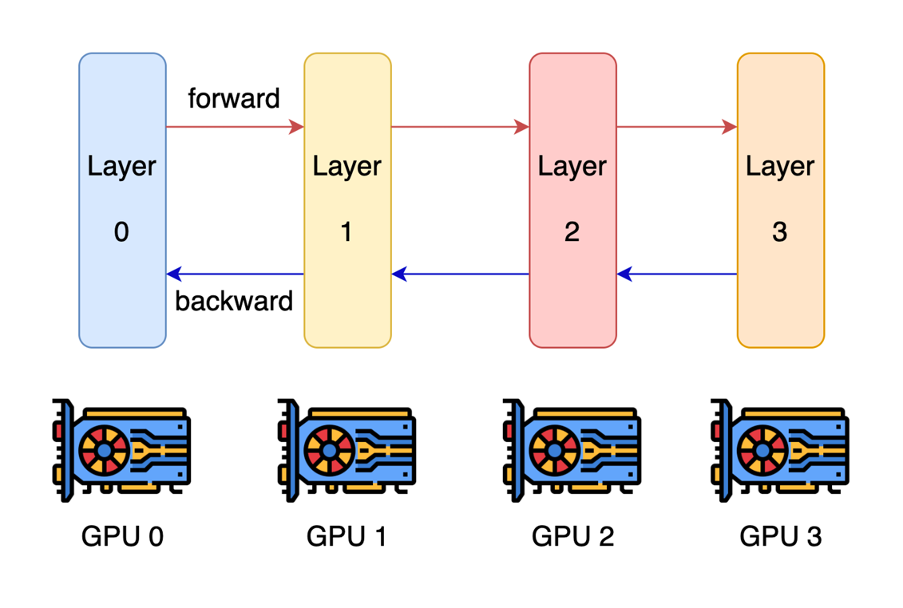
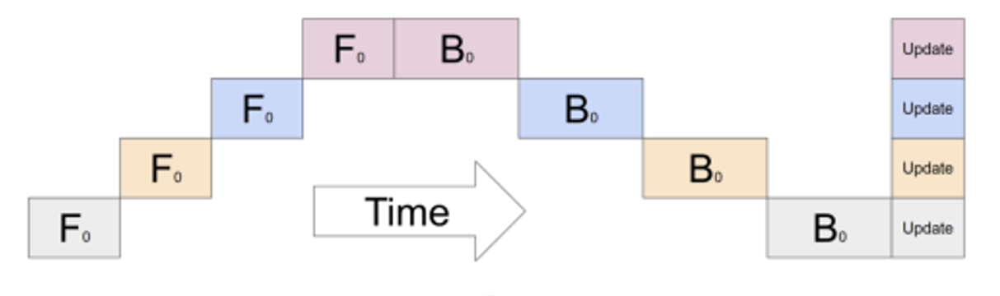

$$\text{bubble ratio} = \frac{n_{\text{stages}} - 1}{n_{\text{micro}}}$$

> "Pipeline parallel 的优势在于通信成本低——只需要点对点地传激活值（b×s×h），不依赖 all-reduce。它适合**较慢的 inter-node 链路**。decentralized training 工作就用 PP——因为 GPU 可能散落在世界各地。"

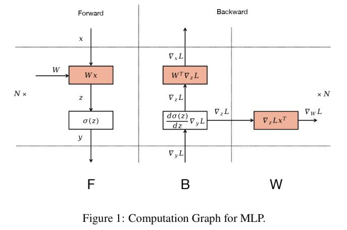

### 8.2 Tensor Parallelism

> "矩阵乘法天然可分解：`[A₁, A₂] × [B₁; B₂] = A₁B₁ + A₂B₂`。前向 pass 先是独立的子矩阵乘法（identity），然后是 all-reduce（收集部分和）。反向 pass 刚好反过来。"

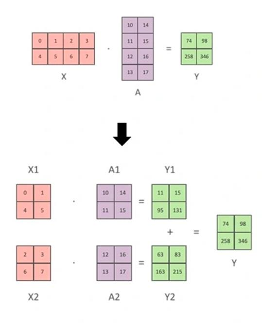
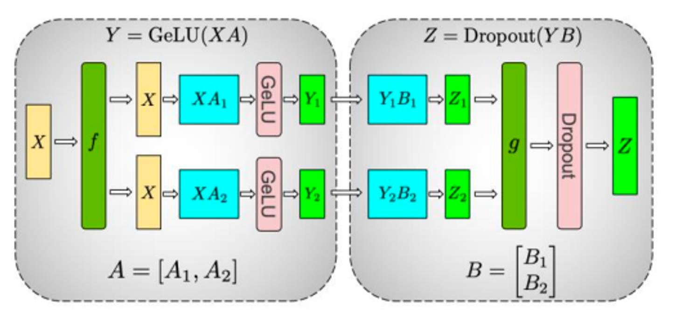

| 切分方式 | 适用组件 |
|----------|----------|
| 列切（Column-wise） | QKV 投影、MLP up-projection |
| 行切（Row-wise） | Attention 输出投影、MLP down-projection |
| 不切（Replicated） | LayerNorm、Router |

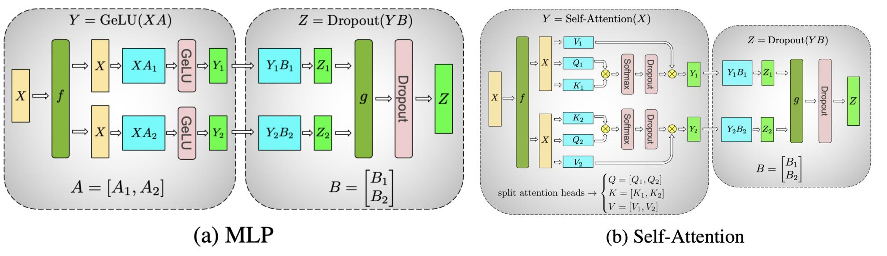

> "TP 的通信量远超 PP——每层都要 all-reduce 激活值。所以**只在节点内**用（NVLink）。互联一慢就不划算了。但它的好处是没有 bubble、不需要大 batch size。"

### 8.3 Expert Parallelism（MoE）

> "MoE 只影响 MLP，不影响 attention。这带来了 attention 和 MLP 需要**不同并行策略**的挑战——attention 需要高 TP，MLP 需要 EP。"

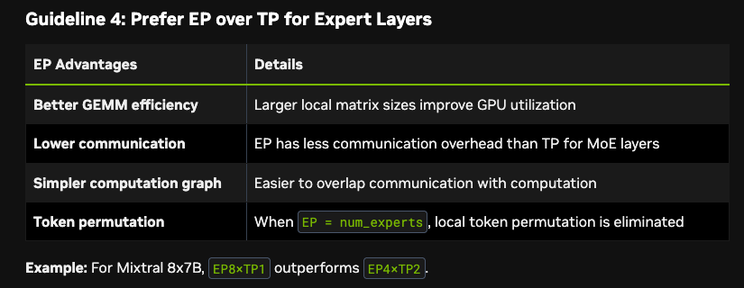

**Megatron 的解耦方案**：将 attention 的 TP/DP 和 MLP 的 EP/DP **分开指定**——"让 attention 和 MLP 各自用最优的并行策略。"

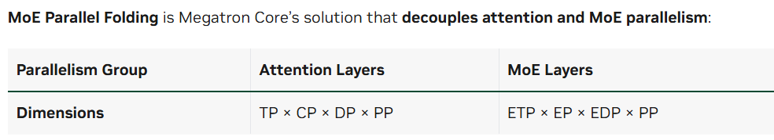

---

## 9. 激活值显存与 Sequence Parallel

> "讲到这里我们发现——我们一直在讨论参数显存。但这是静态的。**激活值也是显存的大头**，尤其在长上下文下。"

**每层激活值**：包含 ~5ash（attention 的二次项）+ ~10sbh（LayerNorm、Dropout 等逐点操作的激活值）

Flash Attention 可以消除 5ash，但 10sbh 仍然存在——且会随 s（序列长度）和 b（batch size）线性增长。

> "关键观察：那些 10sbh 的激活都是**沿序列维度的逐点操作**。所以——把 LayerNorm/Dropout 沿序列维度也切分掉。"

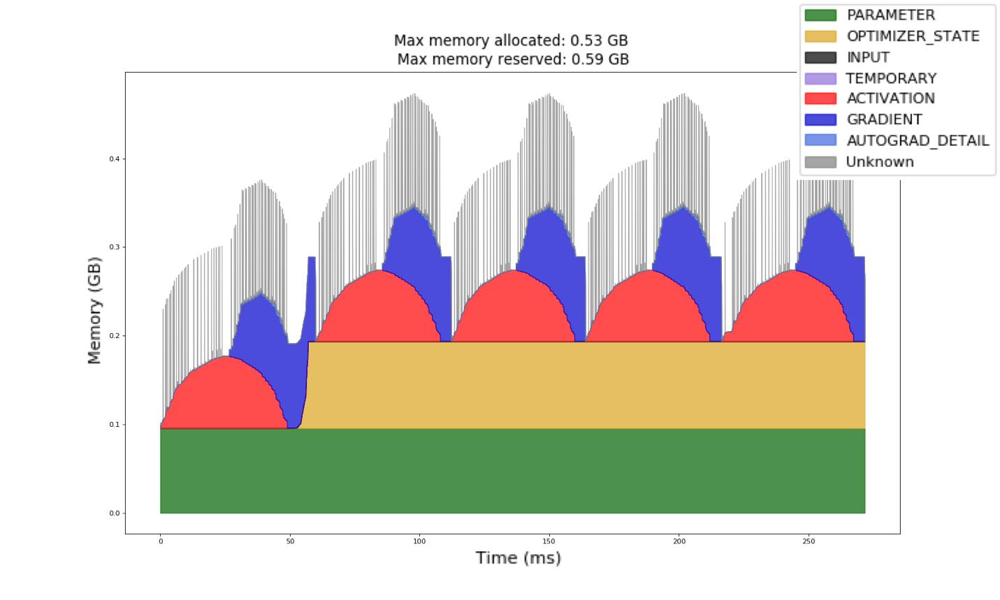
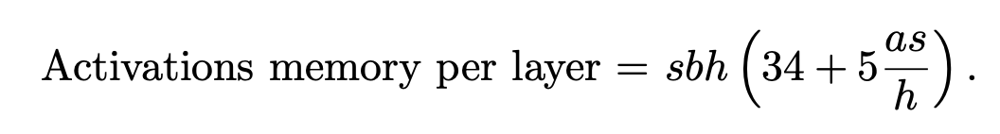

**Sequence Parallel**：前向 = all-gather + reduce-scatter；反向角色互换。与 TP 组合可真正实现激活值的线性缩放。

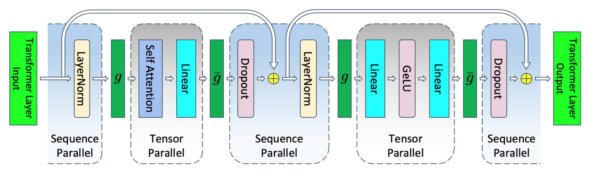
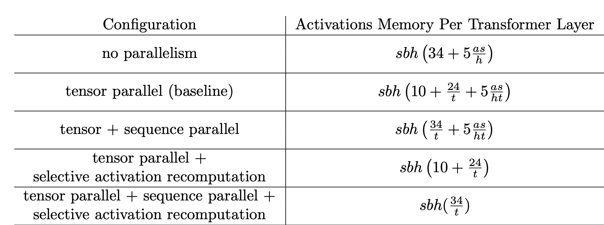

---

## 10. 3D/4D 并行：组合一切

> "没有 single solution。你必须组合全部。简单、可解释的经验法则——"

1. **先让模型 fit**：TP/EP 节点内（≤8 GPUs）→ PP 跨节点 → ZeRO-3 按需
2. **再加速**：剩下的 GPU 用 Data Parallel（DDP/ZeRO-1）
3. **batch size 不够** → Gradient Accumulation
4. **长上下文** → 大量 CP（Context Parallel）

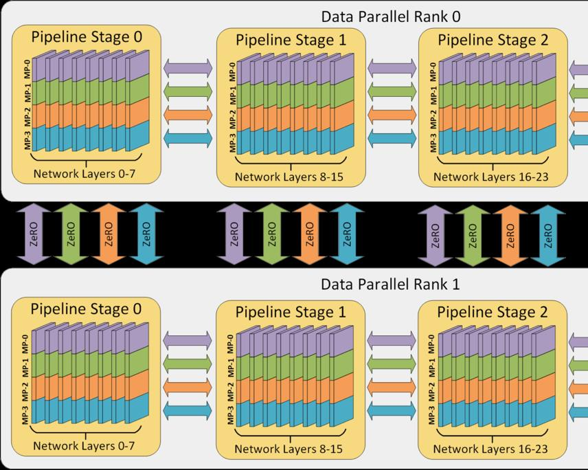

**Narayanan et al. (2021) 的 scaling pattern**：

> "TP 先到 8（hard cap：NVLink），PP 扩展让模型 fit，DP 逐渐缩小。最大的模型 DP=6。64 台机器并行时，8×8 的 TP×PP 是最优的。"

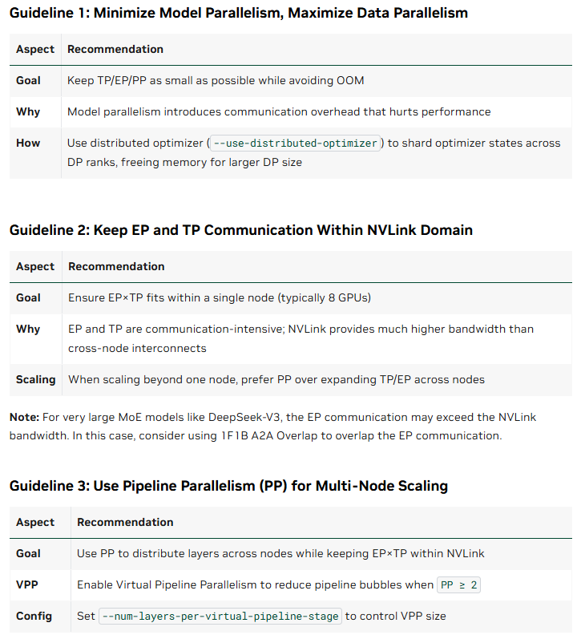
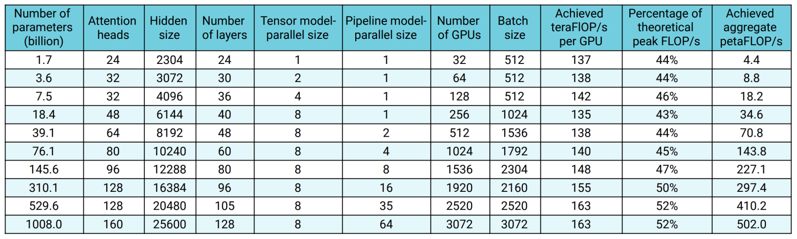
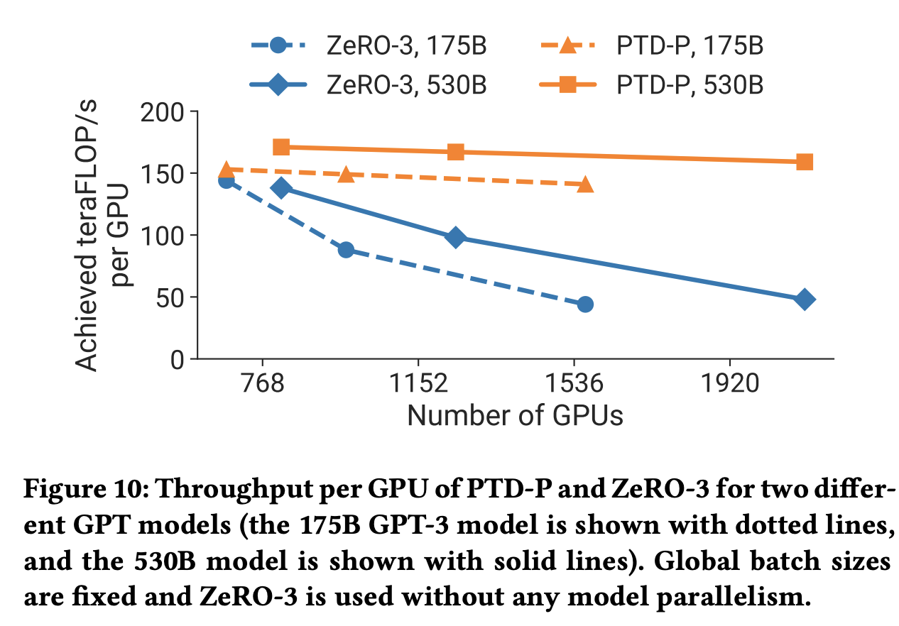
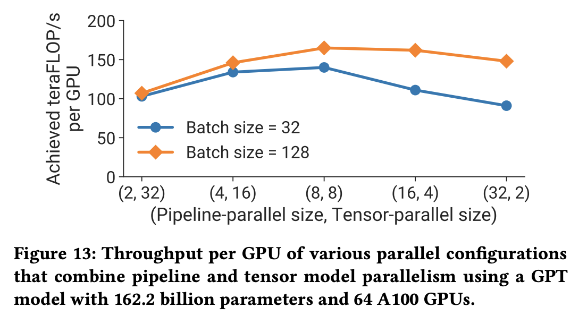

**Activation recomputation 用显存换吞吐**：释放显存 → 更大 batch → 更高吞吐。

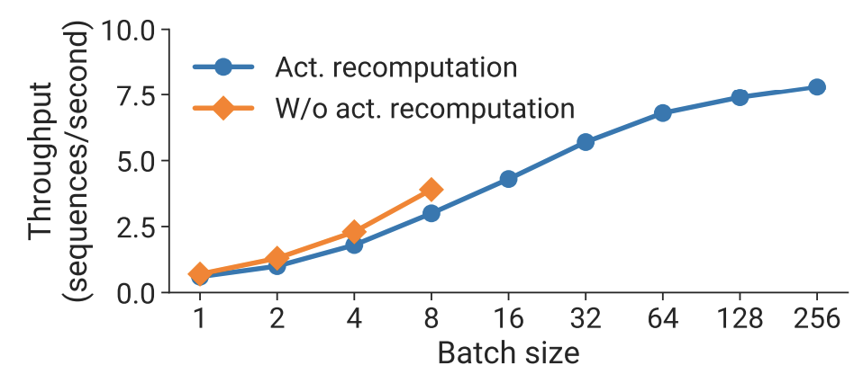

---

## 11. 实际大模型训练配置一览

| 模型 | DP (ZeRO) | TP/SP | EP | PP | CP |
|------|-----------|-------|----|----|-----|
| **DeepSeek V3** | ZeRO-1 | 1 | **64** (8 nodes) | 16 | ? |
| **Llama 3 405B** | 128 | 8 | 0 | 16 | 1 |
| **Gemma 2** (27B) | ZeRO-3 | 8 (TP+SP) | 0 | 0 | 0 |
| **Mixtral 8×22B** | 2 | 4 | 8 | 4 | 1 |
| **Nemotron 3 120B** (long ctx) | ? | 2 | **64** | ? | **64** |
| **Qwen 3** (225B-A22B) | ? | 2 | **32** | 8 | 1 |

> **Patterns**：TP ≤ 8（NVLink 硬限制）。EP 可以非常 aggressive（64-way）。长上下文需要大量 CP。Llama 3 405B 训练中甚至出现了**大量 GPU 故障**——"在这个规模上，硬件可靠性本身就是一个 engineering problem。"

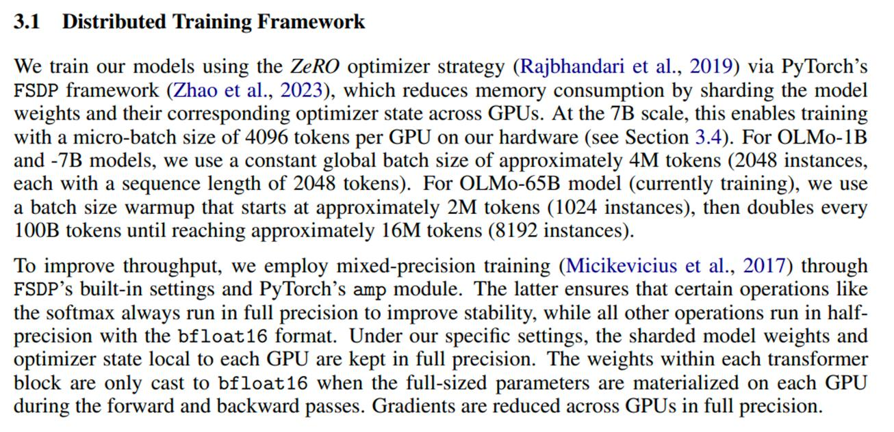
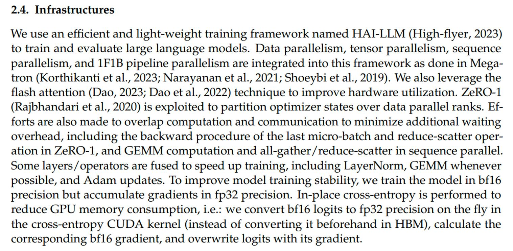
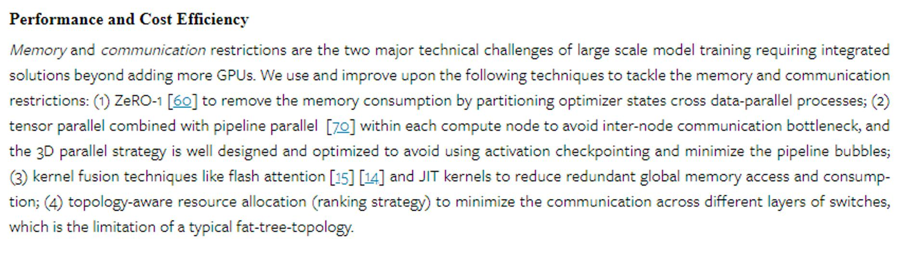
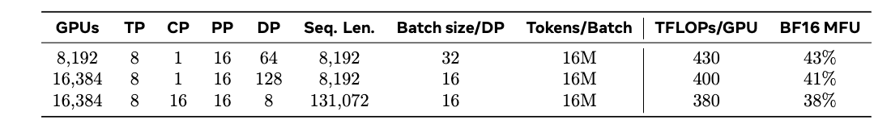
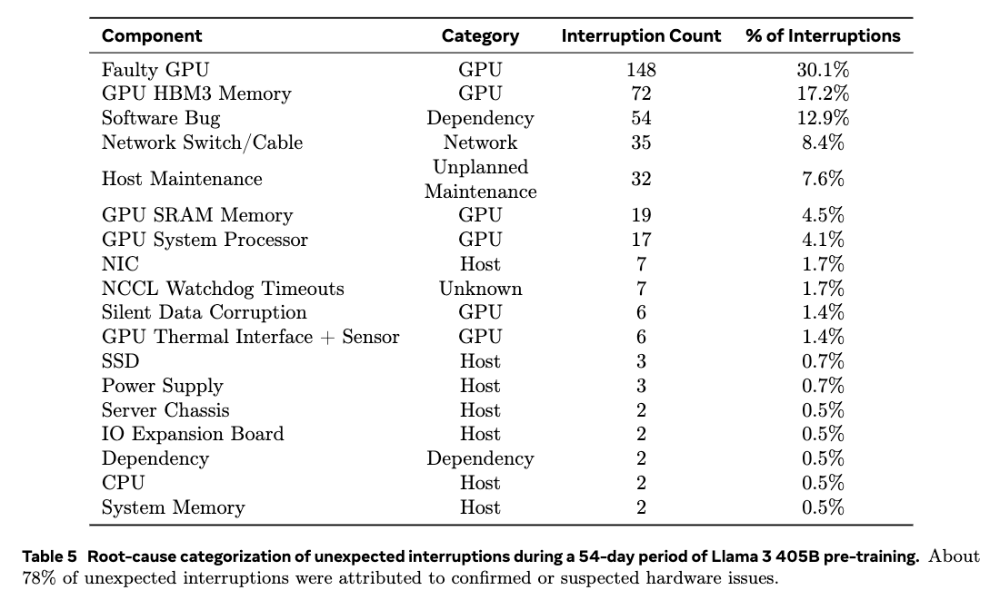

### 全并行策略总表

| 方法 | 参数显存 | 激活/KV显存 | 主要带宽成本 | 扩展batch？ | 易用性 |
|------|---------|-----------|-------------|-----------|--------|
| DDP / ZeRO-1 | 仅优化器状态缩减 | 无缩减 | 梯度 ~O(params) | 线性DP | 很简单 |
| FSDP / ZeRO-3 | ~1/DP | 无缩减 | 参数~O(params)可重叠 | 线性DP | 中等 |
| Pipeline Parallel | ~1/PP | 取决于buffer | 层间激活点对点 | 需microbatches | 困难 |
| Tensor Parallel | ~1/TP | ~1/TP(含SP) | 每block的all-reduce | 否 | 困难 |
| Sequence / Context | 无缩减 | ~1/SP或1/CP | 激活/KV通信 | 否 | 困难 |
| Expert Parallel | ~1/EP(expert) | 无缩减 | Token routing all-to-all | 需足够token | 困难 |

---

## 总结

Tatsu 的核心结论：

1. **ZeRO-1 和 ZeRO-2 是免费的**——通信量与 Naive DDP 相同，只是利用了 all-reduce = reduce-scatter + all-gather 的等价性
2. **ZeRO-3 / FSDP 通过重叠通信和计算**，额外开销也基本可忽略
3. **Model Parallelism 提供了不同的 tradeoff**：TP 需 NVLink 但无 bubble；PP 可容忍慢互联但需要大 batch 压制 bubble；EP 专门为 MoE 而设计
4. **所有大模型都混合使用了多种策略**——TP≤8 节点内、EP 可以很激进、PP 跨节点、DP 填满剩余 GPU
5. **硬件设计在收敛**——TPU 也在向 GPU-like 的 tree/A2A 拓扑演进，因为 MoE 是主导 workload

---

## 参考文献

- [ZeRO (Rajbhandari et al., 2020)](https://arxiv.org/abs/1910.02054)
- [FSDP (Zhao et al., 2023)](https://arxiv.org/abs/2304.11277)
- [Megatron-LM (Shoeybi et al., 2019)](https://arxiv.org/abs/1909.08053)
- [Narayanan et al. (2021)](https://arxiv.org/abs/2104.04473)
- [GPipe (Huang et al., 2019)](https://arxiv.org/abs/1811.06965)
- [Korthikanti et al. (2022)](https://arxiv.org/abs/2205.05198)
- [DeepSeek V3](https://arxiv.org/abs/2412.19437)
- [Llama 3 405B](https://ai.meta.com/blog/meta-llama-3/)
- [Megatron-Core MoE Guide](https://docs.nvidia.com/megatron-core/developer-guide/latest/user-guide/features/moe.html)
- [Semianalysis: Domain Sizes](https://newsletter.semianalysis.com/p/huawei-ai-cloudmatrix-384-chinas-answer-to-nvidia-gb200-nvl72)
- [CS336 Course Website](https://cs336.stanford.edu/)
