# CS336 Lecture 9: Scaling Laws 基础

> **课程**: Stanford CS336 — Language Models From Scratch (Spring 2026)
> **讲师**: Tatsunori Hashimoto (Tatsu)
> **课程网站**: [https://cs336.stanford.edu/](https://cs336.stanford.edu/)
> **预告**: 本讲为 Scaling Laws 基础篇；进阶篇（muP、优化器细节、现代开源模型技术报告分析）将在后续 Lecture 中展开

---

## 目录

1. [开篇：为什么要认真对待 Scaling](#1-开篇为什么要认真对待-scaling)
2. [历史脉络：从 Vapnik 到 Hestness](#2-历史脉络从-vapnik-到-hestness)
3. [数据 Scaling Laws — 基础理论与直觉](#3-数据-scaling-laws--基础理论与直觉)
   - [3.1 经验观察：log-log 上的直线](#31-经验观察log-log-上的直线)
   - [3.2 均值估计的例子](#32-均值估计的例子)
   - [3.3 为什么指数是 -0.1 而非 -1？非参数视角](#33-为什么指数是--01-而非--1非参数视角)
4. [数据 Scaling Laws 的应用](#4-数据-scaling-laws-的应用)
   - [4.1 数据混合选择](#41-数据混合选择)
   - [4.2 数据重复](#42-数据重复)
   - [4.3 分布偏移 Scaling Laws](#43-分布偏移-scaling-laws)
5. [模型与超参数的 Scaling Laws](#5-模型与超参数的-scaling-laws)
   - [5.1 架构选择：Transformer vs LSTM](#51-架构选择transformer-vs-lstm)
   - [5.2 优化器选择：Adam vs SGD](#52-优化器选择adam-vs-sgd)
   - [5.3 深度/宽度](#53-深度宽度)
   - [5.4 不是所有参数都平等：Embedding 与 MoE](#54-不是所有参数都平等embedding-与-moe)
6. [Critical Batch Size 与 Learning Rate](#6-critical-batch-size-与-learning-rate)
7. [上游 vs 下游的陷阱](#7-上游-vs-下游的陷阱)
8. [Chinchilla vs Kaplan：数据与模型的权衡](#8-chinchilla-vs-kaplan数据与模型的权衡)
   - [8.1 联合 Scaling Laws 的函数形式](#81-联合-scaling-laws-的函数形式)
   - [8.2 Chinchilla 的三种拟合方法](#82-chinchilla-的三种拟合方法)
   - [8.3 为什么 Kaplan 和 Chinchilla 差异这么大？](#83-为什么-kaplan-和-chinchilla-差异这么大)
   - [8.4 训练最优 ≠ 部署最优](#84-训练最优--部署最优)
9. [总结：Scaling Law 的设计流程](#9-总结scaling-law-的设计流程)

---

## 1. 开篇：为什么要认真对待 Scaling

> "你的富豪朋友给了你 10,000 张 B200 用一个月，让你训一个开源大模型。你已经搞定了分布式训练框架（A2）和预训练数据（A4），现在要跑一个大模型——但哪个配置？这个问题就是你面对 scaling laws 的第一个场景。"

**Scaling Laws 的本质**：在小规模模型上做实验，找到性能随资源变化的规律，然后**外推到大规模**。

> "如果你的大 run 可能花几百万美元，你怎么确保它是成功的？如果只是 copy 别人的架构选择，你永远做不出比 state-of-the-art 更好的模型。你必须认真对待 scaling。"

**旧的痛苦方法**：在大模型上直接调超参数（极其浪费）。
**新的（过度？）乐观方法**：在小模型上调，外推到大模型。

> Tatsu 描述了一些实验室的心态："对一些人来说，scaling laws 几乎是种信仰——'We really believe in the scaling laws.'这几乎是一种生活方式。"

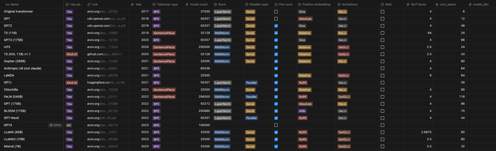
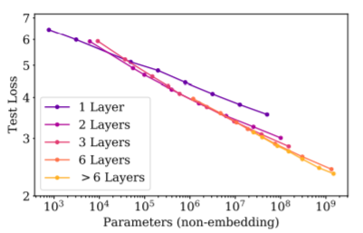

---

## 2. 历史脉络：从 Vapnik 到 Hestness

Tatsu 强调："Scaling laws 不是突然冒出来的新东西——它有非常深的根。"

### 2.1 泛化界（Generalization Bounds）是最早的 Scaling Law

机器学习理论中最早思考"模型性能随数据量如何变化"的问题，就是泛化界：

$$\text{Error} \leq \text{Training Error} + O\left(\sqrt{\frac{\log |\mathcal{H}|}{n}}\right)$$

这些 bound 通常依赖于样本量 n → **本质上是在描述 error 随 data size 变化的上界**。

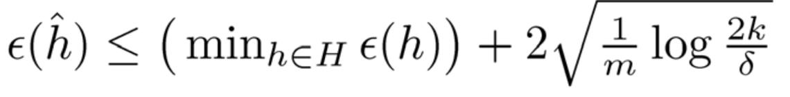

### 2.2 1993 — 最早的数据 Scaling Law 论文

**Cortes, Jackel, Solla, Vapnik, Denker (AT&T Bell Labs, 1993)**——"比大多数人想象的早得多的 scaling law work"：

> 当时的动机非常实际："在大数据集上训练分类器很贵，我们能不能在小样本上训练，拟合一条误差衰减的曲线，然后用它来估计在大数据上的表现？"——Tatsu 说："这几乎就是 1993 年的 data scaling law。"

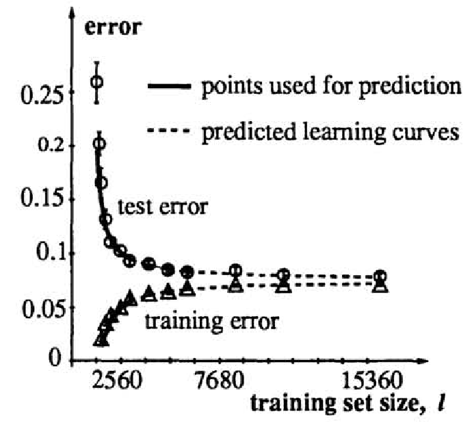

### 2.3 Banko & Brill (2001) — "更多的数据比更好的算法重要"

NLP 领域的经典参考文献——系统地展示了数据量增大导致性能提升的模式。

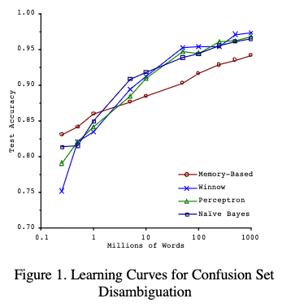

### 2.4 Kolachina et al. (2012) — Power Law 的早期形式

研究机器翻译 BLEU 分数与训练数据量之间的 functional form（函数形式）——结果也是幂律（Power Law）。

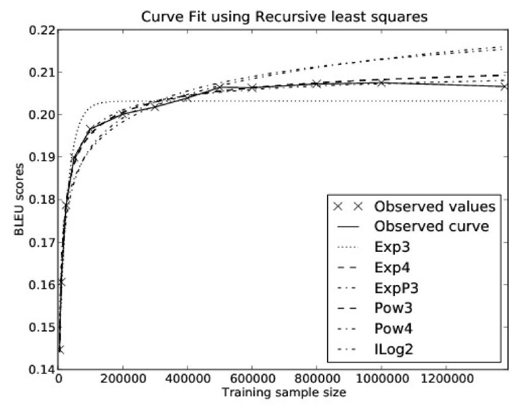

### 2.5 Hestness et al. (2017) — 被低估的先驱

> Tatsu 每次讲 scaling laws 都会专门提这篇论文："Hestness et al. 2017 是真正的 neural scaling 的起源，但他们没有得到应有的引用。这篇工作非常超前——他们跨多个 domain（MT、LM、Speech）建立了 scaling laws，并假设了 scaling 的形状。"

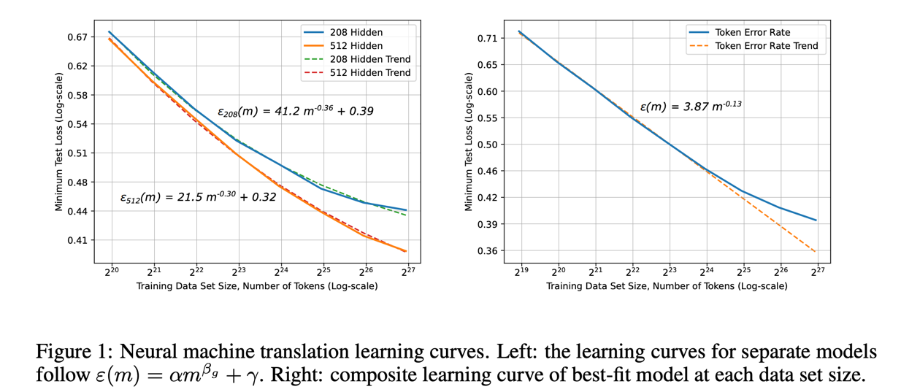

**Hestness 提出的几个核心概念**——2017 年！——至今仍在讨论：
- **"Emergence"**（涌现）：accuracy 是一个比 loss 更不连续（discontinuous）的度量，所以模型好像在某个 scale"突然"获得某种能力
- **Scaling by compute**：如果系统随训练数据量有可预测的 scaling 行为，compute 就会是最关键的资源
- **Speed = Accuracy**：系统优化 → 更快 → 相同时间内更多 FLOPs → 更好的 accuracy

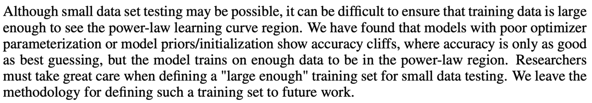

> "2017 年就已经能看到我们今天讨论的几乎所有现象。如果我当时认真读并思考了这篇论文，可能早就看懂了这一整个时代。"

---

## 3. 数据 Scaling Laws — 基础理论与直觉

Tatsu 从最简单的 **data scaling law** 开始，因为"它是最简单、最自然、也最容易从理论上理解的 scaling law"。

### 3.1 经验观察：log-log 上的直线

**实验设置**：固定一个大模型（远大于数据集），只变化数据集大小。将 test loss 和 dataset size 画在 log-log 图上。

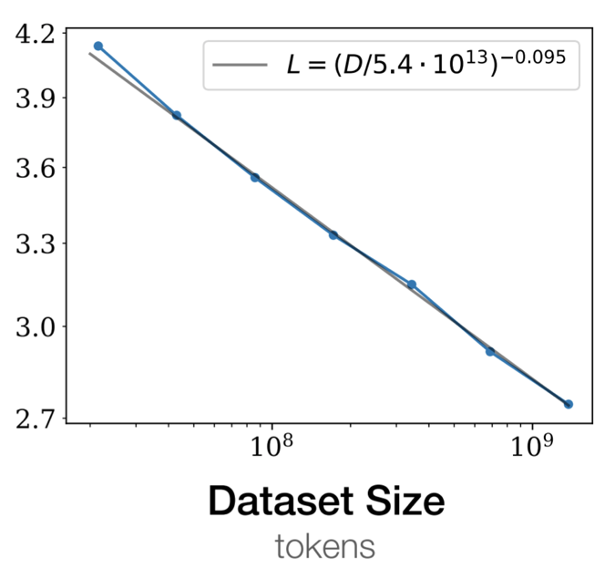

观察（来自 Kaplan et al. 2020）——**一条清晰的直线**。这意味着：

$$\text{Loss} \propto n^{-\alpha}$$

这是一个 **scale-free（无尺度）** 或 **power law（幂律）** 关系。

> "Log-log 图上的直线意味着误差在**多项式衰减**。同时它也意味着我们离渐近线（asymptote，即任务的 irreducible error/噪声底线）还很远——因为一旦接近渐近线，曲线就会 tapering off，不再是直线。"

**被问到 variance 的问题**，Tatsu 回答："在 perplexity 上做 scaling law 时，几乎所有数据点都是 singleton（只跑了一次）。因为 perplexity 太干净了——训练数据非常多、非常 homogeneous、eval sets 非常大，variance 已经被压得很低了。但如果你做 learning rate 或 critical batch size 的 scaling law，你会看到一些非常恐怖的东西。"

### 3.2 均值估计的例子

**忘记语言模型一分钟——这是统计课**。Tatsu 用一个最简单的例子来解释为什么 power law 是"自然"的：

**问题**：从 Gaussian 中估计均值 μ̂ = Σx_i / n

$$\mathbb{E}[(\hat{\mu} - \mu)^2] = \frac{\sigma^2}{n}$$

取对数：

$$\log(\text{Error}) = -\log n + 2\log\sigma$$

**这就是一个 scaling law！** log-log 图中的斜率为 -1（即 α = 1）。

> "任何可以写成 1/n^α + C 的形式——当你在 log-log 图上画出来（减去 C），就会是一条直线。"

### 3.3 为什么指数是 -0.1 而非 -1？非参数视角

**经典模型**（线性回归、均值估计等）的 scaling law exponent 都是 α = 1，即 y = -x + C。

**但神经网络的实测 exponent 是 ~0.1（MT）、~0.3（Speech）、~0.07-0.1（LM）——远比经典模型慢。**

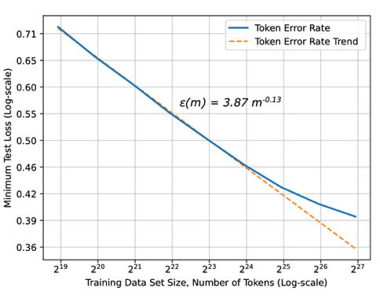

**为什么？— 非参数（Nonparametric）视角**：

考虑一个更灵活的模型——在 D 维空间中估计任意光滑函数 f：

- 将空间切成 n^{1/4} 的小盒子 → 有 √n 个盒子，每个盒子分到 √n 个样本
- 误差 ≈ n^{-1/2}（在 2D 中）
- 在 **D 维**：Error ≈ **n^{-1/D}**

> 所以 scaling law 的斜率 = -1/D。 神经网络的 exponent ~ -0.1 → **相当于 D ≈ 10 维的非参数估计器**。

> "一个 mental model：神经网络在某种程度上像一个 10 维的最邻近邻估计器。这就是 scaling law 的 exponent 告诉我们的。当然，这个理论并不 airtight——内在维度（intrinsic dimension）的估计器本身不太靠谱。但作为直觉是很有价值的。"（Bahri et al. 2021）

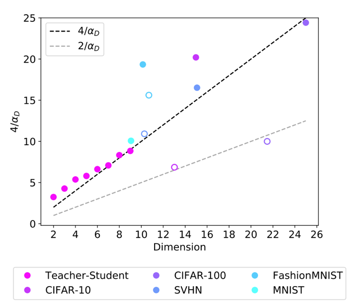

---

## 4. 数据 Scaling Laws 的应用

> "纯粹的 data scaling law 只能告诉你怎么快学习，对工程决策帮助不大。真正有用的问题是：最优的数据混合比例是什么？数据要不要重复？高质量数据和低质量数据怎么平衡？"

### 4.1 数据混合选择

**核心发现**：数据分布改变的是 scaling law 的 **intercept（截距）**，而非 **slope（斜率）**。

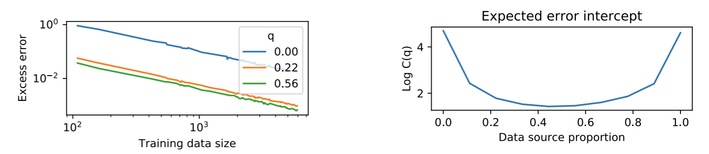

这意味着：**在小规模上最好的数据混合，在大规模上也是最好的**。一个非常务实的结论——不需要复杂的 scaling law 外推，**只需在小模型上试不同数据混合，挑最好的，直接 scaling**。

> "我和实际做过数据混合工作的人聊过，现实比理论描述的要 noisy 得多。很多情况下，真正发生的就是：在小模型上找到最好的数据混合，然后直接放大——根本不需要 scaling law。这恰好印证了'斜率不变、只有截距变'的理论。"（参考 DataDecide 等大规模实证研究）

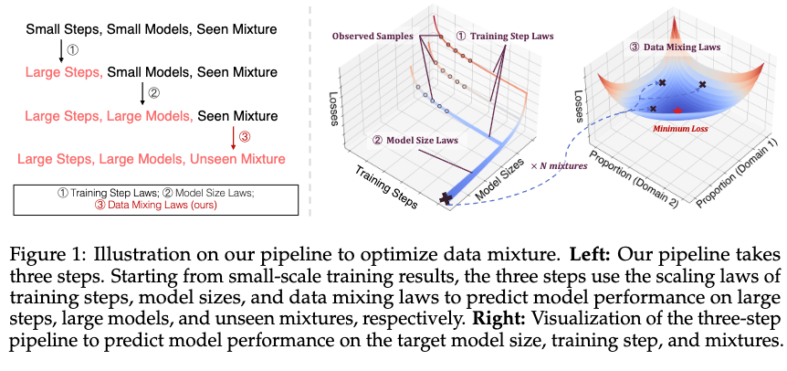

### 4.2 数据重复

> "一个越来越现实的问题：算力在增长，但数据量没有增长。我们能重复数据多少次？"

**关键发现**：前 ~4 个 epoch，标准训练配方几乎无损。但超过 4 个 epoch 后，实际 scaling law（深色曲线）显著偏离"如果有新数据"的投影线（虚线）。

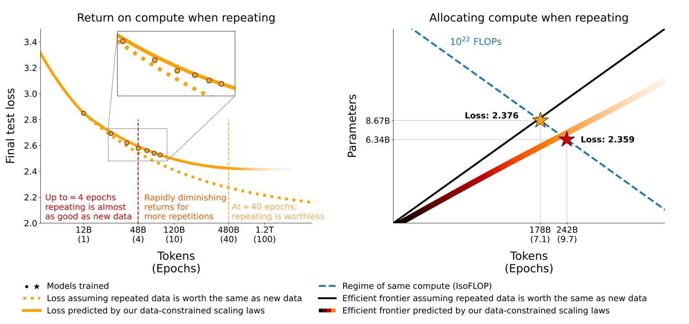

**修改后的函数形式**：可以拟合一个考虑「有效数据量」的 scaling law，其中重复数据的价值随 epoch 数衰减。

**极端情况**（Tatsu & Percy 的 co-advised 学生的工作）：如果允许无限重复——不能无限扩大模型、不能无限增加 epoch。最终需要 ensembling 等手段来继续压榨数据。

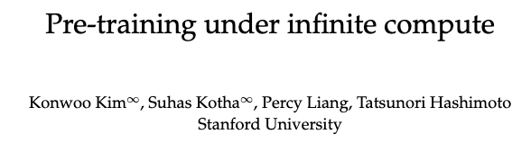

> "不管你在数据上做多少花样的干预（正则化、ensembling 等），scaling law 的**斜率几乎不变**——只有截距在变。这是你在亲自拟合 scaling law 后会学到的一个重要教训。"

### 4.3 分布偏移 Scaling Laws

更深入的工作（Hashimoto 2021）表明：数据多样性通过影响截距来影响性能——在多个数据源上均匀采样比单一数据源效果好。这在理论上被解释为分布偏移（distribution shift）问题。

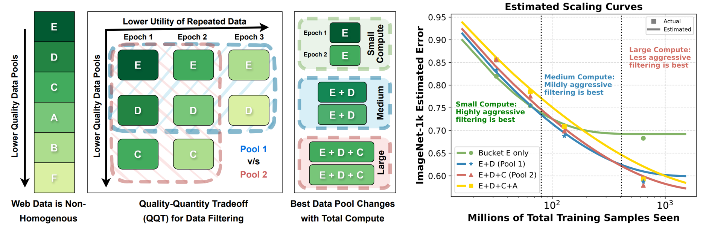

---

## 5. 模型与超参数的 Scaling Laws

> "这是本讲最开始承诺的内容——模型 scaling。动机：怎么高效地设计大模型？我们应该用 LSTM 还是 Transformer？Adam 还是 SGD？应该加更多数据还是更大的模型？"

Scaling laws 提供了一个系统性的方法来回答这些问题。

### 5.1 架构选择：Transformer vs LSTM

**暴力方法**：花几千万美元训练一个 LSTM 版的 GPT-3。

**Scaling law 方法**（Kaplan et al. 2021）：

结论非常清晰——**Transformer 在各个 scale 上都持续优于 LSTM**，且差距在扩大。

**跨架构 scaling**（Tay et al. 2022）——考察了大量不同架构（包括各种 attention 变体）在 scaling 下的行为。

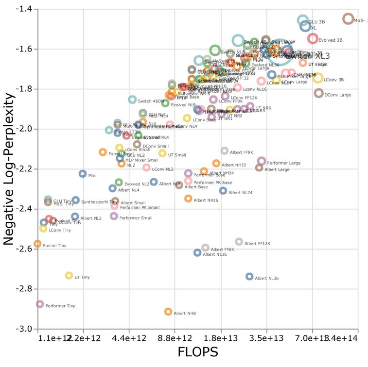

### 5.2 优化器选择：Adam vs SGD

**Hestness et al. 2017**（pre-Transformer 时代，在 Recurrent Highway Nets 上的实验）：

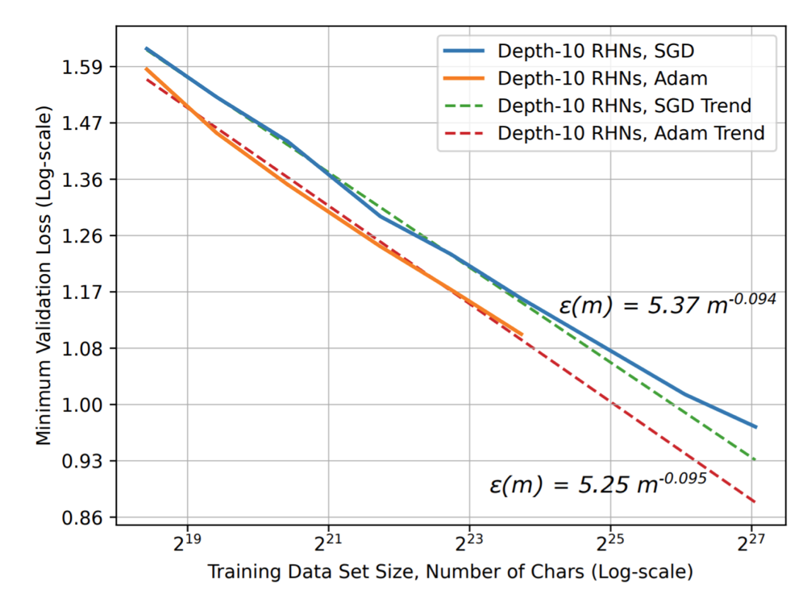

> 注意这是 2017 年的结果——pre-Transformer。RHN（Recurrent Highway Nets）上的结果。但模式成立：不同优化器的 scaling trends 是可以从小规模外推的。

### 5.3 深度/宽度

**层数**：
- 1 vs 2 层差距巨大
- 超过 2 层后，在 10^7 参数范围内，diminishing returns（收益递减）非常严重

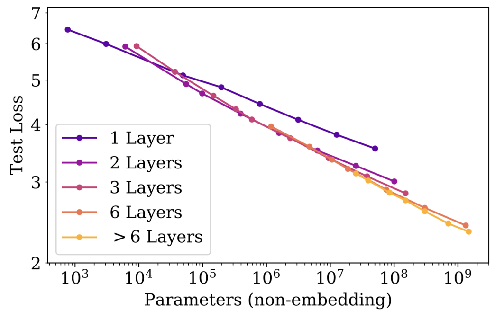

**Aspect Ratio（宽深比）与 scale 的依赖**：Kaplan 发现 aspect ratio 的最优值随着 compute 的增大而变化很小——这和我们之前（Lecture 3）看到的"aspect ratio 有宽容 basin"是一致的。

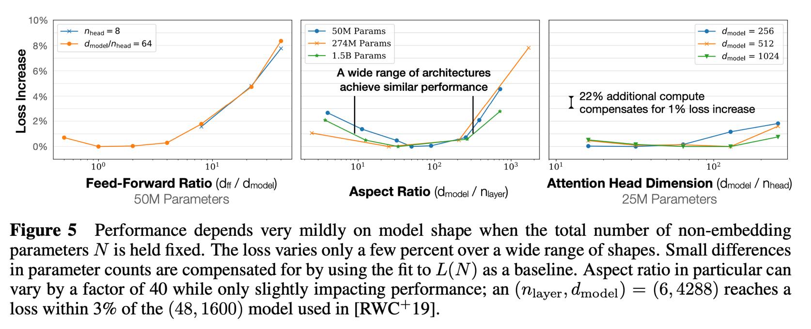

### 5.4 不是所有参数都平等：Embedding 与 MoE

**Kaplan 的一个重要观察**：

> 如果把 embedding 参数也算进来，depth 的 scaling law 会变得"非常怪异"（very funky-looking）。所以他们决定排除所有 embedding 参数，只统计 non-embedding 参数。"因为你可以说服自己——embedding 只是查表，做 computation 的是其他参数。"

**Tatsu 和 Percy 的评论**： "Scaling laws 不是魔法——它们是**被精心制造出来的**。你需要选对 x 轴（non-embedding params 而非 total params）、设对超参数，才能得到平滑可预测的 scaling。" 这个 embedding/non-embedding 参数的选择后来对 Kaplan vs Chinchilla 的争论产生了重要影响。

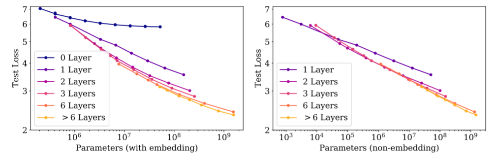

**MoE 的 Scaling Laws**（Apple & MIT 的最新工作）：

> "既然 MoE 是训练大模型的主流方式，理解 '什么叫一个参数' 就非常重要——total params 和 active params 是解耦的。"

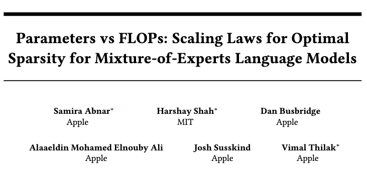

关键发现：**增加 total parameters（保持 active params 不变）仍然能降低 loss**——即使那些不活跃的参数也在帮助减少误差。"这是非常酷的结果。"

---

## 6. Critical Batch Size 与 Learning Rate

> "大多数人不会激进到换一个 LSTM——你大概率会选 DeepSeek-V4-inspired MoE。但有两个东西你每次都必须重新确定：**batch size 和 learning rate**。你改一个，必须同时改另一个。"

### 6.1 Critical Batch Size

**背景**：我们希望 batch size 尽可能大（给 data parallelism 更多空间），但超过某个点后会有 diminishing returns。那这个临界点在哪？

**定义**：Critical batch size 是**从"完美 scaling"（noise-limited）过渡到"低效 scaling"（bias-limited）的转折点**。

- **Noise-limited regime**：每个额外的样本都在降低梯度的噪声方差 → 近乎完美的 scaling。你受限于 SGD 的方差。
- **Bias-limited regime**：梯度噪声已足够低，你受限于 SGD 的局部性——梯度只告诉你当前点附近的方向，不知道全局最优在哪。

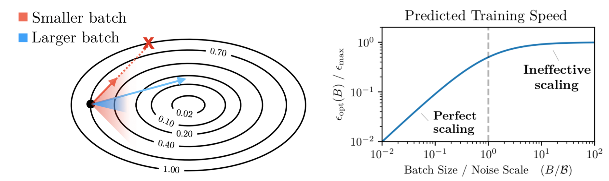

**估计方法**（McCandlish et al., OpenAI）：

1. 选一个 target loss
2. 在不同的 batch size 下，记录达到 target loss 所需的**步数 S** 和**样本数 E**
3. 拟合函数形式：S 和 E 大致满足反比关系，包括最小步数 S_min 和最小样本数 E_min 两个参数
4. **Critical batch size = E_min / S_min**

> 一个等效的估计方法：直接算 gradient covariance 的 trace / gradient 的 squared norm 的比值。但更复杂，不再展开。

**为什么这出现在 Scaling Law 的课里？** 因为 critical batch size **随 target loss 变化**——loss 越低（模型越好），需要的 critical batch size **越大**。而且这个关系又是**幂律**！

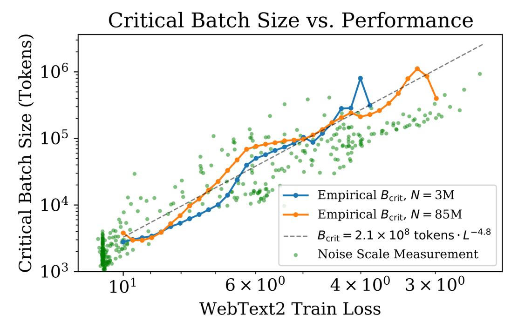

> "当你训练越接近最优点，梯度噪声的影响越大——你在优化越来越精细的对象，噪声的微小差异变得非常关键。"

### 6.2 Learning Rate 的 Scaling

**宽模型（width scaling）的直觉**："模型越大 → 更多参数 → 每次改变的东西更多 → learning rate 应该更小。粗略的经验法则是 LR ∝ 1/width。"

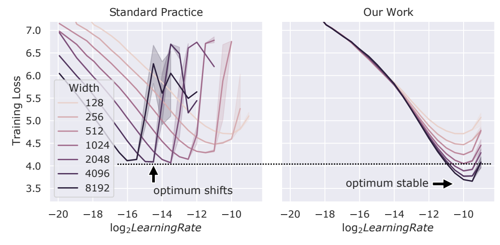

**两种 philosophy**：

| 方法 | 思路 | 代表 |
|------|------|------|
| **Scaling Law 外推** | 在小模型上拟合"最优 LR vs 模型大小"的曲线，外推到大模型 | 直接、但需要拟合 |
| **muP（Maximal Update Parametrization）** | 重新参数化网络（调整初始化大小和各层的 step size），使得**最优 LR 不随 scale 变化** | 只需在小模型上找到最优 LR，直接用到大模型 |

> "两者在大规模训练中都有成功的案例。Anecdotally，更多人似乎倾向于 scaling law 方法，但两者都是可行的。下讲我会详细介绍 muP 和相关的参数初始化技巧。"

---

## 7. 上游 vs 下游的陷阱

> "Pre-training 的人在给你模型时说'perplexity 很好，剩下的都是你的问题了'——但很多时候问题其实在 pre-training 阶段就开始了。"

**Tay et al. (2023)** 的关键发现：

- **Perplexity vs 参数量**：清晰的线性趋势，非常漂亮——"USM NL12 是 perplexity 最好的模型，我们 ship 它！"
- **Downstream vs 参数量**：**USM NL12 根本不是最好的模型**——USM NL32XL（perplexity 差得多的模型）才是

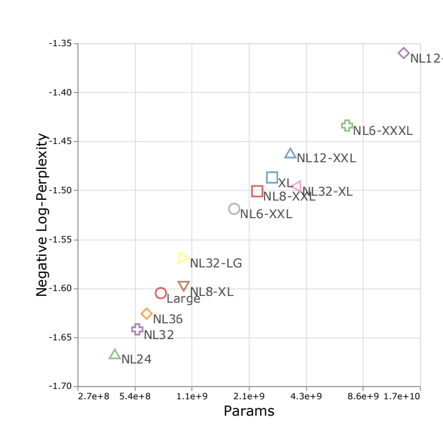

> "这是我从上游到下游见过的最差的 correlation 之一。但这是一个非常重要的警示——scaling laws **通常只在 perplexity 侧适用**。从 perplexity 到 downstream 的 transfer 比你想象的要不确定得多。"

**Scaling law 设计的正确心态**：
1. 先在低 variance 的度量（perplexity/train loss）上建立 scaling regularity
2. 确认这种 regularity 成立后，再依赖 transfer belief 或额外的实验来验证下游迁移

---

## 8. Chinchilla vs Kaplan：数据与模型的权衡

这是本讲最核心的应用案例。

**核心问题**：你有固定的 compute budget C（FLOPs），应该把它花在更大的模型上，还是更多的数据上？

> Recall Percy Lecture 1: FLOPs ∝ params × data tokens

### 8.1 联合 Scaling Laws 的函数形式

**Rosenfeld et al. (2020)** 和 **Kaplan et al. (2020)** 几乎同时提出了联合 data-model scaling law：

**Rosenfeld 形式**：
$$\text{Error} = n^{-\alpha} + m^{-\beta} + C$$

**Kaplan 形式**：
$$\text{Error} = m^{-\alpha} + n^{-1/\beta}$$

> "这两种形式本质上是同一个 idea：两个单项的 scaling law 组合在一起。检查极限是验证 scaling law 的好方法——如果 data → ∞，你得到 model-only scaling law。如果 model size → ∞，你得到 data-only scaling law。"

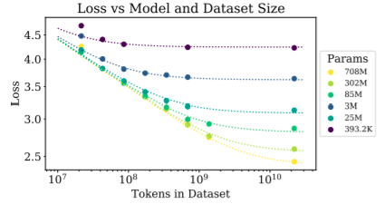

**关键能力**：只在小规模（小数据 + 小模型）的绿色点上拟合，然后外推到高 compute 区域——预测非常准。

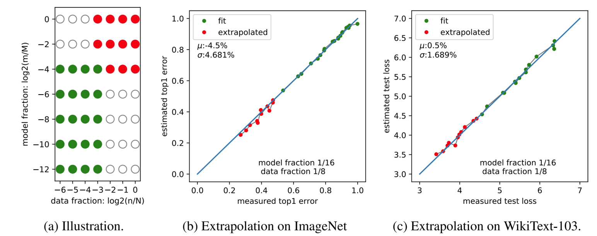

### 8.2 Chinchilla 的三种拟合方法

> "我特别喜欢 Chinchilla 论文，因为它提供了三种不同方法来估计 data-model tradeoff——这是一种 robustify（鲁棒化）自己免于建模假设的方式。"

**Kaplan 的原始结论**：`N_opt ∝ C^{0.73}, D_opt ∝ C^{0.27}`——**tokens per param 随 compute 增加而减少**。这意味着你越有钱，越应该训**更大的模型**（相对较少的数据）。

> Tatsu 解释："这在 GPT-3 时代确实驱动了很多决策——大家都在训练巨大的、数百 B 甚至上万亿参数的 dense 模型。"

**Chinchilla（Hoffmann et al. 2022）的反驳**：三个星号（Kaplan 预测的最优点）完全不对。实际最优训练是更小的模型 + 更多的数据。

**三种方法**：

| 方法 | 思路 | Data exponent | Model exponent |
|------|------|-------------|---------------|
| **Method 1: Lower Envelope** | 取所有训练曲线的下包络（每个 FLOP 的最优 loss），scatter plot 对应的最优模型大小 | ~0.5 | ~0.5 |
| **Method 2: IsoFLOP** | 固定多个 FLOP budgets，每个 budget 下 sweep 模型大小，取最小 loss → 拟合最优 (N, D) 的 scaling | ~0.5 | ~0.5 |
| **Method 3: Joint Fit** | 在所有 (N, D) grid 上用最小二乘拟合联合函数 | ~0.46 | ~0.54 |

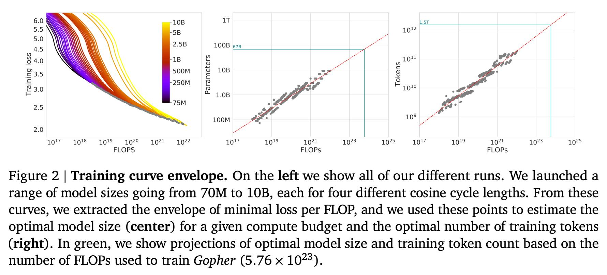
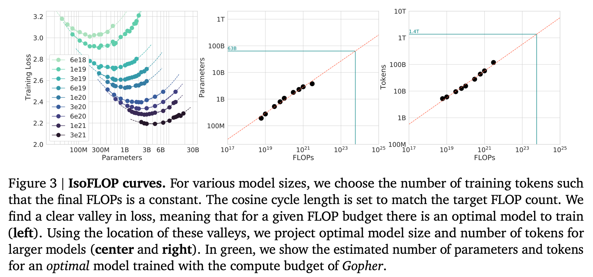
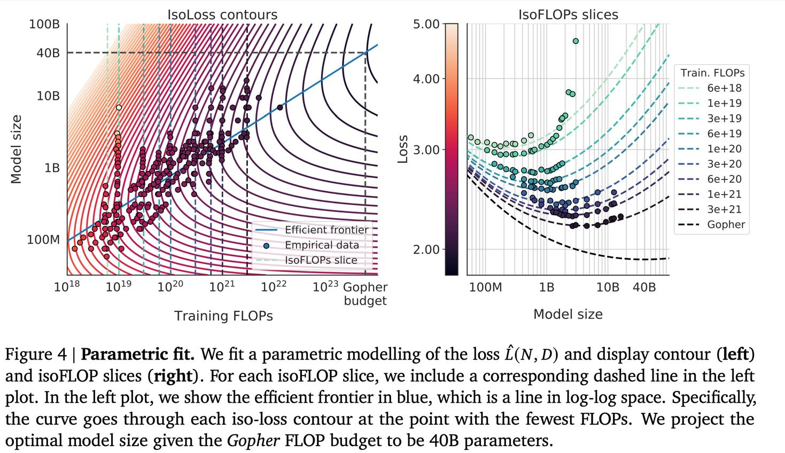

> **Chinchilla 的推荐**：约 **20 tokens per parameter**（Kaplan 的推荐远小于此）。

### 8.3 为什么 Kaplan 和 Chinchilla 差异这么大？

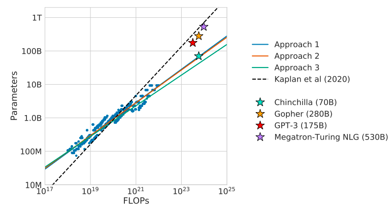

**解释 1**：Kaplan 排除了 embedding 参数（只统计 non-embedding params），而且在小 compute budget 下 warmup 太高、learning rate decay 可能没有恰当地 tune。**选择 non-embedding vs total params 改变了参数的 counting 方式，从而改变了 N_opt(C) 的 exponent。**

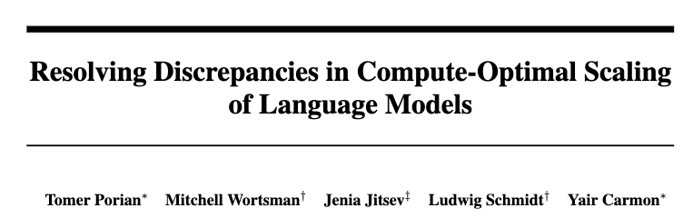

**解释 2**：Non-embedding vs total params 的选择 + 拟合中的小非线性。两者叠加，产生了巨大的 exponent 差异。

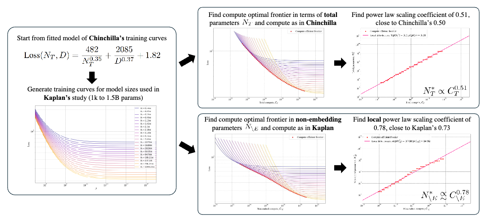

**有趣的附注 — Chinchilla Method 3 有误**（Besiroglu et al. 2024）：

> "有人做了数据 forensic——恢复了 Chinchilla Method 3 的原始数据，重新拟合，结果和 Method 1/2 一致了。所以 Method 3 的偏离是原始论文中的一个错误。"

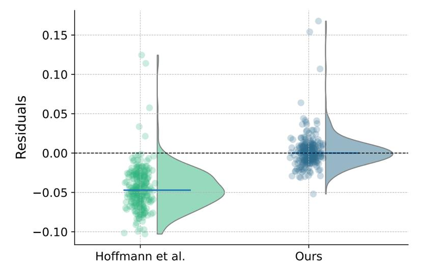

### 8.4 训练最优 ≠ 部署最优

> "Chinchilla 告诉你的是：给定固定的**训练** compute，最优的 data-param 配比是多少。但现实是：大部分 compute 消耗在**推理**上——所以我们应该'over-train'（用更多数据训练相对较小的模型）。"

**实际 token/param 比例的历史趋势**：

| 模型 | tokens / param |
|------|---------------|
| GPT-3 | ~2 |
| Chinchilla | ~20 |
| LLaMA 65B | ~22 |
| Llama 2 70B | ~29 |
| Mistral 7B | ~110 |
| Llama 3 70B | ~215 |

> "使用越频繁的模型，越值得在训练时投入更多数据——推理成本分摊了训练成本。"

**IsoFLOP 方法的广泛应用**：不仅是语言模型——Diffusion（Gulrajani et al. 2023）、MoE（Abnar et al. 2025）都使用 IsoFLOP 来优化架构选择。

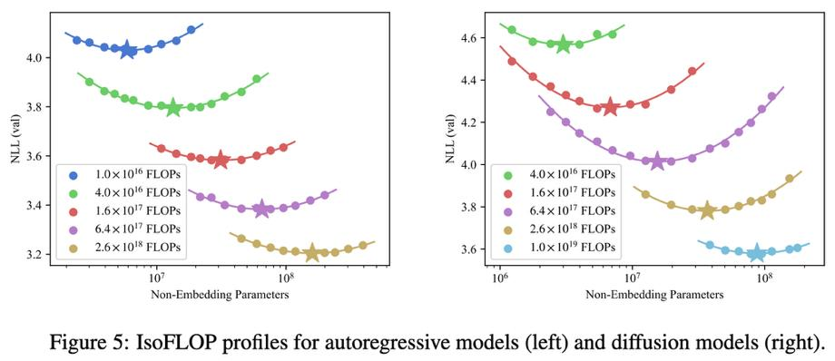

---

## 9. 总结：Scaling Law 的设计流程

> "在大 run 之前，你不仅应该知道模型能不能训练——你应该能**几乎精确地预测数值**。如果选择 optimizer A vs B，会带来多少 gain？你应该能从 scaling law 中预测出来。"

**标准的 Scaling Law 设计流程**：

1. **训练多个小模型** → 建立 scaling law（log-log 图上的直线）
2. **验证拟合质量** → 如果 fit 够好，有信心 gap 会保持到大规模
3. **外推** → 选择在小规模上预测最优的配置，用到大规模训练 run
4. **记住 downstream transfer** → perplexity 好不代表下游好

> "你会惊奇地发现 scaling law 能给你多精确的预测。这绝不是'碰运气'——这是现代大模型训练最重要的设计工具之一。"

---

## 关键公式速查

| 公式 | 含义 |
|------|------|
| `Loss = n^(-α) + C` | 纯数据 scaling law（power law） |
| `log(Error) = -α·log(n) + C` | log-log 图中的直线形式 |
| `Error = n^(-α) + m^(-β) + C` | Rosenfeld 联合 data-model scaling law |
| `Error = m^(-α) + n^(-1/β)` | Kaplan 联合形式 |
| `B_crit = E_min / S_min` | Critical batch size 的估计 |
| `LR ∝ 1/width` | 宽模型的 learning rate scaling 经验法则 |

---

## 参考文献

- [Cortes, Jackel, Solla, Vapnik, Denker (1993)](https://papers.nips.cc/paper_files/nips/1993) — 最早的数据 scaling law
- [Banko & Brill (2001)](https://aclanthology.org/P01-1005/) — NLP 数据 scaling
- [Kolachina et al. (2012)](https://aclanthology.org/C12-1080/) — 机器翻译的 power law
- [Hestness et al. (2017)](https://arxiv.org/abs/1712.00409) — 神经网络 scaling 的先驱
- [Kaplan et al. (2020)](https://arxiv.org/abs/2001.08361) — OpenAI Neural Scaling Laws
- [Rosenfeld et al. (2020)](https://arxiv.org/abs/1910.02292) — 联合 data-model scaling law
- [Hoffmann et al. (2022) — Chinchilla](https://arxiv.org/abs/2203.15556) — 训练最优 data-model tradeoff
- [Besiroglu et al. (2024)](https://arxiv.org/abs/2405.14876) — Chinchilla Method 3 的修正
- [McCandlish et al. (2018)](https://arxiv.org/abs/1812.06162) — Critical Batch Size
- [Bahri et al. (2021)](https://arxiv.org/abs/2102.06701) — 内在维度与 scaling law
- [Hashimoto (2021)](https://arxiv.org/abs/2110.05893) — 分布偏移 scaling laws
- [Tay et al. (2022)](https://arxiv.org/abs/2203.00559) — 跨架构 scaling
- [Tay et al. (2023)](https://arxiv.org/abs/2301.00000) — 上游 vs 下游的 divergence
- [Yang et al. (2022) — muP](https://arxiv.org/abs/2203.03466) — Maximal Update Parametrization
- [Muennighoff et al. (2023) — Data-Constrained LMs](https://arxiv.org/abs/2305.16264) — 数据重复
- [Gulrajani et al. (2023)](https://arxiv.org/abs/2305.13048) — Diffusion IsoFLOP
- [Abnar et al. (2025)](https://arxiv.org/abs/2503.00000) — MoE scaling laws (Apple)
- [CS336 Course Website](https://cs336.stanford.edu/)
